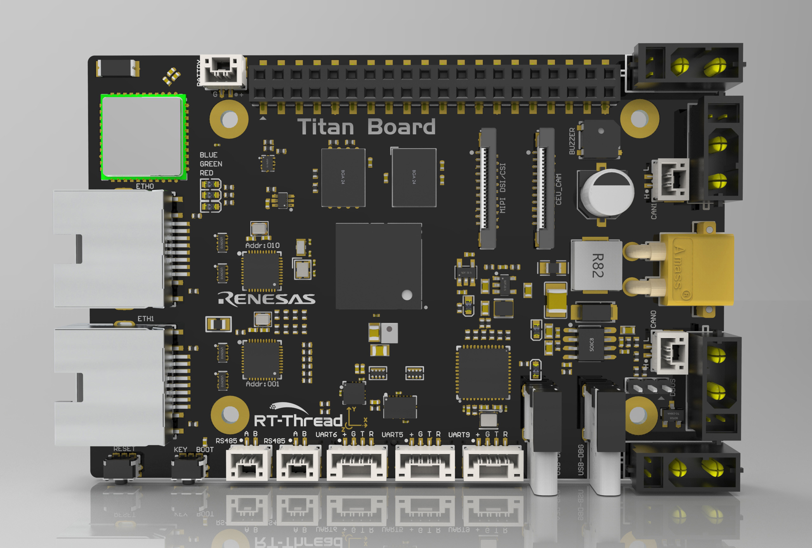

# sdk-bsp-ra8p1-titan-board

**中文** | [**English**](README.md)

## 简介

中文页

sdk-bsp-ra8p1-titan-board 是 RT-Thread 团队对 `Titan Board` 开发板所作的支持包，也可作为用户开发使用的软件SDK，让用户可以更简单方便的开发自己的应用程序。

Titan Board 开发板是 RT-Thread 推出基于瑞萨 Cortex-M85 与 Cortex-M33 双核架构 R7KA8P1 芯片，为工程师们提供了一个灵活、全面的开发平台，助力开发者在嵌入式物联网领域获得更深层次的体验。



## 目录结构

```
$ sdk-bsp-ra8p1-titan-board
├── docs
│   ├── ra8p1-datasheet.pdf
│   ├── ra8p1-users-manual.pdf
│   ├── Titan_Board_schematic.pdf
│   └── source
├── figures
├── libraries
├── rt-thread
├── project
│   ├── Titan_basic_blink_led
│   ├── Titan_basic_buzzer
│   ├── Titan_basic_key_irq
│   ├── Titan_component_flash_fs
│   ├── Titan_component_netutils
│   ├── Titan_display_camera_ceu
│   ├── Titan_display_camera_mipi_csi
│   ├── Titan_display_lvgl
│   ├── Titan_driver_adc
│   ├── Titan_driver_can
│   ├── Titan_driver_eth
│   ├── Titan_driver_gpt
│   ├── Titan_driver_hyperram
│   ├── Titan_driver_iic_ist8310
│   ├── Titan_driver_rgb_lcd
│   ├── Titan_driver_rs485
│   ├── Titan_driver_rtc
│   ├── Titan_driver_sdcard
│   ├── Titan_driver_spi_bmi088
│   ├── Titan_driver_usb_hhid
│   ├── Titan_driver_usb_pcdc
│   ├── Titan_driver_wdt
│   ├── Titan_driver_wifi
│   ├── Titan_dual_core
│   │   ├── Titan_dual_core0
│   │   ├── Titan_dual_core1
│   ├── Titan_factory
│   ├── Titan_mlc_rpmsg_lite
│   │   ├── Titan_rpmsg_master
│   │   └── Titan_rpmsg_remote
│   └── Titan_template
├── README.md
├── README_zh.md
└── sdk-bsp-ra8p1-titan-board.yaml
```

- sdk-bsp-ra8p1-titan-board.yaml：描述 Titan Board 的硬件信息
- docs：开发板原理图，文档以及 datasheets 等
- libraries ：Titan Board 通用外设驱动
- project：示例工程文件夹
- rt-thread： rt-thread 源码

## 使用方式

`sdk-bsp-ra8p1-titan-board` 支持 **RT-Thread Studio** 开发方式

## **RT-Thread Studio 开发步骤**

1. 打开 RT-Thread Studio ，安装 Titan Board 开发板支持包（如有最新建议安装最新版本，下图版本仅供参考）

2. 新建 Titan Board 工程，选择左上角文件->新建->RT-Thread 项目->基于开发板，可以创建示例工程或模板工程


3. 进行工程的编译和下载：


