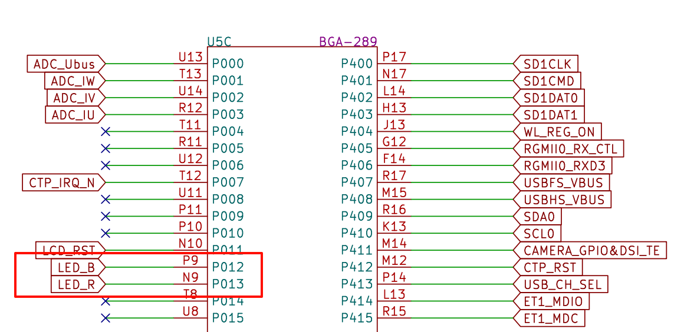

# RGB Usage Instructions

**English**|[**Chinese**](README_zh.md)

## Introduction

This example is the first and simplest example in the SDK, similar to the "Hello World" program that programmers encounter as their first program. The main function of this example is to make the onboard RGB-LED blink periodically.

## GPIO Introduction

**GPIO (General Purpose Input/Output)** is one of the most commonly used peripheral interfaces of an MCU. It can be configured under software control as either **input mode** or **output mode**:

- **Input mode**: Used to read external voltage levels, such as button inputs.
- **Output mode**: Used to control peripheral voltage levels, such as lighting up an LED or driving a buzzer.

### Features of RA8 Series GPIO

- **Rich pin resources**: Each port can be independently configured as input/output/multiplexed function.
- **Multi-function multiplexing**: In addition to GPIO functionality, the same pin can also serve as a signal line for peripherals such as UART, SPI, or I2C.
- **Level control**: In output mode, pins can drive either high or low levels; some pins support open-drain mode.
- **Direction control**: Input/output direction can be dynamically switched.

### RT-Thread Abstraction for GPIO

RT-Thread provides a **PIN device driver framework**, which offers a unified interface to shield hardware differences:

- `rt_pin_mode(pin, mode)` : Set the working mode of a pin (input/output/pull-up/pull-down, etc.)
- `rt_pin_write(pin, value)` : Output a voltage level (high/low)
- `rt_pin_read(pin)` : Read an input voltage level

This way, developers don’t need to directly manipulate registers; GPIO control can be achieved through RT-Thread’s API.

In this example, the LED pin is configured as **output mode**, and the software continuously toggles between high and low levels to make the LED blink.

## Hardware Description




As shown in the diagram above, the Titan Board provides three user LEDs: LED_R (RED), LED_B (BLUE), and LED_G (GREEN). The BLUE LED corresponds to pin P012 on the MCU. To turn on the LED, a low level signal is output from the MCU pin, and to turn it off, a high level signal is output.

The positions of the LEDs on the development board are shown in the diagram below:


## Software Description

The source code for this example is located in `/project/Titan_basic_blink_led`. The MCU pin definitions for the RGB LEDs and the RGB control logic can be found in`src/hal_entry.c`.

```c
/* Configure LED pins */
#define LED_PIN_R   BSP_IO_PORT_00_PIN_13
#define LED_PIN_B   BSP_IO_PORT_00_PIN_12
#define LED_PIN_G   BSP_IO_PORT_06_PIN_13

/* Define the LED on/off level */
#define LED_ON  (0)
#define LED_OFF (1)

/* Define eight groups of LED flash tables whose order is R B G */
static const rt_uint8_t _blink_tab[][3] =
{
    {LED_OFF, LED_OFF, LED_OFF},
    {LED_ON,  LED_OFF, LED_OFF},
    {LED_OFF, LED_ON,  LED_OFF},
    {LED_OFF, LED_OFF, LED_ON},
    {LED_ON,  LED_OFF, LED_ON},
    {LED_ON,  LED_ON,  LED_OFF},
    {LED_OFF, LED_ON,  LED_ON},
    {LED_ON,  LED_ON,  LED_ON},
};

void hal_entry(void)
{
    rt_kprintf("\nHello RT-Thread!\n");
    rt_kprintf("==================================================\n");
    rt_kprintf("This example project is a RGB flicker routine!\n\n");
    rt_kprintf("==================================================\n");

    unsigned int count = 0;
    unsigned int group_num = sizeof(_blink_tab)/sizeof(_blink_tab[0]);
    unsigned int group_current;

    /* Set the RGB lamp pin to output mode */
    rt_pin_mode(LED_PIN_R, PIN_MODE_OUTPUT);
    rt_pin_mode(LED_PIN_G, PIN_MODE_OUTPUT);
    rt_pin_mode(LED_PIN_B, PIN_MODE_OUTPUT);
    rt_pin_write(LED_PIN_R, LED_OFF);
    rt_pin_write(LED_PIN_G, LED_OFF);
    rt_pin_write(LED_PIN_B, LED_OFF);

    do
    {
        /* Get the group number */
        group_current = count % group_num;

        /* Control RGB LEDs */
        rt_pin_write(LED_PIN_R, _blink_tab[group_current][0]);
        rt_pin_write(LED_PIN_B, _blink_tab[group_current][1]);
        rt_pin_write(LED_PIN_G, _blink_tab[group_current][2]);

        /* Output LOG information */
        LOG_D("group: %d | red led [%-3.3s] | | blue led [%-3.3s] | | green led [%-3.3s]",
            group_current,
            _blink_tab[group_current][0] == LED_ON ? "ON" : "OFF",
            _blink_tab[group_current][1] == LED_ON ? "ON" : "OFF",
            _blink_tab[group_current][2] == LED_ON ? "ON" : "OFF");

        count++;

        /* Delay for a short time */
        rt_thread_mdelay(500);
    }while(count > 0);
}
```

## Compilation & Download

* **RT-Thread Studio**: In RT-Thread Studio's package manager, download the Titan Board resource package, create a new project, and compile it.


After compilation, connect the development board's USB-DBG interface to the PC and download the firmware to the development board.

## Run Effect

After pressing the reset button to restart the development board, observe the actual effect of the RGB-LED on the development board. When the program is running normally, the RGB LEDs will change periodically.

At this point, you can also open the default serial port of the development board using a terminal tool on the PC, with the baud rate set to 115200N. The board's runtime log information will be output in real-time.

```c
 \ | /
- RT -     Thread Operating System
 / | \     5.2.0 build Jul 30 2025 13:29:07
 2006 - 2024 Copyright by RT-Thread team

Hello RT-Thread!
==================================================
This example project is an RGB flicker routine!
==================================================
[D/main] group: 0 | red led [OFF] | | blue led [OFF] | | green led [OFF]
[D/main] group: 1 | red led [ON ] | | blue led [OFF] | | green led [OFF]
[D/main] group: 2 | red led [OFF] | | blue led [ON ] | | green led [OFF]
[D/main] group: 3 | red led [OFF] | | blue led [OFF] | | green led [ON ]
[D/main] group: 4 | red led [ON ] | | blue led [OFF] | | green led [ON ]
[D/main] group: 5 | red led [ON ] | | blue led [ON ] | | green led [OFF]
[D/main] group: 6 | red led [OFF] | | blue led [ON ] | | green led [ON ]
[D/main] group: 7 | red led [ON ] | | blue led [ON ] | | green led [ON ]
```