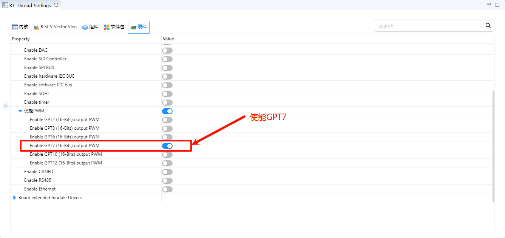

# GPT Usage Guide

**English** | [**Chinese**](./README_zh.md)

## Introduction

In practical applications, the use of **timers** is almost always indispensable. This example demonstrates how to use the **GPT (General Purpose Timer)** on the Titan Board to generate PWM signals and drive a passive buzzer to play a melody.

The selected melody in this example is the classic children’s song **“Two Tigers”**. By dynamically adjusting the PWM frequency through the timer, the buzzer produces different musical notes.

Through this example, users will learn:

- How to configure the RA8 GPT module and generate PWM output
- How to use the PWM device driver framework under RT-Thread
- How to synthesize different tones using PWM duty cycle and frequency, and thereby implement simple music playback

## Introduction to PWM / GPT

### Passive Buzzer and PWM

- A **passive buzzer** is essentially a small piezoelectric or electromagnetic transducer that requires an **external AC signal (square wave) at a certain frequency** to produce sound.
- The **pitch** is determined by the **PWM frequency**, while the **loudness/timbre** is mainly influenced by the **duty cycle** and driving capability. A **50% duty cycle** is commonly used to produce a pure tone with the strongest fundamental frequency and minimal harmonics.
- If the buzzer has a high rated current (or the onboard GPIO cannot drive it directly), it is recommended to use an **NPN/MOSFET low-side switch + diode** (for electromagnetic types) for protection. Piezoelectric buzzers generally do not require a freewheeling diode but adding a **100–1kΩ resistor** in series is still recommended to limit current and reduce noise (depending on the specific device and board).

### Basic Concepts of PWM

- **Period (T):** The total time of one high-low cycle.
- **Frequency (f):** `f = 1 / T` (in Hz).
- **Duty Cycle (D):** The ratio of high-level duration to the total period, `D = t_high / T`.
- **Voltage Level:** Usually VCC (e.g., 3.3V).

When using PWM to play music on a buzzer:

- Changing **frequency f** → changes the pitch.
- Changing **duration** → changes the beat and rhythm.
- Fine-tuning **duty cycle D** (typically 40–60%) → affects loudness and timbre.

### Overview of RA8 GPT (for PWM)

- **GPT (General PWM Timer):** A general-purpose timer in the RA8 series that supports **PWM output**, typically with A/B channels (as mapped by FSP/BSP pins).
- Typical features: configurable **count source/divider**, **period/compare value**, **edge-aligned/center-aligned modes**, and support for complementary output with dead time (often used for motors/drivers).
- Under **RT-Thread**, GPT can be controlled via the **PWM device driver**: simply set the **period** and **pulse width** to generate PWM.

### Setting Frequency and Duty Cycle in RT-Thread

`rt_pwm_set(device, channel, period_ns, pulse_ns)` uses nanoseconds:

- Period (ns): `T_ns = 10^9 / f`
- High-level duration (ns): `t_high = T_ns * D`

For example, with `D = 50%`, `t_high = T_ns / 2`.

> Note: `period_ns` and `pulse_ns` are usually 32-bit values. Avoid extremely low frequencies that result in very large periods; for very low frequencies, consider software timers or segmented playback.

## Hardware Description

The pin of the buzzer is PA07.


## FSP Configuration

* The FSP is configured to enable  GPT7 as a PWM mode:


* Additionally, the pins for GPT7 are enabled:


## RT-Thread Settings Configuration

* In the configuration, enable  PWM7:



## Example Project Instructions

To play **“Two Tigers”**, we need to define the frequencies corresponding to the numbered musical notation (unit: Hz):

| Note | Frequency (Hz) |
| ---- | -------------- |
| C4   | 262            |
| D4   | 294            |
| E4   | 330            |
| F4   | 349            |
| G4   | 392            |
| A4   | 440            |
| B4   | 494            |
| C5   | 523            |

> The actual output frequency may be affected by **GPT clock/divider/count step quantization**. The driver will select the nearest achievable value within the range. For more accurate pitch, it’s recommended to choose frequencies with **smaller quantization errors** first (or adjust the system clock/divider).

The source code for this example is located in `/project/Titan_basic_buzzer/src/buzzer.c`：

```c
#include <rtthread.h>
#include <rtdevice.h>

#define PWM_DEV_NAME        "pwm7"  /* PWM Device Name */
#define PWM_DEV_CHANNEL     0       /* PWM Channel */

struct rt_device_pwm *pwm_dev;

typedef struct
{
    uint16_t freq;   // Frequency (Hz)
    uint16_t duration; // Duration (ms)
} note_t;

note_t song[] =
{
    {262,400}, {294,400}, {330,400}, {262,400},  // 1 2 3 1
    {262,400}, {294,400}, {330,400}, {262,400},  // 1 2 3 1
    {330,400}, {349,400}, {392,800},             // 3 4 5
    {330,400}, {349,400}, {392,800},             // 3 4 5
    {392,200}, {440,200}, {392,200}, {349,200}, {330,400}, {262,400}, // 5 6 5 4 3 1
    {392,200}, {440,200}, {392,200}, {349,200}, {330,400}, {262,400}, // 5 6 5 4 3 1
    {262,400}, {196,400}, {262,400}, {0,400},    // 1(低) 7(低) 1 高 休止
    {262,400}, {196,400}, {262,400}, {0,400},    // 1 7 1 休止
};

static int buzzer_test(void)
{
    pwm_dev = (struct rt_device_pwm *)rt_device_find(PWM_DEV_NAME);
    if (!pwm_dev)
    {
        rt_kprintf("Cannot find PWM device %s\n", PWM_DEV_NAME);
        return -1;
    }

    for (size_t i = 0; i < sizeof(song)/sizeof(song[0]); i++)
    {
        if (song[i].freq == 0)
        {
            rt_pwm_disable(pwm_dev, PWM_DEV_CHANNEL);
        }
        else
        {
            uint32_t period_ns = 1000000000 / song[i].freq;  // ns
            uint32_t pulse_ns  = period_ns / 2;              // 50%

            rt_pwm_set(pwm_dev, PWM_DEV_CHANNEL, period_ns, pulse_ns);
            rt_pwm_enable(pwm_dev, PWM_DEV_CHANNEL);
        }

        rt_thread_mdelay(song[i].duration);
    }

    rt_pwm_disable(pwm_dev, PWM_DEV_CHANNEL);
    return 0;
}
MSH_CMD_EXPORT(buzzer_test, Play song on buzzer);
```

## Compilation & Download

* **RT-Thread Studio**: Download the Titan Board resource package in the RT-Thread Studio package manager, then create a new project and compile it.

After compilation, connect the development board's USB-DBG interface to the PC, and download the firmware to the development board.

## Running Results

Type `buzzer_sample` in the serial terminal to see the effect. The buzzer will play *“Two Tigers”*.
