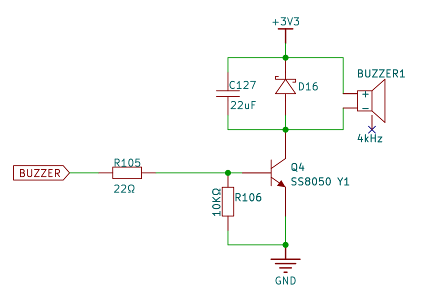
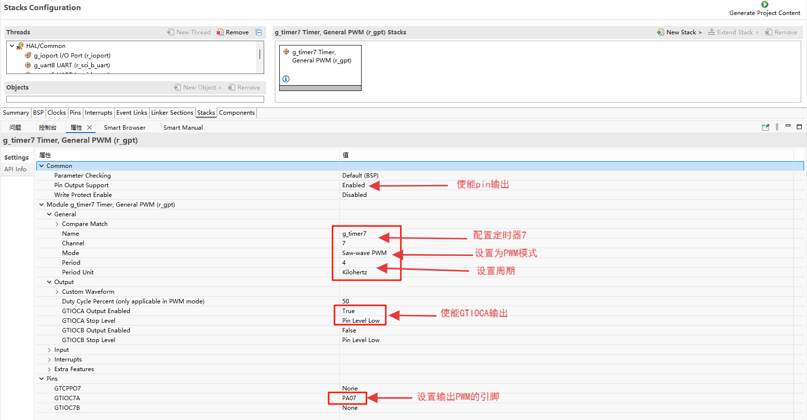

# 蜂鸣器使用说明

**中文** | [**English**](./README.md)

## 简介

在我们具体的应用场合中往往都离不开 timer 的使用，本例程主要介绍了如何在 Titan Board 上使用  **GPT (General Purpose Timer)** 产生 PWM 信号，驱动无源蜂鸣器演奏一段旋律。

本示例的旋律选择了经典儿童歌曲 **《两只老虎》**，通过定时器动态调整 PWM 的频率，改变蜂鸣器的发声音调。

通过该示例，用户可以学习：

- RA8 GPT 模块配置与 PWM 输出方法
- RT-Thread 下 PWM 设备驱动框架的使用
- 如何利用 PWM 占空比和频率合成不同音调，进而实现简单音乐播放

## PWM / GPT 简介

### 无源蜂鸣器与PWM

- **无源蜂鸣器** 本质上是一个小型压电/电磁换能器，需要外部提供**一定频率**的交流（方波）以发声。
- **音高**由**PWM 频率**决定；**响度/音色**主要受**占空比**与驱动能力影响。常用 **50% 占空比** 得到基波最强、谐波较低的纯净音。
- 若蜂鸣器额定电流较大（或板载GPIO不直驱），应使用 **NPN/MOSFET** 低边开关 + 二极管（电磁式）做保护；压电式一般无需续流二极管，但仍建议串联 **100–1kΩ** 电阻限流/降噪（依据实际器件与板卡而定）。

### PWM 基本概念

- **周期**：一轮高低电平的总时间，记为 `T`。
- **频率**：`f = 1 / T` (单位 Hz)。
- **占空比**：高电平持续时间与周期之比，`D = t_high / T`。
- **电平幅值**：通常为 VCC（如 3.3V）。

用于蜂鸣器播放乐曲时：

- 改变 **频率 f** → 改变音高；
- 改变 **保持时长** → 改变节拍与节奏；
- 微调 **占空比 D**（常在 40–60%）→ 影响响度与音色。

### RA8 GPT 概览（用于PWM）

* **GPT（General PWM Timer）**：RA8 系列通用定时器，支持 **PWM 输出**，通常具备 A/B 两路输出（以 FSP/BSP 引脚映射为准）。
* 典型能力：可配置 **计数源/分频**、**周期/比较值**、**边沿对齐/中心对齐** 等；亦支持互补与死区（多用于电机/驱动）。
* 在 **RT-Thread** 下，通过 **PWM 设备驱动** 统一操作 GPT：只需设置 **周期 (period)** 与 **脉宽 (pulse)** 即可产生 PWM。

### 在 RT-Thread 中设置频率与占空比

`rt_pwm_set(device, channel, period_ns, pulse_ns)` 以纳秒为单位：

- 周期 (ns)：`T_ns = 10^9 / f`
- 高电平时间 (ns)：`t_high = T_ns * D`

例如 `D=50%` 时，`t_high = T_ns / 2`。

> 注意：`period_ns/pulse_ns` 通常为 32 位数值，建议避免过低频率导致周期过大；若需要极低频，可考虑软件定时或分段播放。

## 硬件说明

蜂鸣器的引脚为 PA07。




## FSP配置

* FSP 配置使能 GPT7 为 PWM 模式：



* 并配置 Pins 使能 GPT7：


## RT-Thread Settings 配置

* 在配置中打开 PWM7 使能：


## 示例工程说明

为了演奏《两只老虎》，我们需要定义简谱对应的频率（单位：Hz）：

| 音符 | 频率(Hz) |
| ---- | -------- |
| C4   | 262      |
| D4   | 294      |
| E4   | 330      |
| F4   | 349      |
| G4   | 392      |
| A4   | 440      |
| B4   | 494      |
| C5   | 523      |

> 实际输出频率会受 **GPT时钟/分频/计数步进** 量化影响，驱动会在可达范围内取最近值。若需要更准的音高，可优先挑选**量化误差更小**的频率（或调整系统时钟/分频）。

本例程的源码位于`/project/Titan_basic_buzzer/src/buzzer.c`：

```c
#include <rtthread.h>
#include <rtdevice.h>

#define PWM_DEV_NAME        "pwm7"  /* PWM设备名称 */
#define PWM_DEV_CHANNEL     0       /* PWM通道 */

struct rt_device_pwm *pwm_dev;

typedef struct
{
    uint16_t freq;   // 频率Hz
    uint16_t duration; // 持续时间ms
} note_t;

note_t song[] =
{
    {262,400}, {294,400}, {330,400}, {262,400},  // 1 2 3 1
    {262,400}, {294,400}, {330,400}, {262,400},  // 1 2 3 1
    {330,400}, {349,400}, {392,800},             // 3 4 5
    {330,400}, {349,400}, {392,800},             // 3 4 5
    {392,200}, {440,200}, {392,200}, {349,200}, {330,400}, {262,400}, // 5 6 5 4 3 1
    {392,200}, {440,200}, {392,200}, {349,200}, {330,400}, {262,400}, // 5 6 5 4 3 1
    {262,400}, {196,400}, {262,400}, {0,400},    // 1(低) 7(低) 1 高 休止
    {262,400}, {196,400}, {262,400}, {0,400},    // 1 7 1 休止
};

static int buzzer_test(void)
{
    pwm_dev = (struct rt_device_pwm *)rt_device_find(PWM_DEV_NAME);
    if (!pwm_dev)
    {
        rt_kprintf("Cannot find PWM device %s\n", PWM_DEV_NAME);
        return -1;
    }

    for (size_t i = 0; i < sizeof(song)/sizeof(song[0]); i++)
    {
        if (song[i].freq == 0)
        {
            rt_pwm_disable(pwm_dev, PWM_DEV_CHANNEL);
        }
        else
        {
            uint32_t period_ns = 1000000000 / song[i].freq;  // ns
            uint32_t pulse_ns  = period_ns / 2;              // 50%

            rt_pwm_set(pwm_dev, PWM_DEV_CHANNEL, period_ns, pulse_ns);
            rt_pwm_enable(pwm_dev, PWM_DEV_CHANNEL);
        }

        rt_thread_mdelay(song[i].duration);
    }

    rt_pwm_disable(pwm_dev, PWM_DEV_CHANNEL);
    return 0;
}
MSH_CMD_EXPORT(buzzer_test, Play song on buzzer);
```
##  编译&下载

* RT-Thread Studio：在 RT-Thread Studio 的包管理器中下载 Titan Board 资源包，然后创建新工程，执行编译。

编译完成后，将开发板的 USB-DBG 接口与 PC 机连接，然后将固件下载至开发板。

## 运行效果

在串口终端输入 `buzzer_sample` 即可看到效果。蜂鸣器将播放 **“两只老虎”**。

