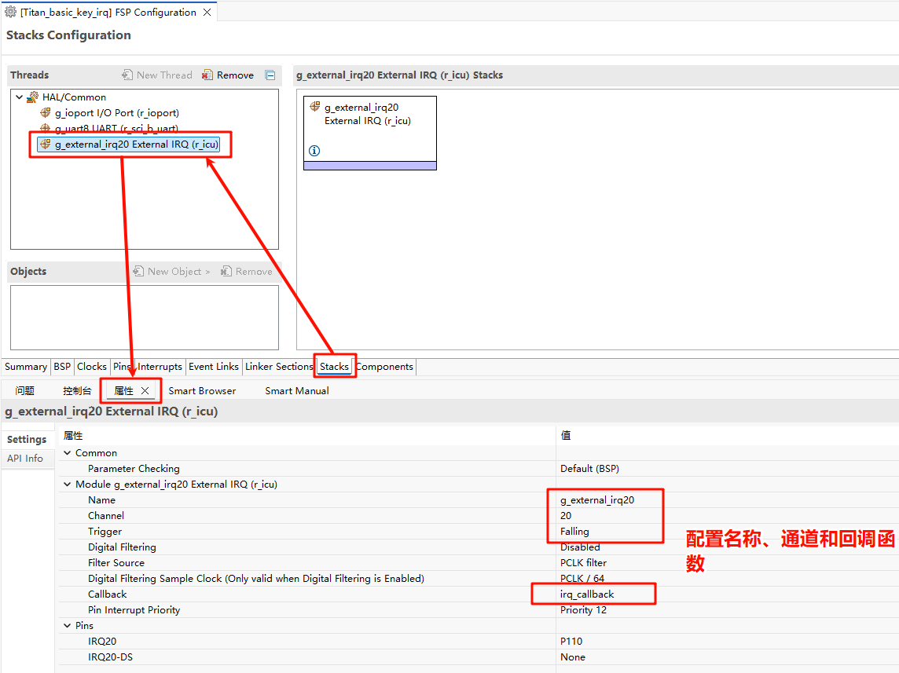

# Button Interrupt Usage Instructions

**English** | [**Chinese**](./README_zh.md)

## Introduction

The main function of this routine is to realize the external interrupt through the KEY on the board. When USER_KEY is pressed, the state of LED_G(Green) is changed.

## RA8 Series MCU Interrupt System Overview

The RA8 series MCU has the following interrupt features:

1. **NVIC (Nested Vectored Interrupt Controller)**
   - Supports **nested interrupts**: higher-priority interrupts can preempt lower-priority ones.
   - Supports **priority grouping** (Preemption Priority and Subpriority).
   - IRQn numbers are mapped to the interrupt vector table, and the NVIC calls the corresponding ISR.
2. **GPIO External Interrupt (EXTI)**
   - Each GPIO pin can be configured as an external interrupt input.
   - Supports **rising edge, falling edge, or both-edge triggers**.
   - Interrupt channels are managed by the **ICU (Interrupt Controller Unit)**.
   - Can be configured via Renesas FSP or directly through low-level registers.
   - Provides low-latency response, suitable for buttons, sensors, and other event-driven applications.
3. **RT-Thread PIN Driver Model**
   - GPIOs are encapsulated as **PIN devices** in RT-Thread.
   - Provides a unified interface:
     - `rt_pin_mode(pin, mode)`: configure pin as input or output.
     - `rt_pin_read(pin)` / `rt_pin_write(pin, value)`: read or write GPIO.
     - `rt_pin_attach_irq(pin, mode, callback, args)`: register an interrupt callback.
     - `rt_pin_irq_enable(pin, enable)`: enable or disable interrupts.

> Using the RT-Thread PIN driver allows interrupt handling without directly accessing the NVIC or MCU registers.

## Hardware Description


As shown in the figure above, the USER_KEY pin is connected to the P110 pin of the microcontroller, and the KEY button is pressed for low level and released for high level.

The position of the KEY in the development board is shown as follows:


## FSP Configuration

* First, download the official FSP code generation tool:

​	https://github.com/renesas/fsp/releases/download/v6.0.0/setup_fsp_v6_0_0_rasc_v2025-04.1.exe

* Once installed, double-click on the `rasc.exe` in eclipse and open the configuration file `configuration.xml` in the `Titan_basic_key_irq` project directory:

* Let's add two stacks: New Stack->Input->External IRQ(r_icu)：


* Next we need to enable the IRQ feature in the pin config. Select the interrupt pin we want to enable as shown in the following screenshot: USER_KEY(IRQ20) :


* Back in the Stacks interface, set IRQ20, and configure the interrupt name, channel number, and interrupt callback function:



## Example Code Description

The source code for this routine is located at `/project/Titan_basic_key_irq`.

The microcontroller pin corresponding to USER_KEY is defined as follows:

```c
/* Configure key IRQ pins */
#define KEY_PIN     BSP_IO_PORT_01_PIN_10 /* Onboard KEY pins */
```

LED灯的单片机引脚定义如下:

```c
/* Configure LED pins */
#define LED_PIN_B   BSP_IO_PORT_00_PIN_12 /* Onboard LED pins */
#define LED_PIN_G   BSP_IO_PORT_06_PIN_13 /* Onboard LED pins */
```

The source code for the keypress interrupt is located at `/project/Titan_basic_key_irq/src/hal_entry.c`. When the USER_KEY key is pressed, the green LED is turned on and off.

```c
#define LED_PIN_B   BSP_IO_PORT_00_PIN_12 /* Onboard LED pins */
#define LED_PIN_G   BSP_IO_PORT_06_PIN_13 /* Onboard LED pins */
#define KEY_PIN     BSP_IO_PORT_01_PIN_10 /* Onboard KEY pins */

volatile rt_bool_t flag = 0;

void key_callback(void)
{
    if (flag)
        rt_pin_write(LED_PIN_G, PIN_HIGH);
    else
        rt_pin_write(LED_PIN_G, PIN_LOW);

    flag = flag ? RT_FALSE : RT_TRUE;
}

void hal_entry(void)
{
    rt_kprintf("\nHello RT-Thread!\n");
    rt_kprintf("==================================================\n");
    rt_kprintf("This example project is a key routine!\n");
    rt_kprintf("==================================================\n");

    LOG_I("Tips:");
    LOG_I("You can press the button to run the test case for button interruption.");
    LOG_I("Use the buttons to control the on/off state of the green LED.");

    rt_pin_mode(KEY_PIN, PIN_MODE_INPUT_PULLUP);
    rt_pin_attach_irq(KEY_PIN, PIN_IRQ_MODE_FALLING, key_callback, RT_NULL);
    rt_pin_irq_enable(KEY_PIN, PIN_IRQ_ENABLE);

    while (1)
    {
        rt_pin_write(LED_PIN_B, PIN_HIGH);
        rt_thread_mdelay(1000);
        rt_pin_write(LED_PIN_B, PIN_LOW);
        rt_thread_mdelay(1000);
    }
}
```

## Compilation & Download

* **RT-Thread Studio**: In RT-Thread Studio's package manager, download the Titan Board resource package, create a new project, and compile it.

After compiling, connect the development board's USB-DBG interface to the PC and download the firmware to the development board.

## Run Effect

Press the reset button to restart the development board. LED_G in the initial state is in the light off state. When the USER_KEY is pressed, the light off state of LED_G(Green) will change.

