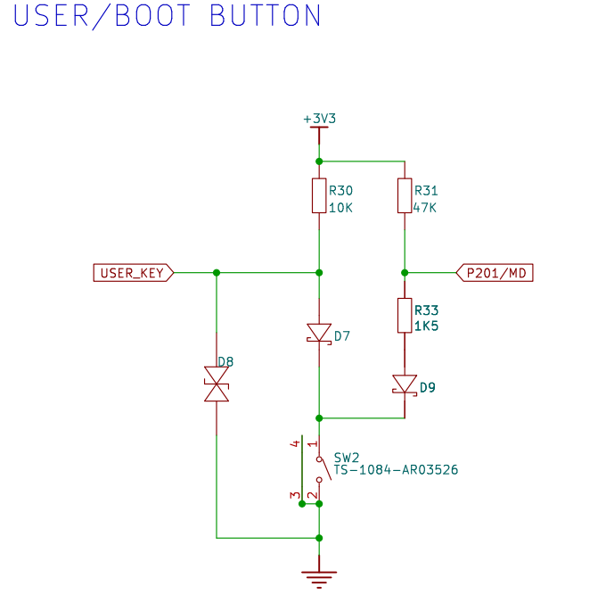
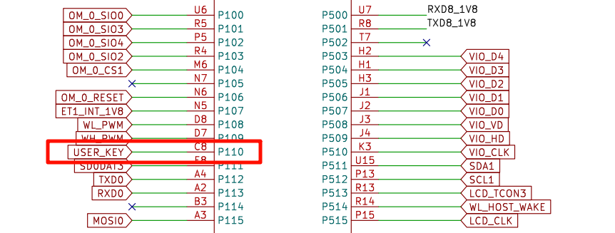
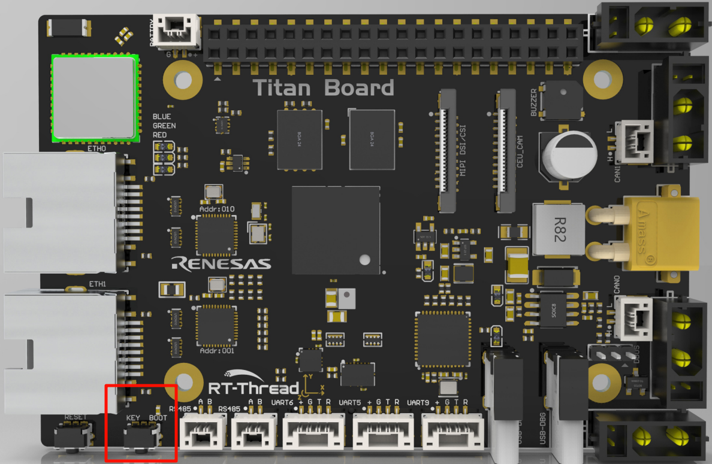
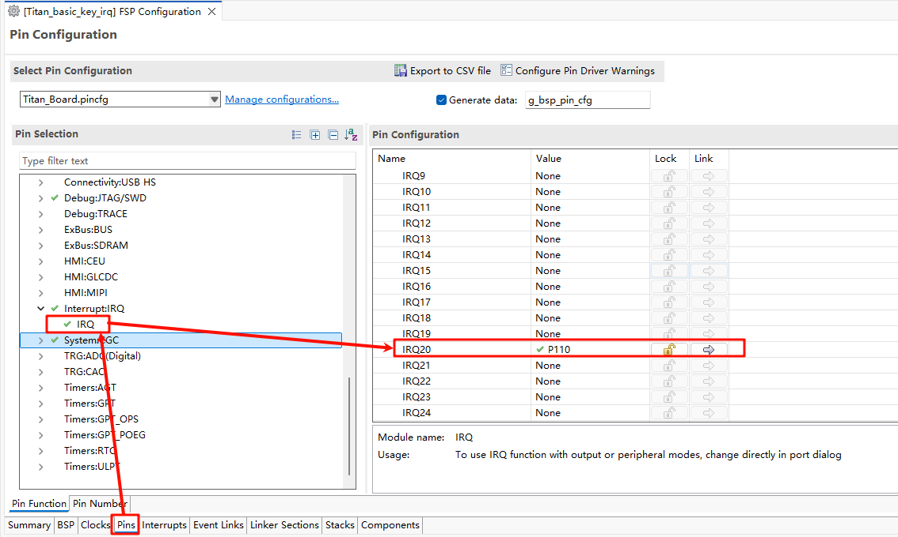

# 按键中断使用说明

**中文** | [**English**](./README.md)

## 简介

本例程主要功能是通过板载的按键 KEY 实现外部中断，当 USER_KEY 被按下时，改变 LED_G(Green) 的亮灭状态。

## RA8 系列 MCU 中断体系概述

具有如下中断特性：

1. **NVIC（嵌套向量中断控制器）**
   - 支持 **中断嵌套**：高优先级中断可打断低优先级中断
   - 支持 **优先级分组**（Preemption Priority 与 Subpriority）
   - IRQn 映射到中断向量表，由 NVIC 调用对应 ISR
2. **GPIO 外部中断 (EXTI)**
   - 每个 GPIO 引脚可配置为外部中断输入
   - 支持 **上升沿、下降沿或双沿触发**
   - 中断通道由 **ICU (Interrupt Controller Unit)** 管理
   - 可以通过 Renesas FSP 或底层寄存器配置
   - 中断响应延迟低，适合按键、传感器等事件驱动
3. **RT-Thread PIN 驱动模型**
   - GPIO 在 RT-Thread 中被封装为 **PIN 设备**
   - 提供统一接口：
     - `rt_pin_mode(pin, mode)`：配置输入/输出模式
     - `rt_pin_read(pin)` / `rt_pin_write(pin, value)`：读写 GPIO
     - `rt_pin_attach_irq(pin, mode, callback, args)`：注册中断回调
     - `rt_pin_irq_enable(pin, enable)`：使能/禁用中断

> 使用 RT-Thread PIN 驱动，无需直接操作 NVIC 或 MCU 寄存器即可实现中断响应。

## 硬件说明

如下图所示， USER_KEY 引脚连接单片机 P110 引脚, KEY 按键按下为低电平，松开为高电平。





KEY 在开发板中的位置如下图所示：



## FSP配置

* 首先下载官方FSP代码生成工具：

  https://github.com/renesas/fsp/releases/download/v6.0.0/setup_fsp_v6_0_0_rasc_v2025-04.1.exe

* 安装成功之后我们双击 eclipse 目录下的 `rasc.exe`，并打开 `Titan_basic_key_irq` 工程目录下的配置文件 `configuration.xml`：

* 下面我们新增两个Stack：New Stack->Input->External IRQ(r_icu)：


* 接着我们需要在引脚配置那开启IRQ功能，根据下图选中我们要使能的中断引脚：USER_KEY(IRQ20)：



* 回到Stacks界面，设置 IRQ20，配置对应的中断名称、通道号以及中断回调函数：


## 示例代码说明

本例程的源码位于`/project/Titan_basic_key_irq`。

USER_KEY 对应的单片机引脚定义如下:

```c
/* 配置 key irq 引脚 */
#define KEY_PIN     BSP_IO_PORT_01_PIN_10 /* Onboard KEY pins */
```

LED灯的单片机引脚定义如下:

```c
/* 配置 LED 灯引脚 */
#define LED_PIN_B   BSP_IO_PORT_00_PIN_12 /* Onboard LED pins */
#define LED_PIN_G   BSP_IO_PORT_06_PIN_13 /* Onboard LED pins */
```

按键中断的源代码位于`/project/Titan_basic_key_irq/src/hal_entry.c`中，当按下 USER_KEY 按键，会改变绿色 LED 的亮灭状态。

```c
#define LED_PIN_B   BSP_IO_PORT_00_PIN_12 /* Onboard LED pins */
#define LED_PIN_G   BSP_IO_PORT_06_PIN_13 /* Onboard LED pins */
#define KEY_PIN     BSP_IO_PORT_01_PIN_10 /* Onboard KEY pins */

volatile rt_bool_t flag = 0;

void key_callback(void)
{
    if (flag)
        rt_pin_write(LED_PIN_G, PIN_HIGH);
    else
        rt_pin_write(LED_PIN_G, PIN_LOW);

    flag = flag ? RT_FALSE : RT_TRUE;
}

void hal_entry(void)
{
    rt_kprintf("\nHello RT-Thread!\n");
    rt_kprintf("==================================================\n");
    rt_kprintf("This example project is a key routine!\n");
    rt_kprintf("==================================================\n");

    LOG_I("Tips:");
    LOG_I("You can press the button to run the test case for button interruption.");
    LOG_I("Use the buttons to control the on/off state of the green LED.");

    rt_pin_mode(KEY_PIN, PIN_MODE_INPUT_PULLUP);
    rt_pin_attach_irq(KEY_PIN, PIN_IRQ_MODE_FALLING, key_callback, RT_NULL);
    rt_pin_irq_enable(KEY_PIN, PIN_IRQ_ENABLE);

    while (1)
    {
        rt_pin_write(LED_PIN_B, PIN_HIGH);
        rt_thread_mdelay(1000);
        rt_pin_write(LED_PIN_B, PIN_LOW);
        rt_thread_mdelay(1000);
    }
}
```

## 编译&下载

* RT-Thread Studio：在RT-Thread Studio 的包管理器中下载 Titan Board 资源包，然后创建新工程，执行编译。


编译完成后，将开发板的 USB-DBG 接口与 PC 机连接，然后将固件下载至开发板。

## 运行效果

按下复位按键重启开发板，初始状态下的 LED_G 处于灭灯状态，当按下 USER_KEY 时，LED_G(Green) 的亮灭状态会改变。

