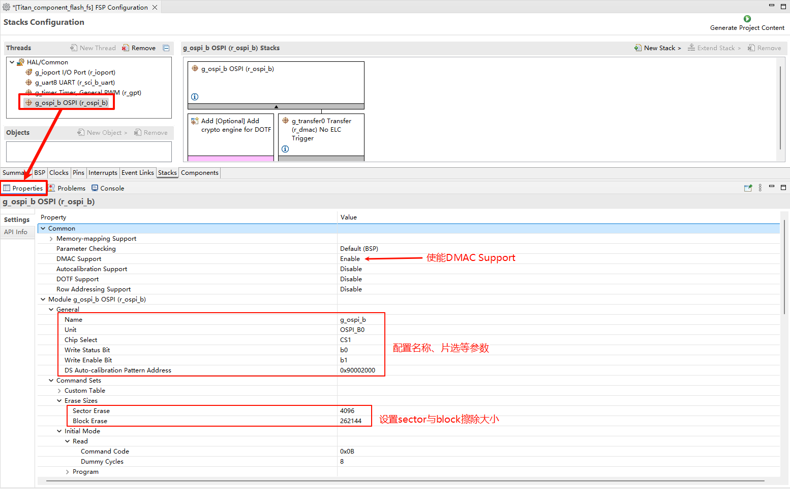
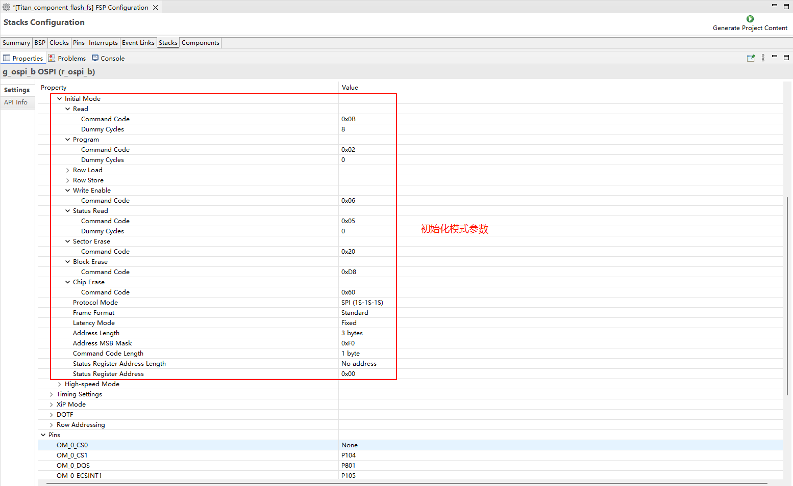
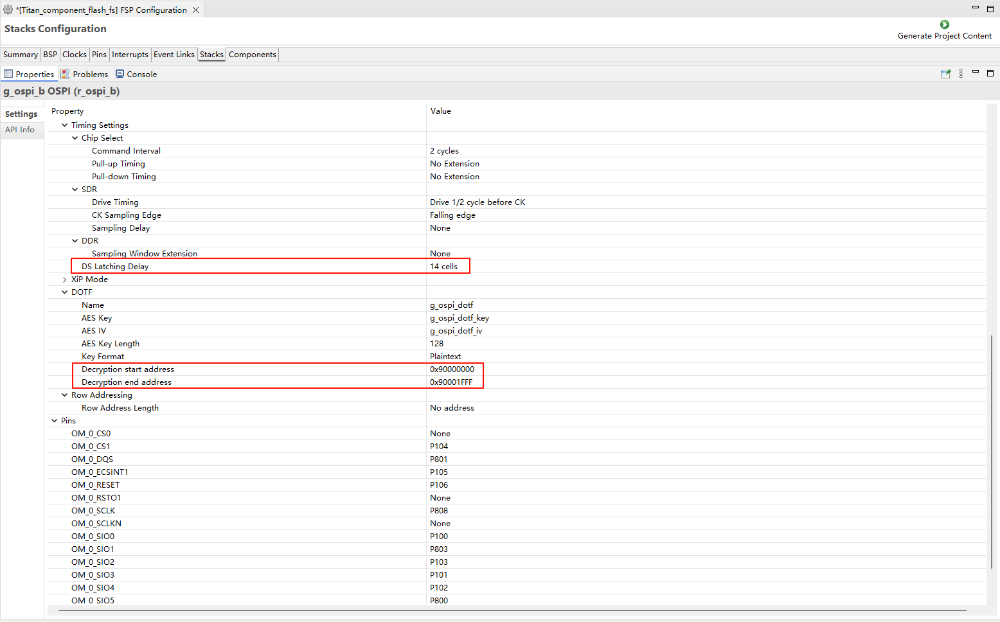
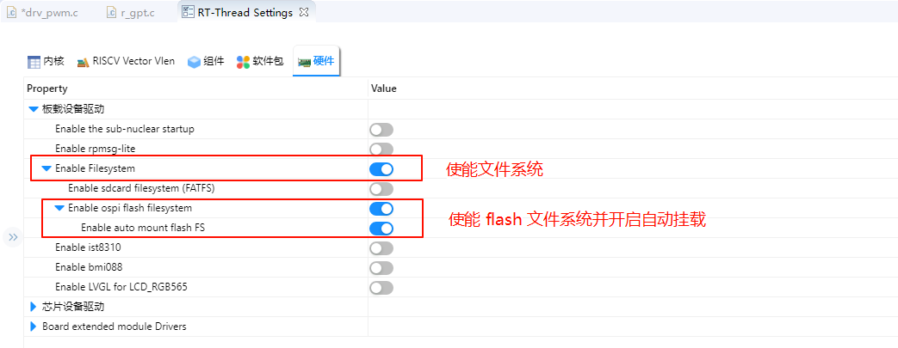

# Flash File System Usage Instructions

**English** | [**Chinese**](./README_zh.md)

## Introduction

This example demonstrates how to use **OSPI Flash** on the **Titan Board** to mount a **LittleFS file system**. With this example, you can read and write files on external flash, achieving persistent data storage. The program is based on the **RT-Thread file system component** and the **OSPI driver**.

## RA8 Series OSPI Features

The RA8 series MCU provides an **Octal SPI / Quad SPI interface (OSPI)**, specifically designed for high-speed external flash access. Its main features are as follows:

### 1. Multi-line High-Speed Access

- Supports **1–8 data line modes**:
  - 1-line SPI (standard SPI)
  - 4-line QSPI (Quad SPI)
  - 8-line OSPI (Octal SPI)
- Maximum clock frequency up to **100 MHz** (depending on MCU and Flash device), suitable for high-capacity, high-speed read/write operations.
- Supports **continuous read mode**, reducing the overhead of issuing commands for each read.

### 2. Flexible Flash Operation Modes

- Supports **Page Program**, typically 256 bytes per page, with block management for cross-page writes.
- Supports **Block Erase**, typical block sizes of 4KB or 64KB, allowing selective erasure to improve write efficiency.
- Supports **random read** and **continuous read** operations.
- Configurable **read/write commands, dummy cycles, and data line width** to match different Flash devices.
- Supports **high-speed modes (DDR / Quad / Octal I/O)** to improve transfer efficiency.

### 3. Interrupt and DMA Support

- The OSPI peripheral can notify transfer completion via **interrupts**.
- Supports **DMA mode** to reduce CPU load.
- Can be integrated with RT-Thread as a **block device (blkdev)**, facilitating file system mounting or data caching.

### 4. RT-Thread Driver Integration

- The RA8 OSPI driver can be registered as an RT-Thread **block device**.
- LittleFS or FatFS can be mounted on this block device for file system operations.
- Supports **thread-safe APIs**, allowing multi-threaded access to Flash.
- Configurable **page cache size** and **block erase/write strategy** to optimize LittleFS performance.

### 5. High Reliability Features

- Supports **write protection** and **software lock**.
- Supports **error detection**, such as command errors or data CRC verification.
- Ensures safe file system mounting after power loss or system reset.

## Abstraction Layer

- **FAL** (Flash Abstraction Layer) is an abstraction layer for managing and operating Flash devices and Flash-based partitions. It provides a unified API for upper-layer Flash and partition operations (as shown in the framework diagram below), with the following features:
  - Supports a statically configurable partition table, which can be associated with multiple Flash devices.
  - The partition table supports **automatic loading**, avoiding the issue of the partition table being repeatedly defined in multi-firmware projects.
  - Lightweight code with **no dependency on an operating system**, allowing it to run on bare-metal platforms, such as bootloaders with limited resources.
  - A unified operation interface ensures the reusability of underlying Flash drivers for components that rely on Flash, such as file systems, OTA, and NVM (e.g., [EasyFlash](https://github.com/armink-rtt-pkgs/EasyFlash)).
  - Built-in Finsh/MSH-based test commands, enabling developers to read, write, and erase Flash or partitions via shell commands with byte-level addressing, which facilitates debugging and testing.


## Hardware Description


## FSP Configuration

* Create a `r_ospi_b` stack:


* Configure the r_ospi_b stack:








* Flash pin configuration:


## RT-Thread Settings Configuration

* Enable Flash filesystem in RT-Thread Settings.



## Software Overview

The source code for file system initialization in this example is located at: `./board/ports/drv_filesystem.c` 中：

```c
#include <rtthread.h>

#if defined(BSP_USING_FILESYSTEM)
#include <dfs_romfs.h>
#include <dfs_fs.h>
#include <dfs_file.h>

#if DFS_FILESYSTEMS_MAX < 4
#error "Please define DFS_FILESYSTEMS_MAX more than 4"
#endif
#if DFS_FILESYSTEM_TYPES_MAX < 4
#error "Please define DFS_FILESYSTEM_TYPES_MAX more than 4"
#endif

#define DBG_TAG "app.filesystem"
#define DBG_LVL DBG_INFO
#include <rtdbg.h>

#ifdef BSP_USING_FS_AUTO_MOUNT
#ifdef BSP_USING_SDCARD_FATFS
static int onboard_sdcard_mount(void)
{
    if (dfs_mount("sd", "/sdcard", "elm", 0, 0) == RT_EOK)
    {
        LOG_I("SD card mount to '/sdcard'");
    }
    else
    {
        LOG_E("SD card mount to '/sdcard' failed!");
        rt_pin_write(0x000D, PIN_LOW);
    }

    return RT_EOK;
}
#endif /* BSP_USING_SDCARD_FATFS */
#endif /* BSP_USING_FS_AUTO_MOUNT */

#ifdef BSP_USING_FLASH_FS_AUTO_MOUNT
#ifdef BSP_USING_FLASH_FATFS
#define FS_PARTITION_NAME "filesystem"

static int onboard_fal_mount(void)
{
    /* init fal */
    extern int fal_init(void);
    extern struct rt_device* fal_mtd_nor_device_create(const char *parition_name);
    fal_init ();
    /* Create a block device on the ospi flash partition named "filesystem" */
    struct rt_device *mtd_dev = fal_mtd_nor_device_create (FS_PARTITION_NAME);
    if (mtd_dev == NULL)
    {
        LOG_E("Can't create a mtd device on '%s' partition.", FS_PARTITION_NAME);
        return -RT_ERROR;
    }
    else
    {
        LOG_D("Create a mtd device on the %s partition of flash successful.", FS_PARTITION_NAME);
    }

    /* Mount the filesystem on the ospi flash partition named "filesystem" */
    if (dfs_mount (FS_PARTITION_NAME, "/fal", "lfs", 0, 0) == 0)
    {
        LOG_I("Filesystem initialized!");
    }
    else
    {
        dfs_mkfs ("lfs", FS_PARTITION_NAME);
        if (dfs_mount ("filesystem", "/fal", "lfs", 0, 0) == 0)
        {
            LOG_I("Filesystem initialized!");
        }
        else
        {
            LOG_E("Failed to initialize filesystem!");
            rt_pin_write(0x000D, PIN_LOW);
        }
    }

    return RT_EOK;
}
#endif /*BSP_USING_FLASH_FATFS*/
#endif /*BSP_USING_FLASH_FS_AUTO_MOUNT*/

const struct romfs_dirent _romfs_root[] =
{
#ifdef BSP_USING_SDCARD_FATFS
    {ROMFS_DIRENT_DIR, "sdcard", RT_NULL, 0},
#endif

#ifdef BSP_USING_FLASH_FATFS
  { ROMFS_DIRENT_DIR, "fal", RT_NULL, 0 },
#endif
        };

const struct romfs_dirent romfs_root =
{
ROMFS_DIRENT_DIR, "/", (rt_uint8_t*) _romfs_root, sizeof(_romfs_root) / sizeof(_romfs_root[0])
};

static int filesystem_mount(void)
{

#ifdef RT_USING_DFS_ROMFS
    if (dfs_mount(RT_NULL, "/", "rom", 0, &(romfs_root)) != 0)
    {
        LOG_E("rom mount to '/' failed!");
    }

    /* Ensure that the block device is successfully registered before mounting the filesystem */
    rt_thread_delay(500);
#endif
#ifdef BSP_USING_FS_AUTO_MOUNT
    onboard_sdcard_mount();
#endif /* BSP_USING_FS_AUTO_MOUNT */

#ifdef BSP_USING_FLASH_FS_AUTO_MOUNT
    onboard_fal_mount ();
#endif

    return RT_EOK;
}
INIT_COMPONENT_EXPORT(filesystem_mount);
#endif /* defined(BSP_USING_FILESYSTEM)*/
```

## Build & Download

* **RT-Thread Studio:** Download the Titan Board resource pack from the RT-Thread Studio package manager, then create a new project and compile it.


Once compiled, connect the development board’s USB-DBG interface to the PC, and download the firmware to the development board.

## Running Result

Press the reset button to restart the development board and observe the terminal logs from the board.

