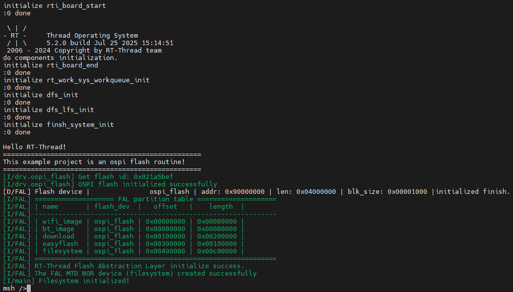

# Flash 文件系统使用说明

**中文** | [**English**](./README.md)

## 简介

本例程展示了如何在 **Titan Board** 上使用 **OSPI Flash** 挂载 **LittleFS 文件系统**。通过此示例，你可以在外部闪存中读写文件，实现数据持久化存储。程序基于 **RT-Thread 文件系统组件** 和 **OSPI 驱动**。

## RA8 系列 OSPI 特性

RA8 系列 MCU 提供 **Octal SPI / Quad SPI 接口（OSPI）**，专为高速外部闪存访问设计，主要特性如下：

### 1. 多线高速访问

- 支持 **1-8 数据线模式**：
  - 1线 SPI（标准 SPI）
  - 4线 QSPI（Quad SPI）
  - 8线 OSPI（Octal SPI）
- 最高时钟可达 **100 MHz**（取决于 MCU 和 Flash 器件），适合大容量高速读写。
- 可配置 **连续读取模式**，减少每次读取命令开销。

### 2. 灵活的 Flash 操作模式

- 支持 **页写入（Page Program）**，单页通常为 256 字节，可分块管理跨页写入。
- 支持 **块擦除（Block Erase）**，典型块大小 4KB、64KB，可按需擦除提高写入效率。
- 支持 **随机读取** 与 **连续读取**。
- 可配置 **读写指令、Dummy Cycle、Data Line Width**，满足不同 Flash 型号要求。
- 支持 **高速模式（DDR / Quad / Octal I/O）**，提高传输效率。

### 3. 中断与 DMA 支持

- OSPI 外设可通过 **中断** 通知传输完成。
- 支持 **DMA 模式**，减少 CPU 占用。
- 与 RT-Thread 结合，可封装为 **块设备（blkdev）**，方便挂载文件系统或缓存数据。

### 4. RT-Thread 驱动集成

- RA8 OSPI 驱动可注册为 RT-Thread **块设备**。
- LittleFS 或 FatFS 可挂载在该块设备上，实现文件系统操作。
- 支持 **线程安全 API**，方便多线程访问 Flash。
- 可配置 **页缓存大小** 和 **块擦写策略**，优化 LittleFS 性能。

### 5. 高可靠性特性

- 支持 **写保护（Write Protect）** 和 **软件锁定（Software Lock）**。
- 支持 **错误检测**，如命令错误或数据 CRC 校验。
- 可在断电或系统重启后安全挂载文件系统。

## FAL 抽象层

**FAL** (Flash Abstraction Layer) Flash 抽象层，是对 Flash 及基于 Flash 的分区进行管理、操作的抽象层，对上层统一了 Flash 及 分区操作的 API (框架图如下所示)，并具有以下特性：

- 支持静态可配置的分区表，并可关联多个 Flash 设备；
- 分区表支持 **自动装载** 。避免在多固件项目，分区表被多次定义的问题；
- 代码精简，对操作系统 **无依赖** ，可运行于裸机平台，比如对资源有一定要求的 Bootloader；
- 统一的操作接口。保证了文件系统、OTA、NVM（例如：[EasyFlash](https://github.com/armink-rtt-pkgs/EasyFlash)） 等对 Flash 有一定依赖的组件，底层 Flash 驱动的可重用性；
- 自带基于 Finsh/MSH 的测试命令，可以通过 Shell 按字节寻址的方式操作（读写擦） Flash 或分区，方便开发者进行调试、测试；


## 硬件说明


## FSP 配置

* 新建 r_ospi_b stack：


* 配置 r_ospi_b stack：


* Flash 引脚配置：


## RT-Thread Settings 配置

* 在 RT-Thread Settings 中使能 Flash。


## 软件说明

本例程的文件系统初始化源码位于 `./board/ports/drv_filesystem.c` 中：

```c
#include <rtthread.h>

#if defined(BSP_USING_FILESYSTEM)
#include <dfs_romfs.h>
#include <dfs_fs.h>
#include <dfs_file.h>

#if DFS_FILESYSTEMS_MAX < 4
#error "Please define DFS_FILESYSTEMS_MAX more than 4"
#endif
#if DFS_FILESYSTEM_TYPES_MAX < 4
#error "Please define DFS_FILESYSTEM_TYPES_MAX more than 4"
#endif

#define DBG_TAG "app.filesystem"
#define DBG_LVL DBG_INFO
#include <rtdbg.h>

#ifdef BSP_USING_FS_AUTO_MOUNT
#ifdef BSP_USING_SDCARD_FATFS
static int onboard_sdcard_mount(void)
{
    if (dfs_mount("sd", "/sdcard", "elm", 0, 0) == RT_EOK)
    {
        LOG_I("SD card mount to '/sdcard'");
    }
    else
    {
        LOG_E("SD card mount to '/sdcard' failed!");
        rt_pin_write(0x000D, PIN_LOW);
    }

    return RT_EOK;
}
#endif /* BSP_USING_SDCARD_FATFS */
#endif /* BSP_USING_FS_AUTO_MOUNT */

#ifdef BSP_USING_FLASH_FS_AUTO_MOUNT
#ifdef BSP_USING_FLASH_FATFS
#define FS_PARTITION_NAME "filesystem"

static int onboard_fal_mount(void)
{
    /* 初始化 fal 功能 */
    extern int fal_init(void);
    extern struct rt_device* fal_mtd_nor_device_create(const char *parition_name);
    fal_init ();
    /* 在 ospi flash 中名为 "filesystem" 的分区上创建一个块设备 */
    struct rt_device *mtd_dev = fal_mtd_nor_device_create (FS_PARTITION_NAME);
    if (mtd_dev == NULL)
    {
        LOG_E("Can't create a mtd device on '%s' partition.", FS_PARTITION_NAME);
        return -RT_ERROR;
    }
    else
    {
        LOG_D("Create a mtd device on the %s partition of flash successful.", FS_PARTITION_NAME);
    }

    /* 挂载 ospi flash 中名为 "filesystem" 的分区上的文件系统 */
    if (dfs_mount (FS_PARTITION_NAME, "/fal", "lfs", 0, 0) == 0)
    {
        LOG_I("Filesystem initialized!");
    }
    else
    {
        dfs_mkfs ("lfs", FS_PARTITION_NAME);
        if (dfs_mount ("filesystem", "/fal", "lfs", 0, 0) == 0)
        {
            LOG_I("Filesystem initialized!");
        }
        else
        {
            LOG_E("Failed to initialize filesystem!");
            rt_pin_write(0x000D, PIN_LOW);
        }
    }

    return RT_EOK;
}
#endif /*BSP_USING_FLASH_FATFS*/
#endif /*BSP_USING_FLASH_FS_AUTO_MOUNT*/

const struct romfs_dirent _romfs_root[] =
{
#ifdef BSP_USING_SDCARD_FATFS
    {ROMFS_DIRENT_DIR, "sdcard", RT_NULL, 0},
#endif

#ifdef BSP_USING_FLASH_FATFS
  { ROMFS_DIRENT_DIR, "fal", RT_NULL, 0 },
#endif
        };

const struct romfs_dirent romfs_root =
{
ROMFS_DIRENT_DIR, "/", (rt_uint8_t*) _romfs_root, sizeof(_romfs_root) / sizeof(_romfs_root[0])
};

static int filesystem_mount(void)
{

#ifdef RT_USING_DFS_ROMFS
    if (dfs_mount(RT_NULL, "/", "rom", 0, &(romfs_root)) != 0)
    {
        LOG_E("rom mount to '/' failed!");
    }

    /* 确保块设备注册成功之后再挂载文件系统 */
    rt_thread_delay(500);
#endif
#ifdef BSP_USING_FS_AUTO_MOUNT
    onboard_sdcard_mount();
#endif /* BSP_USING_FS_AUTO_MOUNT */

#ifdef BSP_USING_FLASH_FS_AUTO_MOUNT
    onboard_fal_mount ();
#endif

    return RT_EOK;
}
INIT_COMPONENT_EXPORT(filesystem_mount);
#endif /* defined(BSP_USING_FILESYSTEM)*/
```

## 编译&下载

* RT-Thread Studio：在RT-Thread Studio 的包管理器中下载 Titan Board 资源包，然后创建新工程，执行编译。


编译完成后，将开发板的 USB-DBG 接口与 PC 机连接，然后将固件下载至开发板。

## 运行效果

按下复位按键重启开发板，观察开发板终端日志。



