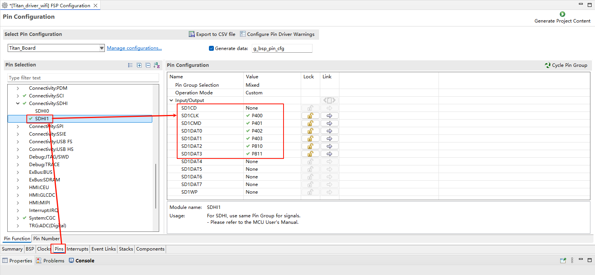
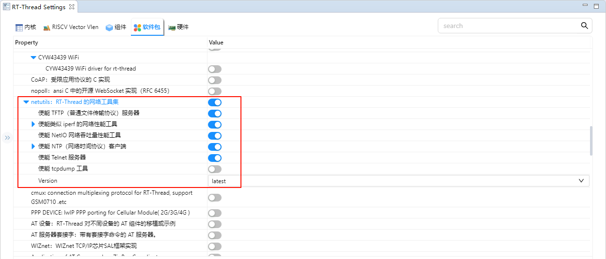
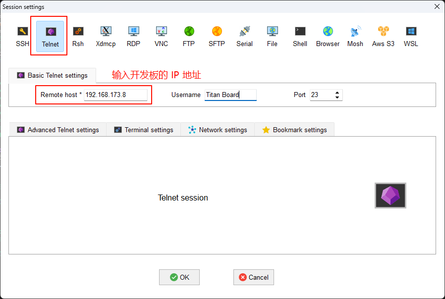

# netutils 示例说明

**中文** | [**English**](./README.md)

## 简介

netutils 是一个包含众多简洁好用网络工具的软件包，利用该软件包，可以给开发者在调试网络功能时带来很多便利。当需要使用一些调试网络的小工具时，只需要拥有 netutils 软件包就够了，堪称网络功能调试界的瑞士军刀。

本例程展示如何在 Titan Board 开发板上使用 netutils 软件包的各种功能。

## 硬件说明

本例程需要依赖 Titan Board 上的 WiFi 模块完成网络通信，因此请确保硬件平台上的 WiFi 模组可以正常工作。


## FSP配置

* 首先需要配置 Flash，Flash 配置参考 `Titan_component_flash_fs` 工程下的 [README_zh.md](.\..\Titan_component_flash_fs\README_zh.md)。
* 接下来配置 SDHI1，新建 r_sdhi stack：


* 配置 SDHI1 stack：


* 配置 SDHI1 引脚：




## RT-Thread Settings 配置

* 添加 netutils 软件包，使能要使用的网络工具。



## 软件说明

本例程的源码位于 `/project/Titan_component_netutils`。

### netutils 软件包文件结构说明

下面是 RT-Thread netutils 软件包功能的分类和简介：

| 名称    | 分类     | 功能简介                                                     |
| ------- | -------- | ------------------------------------------------------------ |
| Ping    | 调试测试 | 利用 “ping” 命令可以检查网络是否连通，可以很好地帮助我们分析和判定网络故障 |
| NTP     | 时间同步 | 网络时间协议                                                 |
| TFTP    | 文件传输 | TFTP 是一个传输文件的简单协议，比 FTP 还要轻量级             |
| Iperf   | 性能测试 | 测试最大 TCP 和 UDP 带宽性能，可以报告带宽、延迟抖动和数据包丢失 |
| NetIO   | 性能测试 | 测试网络的吞吐量的工具                                       |
| Telnet  | 远程访问 | 可以远程登录到 RT-Thread 的 Finsh/MSH Shell                  |
| tcpdump | 网络调试 | tcpdump 是 RT-Thread 基于 lwIP 的网络抓包工具                |

netutils 软件包文件结构如下所示：

```
netutils 		// netutils 文 件 夹
├── iperf 		// iperf 网 络 性 能 测 试
├── netio 		// netio 网 络 吞 吐 量 测 试
├── ntp 		// ntp 时 间 同 步 功 能
├── ping 		// ping 功 能
├── tcpdump 	// 网 络 抓 包 工 具
├── telnet 		// telnet 服 务 器
├── tftp 		// TFTP 功 能
├── tools 		// 网 络 测 试 工 具
```

## 编译&下载

* RT-Thread Studio：在 RT-Thread Studio 的包管理器中下载 Titan Board 资源包，然后创建新工程，执行编译。

编译完成后，将开发板的 USB-DBG 接口与 PC 机连接，然后将固件下载至开发板。

## 运行效果

#### 挂载文件系统

由于在使用 TFTP 功能向系统内传输文件时需要文件系统的支持，所以系统在初始化时会进行文件系统相关功能的初始化。文件系统正常初始化提示信息如下：

```shell
 \ | /
- RT -     Thread Operating System
 / | \     5.2.0 build Sep  1 2025 14:02:13
 2006 - 2024 Copyright by RT-Thread team
lwIP-2.0.3 initialized!
[I/sal.skt] Socket Abstraction Layer initialize success.
Hello RT-Thread!
===========================================================
This example project is an driver wifi routine(hyperflash)!
===========================================================
[I/drv.ospi_flash] Get flash id: 0x021a5bef
[I/drv.ospi_flash] OSPI flash initialized successfully
[D/FAL] Flash device |               ospi_flash | addr: 0x90000000 | len: 0x04000000 | blk_size: 0x00001000 |initialized finish.
[I/FAL] ==================== FAL partition table ====================
[I/FAL] | name         | flash_dev  |   offset   |    length  |
[I/FAL] -------------------------------------------------------------
[I/FAL] | whd_firmware | ospi_flash | 0x00000000 | 0x00080000 |
[I/FAL] | whd_clm      | ospi_flash | 0x00080000 | 0x00080000 |
[I/FAL] | download     | ospi_flash | 0x00100000 | 0x00200000 |
[I/FAL] | easyflash    | ospi_flash | 0x00300000 | 0x00100000 |
[I/FAL] | filesystem   | ospi_flash | 0x00400000 | 0x00c00000 |
[I/FAL] =============================================================
[I/FAL] RT-Thread Flash Abstraction Layer initialize success.
[I/FAL] The FAL MTD NOR device (filesystem) created successfully
[I/wifi] Filesystem initialized!
msh />WLAN MAC Address : 2C:B0:FD:A2:2D:60
WLAN Firmware    : wl0: Mar 28 2021 22:55:55 version 7.45.98.117 (dc5d9c4 CY) FWID 01-d36e8386
WLAN CLM         : API: 12.2 Data: 9.10.39 Compiler: 1.29.4 ClmImport: 1.36.3 Creation: 2021-03-28 22:47:33
WHD VERSION      : 3.1.0.23284 : v3.1.0 : GCC 13.2 : 2024-03-21 22:57:11 +0800
[I/WLAN.dev] wlan init success
[I/WLAN.lwip] eth device init ok name:w0
[I/WLAN.dev] wlan init success
[I/WLAN.lwip] eth device init ok name:w1
```

#### 连接 Wi-Fi

程序运行后会进入 MSH 命令行，等待用户配置设备接入网络。使用 MSH 命令 wifi join ssid password 配置网络，如下所示：

```shell
msh />wifi join ssid_test password
join ssid:ssid_test
[I/WLAN.mgnt] wifi connect success ssid:ssid_test
msh />[I/WLAN.lwip] Got IP address : 192.168.173.8
```

#### Ping 工具

Ping 是一种网络诊断工具，用来测试数据包能否通过 IP 协议到达特定主机。估算与主机间的丢失数据包率（丢包率）和数据包往返时间。

* Ping 域名

```shell
msh />ping www.rt-thread.org
ping: not found specified netif, using default netdev w0.
60 bytes from 120.222.223.251 icmp_seq=1 ttl=48 time=76 ms
60 bytes from 120.222.223.251 icmp_seq=2 ttl=48 time=54 ms
60 bytes from 120.222.223.251 icmp_seq=3 ttl=48 time=74 ms
60 bytes from 120.222.223.251 icmp_seq=4 ttl=48 time=74 ms

--- 120.222.223.251 ping statistics ---
4 packets transmitted, 4 received, 0% packet loss
minimum = 54ms, maximum = 76ms, average = 69ms
msh />
```

* Ping IP

```shell
msh />ping 192.168.173.247
ping: not found specified netif, using default netdev w0.
60 bytes from 192.168.173.247 icmp_seq=1 ttl=64 time=42 ms
60 bytes from 192.168.173.247 icmp_seq=2 ttl=64 time=44 ms
60 bytes from 192.168.173.247 icmp_seq=3 ttl=64 time=24 ms
60 bytes from 192.168.173.247 icmp_seq=4 ttl=64 time=24 ms

--- 192.168.173.247 ping statistics ---
4 packets transmitted, 4 received, 0% packet loss
minimum = 24ms, maximum = 44ms, average = 33ms
msh />
```

#### **NTP** 工具

NTP 是网络时间协议 (Network Time Protocol)，它是用来同步网络中各个计算机时间的协议。在 netutils 软件包实现了 NTP 客户端，连接上网络后，可以获取当前 UTC 时间，并更新至 RTC 中。

MSH 命令效果如下：

```shell
msh />ntp_sync
[I/ntp] Get local time from NTP server: Mon Sep  1 15:15:35 2025
msh />
```

#### **TFTP** 工具

**TFTP** （**Trivial File Transfer Protocol**，简单文件传输协议）是 TCP/IP 协议族中的一个用来在客户机与服务器之间进行简单文件传输的协议，提供不复杂、开销不大的文件传输服务，端口号为 69 ，比传统的FTP 协议要轻量级很多，适用于小型的嵌入式产品上。

TFTP 工具的准备工作需要下面两个步骤：

* 安装 TFTP 客户端安装文件位于 **packages/netutils/tools/Tftpd64-4.60-setup.exe** ，使用 TFTP 前，请先安装该软件。

* 启动 TFTP 服务器在传输文件前，需要在 RT-Thread 上使用 Finsh/MSH 命令来启动 TFTP 服务器，大致效果如下：

```shell
msh />tftp -s
tftp server start!
msh />
```

* 连接 RT-Thread 操作系统并发送文件

打开刚安装的 Tftpd64 软件，按如下操作进行配置：

1. 选择 Tftp Client ；

2. 在 Server interfaces 下拉框中，务必选择与 RT-Thread 处于同一网段的网卡；

3. 填写 TFTP 服务器的 IP 地址。可以在 RT-Thread 的 MSH 下使用 ifconfig 命令查看；

4. 填写 TFTP 服务器端口号，默认：69；

5. 选择好要发送文件，Remote File 是服务器端保存文件的路径（包括文件名），选项支持相对路径和绝对路径。由于 RT-Thread 默认开启 DFS_USING_WORKDIR 选项，此时相对路径是基于 MSH 当前进入的目录。所以，使用相对路径时，务必提前切换好目录；

6. 点击 Put 按钮即可。

注意：如果 DFS_USING_WORKDIR 未开启，同时 Remote File 为空，文件会将保存至根路径下。


在 MSH 中查看 PC 发送的文件：

```shell
msh />ls
Directory /:
test.txt            16
msh />cat test.txt
Hello RT-Thread!
msh />
```

* 从 RT-Thread 获取文件

首先在根目录创建一个文本文件，输入内容 “Hello!”。

```shell
msh />echo "Hello!" test1.txt
msh />cat test1.txt
Hello!
msh />
```

1. 在 Tftpd64 软件中，填写好要接收保存的文件路径（包含文件名）；

2. Remote File 是服务器端待接收回来的文件路径（包括文件名），选项支持相对路径和绝对路径。由于 RT-Thread 默认开启 DFS_USING_WORKDIR 选项，此时相对路径是基于 Finsh/MSH 当前进入的目录。所以，使用相对路径时，务必提前切换好目录；

3. 点击 Get 按钮即可。如下所示，将 /test1.txt 保存到本地，这里使用的是绝对路径：


下图是从 RT-Thread 获取到的文件：


#### Telnet 工具

**Telnet** 是一种基于 TCP 的远程终端协议，用于在网络中远程登录设备的命令行界面。通过 Telnet，可以在 PC 上远程访问开发板的命令行，实现调试、监控和控制。要在 RT-Thread 上使用 Finsh/MSH 命令来启动 telnet 服务，大致效果如下：

```shell
msh />telnet_server
Telnet server start successfully
msh />telnet: waiting for connection
```

接下来使用远程连接工具连接开发板。



连接成功后就可以远程控制开发板了。

```shell
 \ | /
- RT -     Thread Operating System
 / | \     5.2.0 build Sep  1 2025 14:02:13
 2006 - 2024 Copyright by RT-Thread team
msh />
msh />
msh />list device
device               type         ref count
------------ -------------------- ----------
telnet       Character Device     2
w1           Network Interface    1
w0           Network Interface    1
wlan0        Network Interface    1
wlan1        Network Interface    1
filesystem   MTD Device           1
rtc          RTC                  0
uart8        Character Device     0
pin          Pin Device           0
msh />
```

#### 更多网络工具

除了上述常用的网络工具，netutils 软件包也提供一些开发调试中比较实用的网络工具，如 NetIO 工具、Iperf 工具和 tcpdump 工具。这些工具的使用方法可以参考软件包功能目录下的说明文件。
