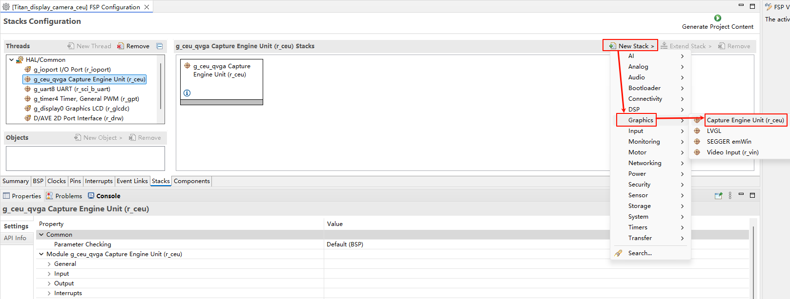
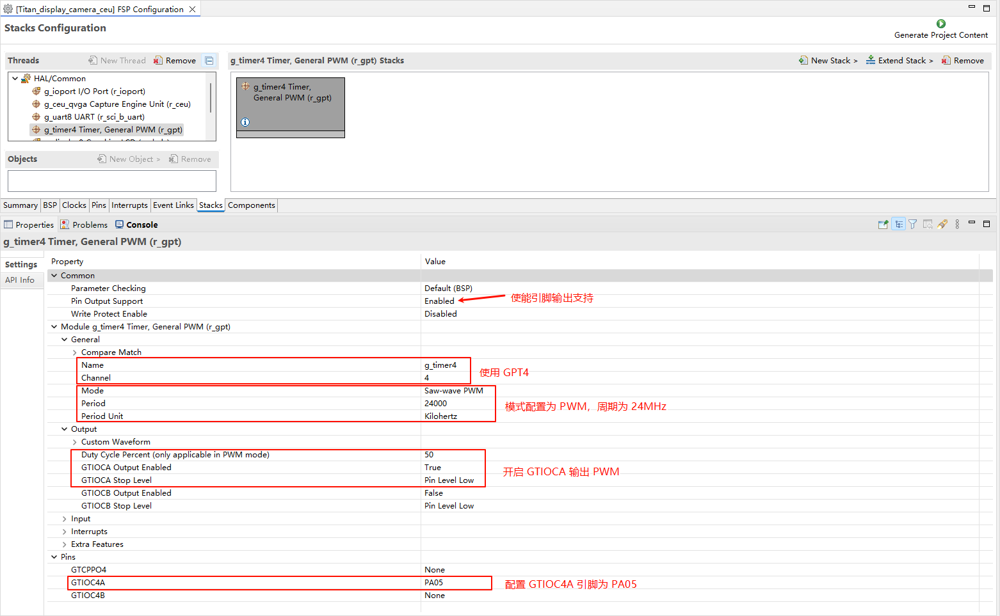
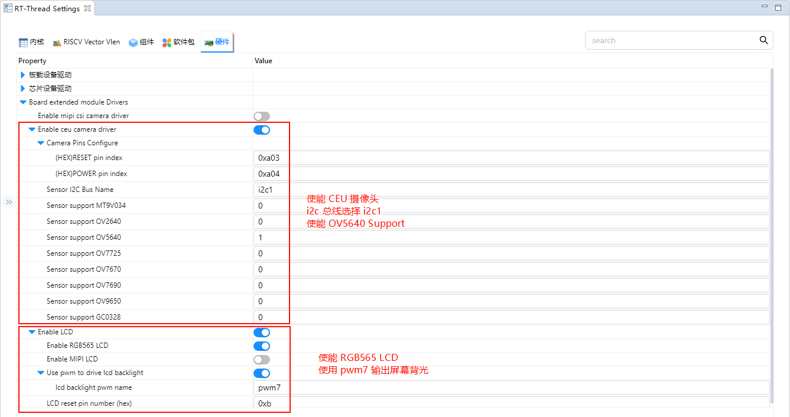

# CEU Camera Usage Instructions

**English**|[**Chinese**](README_zh.md)

## Introduction

This example demonstrates how to use the **CEU (Camera Engine Unit)** interface on the **Titan Board** to connect an **OV5640 camera**, and display the captured images on an **RGB565 LCD screen** via the **RT-Thread LCD framework**.

Key functionalities include:

- Initialize the CEU camera interface to capture real-time video streams
- Configure OV5640 camera parameters (resolution, frame rate, output format)
- Display captured images using the RT-Thread LCD driver
- Support image format conversion (YUV422 → RGB565)

## RA8 Series CEU (Camera Engine Unit) Features

The RA8 series MCU integrates a **CEU hardware module** for efficient capture of camera image data, supporting multiple image formats and resolutions, and enabling direct transfer to memory or display interfaces.

### 1. CEU Hardware Interface Features

1. **Interface Types**
   - **DVP (Digital Video Port)** interface for connecting CMOS cameras
   - Supports 8/10/12-bit data bus
   - Synchronization signals:
     - **PCLK**: Pixel clock
     - **HSYNC**: Line synchronization
     - **VSYNC**: Frame synchronization
2. **Input Resolution and Frame Rate**
   - Supports VGA, QVGA, SXGA, UXGA, and other common resolutions
   - Frame rates from 1–60 fps, configurable for different applications
3. **Camera Compatibility**
   - Compatible with common CMOS cameras such as OV5640, OV7670
   - Supports auto-initialization and register configuration

### 2. Image Formats and Processing Capabilities

1. **Supported Image Formats**
   - **YUV422** (commonly used for video transfer)
   - **RGB565** (suitable for LCD display)
   - **RAW10/RAW12** (for image processing and algorithm development)
2. **Image Processing Features**
   - **Color space conversion**: YUV ↔ RGB
   - **Image cropping**: capture only a specific ROI (Region of Interest)
   - **Image scaling**: support proportional scaling up or down
   - **Mirror and flip**: horizontal or vertical mirroring
3. **Hardware Acceleration**
   - CEU contains a hardware processing unit to reduce CPU load
   - Provides fast image format conversion and scaling

### 3. DMA Support and Buffer Mechanism

1. **High-Speed DMA Transfer**
   - Works with MCU DMAC for fast memory writes
   - Supports direct writing to frame buffer or LCD buffer
2. **Multi-Buffer Mechanism**
   - Supports double buffering or ring buffers for continuous video capture
   - Reduces frame loss and display latency
3. **Flexible DMA Configuration**
   - Configurable buffer start address and size
   - Supports interrupt triggering and callbacks

### 4. Interrupt Mechanism

1. **Interrupt Types**
   - **Frame End Interrupt**: triggered when each frame capture completes
   - **Line End Interrupt (optional)**: triggered at the end of each line capture
   - **Error Interrupt**: including buffer overflow or sync signal anomalies
2. **Interrupt Features**
   - Supports RT-Thread ISR callback registration
   - Can work with DMA for real-time processing and display

### 5. Timing and Synchronization Features

1. **Line/Frame Synchronization**
   - HSYNC aligns each line of data
   - VSYNC aligns each frame
2. **Pixel Clock**
   - CEU supports external PCLK or internal clock division
   - Ensures synchronization with camera output to avoid sampling errors
3. **Data Alignment**
   - Supports byte or pixel alignment
   - Automatically adjusts according to image format

### 6. Performance and Optimization

1. **High Throughput**
   - DMA + double buffering enables continuous video capture
   - Low CPU usage suitable for real-time applications
2. **Reliability**
   - Sync signal anomalies trigger interrupts
   - Buffer overflow detection
   - Automatic recovery from frame loss
3. **Flexibility**
   - Supports multiple resolutions and format switching
   - Configurable cropping and scaling regions to improve display efficiency

### 7. Application Scenarios

- Real-time video display on LCD
- Video capture and image processing algorithm testing
- Embedded vision applications, e.g., surveillance, gesture recognition, robotics vision

## RA8 Series MCU GLCDC (Graphics LCD Controller) Features

The RA8 series MCU (e.g., RA8P1) integrates a **GLCDC hardware module** for driving TFT/LCD displays, enabling high-speed graphics rendering and video display, supporting multiple resolutions, color formats, and display modes.

### 1. Hardware Features

1. **Resolution Support**
   - Can drive common resolutions from QVGA (320×240) to WQVGA/XGA
   - Limited by on-chip RAM and display interface bandwidth
2. **Color Support**
   - Supports 1/4/8/16/24/32-bit color depth
   - Common formats: RGB565, RGB888
   - Supports palette mode (CLUT)
   - Hardware color conversion available
3. **Interface Types**
   - Parallel RGB (TFT LCD interface)
   - Supports 16/18/24-bit data bus
   - Direct connection to external LCD panels
   - Programmable timing: HSYNC, VSYNC, DE, PCLK, RGB output

### 2. Layers and Display Modes

1. **Layer Support**
   - Single-layer mode (single screen display)
   - Multi-layer mode (palette or hardware alpha blending)
   - Supports transparent/semi-transparent overlay
2. **Display Modes**
   - RGB mode (direct color output)
   - CLUT/Palette mode (indexed color via lookup table)
   - Configurable scan direction (horizontal/vertical)

### 3. DMA and Frame Buffer

1. **Frame Buffer Access**
   - GLCDC can directly access on-chip or external SRAM frame buffer
   - Supports single or double buffering
   - Supports ring buffer for continuous refresh
2. **DMA Support**
   - Works with MCU DMAC to reduce CPU usage
   - Can transfer images directly from memory to LCD
   - Supports line, block, or full-frame transfer

### 4. Hardware Graphics Functions

1. **Window Cropping and Scaling**
   - Can specify display window area
   - Supports simple horizontal/vertical scaling
2. **Hardware Graphics Acceleration**
   - Rectangle fill, color replacement
   - Image transparency processing
   - Can be combined with CEU or DMA for video display
3. **Color Format Conversion**
   - YCbCr → RGB
   - RGB888 → RGB565
   - Hardware accelerated to reduce CPU load

### 5. Interrupt Mechanism

1. **Interrupt Types**
   - Frame End
   - Line End (optional)
   - Access error/overflow
2. **Interrupt Application**
   - Integrates with RT-Thread ISR
   - Can trigger buffer update or double-buffer swap on frame completion
   - Enables smooth animations and video display

### 6. Performance Optimization

1. **Double Buffer Mechanism**
   - Reduces flicker
   - CPU can render next frame in background
   - GLCDC hardware automatically switches display buffer
2. **Frame Rate Control**
   - Programmable clock and line/frame synchronization
   - Supports common refresh rates (30fps, 60fps)
3. **CPU Offload**
   - Many graphics operations performed in hardware
   - DMA + GLCDC combination enables efficient image display

## Hardware Description

* CEU camera interface

* RGB LCD interface:

## FSP Configuration

### CEU Configuration

* Create a  `r_ceu` stack：

* Configure CEU：

* Configure CEU pins：

### CEU Clock Configuration

* Create a  `r_gpt` stack：

* Configure the camera clock PWM output:

### D/AVE 2D Configuration

* Create a `r_drw` stack:

### RGB LCD Configuration

* Create a  `r_glcdc` stack：

* Configure interrupt callback and graph layer 1:

* Configure the output parameters, CLUT, TCON, and Dithering:

* Configure GLCDC pins:

### LCD Backlight Configuration

* Create a  `r_gpt` stack:

* Configure back light PWM output:

## RT-Thread Settings Configuration

* Enable CUE camera, using i2c1 and ov5640 camera. Enable RGB565 LCD, using pwm7 output backlight.

## Compilation & Download

- **RT-Thread Studio**: In RT-Thread Studio’s package manager, download the Titan Board resource package, create a new project, and compile it.

After compilation, connect the development board’s USB-DBG interface to the PC and download the firmware to the development board.

## Run Effect

After resetting the Titan Board, the terminal will output the following message:

Here is the image displayed on the LCD screen:

