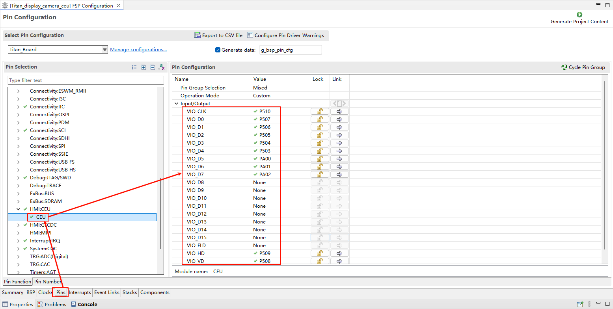
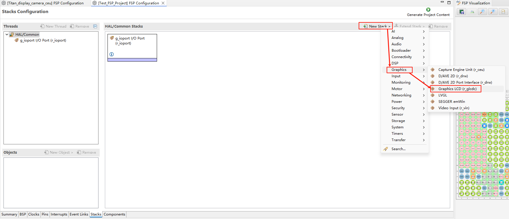
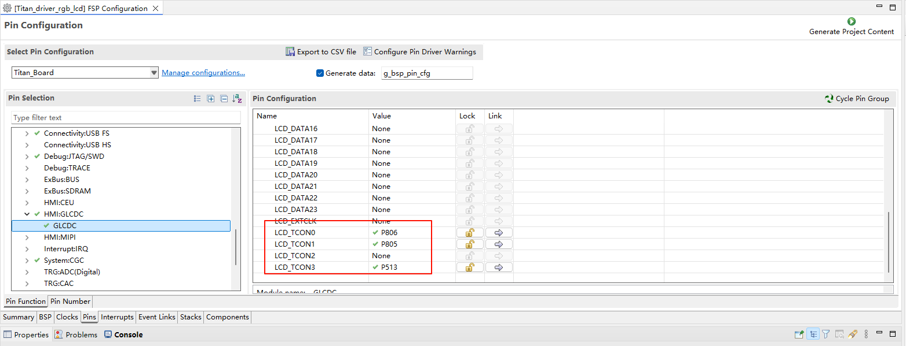

# CEU 摄像头使用说明

**中文**|[**English**](README.md)

## 简介

本示例展示了如何在 **Titan Board** 上使用 **CEU（Camera Engine Unit）** 接口连接 **OV5640 摄像头**，并通过 **RT-Thread LCD 框架** 将捕获的图像显示到 **RGB565 LCD 屏幕**。

主要功能包括：

- 初始化 CEU 摄像头接口，捕获实时视频流
- 配置 OV5640 摄像头参数（分辨率、帧率、输出格式）
- 使用 RT-Thread LCD 驱动显示摄像头捕获的图像
- 支持图像格式转换（YUV422 → RGB565）

## RA8 系列 CEU（Camera Engine Unit）特性

RA8 系列 MCU 内置 **CEU 硬件模块**，用于高效捕获摄像头图像数据，并支持多种图像格式和分辨率，直接将数据传输到内存或显示接口。

### 1. CEU 硬件接口特性

1. **接口类型**
   - **DVP（Digital Video Port）** 接口，用于连接 CMOS 摄像头
   - 支持 8/10/12 位数据总线
   - 同步信号：
     - **PCLK**：像素时钟
     - **HSYNC**：行同步信号
     - **VSYNC**：帧同步信号
2. **输入分辨率与帧率**
   - 支持 VGA、QVGA、SXGA、UXGA 等常用分辨率
   - 帧率支持 1–60 fps，可配置以适应不同应用
3. **摄像头兼容性**
   - 与 OV5640、OV7670 等常用 CMOS 摄像头兼容
   - 支持自动初始化和寄存器配置

### 2. 图像格式与处理能力

1. **图像格式支持**
   - **YUV422**（常用用于视频传输）
   - **RGB565**（适合 LCD 显示）
   - **RAW10/RAW12**（用于图像处理和算法开发）
2. **图像处理功能**
   - **颜色空间转换**：YUV ↔ RGB
   - **图像裁剪**：可只采集部分 ROI（Region of Interest）
   - **图像缩放**：支持按比例缩小或放大
   - **镜像与翻转**：可水平或垂直镜像
3. **硬件加速**
   - CEU 内置硬件处理单元，可减轻 CPU 负担
   - 提供快速图像格式转换和缩放功能

### 3. DMA 支持与缓冲机制

1. **高速 DMA 传输**
   - 与 MCU 的 DMAC 配合，实现内存高速写入
   - 支持直接将图像写入 Frame Buffer 或 LCD 缓冲区
2. **多缓冲区机制**
   - 支持双缓冲或环形缓冲，保证连续视频采集
   - 减少帧丢失和显示延迟
3. **DMA 配置灵活**
   - 可配置缓冲区起始地址、大小
   - 支持中断触发与回调

### 4. 中断机制

1. **中断类型**
   - **帧完成中断（Frame End）**：每帧采集完成时触发
   - **行中断（Line End，可选）**：每行采集完成时触发
   - **错误中断**：包括缓冲区溢出、同步信号异常
2. **中断特点**
   - 支持 RT-Thread ISR 回调注册
   - 可与 DMA 联动，实现实时处理和显示

### 5. 时序与同步特性

1. **行/帧同步**
   - HSYNC 对齐每行数据
   - VSYNC 对齐每帧图像
2. **像素时钟**
   - CEU 支持外部 PCLK 或内部分频
   - 确保与摄像头输出同步，避免采样错误
3. **数据对齐**
   - 支持字节对齐或像素对齐
   - 可根据图像格式自动调整

### 6. 性能与优化

1. **高吞吐量**
   - DMA + 双缓冲机制实现连续视频采集
   - CPU 占用低，适合实时应用
2. **可靠性**
   - 同步信号异常可触发中断
   - 缓冲区溢出检测
   - 支持帧丢失自动恢复
3. **灵活性**
   - 支持多分辨率和多格式切换
   - 可配置裁剪和缩放区域，提高显示效率

### 7. 应用场景

- 实时视频显示到 LCD
- 视频采集与处理算法测试
- 嵌入式视觉应用，如监控、手势识别、机器人视觉

## RA8 系列 MCU GLCDC（Graphics LCD Controller）特性

RA8 系列 MCU（如 RA8P1）集成 **GLCDC 硬件模块**，用于驱动 TFT/LCD 显示屏，实现高速图形渲染和视频显示，支持多种分辨率、色彩格式和显示模式。

### 1. 硬件特性

1. **分辨率支持**
   - 可驱动从 QVGA (320×240) 到 WQVGA/XGA 等常用分辨率
   - 受片上 RAM 和显示接口带宽限制
2. **色彩支持**
   - 支持 1/4/8/16/24/32 位色深
   - 常用 RGB565、RGB888 格式
   - 支持调色板模式（Palette mode）
   - 可硬件进行色彩转换
3. **接口类型**
   - 并行 RGB（TFT LCD 接口）
   - 支持 16/18/24 位数据总线
   - 可与外部 LCD 面板直接连接
   - 时序可编程：HSYNC、VSYNC、DE、PCLK、RGB 输出

### 2. 图层与显示模式

1. **图层支持**
   - 单图层模式（单画面显示）
   - 多图层模式（通过调色板或硬件 alpha 混合叠加）
   - 支持透明/半透明叠加
2. **显示模式**
   - RGB 模式（直显颜色输出）
   - CLUT/Palette 模式（索引颜色，通过查表转换）
   - 可配置扫描方向（水平/垂直扫描）

### 3. DMA 与帧缓冲

1. **帧缓冲访问**
   - GLCDC 可直接访问片上/外部 SRAM 中的帧缓冲
   - 支持单缓冲、双缓冲模式
   - 支持环形缓冲，用于连续刷新
2. **DMA 支持**
   - 与 MCU DMAC 协同工作，减少 CPU 占用
   - 可将图像直接从内存传输到 LCD
   - 支持行、块或全帧传输

### 4. 硬件图形功能

1. **窗口裁剪与缩放**
   - 可指定显示窗口区域
   - 可支持简单缩放（水平/垂直）
2. **硬件图形加速**
   - 支持矩形填充、颜色替换
   - 支持图像透明处理
   - 可结合 CEU 或 DMA 进行视频显示
3. **颜色格式转换**
   - YCbCr → RGB
   - RGB888 → RGB565
   - 硬件加速，减少 CPU 负担

### 5. 中断机制

1. **中断类型**
   - 帧完成中断（Frame End）
   - 行中断（Line End，可选）
   - 访问错误/溢出中断
2. **中断应用**
   - 与 RT-Thread ISR 集成
   - 可在帧完成时触发更新缓冲区或切换双缓冲
   - 方便实现动画和视频显示

### 6. 性能优化

1. **双缓冲机制**
   - 支持双缓冲减少闪烁
   - CPU 可在后台绘制下一帧
   - GLCDC 硬件自动切换显示缓冲
2. **帧率控制**
   - 可编程时钟和行/帧同步
   - 支持 30fps、60fps 等常见刷新率
3. **CPU 卸载**
   - 大量图形操作由硬件完成
   - DMA + GLCDC 结合，实现高效图像显示

## 硬件说明

CEU 摄像头接口和 RGB LCD 接口如下图所示：

## FSP 配置

### CEU 配置

* 新建 `r_ceu` stack：

* 配置 CEU：

* 配置 CEU 引脚：

### CEU 时钟配置

* 新建 `r_gpt` stack：

* 配置摄像头时钟 PWM 输出：

### D/AVE 2D 配置

* 新建 `r_drw` stack：

### RGB LCD 配置

* 新建 `r_glcdc` stack：

* 配置中断回调和图形层1：

* 配置输出参数、CLUT、TCON和抖动。

* 配置 GLCDC 的引脚：

### LCD 背光配置

* 新建 `r_gpt` stack：

* 配置背光 PWM 输出：

## RT-Thread Settings 配置

* 使能 CUE 摄像头，使用 i2c1 和 ov5640 摄像头；使能 RGB565 LCD，使用 pwm7 输出背光。

## 编译&下载

- RT-Thread Studio：在RT-Thread Studio 的包管理器中下载 Titan Board 资源包，然后创建新工程，执行编译。

编译完成后，将开发板的 USB-DBG 接口与PC 机连接，然后将固件下载至开发板。

## 运行效果

复位 Titan Board 后终端会输出如下信息：

下面是 LCD 屏幕上显示的图像：

