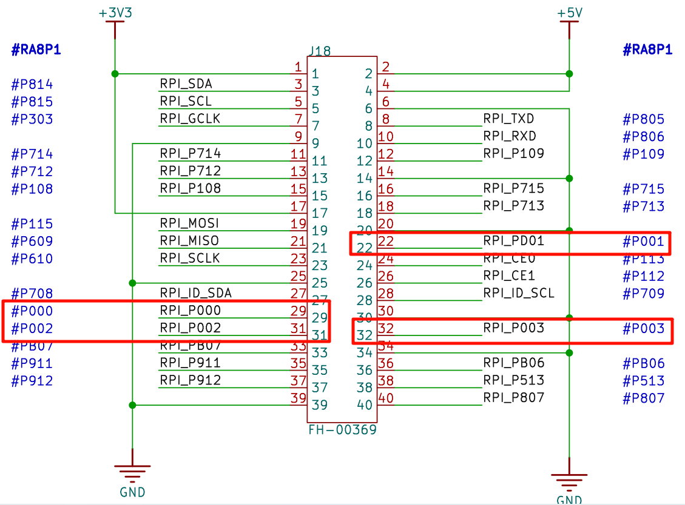

# ADC Application Example Usage Instructions

**English** | [**Chinese**](./README_zh.md)

## Introduction

This example demonstrates how to use the **RA8 series MCU ADC (Analog-to-Digital Converter)** on the **Titan Board**, combined with the **RT-Thread ADC driver framework** for analog signal acquisition and processing.

Main functionalities include:

- Initializing the ADC hardware module
- Configuring ADC channels, sampling time, and trigger mode
- Reading analog signals through the RT-Thread ADC driver interface
- Supporting single-shot sampling, continuous sampling, and hardware-triggered sampling

## RA8P1 ADC Features

### 1. ADC Overview

**ADC (Analog-to-Digital Converter)** is a device or module that converts continuous analog signals into discrete digital signals. It is a core component in modern digital control systems, signal processing, and measurement systems.

- **Function**: Converts continuous signals like voltage and current into digital values for processing by microcontrollers (MCU), DSPs, or FPGAs.
- **Key Parameters**:
  - **Resolution**: The number of digital bits output by the ADC, representing the number of distinguishable levels. The RA8P1 has **16-bit** resolution, i.e., 2^16 = 65,536 distinct levels.
  - **Sampling Rate**: The number of ADC samples per second, affecting the frequency range of signals that can be captured.
  - **Input Range**: The range of analog voltages the ADC can process.
  - **Accuracy**: Indicates how close the ADC output is to the actual input signal, affected by noise, nonlinearity, and offset errors.

### 2. ADC Working Principle

The ADC operation can be divided into several stages:

1. **Sample & Hold (S/H)**
   - Captures and holds the analog signal at the sampling instant to ensure stability during conversion.
   - RA8 series ADCs support **adjustable sample-and-hold time**, optimizing sampling for high-impedance signals.

2. **Quantization**
   - Divides the analog signal into discrete levels, each corresponding to a digital code.
   - A 16-bit ADC divides the input voltage range into 65,536 levels, with quantization precision:ΔV = VREF / 65536.

3. **Encoding**
- Converts the quantized level into a binary code output.
- RA8P1 ADC supports **right-aligned / left-aligned data output** for flexible data handling.

### 3. ADC Type and RA8P1 Features

This MCU contains two units of **Noise-Shaping SAR-type A/D converters (ADC16H)** that is the hybrid architecture with

features of SAR-type and Delta-Sigma modulation-type. The A/D converter unit 0 (ADC0) can select up to 15 channels of

analog inputs. The A/D converter unit 1 (ADC1) can select up to 15 channels of analog inputs. The temperature sensor,

internal reference voltage, VBATT 1/6 voltage monitor output, and D/A converters can be A/D-converted by A/D converter

unit 0 or unit 1. A/D conversion data can be selected from 16-bit, 14-bit, 12-bit, and 10-bit length data formats.

The ADC16H has the following features:

● **Resolution**: Up to 16-bit

● **Fast conversion**: Up to 6.25 Msps (0.16 µs per channel) (when A/D conversion clock ADCLK = 50 MHz)

● **Input channels**: Up to 23 analog input channels

● **Support single-ended input or differential inputs**

● **Self-calibration function**

● **Built-in channel-dedicated sample-and-hold circuit (S&H)**

> **SAR ADC Working Flow**:
>
> 1. Sample and hold the input voltage  
> 2. Stepwise comparison with DAC output  
> 3. Adjust the binary code according to the comparison result  
> 4. Output the digital value

### 4. Key ADC Parameters

1. **Resolution**
- RA8P1 16-bit ADC: theoretical minimum detectable voltage ΔV = VREF / 65536
- Example: VREF = 3.3V, ΔV ≈ 0.00005 V ≈ 50 μV

2. **Sampling Time**
- Determines input voltage stability and ADC error.
- High-impedance signals require longer sampling time to avoid errors.

3. **Linearity**
- **INL (Integral Nonlinearity)**: Cumulative error, deviation from ideal straight line  
- **DNL (Differential Nonlinearity)**: Step size error between adjacent codes

4. **Noise and Accuracy**
- System noise affects low-level resolution. The effective resolution in 16-bit mode is usually slightly below 16 bits (e.g., 15 effective bits).

5. **Input Impedance**
- High-impedance signals can be sampled directly; low-impedance or high-speed signals may require buffering.

### 5. Typical RA8P1 ADC Applications

- **Industrial Measurement**: Temperature, pressure, and flow sensor acquisition  
- **Motor Control**: Current and voltage sampling for closed-loop control  
- **Signal Processing**: Audio acquisition, vibration monitoring  
- **Data Logging**: Multi-channel high-speed sampling for storage or transmission to a host

## Hardware Description

As shown in the following schematic diagram, there are 4 ADC channel interfaces on the Titan Board, namely channels 0, 1, 2 and 3 of adc0.



## FSP Configuration

* Step 1: Open FSP and import the XML configuration file (or directly click the FSP link file in RT-Thread Studio).
* Step 2: Create a new `r_adc` stack, configure the ADC device, and select the channels to be used.


* Step 3: Save and click "Generate Project". The generated code will be saved in `hal_data.c`.

## RT-Thread Settings Configuration

* Enable ADC0:


## Example Code Description

The ADC source code is located in `/project/Titan_driver_adc/src/hal_entry.c`. The macros used are defined as follows:


The specific function is to sample the analog voltage from ADC0 channel 1 every 1000ms and perform a conversion. The code is as follows:

```c
static int adc_vol_sample()
{
    rt_adc_device_t adc_dev;
    rt_uint32_t value, vol;
    rt_err_t ret = RT_EOK;

    adc_dev = (rt_adc_device_t)rt_device_find(ADC_DEV_NAME);
    if (adc_dev == RT_NULL)
    {
        rt_kprintf("adc sample run failed! can't find %s device!\n", ADC_DEV_NAME);
        return RT_ERROR;
    }

    ret = rt_adc_enable(adc_dev, ADC_DEV_CHANNEL);

    while(1)
    {
        value = rt_adc_read(adc_dev, ADC_DEV_CHANNEL);
        rt_kprintf("the value is :%d \n", value);

        vol = value * REFER_VOLTAGE / CONVERT_BITS;
        rt_kprintf("the voltage is :%d.%02d \n", vol / 100, vol % 100);

        rt_thread_mdelay(1000);
    }

    ret = rt_adc_disable(adc_dev, ADC_DEV_CHANNEL);

    return ret;
}
```

In the example, the `while` loop calls `adc_vol_sample` every 1000ms.

## Compilation & Download

* **RT-Thread Studio**: In RT-Thread Studio’s package manager, download the Titan Board resource package, create a new project, and compile it.

After compilation, connect the development board’s USB-DBG interface to the PC and download the firmware to the development board.

## Run Effect

The effect when using ADC0 channel 1 to sample a 1.8V voltage is shown below:

