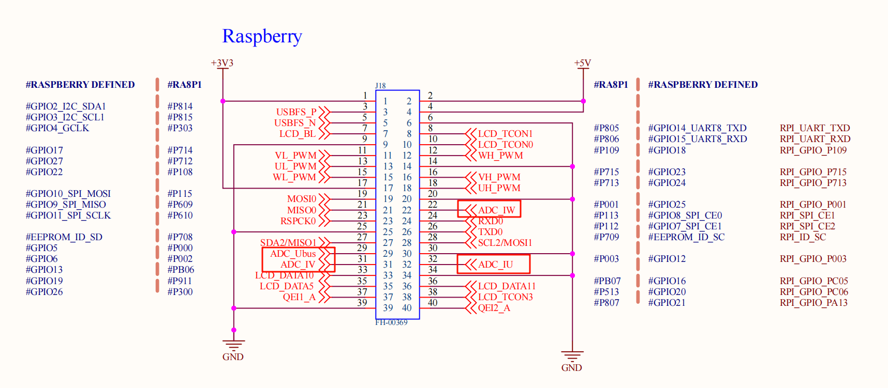
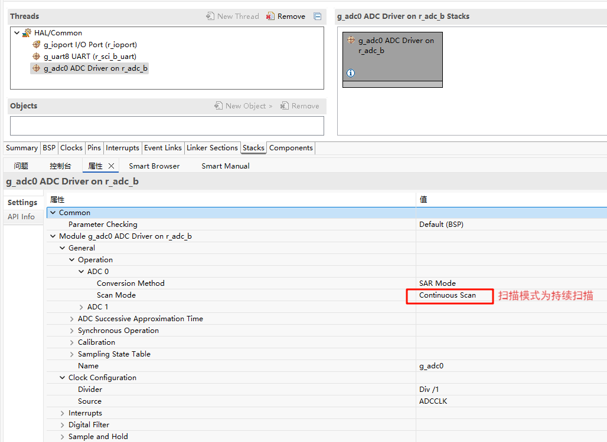
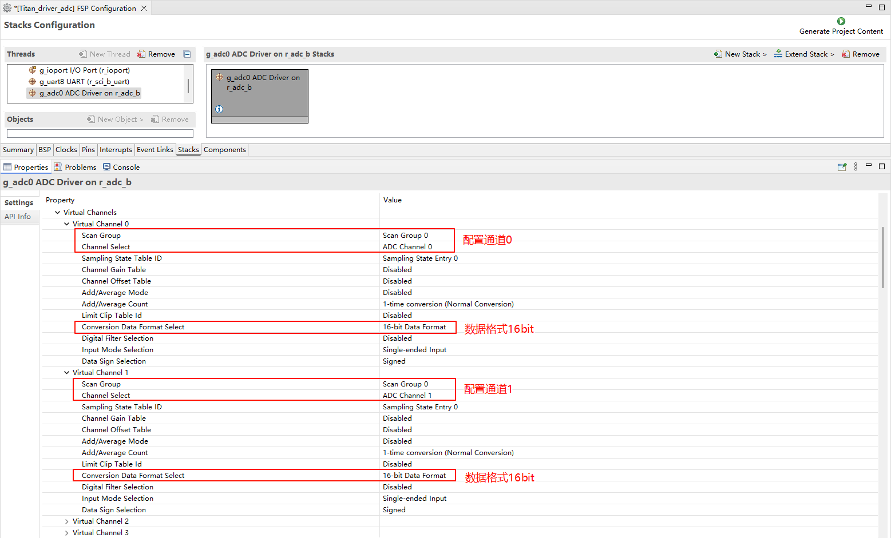
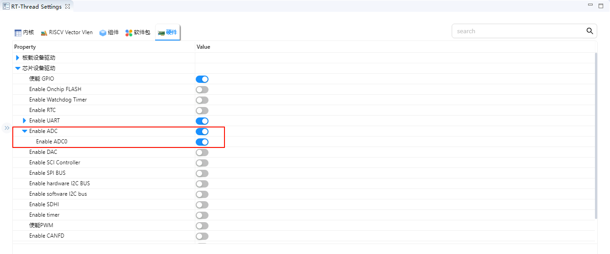

# ADC应用示例说明

**中文** | [**English**](./README.md)

## 简介

本示例展示了如何在 **Titan Board** 上使用 **RA8 系列 MCU 的 ADC（Analog-to-Digital Converter）**，结合 **RT-Thread ADC 驱动框架**进行模拟信号采集和处理。

主要功能包括：

- 初始化 ADC 硬件模块
- 配置 ADC 通道、采样时间和触发方式
- 通过 RT-Thread ADC 驱动接口读取模拟信号
- 支持单次采样、连续采样及硬件触发

## RA8P1 ADC 特性

### 1. ADC概述

**ADC（Analog-to-Digital Converter）** 是将连续的模拟信号转换为离散的数字信号的器件或模块，是现代数字控制系统、信号处理和测量系统中的核心部件。

- **功能**：把电压、电流等连续信号转换为数字值，以便微控制器（MCU）、DSP 或 FPGA 进行处理。
- **重要指标**：
  - **分辨率（Resolution）**：ADC输出的数字位数，表示可区分的电平数。RA8P1为 **16位**，即 2^16 = 65536 个不同电平。
  - **采样率（Sampling Rate）**：ADC每秒采样次数，影响可捕捉的信号频率范围。
  - **输入范围（Input Range）**：ADC能处理的模拟电压范围。
  - **精度（Accuracy）**：表示ADC输出与实际输入信号的接近程度，受噪声、非线性、偏移误差影响。

### 2. ADC工作原理

ADC通常分为几个阶段：

1. **采样与保持（Sample & Hold, S/H）**
   - 将连续变化的模拟信号在采样瞬间固定，保证后续转换过程中信号不变。
   - RA8系列ADC支持 **采样保持时间可调**，可优化高阻抗信号采样。
2. **量化（Quantization）**
   - 将模拟信号划分为离散电平，每个电平对应一个数字编码。
   - 16位ADC将输入电压范围分为 65536 个电平，量化精度可以表示为：ΔV = VREF / 65536。
3. **编码（Encoding）**
   - 将量化后的电平转换成二进制代码输出。
   - RA8P1 ADC支持 **右对齐/左对齐数据输出**，便于不同应用场景读取。

### 3. ADC类型与RA8P1特性

该 MCU 包含两组 **噪声整形型 SAR 型 A/D 转换器（ADC16H）**，其为 **SAR 型与 Δ-Σ 调制型特性混合的架构**。A/D 转换器单元 0（ADC0）最多可选择 15 路模拟输入。A/D 转换器单元 1（ADC1）最多可选择 15 路模拟输入。温度传感器、内部参考电压、VBATT 1/6 电压监测输出以及 D/A 转换器的输出均可由 A/D 转换器单元 0 或单元 1 进行 A/D 转换。A/D 转换数据可选择 16 位、14 位、12 位和 10 位的数据格式。

ADC16H 具有以下特性：

● 分辨率：最高 16 位

● 快速转换：最高 6.25 Msps（每通道 0.16 µs）（当 A/D 转换时钟 ADCLK = 50 MHz）

● 输入通道：最多 23 路模拟输入通道

● 支持单端输入或差分输入

● 自校准功能

● 内置通道专用采样保持电路（S&H）

> **SAR ADC工作流程**：
>
> 1. 采样保持输入电压
> 2. 逐步比较输入与DAC输出
> 3. 根据比较结果调整二进制码
> 4. 输出数字值

### 4. ADC关键参数解释

1. **分辨率（Resolution）**
   - RA8P1 16位ADC：理论最小可分辨电压ΔV = VREF / 65536。
   - 举例：VREF=3.3V，则 ΔV ≈ 0.00005 V ≈ 50 μV。
2. **采样时间（Sampling Time）**
   - 决定输入电压稳定性与ADC误差。
   - 高阻抗信号需要较长采样时间，否则可能出现采样误差。
3. **线性度（Linearity）**
   - **INL（Integral Nonlinearity）**：累积误差，理想直线偏离实际值
   - **DNL（Differential Nonlinearity）**：相邻码间的间隔误差
4. **噪声与精度**
   - 系统噪声会影响低电平分辨率，RA8P1 ADC在16位模式下实际有效位通常略低于16位（比如15位有效位）。
5. **输入阻抗**
   - 高输入阻抗信号可直接采样，低阻抗或高速信号需要缓冲电路。

### 5. RA8P1 ADC的典型应用

- **工业测量**：温度、压力、流量传感器采集
- **电机控制**：电流、电压采样，实现闭环控制
- **信号处理**：音频采集、振动监测
- **数据记录**：多通道高速采样，存储或发送到上位机

## 硬件说明



如上述原理图所示：Titan Board 上留有 4 个 ADC 通道接口分别连接到单片机 adc0的通道0、1、2、3。

## FSP配置说明

* 第一步：打开FSP导入xml配置文件；（或者直接点击 RT-Thread Studio 的 FSP 链接文件）；
* 第二步：新建 r_adc Stack 配置 adc 设备以及所用通道;






* 第三步：保存并点击 Generate Project；生成的代码保存到 hal_data.c 中；


## RT-Thread Settings 配置

* 使能 ADC0：



## 工程实例说明

ADC 的源代码位于`/project/Titan_driver_adc/src/hal_entry.c` 中，使用的宏定义如下所示：


具体功能为每隔 1000ms 对 ADC0 的通道 1 采集一次模拟电压并进行一次转化，代码如下：

```c
static int adc_vol_sample()
{
    rt_adc_device_t adc_dev;
    rt_uint32_t value, vol;
    rt_err_t ret = RT_EOK;

    adc_dev = (rt_adc_device_t)rt_device_find(ADC_DEV_NAME);
    if (adc_dev == RT_NULL)
    {
        rt_kprintf("adc sample run failed! can't find %s device!\n", ADC_DEV_NAME);
        return RT_ERROR;
    }

    ret = rt_adc_enable(adc_dev, ADC_DEV_CHANNEL);

    while(1)
    {
        value = rt_adc_read(adc_dev, ADC_DEV_CHANNEL);
        rt_kprintf("the value is :%d \n", value);

        vol = value * REFER_VOLTAGE / CONVERT_BITS;
        rt_kprintf("the voltage is :%d.%02d \n", vol / 100, vol % 100);

        rt_thread_mdelay(1000);
    }

    ret = rt_adc_disable(adc_dev, ADC_DEV_CHANNEL);

    return ret;
}
```

示例中 While 循环每隔 1000ms 调用一次 adc_vol_sample;

## 编译&下载

* RT-Thread Studio：在 RT-Thread Studio 的包管理器中下载 Titan Board 资源包，然后创建新工程，执行编译。

编译完成后，将开发板的 USB-DBG 接口与 PC 机连接，然后将固件下载至开发板。

## 运行效果

使用 adc0 的 1通道采集 1.8v 电压效果如下：


