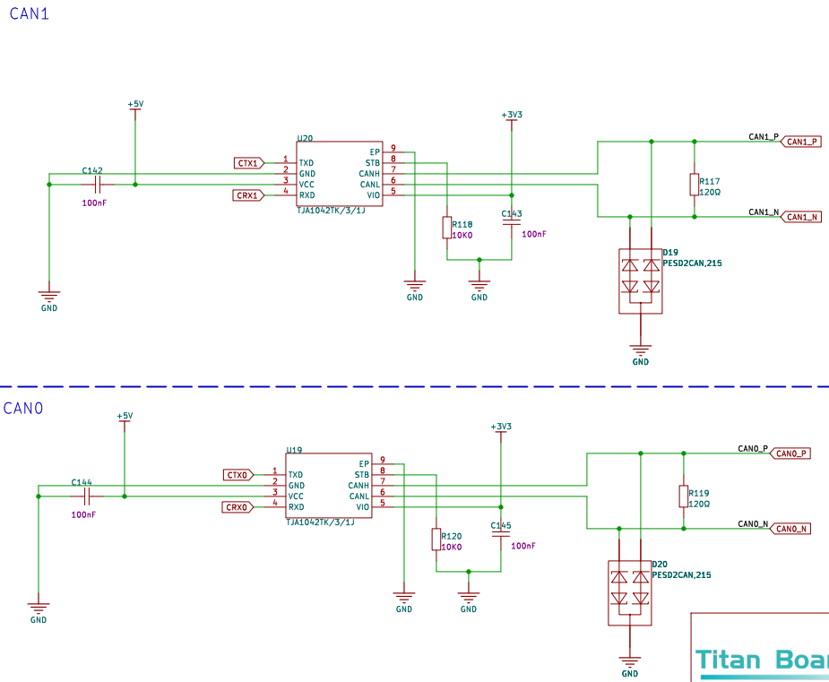
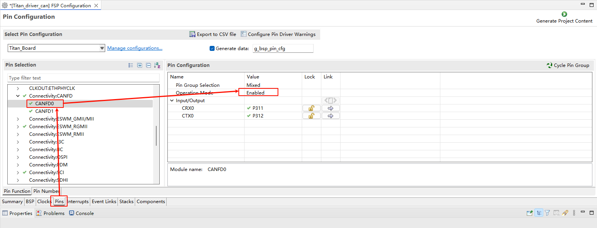
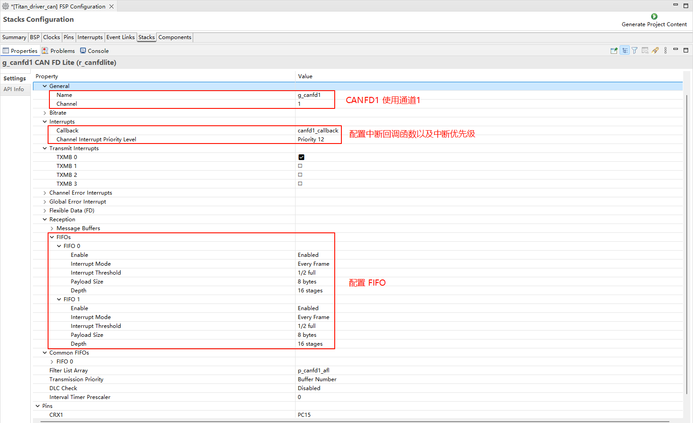
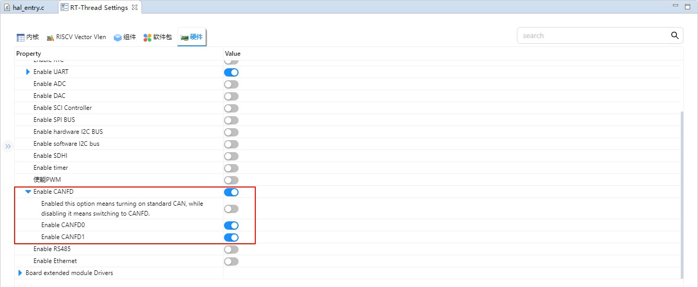
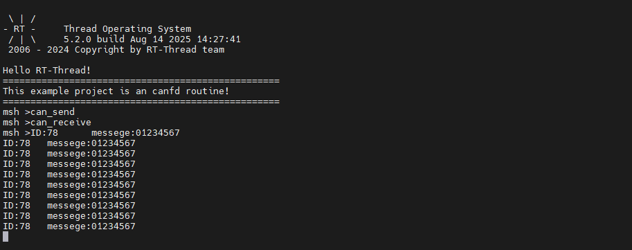

# CANFD Usage Instructions

**English** | [**Chinese**](./README_zh.md)

## Introduction

This example demonstrates how to use the **CANFD (CAN with Flexible Data Rate) interface** on the **Titan Board**, combined with the **RT-Thread CAN driver framework**, to implement high-speed automotive or industrial communication.

Main features include:

- Initialization of the CANFD hardware interface
- Configuration of baud rate, data frames, and timing parameters
- Transmission and reception of standard and extended frames
- Unified device management via RT-Thread CAN API
- Support for high-speed data transfer using interrupts, FIFO, and DMA

## CAN and CAN FD Protocol Overview

### 1. CAN Protocol Overview

**CAN (Controller Area Network)** is a multi-master serial communication protocol developed by Bosch in the 1980s for automotive electronics. It is characterized by high reliability and strong real-time capability, suitable for automotive, industrial automation, and smart devices.

- **Data Transmission**: Bus communication based on differential signals using CAN_H and CAN_L lines
- **Communication Mode**: Multi-master with **non-destructive bus arbitration**; higher-priority messages are transmitted first
- **Physical Layer Standards**: ISO 11898-2 (High-Speed CAN), ISO 11898-3 (Low-Speed Fault-Tolerant CAN)

### 2. CAN Frame Formats

CAN transmits data in **frames**, which are categorized as:

1. **Data Frame**: Transmits data
2. **Remote Frame**: Requests data
3. **Error Frame**: Reports bus errors
4. **Overload Frame**: Provides inter-frame spacing control

#### 2.1 Standard Frame (CAN 2.0A)

- **Identifier (ID)**: 11 bits
- **Data Length (DLC)**: 0–8 bytes

| Field | Length      | Description             |
| ----- | ----------- | ----------------------- |
| SOF   | 1 bit       | Start of frame          |
| ID    | 11 bits     | Message identifier      |
| RTR   | 1 bit       | Data/remote frame flag  |
| IDE   | 1 bit       | Standard/extended frame |
| r0    | 1 bit       | Reserved                |
| DLC   | 4 bits      | Data length code        |
| Data  | 0–8 bytes   | Data field              |
| CRC   | 15 bits + 1 | CRC check               |
| ACK   | 2 bits      | Acknowledgment          |
| EOF   | 7 bits      | End of frame            |

#### 2.2 Extended Frame (CAN 2.0B)

- **Identifier (ID)**: 29 bits
- Other fields are similar to the standard frame; only the ID is extended by 18 bits

### 3. CAN Protocol Features

1. **Non-Destructive Bus Arbitration**: Messages with lower ID values have higher priority. Lower-priority messages automatically stop transmitting in case of conflict without affecting higher-priority messages.
2. **Differential Signal Transmission**: CAN_H - CAN_L differential signals provide strong interference resistance.
3. **Speed and Bus Length**: High-speed CAN up to 1 Mbps; maximum bus length depends on speed:
   - 1 Mbps → max 40 m
   - 500 kbps → max 100 m
   - 125 kbps → max 500 m
4. **Error Detection and Fault Tolerance**: CRC check, bit stuffing, ACK check, error counters; nodes can go offline automatically in case of repeated errors.

### 4. CAN FD Protocol Overview

**CAN FD (Flexible Data-rate)**, introduced by Bosch in 2012 (ISO 11898-1:2015), extends the CAN standard to address bandwidth limitations and data length restrictions.

- **Key Improvements**:
  1. Extended data length: from 8 bytes to 64 bytes
  2. Variable data rate: arbitration phase remains at standard speed, while the data phase can operate 2–8 times faster

### 5. CAN FD Frame Format

#### 5.1 CAN FD Data Frame Structure

| Field | Description                           |
| ----- | ------------------------------------- |
| SOF   | Start of frame                        |
| ID    | 11/29-bit identifier                  |
| RTR   | Data frame flag (remote frame unused) |
| IDE   | Extended frame flag                   |
| FDF   | CAN FD frame flag                     |
| BRS   | Bit Rate Switch                       |
| ESI   | Error State Indicator                 |
| DLC   | Data length code (0–64 bytes)         |
| Data  | Data field (0–64 bytes)               |
| CRC   | CRC check (17/21 bits)                |
| ACK   | Acknowledgment                        |
| EOF   | End of frame                          |

- **BRS = 1**: Data phase transmitted at higher speed
- **ESI = 1**: Node is in error passive state

### 6. CAN FD Features

1. Larger data payload: up to 64 bytes per frame
2. Higher data rate: data phase can be 2–8 times faster than classic CAN
3. Compatibility: CAN FD nodes can coexist with classic CAN nodes; FD functionality requires hardware support
4. Enhanced error handling: maintains CAN error mechanisms while increasing CRC length for longer data

### 7. CAN vs CAN FD Comparison

| Feature         | CAN                              | CAN FD                                                  |
| --------------- | -------------------------------- | ------------------------------------------------------- |
| Max Data Length | 8 bytes                          | 64 bytes                                                |
| Data Rate       | Up to 1 Mbps                     | Arbitration phase 1 Mbps, data phase 2–8 Mbps           |
| Frame Format    | Standard/Extended                | Standard/Extended + FDF/BRS/ESI                         |
| Compatibility   | All nodes supported              | Backward compatible with classic CAN; FD nodes required |
| CRC Check       | 15-bit                           | 17/21-bit                                               |
| Applications    | Vehicle ECUs, industrial control | High-speed data acquisition, cameras, ADAS systems      |

## RA8 Series CANFD Features

RA8 series MCUs integrate a high-performance **CANFD controller**, supporting ISO CAN 2.0A/B and CANFD protocols with high-speed communication, flexible frame length, and hardware FIFO capabilities.

### 1. Basic Parameters

1. **Protocol Support**
   - ISO CAN 2.0A/B (Classic CAN)
   - CAN FD (Flexible Data Rate)
   - Standard frame (11-bit ID) and extended frame (29-bit ID)
2. **Data Frame Length**
   - CAN: 0–8 bytes
   - CAN FD: 0–64 bytes
3. **Communication Speed**
   - CAN: up to 1 Mbps
   - CAN FD: data phase up to 8 Mbps (depends on MCU clock and PHY)
4. **Hardware FIFO**
   - Independent RX/TX FIFOs
   - Multi-frame buffering for improved throughput
   - FIFO-triggered interrupts can be handled via RT-Thread ISR

### 2. Hardware Features

1. **Controller Architecture**
   - Independent RX/TX FIFOs
   - Hardware filters (standard ID / extended ID / combined)
   - Auto retransmission, error detection, and bus status monitoring
2. **Timing and Baud Rate**
   - Configurable synchronization segment, time segments 1/2, and sampling point
   - CAN FD allows asynchronous baud rate for data segment
   - Provides auto bit-rate calculation tool
3. **Interrupt Mechanism**
   - Transmission complete (TX)
   - Frame reception (RX FIFO)
   - Error warning/passive
   - Bus-off/recovery
4. **DMA Support**
   - Works with MCU DMAC for high-speed transfers
   - TX/RX FIFO automatically read/written to memory
   - Reduces CPU load
5. **Error Handling and Bus Monitoring**
   - Error counters (TEC/REC)
   - Bus states: Error Active / Error Passive / Bus Off
   - Automatic recovery

### 3. Frame Format

1. **Classic CAN Frames**
   - Standard frame: 11-bit ID, 0–8 bytes
   - Extended frame: 29-bit ID, 0–8 bytes
2. **CAN FD Frames**
   - Supports 0–64 bytes
   - High-speed data phase
   - Includes **BRS (Bit Rate Switch)** for data acceleration
3. **Frame Control Bits**
   - RTR (Remote Transmission Request)
   - IDE (Identifier Extension)
   - FDF (CAN FD Frame)
   - ESI (Error State Indicator)

### 4. Applications

- Vehicle ECU communication
- Industrial control networks (e.g., CANopen, J1939)
- Real-time sensor data acquisition
- High-speed data logging and distributed control

## Hardware Description



## FSP Configuration

* Create two `r_canfdlite` stacks:


* Configure the CANFD0 stack:


* Configure CANFD0 pin:



* Configure the CANFD1 stack:



* Configure CANFD1 pin:


## RT-Thread Settings Configuration

* Enable CANFD0 and CANFD1:



## Example Code Description

The project sends the message through canfd0 and canfd1 receives the message and prints it using the serial port.

Send code example:

```c
static void can_tx_thread(void *parameter)
{
    struct rt_can_msg msg = {0};
    rt_size_t  size;
    msg.id = 0x78;              /* ID is 0x78 */
    msg.ide = RT_CAN_STDID;     /* Standard format */
    msg.rtr = RT_CAN_DTR;       /* Data frame */
    msg.len = 8;                /* The data length is 8 */
    /* The 8-byte data to be sent */
    rt_memset(msg.data,0,sizeof(msg.data));
    while(1)
    {
        /* Send a CAN data frame */
        for(int i = 0; i < 8; i++)
        {
            msg.data[i] = i;
        }
        size = rt_device_write(can0_dev, 0, &msg, sizeof(msg));
        if (size == 0)
        {
            rt_kprintf("can dev write data failed!\n");
        }
        rt_thread_delay(1000);
    }
}

int can_send(int argc, char *argv[])
{
    rt_err_t res;
    rt_thread_t thread;
    char can_name[RT_NAME_MAX];

    if (argc == 2)
    {
        rt_strncpy(can_name, argv[1], RT_NAME_MAX);
    }
    else
    {
        rt_strncpy(can_name, CAN0_DEV_NAME, RT_NAME_MAX);
    }
    /* Find CAN device */
    can0_dev = rt_device_find(can_name);
    if (!can0_dev)
    {
        rt_kprintf("find %s failed!\n", can_name);
        return RT_ERROR;
    }

    /* Open CAN device in interrupt receive and send mode */
    res = rt_device_open(can0_dev, RT_DEVICE_FLAG_INT_TX | RT_DEVICE_FLAG_INT_RX);
    RT_ASSERT(res == RT_EOK);
    /* Create data receiving thread */
    thread = rt_thread_create("can0_tx", can_tx_thread, RT_NULL, 1024, 25, 10);
    if (thread != RT_NULL)
    {
        rt_thread_startup(thread);
    }
    else
    {
        rt_kprintf("create can_rx thread failed!\n");
    }

    return res;
}
MSH_CMD_EXPORT(can_send, can device sample);
```

Receive code example:

```c
/* Receiving Data Callback Function */
static rt_err_t can_rx_call(rt_device_t dev, rt_size_t size)
{
    /* The CAN generates an interrupt after receiving data, invokes this callback function, and then sends a receive semaphore. */
    rt_sem_release(&rx_sem);

    return RT_EOK;
}

static void can_rx_thread(void *parameter)
{
    struct rt_can_msg rxmsg = {0};

    /* Set up the receiving callback function */
    rt_device_set_rx_indicate(can1_dev, can_rx_call);

    while (1)
    {
        /* hdr value is -1, indicating to read data directly from the uselist linked list */
        rxmsg.hdr_index = -1;
        /* Block waiting to receive semaphore */
        rt_sem_take(&rx_sem, RT_WAITING_FOREVER);
        /* Read a frame of data from CAN */
        rt_device_read(can1_dev, 0, &rxmsg, sizeof(rxmsg));
        /* Print Data ID and Content */
        rt_kprintf("ID:%x\tmessege:", rxmsg.id);
        for(int i = 0; i < 8; i++)
        {
            rt_kprintf("%d",  rxmsg.data[i]);
        }
        rt_kprintf("\n");
    }
}

int can_receive(int argc, char *argv[])
{
    rt_err_t res;
    rt_thread_t thread;
    char can_name[RT_NAME_MAX];

    if (argc == 2)
    {
        rt_strncpy(can_name, argv[1], RT_NAME_MAX);
    }
    else
    {
        rt_strncpy(can_name, CAN1_DEV_NAME, RT_NAME_MAX);
    }
    /* Find CAN device */
    can1_dev = rt_device_find(can_name);
    if (!can1_dev)
    {
        rt_kprintf("find %s failed!\n", can_name);
        return RT_ERROR;
    }

    /* Initialize CAN receive semaphore */
    rt_sem_init(&rx_sem, "rx_sem", 0, RT_IPC_FLAG_FIFO);

    /* Open CAN device in interrupt receive and send mode */
    res = rt_device_open(can1_dev, RT_DEVICE_FLAG_INT_TX | RT_DEVICE_FLAG_INT_RX);
    RT_ASSERT(res == RT_EOK);
    /* Create data receiving thread */
    thread = rt_thread_create("can1_rx", can_rx_thread, RT_NULL, 1024, 25, 10);
    if (thread != RT_NULL)
    {
        rt_thread_startup(thread);
    }
    else
    {
        rt_kprintf("create can_rx thread failed!\n");
    }
    return res;
}
MSH_CMD_EXPORT(can_receive, can device sample);
```

## Compilation & Download

* **RT-Thread Studio**: In RT-Thread Studio’s package manager, download the Titan Board resource package, create a new project, and compile it.

After compilation, connect the development board’s USB-DBG interface to the PC and download the firmware to the development board.

## Run Effect

Docking CAN0 and CAN1, input 'can_send' and `can_receive` commands respectively for loop back test.

