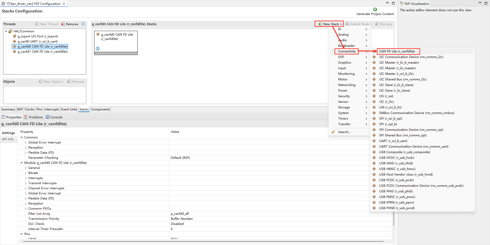
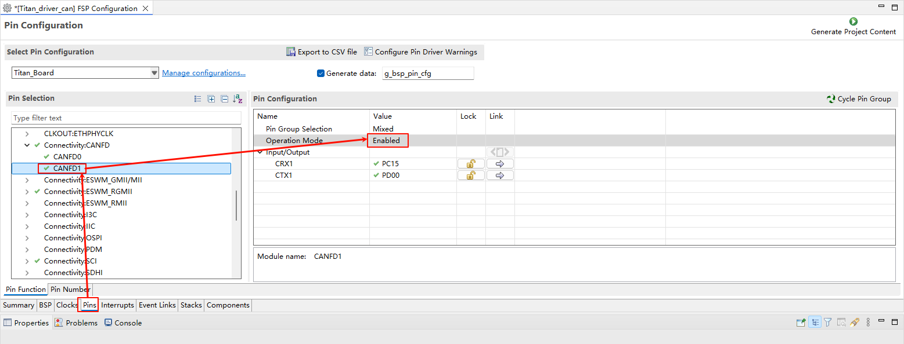

# CANFD 应用示例说明

**中文** | [**English**](./README.md)

## 简介

本示例展示了如何在 **Titan Board** 上使用 **CANFD（CAN with Flexible Data Rate）接口**，结合 **RT-Thread CAN 驱动框架**进行高速车载或工业通信。

主要功能包括：

- 初始化 CANFD 硬件接口
- 配置波特率、数据帧和时序参数
- 发送和接收标准帧/扩展帧
- 使用 RT-Thread CAN API 实现设备统一管理
- 支持中断、FIFO、DMA 高速数据传输

## CAN 与 CAN FD 协议详解

### 1. CAN 协议概述

**CAN（Controller Area Network）** 是一种多主机串行通信协议，由 Bosch 在 1980 年代为汽车电子设计。其主要特点是高可靠性、实时性强，适用于汽车、工业自动化、智能设备等领域。

- **数据传输方式**：基于差分信号的总线通信，使用 CAN_H 和 CAN_L 两根线。
- **通信模式**：多主机，支持 **非破坏性总线仲裁**，即优先级高的报文可以先发送。
- **物理层标准**：ISO 11898-2（高速 CAN）、ISO 11898-3（低速容错 CAN）。

### 2. CAN 协议帧格式

CAN 的数据传输以 **帧（Frame）** 为单位，主要分为以下几种帧类型：

1. **数据帧（Data Frame）**：传输数据
2. **远程帧（Remote Frame）**：请求数据
3. **错误帧（Error Frame）**：用于报告总线错误
4. **过载帧（Overload Frame）**：用于间隔时间控制

#### 2.1 标准帧（CAN 2.0A）

- **帧标识符（ID）**：11 位
- **数据长度（DLC）**：0~8 字节
- **帧结构**：

| 字段 | 长度           | 描述              |
| ---- | -------------- | ----------------- |
| SOF  | 1 bit          | 帧起始位          |
| ID   | 11 bit         | 报文标识符        |
| RTR  | 1 bit          | 数据帧/远程帧标志 |
| IDE  | 1 bit          | 标准/扩展帧标志   |
| r0   | 1 bit          | 保留位            |
| DLC  | 4 bit          | 数据长度码        |
| Data | 0~8 bytes      | 数据域            |
| CRC  | 15 bit + 1 bit | CRC 校验          |
| ACK  | 2 bit          | 应答位            |
| EOF  | 7 bit          | 帧结束            |

#### 2.2 扩展帧（CAN 2.0B）

- **帧标识符（ID）**：29 位
- 其它字段与标准帧类似，只是 ID 扩展了 18 位。

### 3. CAN 协议特性

1. **非破坏性总线仲裁**
   - 利用 ID 的优先级，ID 越小优先级越高。
   - 总线冲突时，低优先级报文自动停止发送，不影响高优先级报文。
2. **差分信号传输**
   - CAN_H - CAN_L 差分传输，抗干扰能力强。
3. **速度与长度**
   - 最高 1 Mbps（高速 CAN），传输距离与速率相关：
     - 1 Mbps → 最大 40 m
     - 500 kbps → 最大 100 m
     - 125 kbps → 最大 500 m
4. **错误检测与容错**
   - CRC 校验
   - 位填充（Bit Stuffing）
   - ACK 检查
   - 错误计数器管理，节点可自动离线

### 4. CAN FD 协议概述

**CAN FD（Flexible Data-rate）** 是 Bosch 在 2012 年推出的 CAN 协议扩展标准（ISO 11898-1:2015），解决传统 CAN 带宽不足和数据长度受限问题。

- **主要改进**：
  1. 数据长度扩展：从 8 字节提升到 64 字节
  2. 可变数据速率：仲裁段保持原速率，数据段可以提高速率（通常 2~8 倍）

### 5. CAN FD 帧格式

#### 5.1 CAN FD 数据帧结构

| 字段 | 描述                              |
| ---- | --------------------------------- |
| SOF  | 帧起始位                          |
| ID   | 11/29 位标识符                    |
| RTR  | 数据帧标志（远程帧不再使用）      |
| IDE  | 扩展帧标志                        |
| FDF  | CAN FD 数据帧标志                 |
| BRS  | 位速率切换（Bit Rate Switch）标志 |
| ESI  | 错误状态指示                      |
| DLC  | 数据长度码（0~64 字节）           |
| Data | 数据字段（0~64 字节）             |
| CRC  | CRC 校验（17/21 bit）             |
| ACK  | 应答位                            |
| EOF  | 帧结束位                          |

- **BRS = 1**：数据段以更高速率传输
- **ESI = 1**：发送节点处于错误被动状态

### 6. CAN FD 特性

1. **更大数据长度**：最大 64 字节/帧
2. **更高数据速率**：数据段可提高至传统 CAN 速率的 2~8 倍
3. **兼容性**：CAN FD 节点可以与传统 CAN 节点共存，但 FD 功能需硬件支持
4. **错误处理增强**：保持 CAN 错误机制，同时增加 CRC 位数以适应更长数据

### 7. CAN 与 CAN FD 对比

| 特性         | CAN                | CAN FD                                |
| ------------ | ------------------ | ------------------------------------- |
| 最大数据长度 | 8 字节             | 64 字节                               |
| 数据速率     | 最高 1 Mbps        | 仲裁段 1 Mbps，数据段可 2~8 Mbps      |
| 帧格式       | 标准/扩展          | 标准/扩展，增加 FDF/BRS/ESI           |
| 兼容性       | 所有节点均支持     | 与传统 CAN 向下兼容，需要 FD 节点支持 |
| CRC 校验     | 15-bit             | 17/21-bit                             |
| 使用场景     | 车辆 ECU、工业控制 | 高速数据采集、摄像头、ADAS 系统       |

## RA8 系列 CANFD 特性

RA8 系列 MCU 集成高性能 **CANFD 控制器**，支持 ISO CAN 2.0A/B 及 CANFD 协议，具备高速通信、灵活帧长度和硬件 FIFO 功能。

### 1. 基本参数

1. **协议支持**
   - ISO CAN 2.0A/B（经典 CAN）
   - CAN FD（Flexible Data Rate）
   - 支持标准帧（11 位 ID）和扩展帧（29 位 ID）
2. **数据帧长度**
   - CAN：0–8 字节
   - CAN FD：0–64 字节
3. **通信速率**
   - CAN：最高 1 Mbps
   - CAN FD：数据段最高可达 8 Mbps（取决 MCU 时钟和 PHY）
4. **硬件 FIFO**
   - RX/TX 独立 FIFO
   - 支持多帧缓冲，提高数据吞吐量
   - FIFO 触发中断，可结合 RT-Thread ISR 处理

### 2. 硬件特性

1. **控制器架构**
   - 包含独立 RX/TX FIFO
   - 硬件滤波器（标准 ID / 扩展 ID / 组合滤波）
   - 自动重发、错误检测和总线状态监控
2. **时序与波特率**
   - 支持独立 **同步段、时间段 1/2、采样点** 配置
   - 支持 CAN FD 异步波特率（数据段波特率可不同于仲裁段）
   - 提供自动比特率计算工具
3. **中断机制**
   - 传输完成中断（TX）
   - 接收帧中断（RX FIFO）
   - 错误警告/被动中断
   - 总线离线/恢复中断
4. **DMA 支持**
   - 可与 MCU DMAC 协作，实现高速数据传输
   - TX/RX FIFO 自动写入/读取内存
   - 减少 CPU 占用
5. **错误处理与总线监控**
   - 错误计数器（TEC / REC）
   - 总线状态机（Error Active / Error Passive / Bus Off）
   - 自动恢复机制

### 3. 帧格式

1. **经典 CAN 帧**
   - 标准帧：11 位 ID，0–8 字节数据
   - 扩展帧：29 位 ID，0–8 字节数据
2. **CAN FD 帧**
   - 支持 0–64 字节数据长度
   - 支持快速数据段（Higher Data Rate）
   - 帧结构增加 **BRS（Bit Rate Switch）** 位用于数据段加速
3. **帧标记与控制位**
   - RTR（Remote Transmission Request）
   - IDE（Identifier Extension）
   - FDF（CAN FD Frame）
   - ESI（Error State Indicator）

### 4. 应用场景

- 汽车 ECU 通信
- 工业控制网络（如 CANopen、J1939）
- 实时传感器数据采集
- 高速数据日志记录和分布式控制

## 硬件说明


## FSP配置

* 新建两个 r_canfdlite Stack：



* 配置 CANFD0 stack：


* 配置 CANFD0 引脚：


* 配置 CANFD1 stack：


* 配置 CANFD1 引脚：




## RT-Thread Settings 配置

* 使能 CANFD0 和 CANFD1：


## 工程示例说明

工程通过 canfd0 发送报文 canfd1 接收报文并将其使用串口打印。

发送代码示例：

```c
static void can_tx_thread(void *parameter)
{
    struct rt_can_msg msg = {0};
    rt_size_t  size;
    msg.id = 0x78;              /* ID 为 0x78 */
    msg.ide = RT_CAN_STDID;     /* 标准格式 */
    msg.rtr = RT_CAN_DTR;       /* 数据帧 */
    msg.len = 8;                /* 数据长度为 8 */
    /* 待发送的 8 字节数据 */
    rt_memset(msg.data,0,sizeof(msg.data));
    while(1)
    {
        /* 发送一帧 CAN 数据 */
        for(int i = 0; i < 8; i++)
        {
            msg.data[i] = i;
        }
        size = rt_device_write(can0_dev, 0, &msg, sizeof(msg));
        if (size == 0)
        {
            rt_kprintf("can dev write data failed!\n");
        }
        rt_thread_delay(1000);
    }
}

int can_send(int argc, char *argv[])
{
    rt_err_t res;
    rt_thread_t thread;
    char can_name[RT_NAME_MAX];

    if (argc == 2)
    {
        rt_strncpy(can_name, argv[1], RT_NAME_MAX);
    }
    else
    {
        rt_strncpy(can_name, CAN0_DEV_NAME, RT_NAME_MAX);
    }
    /* 查找 CAN 设备 */
    can0_dev = rt_device_find(can_name);
    if (!can0_dev)
    {
        rt_kprintf("find %s failed!\n", can_name);
        return RT_ERROR;
    }

    /* 以中断接收及发送方式打开 CAN 设备 */
    res = rt_device_open(can0_dev, RT_DEVICE_FLAG_INT_TX | RT_DEVICE_FLAG_INT_RX);
    RT_ASSERT(res == RT_EOK);
    /* 创建数据接收线程 */
    thread = rt_thread_create("can0_tx", can_tx_thread, RT_NULL, 1024, 25, 10);
    if (thread != RT_NULL)
    {
        rt_thread_startup(thread);
    }
    else
    {
        rt_kprintf("create can_rx thread failed!\n");
    }

    return res;
}
/* 导出到 msh 命令列表中 */
MSH_CMD_EXPORT(can_send, can device sample);
```

接收代码示例;

```c 
/* 接收数据回调函数 */
static rt_err_t can_rx_call(rt_device_t dev, rt_size_t size)
{
    /* CAN 接收到数据后产生中断，调用此回调函数，然后发送接收信号量 */
    rt_sem_release(&rx_sem);

    return RT_EOK;
}

static void can_rx_thread(void *parameter)
{
    struct rt_can_msg rxmsg = {0};

    /* 设置接收回调函数 */
    rt_device_set_rx_indicate(can1_dev, can_rx_call);

    while (1)
    {
        /* hdr 值为 - 1，表示直接从 uselist 链表读取数据 */
        rxmsg.hdr_index = -1;
        /* 阻塞等待接收信号量 */
        rt_sem_take(&rx_sem, RT_WAITING_FOREVER);
        /* 从 CAN 读取一帧数据 */
        rt_device_read(can1_dev, 0, &rxmsg, sizeof(rxmsg));
        /* 打印数据 ID 及内容 */
        rt_kprintf("ID:%x\tmessege:", rxmsg.id);
        for(int i = 0; i < 8; i++)
        {
            rt_kprintf("%d",  rxmsg.data[i]);
        }
        rt_kprintf("\n");
    }
}

int can_receive(int argc, char *argv[])
{
    rt_err_t res;
    rt_thread_t thread;
    char can_name[RT_NAME_MAX];

    if (argc == 2)
    {
        rt_strncpy(can_name, argv[1], RT_NAME_MAX);
    }
    else
    {
        rt_strncpy(can_name, CAN1_DEV_NAME, RT_NAME_MAX);
    }
    /* 查找 CAN 设备 */
    can1_dev = rt_device_find(can_name);
    if (!can1_dev)
    {
        rt_kprintf("find %s failed!\n", can_name);
        return RT_ERROR;
    }

    /* 初始化 CAN 接收信号量 */
    rt_sem_init(&rx_sem, "rx_sem", 0, RT_IPC_FLAG_FIFO);

    /* 以中断接收及发送方式打开 CAN 设备 */
    res = rt_device_open(can1_dev, RT_DEVICE_FLAG_INT_TX | RT_DEVICE_FLAG_INT_RX);
    RT_ASSERT(res == RT_EOK);
    /* 创建数据接收线程 */
    thread = rt_thread_create("can1_rx", can_rx_thread, RT_NULL, 1024, 25, 10);
    if (thread != RT_NULL)
    {
        rt_thread_startup(thread);
    }
    else
    {
        rt_kprintf("create can_rx thread failed!\n");
    }
    return res;
}
/* 导出到 msh 命令列表中 */
MSH_CMD_EXPORT(can_receive, can device sample);
```

## 编译&下载

* RT-Thread Studio：在 RT-Thread Studio 的包管理器中下载 Titan Board 资源包，然后创建新工程，执行编译。

编译完成后，将开发板的 USB-DBG 接口与 PC 机连接，然后将固件下载至开发板。

## 运行效果

将 CAN0 与 CAN1 对接，分别输入 ` can_send ` 和 ` can_receive ` 命令进行回环测试。


