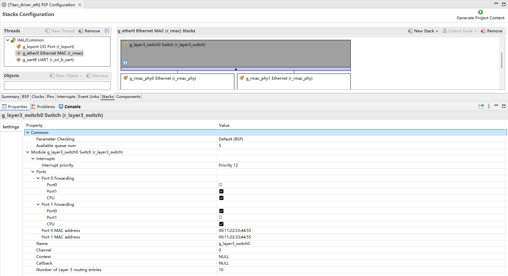
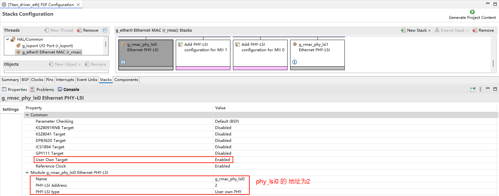

# Ethernet Usage Guide

**English** | [**Chinese**](./README_zh.md)

## Introduction

This example demonstrates how to use the **Ethernet interface** on the **Titan Board** with the **RT-Thread Ethernet driver framework** to implement network connectivity.

Main features include:

- Initialization of RA8 Ethernet hardware
- Configuration of IP address, subnet mask, and gateway
- Sending and receiving Ethernet frames
- Integration with RT-Thread’s `netdev` framework for unified network device management
- Support for high-speed data transfer using DMA and interrupts

## Ethernet Introduction

### 1. Overview

**Ethernet** is the most widely used Local Area Network (LAN) technology. It was first proposed by Xerox PARC in the 1970s and later standardized by IEEE 802.3. Ethernet has the following characteristics:

- **Data Transmission Method**: Packet-based communication using **frames**, physically transmitted over twisted pair cables, fiber optics, or wireless media.
- **Topology**: Traditional Ethernet used bus or star topologies; modern Ethernet primarily adopts star and tree topologies.
- **Protocol Layer**: Operates at the data link layer (Layer 2) and physical layer (Layer 1) of the OSI model.

### 2. Ethernet Frame Structure

Ethernet uses **frames** as the unit of data transmission. An Ethernet frame consists of the following fields:

| Field                       | Length        | Description                               |
| --------------------------- | ------------- | ----------------------------------------- |
| Preamble                    | 7 bytes       | Used for frame synchronization            |
| Start Frame Delimiter (SFD) | 1 byte        | Frame start indicator (10101011)          |
| Destination MAC Address     | 6 bytes       | Receiver hardware address                 |
| Source MAC Address          | 6 bytes       | Sender hardware address                   |
| Type/Length                 | 2 bytes       | Upper layer protocol type or frame length |
| Payload                     | 46–1500 bytes | Upper layer data (e.g., IP packet)        |
| CRC                         | 4 bytes       | Cyclic Redundancy Check for integrity     |

> **Minimum Frame Length**: 64 bytes
>  **Maximum Frame Length**: 1518 bytes (without VLAN tag)

### 3. Ethernet Physical Layer and Speed

Ethernet supports multiple speeds and physical media standards:

| Standard           | Speed       | Medium       | Feature                         |
| ------------------ | ----------- | ------------ | ------------------------------- |
| 10BASE-T           | 10 Mbps     | Twisted pair | Original Ethernet standard      |
| 100BASE-TX         | 100 Mbps    | Twisted pair | Fast Ethernet                   |
| 1000BASE-T         | 1 Gbps      | Twisted pair | Gigabit Ethernet                |
| 10GBASE-T          | 10 Gbps     | Twisted pair | 10G Ethernet                    |
| 10GBASE-SR         | 10 Gbps     | Fiber        | Short-range fiber transmission  |
| 40GBASE / 100GBASE | 40/100 Gbps | Fiber        | High-speed data center Ethernet |

- **BASE-T**: Twisted pair transmission
- **BASE-SX / LX / SR**: Fiber optic transmission

### 4. Ethernet Access Control

Ethernet traditionally uses **CSMA/CD (Carrier Sense Multiple Access with Collision Detection)**:

1. **Carrier Sense**: Listen to the channel before transmitting.
2. **Multiple Access**: All nodes share the same channel.
3. **Collision Detection**: If a collision occurs, nodes stop transmitting and retry after a random delay.

> Note: Modern switch-based Ethernet typically operates in **full-duplex**, so CSMA/CD is no longer used.

### 5. VLAN and Ethernet Extensions

- **VLAN (Virtual LAN)**: Defined by IEEE 802.1Q to logically segment networks, improving security and manageability.
- **VLAN Tagged Frame Structure**:

| Field   | Length        | Description                     |
| ------- | ------------- | ------------------------------- |
| TPID    | 2 bytes       | Ethernet type identifier 0x8100 |
| TCI     | 2 bytes       | VLAN ID and priority            |
| Payload | 46–1500 bytes | Upper layer data                |
| CRC     | 4 bytes       | Frame check                     |

- **QoS Support**: The PCP field in VLAN tags can indicate priority levels.

### 6. Ethernet Frame Types

1. **Unicast**: Frame destined for a single MAC address.
2. **Broadcast**: Frame destined for all nodes (MAC = FF:FF:FF:FF:FF:FF).
3. **Multicast**: Frame destined for a group of nodes.

### 7. Ethernet Trends

1. **Higher Speeds**: From 10 Mbps → 100 Mbps → 1 Gbps → 10/40/100 Gbps.
2. **Industrial Ethernet**: Supports real-time control protocols like EtherCAT, Profinet, TSN.
3. **Power over Ethernet (PoE)**: Transmits data and power over the same cable.
4. **Full-Duplex Switch Networks**: Eliminates collisions and improves bandwidth utilization.
5. **Time-Sensitive Networking (TSN)**: Provides deterministic latency for industrial automation and automotive networks.

## RA8 Series Ethernet Features

The RA8 series MCUs (such as RA8P1) integrate a high-performance **Ethernet MAC** that supports RGMII, RMII, and MII interfaces, enabling robust and high-speed network communication. The MAC can work with external PHYs and is compatible with the LwIP TCP/IP stack.

### 1. Network Interface Features

1. **Interface Types**
   - **RMII (Reduced Media Independent Interface)**: saves pins, supports 10/100 Mbps
   - **MII (Media Independent Interface)**: standard interface, supports 10/100 Mbps
   - **RGMII (Reduced Gigabit MII)**: supports 10/100/1000 Mbps, high-speed interface suitable for Gigabit Ethernet
2. **PHY Connection**
   - External PHY is connected via MDC/MDIO interface
   - Supports auto-negotiation of speed and duplex
   - Provides access to PHY registers for configuration and status monitoring

### 2. MAC Features

1. **Duplex and Speed Support**
   - Full/half duplex
   - Supports 10/100/1000 Mbps (RGMII)
   - Auto-negotiation or forced configuration
2. **Frame Handling**
   - VLAN tag support (IEEE 802.1Q, optional)
   - Multicast and broadcast filtering
   - Hardware CRC generation and checking
3. **MAC Address Management**
   - Supports single or multiple MAC addresses
   - Configurable via FSP or software

### 3. DMA and Buffering

1. **Independent TX/RX DMA Engines**
   - Simultaneous transmission and reception
   - Reduces CPU overhead and increases throughput
2. **Descriptor Queues**
   - Configurable TX/RX buffer count
   - Supports chained DMA for efficient large data transfer
3. **Multi-Buffer Management**
   - Ring buffer support for continuous streaming
   - Reduces packet loss
4. **Hardware Acceleration**
   - Frame filtering, length checking, and CRC verification

### 4. Interrupt Mechanism

1. **Interrupt Types**
   - Receive complete (RX)
   - Transmit complete (TX)
   - Error interrupts (CRC error, buffer overflow)
2. **Configuration**
   - Priority configurable via FSP
   - Compatible with RT-Thread ISR integration
3. **Optimization**
   - RX/TX interrupts can be combined with DMA
   - Selective interrupt enable for performance

### 5. PHY Management

1. **MDIO Interface**
   - Read/write PHY registers for configuration, reset, and status monitoring
2. **Auto-Negotiation**
   - Automatic negotiation of speed (10/100/1000 Mbps) and duplex mode
3. **Link Monitoring**
   - Detects link up/down
   - Detects CRC errors and collisions

### 6. Protocol and Stack Support

1. **TCP/IP Stack Integration**
   - Compatible with LwIP
   - Supports TCP/UDP/ICMP, DHCP client/server, ARP
2. **Application Layer**
   - Supports Telnet, HTTP, MQTT, and other protocols
   - Multi-thread safe for concurrent access

### 7. Performance and Reliability

1. **Throughput Optimization**
   - DMA + interrupts reduce CPU load
   - Configurable TX/RX buffer sizes
2. **Reliability Features**
   - Hardware CRC checking
   - VLAN and multicast filtering reduce interference
   - Link detection and automatic reconnection

## Hardware Description

ETH0:


ETH1:


## FSP Configuration

* Create a `r_mac` stack:


* Configure the r_mac stack:


* Configure r_layer3_switch：



* Configure r_rmac_phy：


* Configure g_rmac_phy_lsi0：



* ETH0 pin configuration:


* **Note:** All pins related to ETH need to change the drive capability to H.


## RT-Thread Settings Configuration

* Enable Ethernet in RT-Thread Settings.


## Software Overview

The Ethernet phy chip initialization function is in `./src/hal_entry.c`:

```c
void rmac_phy_target_rtl8211_initialize (rmac_phy_instance_ctrl_t * phydev)
{
#define RTL_8211F_PAGE_SELECT 0x1F
#define RTL_8211F_EEELCR_ADDR 0x11
#define RTL_8211F_LED_PAGE 0xD04
#define RTL_8211F_LCR_ADDR 0x10

    uint32_t val1, val2 = 0;

    /* switch to led page */
    R_RMAC_PHY_Write(phydev, RTL_8211F_PAGE_SELECT, RTL_8211F_LED_PAGE);

    /* set led1(green) Link 10/100/1000M, and set led2(yellow) Link 10/100/1000M+Active */
    R_RMAC_PHY_Read(phydev, RTL_8211F_LCR_ADDR, &val1);
    val1 |= (1 << 5);
    val1 |= (1 << 8);
    val1 &= (~(1 << 9));
    val1 |= (1 << 10);
    val1 |= (1 << 11);
    R_RMAC_PHY_Write(phydev, RTL_8211F_LCR_ADDR, val1);

    /* set led1(green) EEE LED function disabled so it can keep on when linked */
    R_RMAC_PHY_Read(phydev, RTL_8211F_EEELCR_ADDR, &val2);
    val2 &= (~(1 << 2));
    R_RMAC_PHY_Write(phydev, RTL_8211F_EEELCR_ADDR, val2);

    /* switch back to page0 */
    R_RMAC_PHY_Write(phydev, RTL_8211F_PAGE_SELECT, 0xa42);
}

bool rmac_phy_target_rtl8211_is_support_link_partner_ability (rmac_phy_instance_ctrl_t * p_instance_ctrl,
                                                             uint32_t                   line_speed_duplex)
{
    FSP_PARAMETER_NOT_USED(p_instance_ctrl);
    FSP_PARAMETER_NOT_USED(line_speed_duplex);

    /* This PHY-LSI supports half and full duplex mode. */
    return true;
}
```

## Build & Download

* **RT-Thread Studio:** Download the Titan Board resource pack from the RT-Thread Studio package manager, then create a new project and compile it.


Once compiled, connect the development board’s USB-DBG interface to the PC, and download the firmware to the development board.

## Running Result

Insert the network cable into the ETH0 network port, press the reset button to restart the development board, wait for PHY0 link up, then enter `ifconfig` to view the IP address obtained by the development board, and then enter `ping baidu.com` command to test the connectivity.

