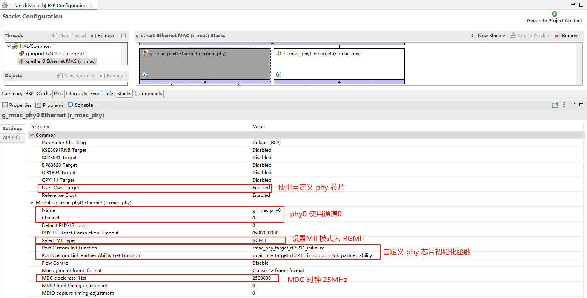
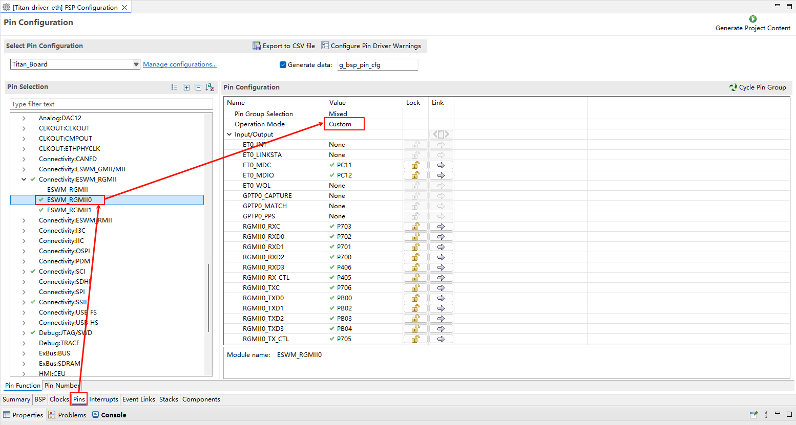
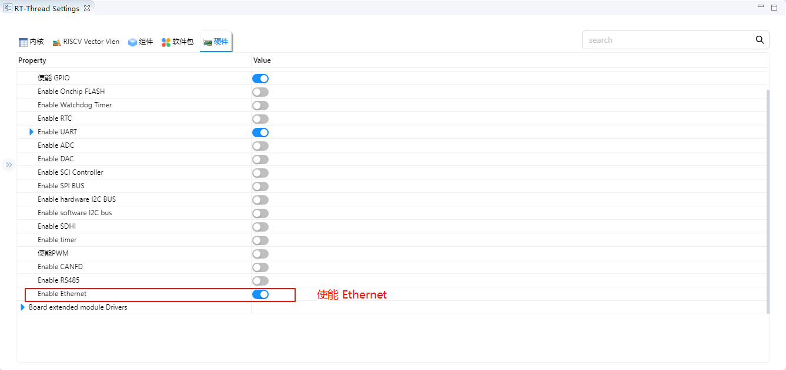

# Ethernet 示例说明

**中文** | [**English**](./README.md)

## 简介

本示例展示了如何在 **Titan Board** 上使用 **以太网接口**，结合 **RT-Thread Ethernet 驱动框架** 实现网络通信功能。

主要功能包括：

- 初始化 RA8 系列以太网硬件
- 配置 IP 地址、子网掩码和网关
- 发送和接收以太网帧
- 集成 RT-Thread `netdev` 框架，实现统一网络设备管理
- 支持 DMA 和中断，实现高速数据传输

## 以太网（Ethernet）简介

### 1. 概述

**以太网（Ethernet）** 是最广泛使用的局域网（LAN）技术，由 Xerox PARC 在 1970 年代提出，后由 IEEE 802.3 标准化。以太网具有以下特点：

- **数据传输方式**：基于 **帧（Frame）** 的分组交换，物理上可通过双绞线、光纤或无线介质传输。
- **拓扑结构**：传统以太网为总线或星型拓扑，现代以太网主要采用星型和树型。
- **协议层次**：属于 OSI 模型的数据链路层（第 2 层）及物理层（第 1 层）技术。

### 2. 以太网帧结构

以太网使用 **帧（Frame）** 作为数据传输单位。以太网帧由以下字段组成：

| 字段                | 长度         | 描述                       |
| ------------------- | ------------ | -------------------------- |
| 前导码（Preamble）  | 7 字节       | 用于帧同步                 |
| 帧开始定界符（SFD） | 1 字节       | 帧起始标志，值为 10101011  |
| 目的 MAC 地址       | 6 字节       | 接收方硬件地址             |
| 源 MAC 地址         | 6 字节       | 发送方硬件地址             |
| 类型/长度           | 2 字节       | 上层协议类型或帧长度       |
| 数据载荷            | 46~1500 字节 | 上层数据（如 IP 包）       |
| CRC 校验            | 4 字节       | 循环冗余校验，保证帧完整性 |

> **最小帧长度**：64 字节
>  **最大帧长度**：1518 字节（不含 VLAN 标记时）

### 3. 以太网物理层与速率

以太网有多种速率和物理介质标准，主要分为以下几类：

| 标准               | 速率        | 介质   | 特点               |
| ------------------ | ----------- | ------ | ------------------ |
| 10BASE-T           | 10 Mbps     | 双绞线 | 最初以太网标准     |
| 100BASE-TX         | 100 Mbps    | 双绞线 | 快速以太网         |
| 1000BASE-T         | 1 Gbps      | 双绞线 | 千兆以太网         |
| 10GBASE-T          | 10 Gbps     | 双绞线 | 10G 以太网         |
| 10GBASE-SR         | 10 Gbps     | 光纤   | 短距离光纤传输     |
| 40GBASE / 100GBASE | 40/100 Gbps | 光纤   | 数据中心高速以太网 |

- **BASE-T**：基于双绞线传输
- **BASE-SX / LX / SR**：基于光纤传输

### 4. 以太网访问控制机制

以太网使用 **CSMA/CD（Carrier Sense Multiple Access with Collision Detection）** 机制：

1. **Carrier Sense（载波监听）**：发送前监听信道是否空闲
2. **Multiple Access（多路访问）**：所有节点共享同一信道
3. **Collision Detection（碰撞检测）**：若同时发送发生冲突，节点停止发送并在随机延迟后重传

> 注意：现代交换机以太网大多为全双工（Full Duplex），不再使用 CSMA/CD。

### 5. VLAN 与以太网扩展

- **VLAN（Virtual LAN）**：通过 IEEE 802.1Q 标准，实现逻辑网络划分，提高网络安全和管理性。
- **VLAN 标签帧结构**：

| 字段     | 长度         | 描述                  |
| -------- | ------------ | --------------------- |
| TPID     | 2 字节       | 以太网类型标识 0x8100 |
| TCI      | 2 字节       | VLAN ID 与优先级      |
| 数据载荷 | 46~1500 字节 | 上层数据              |
| CRC      | 4 字节       | 校验                  |

- **QoS 支持**：VLAN 标签中的 PCP 字段可用于优先级标记。

### 6. 以太网帧类型

1. **单播（Unicast）**：目标 MAC 地址唯一
2. **广播（Broadcast）**：目标 MAC 地址为 FF:FF:FF:FF:FF:FF
3. **组播（Multicast）**：目标 MAC 地址对应一组节点

### 7. 以太网发展趋势

1. **高速化**：从 10 Mbps → 100 Mbps → 1 Gbps → 10/40/100 Gbps
2. **工业以太网**：支持实时控制协议（EtherCAT、Profinet、TSN）
3. **以太网供电（PoE）**：通过网线同时传输数据和电力
4. **全双工交换机网络**：消除碰撞，提高带宽利用率
5. **时间敏感网络（TSN）**：为工业自动化和汽车网络提供确定性时延

## RA8 系列以太网特性

RA8 系列 MCU（如 RA8P1）集成高性能 **以太网 MAC**，支持 RGMII、RMII 和 MII 接口，具备稳定可靠的高速网络通信能力。MAC 可配合外部 PHY 使用，并兼容 LwIP TCP/IP 协议栈。

### 1. 网络接口特性

1. **接口类型**
   - **RMII（Reduced Media Independent Interface）**：节省引脚，支持 10/100 Mbps
   - **MII（Media Independent Interface）**：标准接口，支持 10/100 Mbps
   - **RGMII（Reduced Gigabit MII）**：支持 10/100/1000 Mbps，高速接口，适用于千兆以太网
2. **PHY 连接**
   - 外部 PHY 通过 MDC/MDIO 接口连接
   - 支持自动协商速率和双工模式
   - 可读取和写入 PHY 寄存器，用于配置和状态监控

### 2. MAC 特性

1. **双工与速率支持**
   - 全/半双工
   - 支持 10/100/1000 Mbps（RGMII）
   - 支持自动协商或强制配置
2. **帧处理**
   - VLAN 标签支持（IEEE 802.1Q，可选）
   - 支持多播和广播帧过滤
   - 硬件 CRC 生成和校验
3. **MAC 地址管理**
   - 支持单个或多个 MAC 地址
   - 可通过 FSP 或软件动态配置

### 3. DMA 与缓冲特性

1. **独立 TX/RX DMA 引擎**
   - 支持同时发送和接收数据
   - 减少 CPU 占用，提高吞吐量
2. **描述符队列**
   - TX/RX 缓冲区数量可配置
   - 支持链式 DMA，提高大数据传输效率
3. **多缓冲区管理**
   - 支持环形缓冲区，实现连续传输
   - 减少丢包
4. **硬件加速**
   - 帧过滤、长度检测和 CRC 校验

### 4. 中断机制

1. **中断类型**
   - 接收完成（RX）
   - 发送完成（TX）
   - 错误中断（CRC 错误、缓冲溢出）
2. **中断配置**
   - 优先级可通过 FSP 配置
   - 支持 RT-Thread ISR 集成
3. **优化**
   - RX/TX 中断可与 DMA 联动
   - 可选择性启用中断，提高性能

### 5. PHY 管理

1. **MDIO 接口**
   - 可读写 PHY 寄存器，实现配置、复位和状态监控
2. **自动协商**
   - 支持速率（10/100/1000 Mbps）和双工模式自动协商
3. **链路监控**
   - 检测链路状态（Up/Down）
   - CRC 错误和冲突检测

### 6. 协议与栈支持

1. **TCP/IP 协议栈集成**
   - 兼容 LwIP
   - 支持 TCP/UDP/ICMP、DHCP 客户端/服务器、ARP
2. **应用层支持**
   - 支持 Telnet、HTTP、MQTT 等应用
   - 多线程安全，支持并发访问

### 7. 性能与可靠性

1. **吞吐量优化**
   - DMA + 中断减少 CPU 占用
   - TX/RX 缓冲区大小可调
2. **可靠性特性**
   - 硬件 CRC 校验
   - VLAN 和多播过滤减少干扰
   - 链路检测与自动重连

## 硬件说明

ETH0：


ETH1：


## FSP 配置

* 新建 r_rmac stack：


* 配置 r_mac stack：


* 配置 r_layer3_switch：


* 配置 r_rmac_phy：



* 配置 g_rmac_phy_lsi0：


* ETH0 引脚配置：



* **注意**：ETH 相关的所有引脚需要将驱动能力改为 H。


## RT-Thread Settings 配置

* 在 RT-Thread Settings 中使能 Ethernet。



## 软件说明

以太网的 phy 芯片初始化函数在 `./src/hal_entry.c` 中：

```c
void rmac_phy_target_rtl8211_initialize (rmac_phy_instance_ctrl_t * phydev)
{
#define RTL_8211F_PAGE_SELECT 0x1F
#define RTL_8211F_EEELCR_ADDR 0x11
#define RTL_8211F_LED_PAGE 0xD04
#define RTL_8211F_LCR_ADDR 0x10

    uint32_t val1, val2 = 0;

    /* switch to led page */
    R_RMAC_PHY_Write(phydev, RTL_8211F_PAGE_SELECT, RTL_8211F_LED_PAGE);

    /* set led1(green) Link 10/100/1000M, and set led2(yellow) Link 10/100/1000M+Active */
    R_RMAC_PHY_Read(phydev, RTL_8211F_LCR_ADDR, &val1);
    val1 |= (1 << 5);
    val1 |= (1 << 8);
    val1 &= (~(1 << 9));
    val1 |= (1 << 10);
    val1 |= (1 << 11);
    R_RMAC_PHY_Write(phydev, RTL_8211F_LCR_ADDR, val1);

    /* set led1(green) EEE LED function disabled so it can keep on when linked */
    R_RMAC_PHY_Read(phydev, RTL_8211F_EEELCR_ADDR, &val2);
    val2 &= (~(1 << 2));
    R_RMAC_PHY_Write(phydev, RTL_8211F_EEELCR_ADDR, val2);

    /* switch back to page0 */
    R_RMAC_PHY_Write(phydev, RTL_8211F_PAGE_SELECT, 0xa42);
}

bool rmac_phy_target_rtl8211_is_support_link_partner_ability (rmac_phy_instance_ctrl_t * p_instance_ctrl,
                                                             uint32_t                   line_speed_duplex)
{
    FSP_PARAMETER_NOT_USED(p_instance_ctrl);
    FSP_PARAMETER_NOT_USED(line_speed_duplex);

    /* This PHY-LSI supports half and full duplex mode. */
    return true;
}
```

## 编译&下载

* RT-Thread Studio：在RT-Thread Studio 的包管理器中下载 Titan Board 资源包，然后创建新工程，执行编译。


编译完成后，将开发板的 USB-DBG 接口与 PC 机连接，然后将固件下载至开发板。

## 运行效果

将网线插入 ETH0 网口，按下复位按键重启开发板，等待 PHY0 link up 之后输入 `ifconfig` 可以查看开发板获取到的 IP 地址，然后输入 `ping baidu.com` 命令进行连通性测试。


