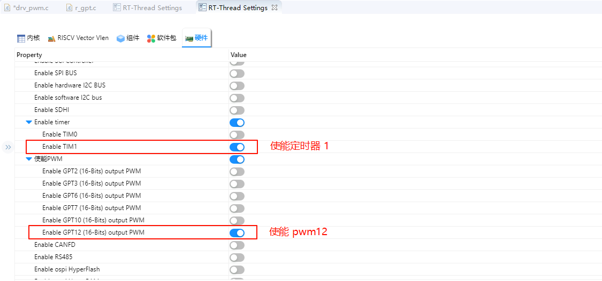
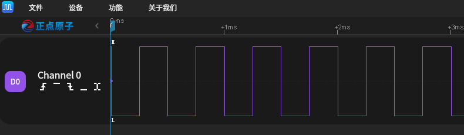

# GPT Usage Guide

**English** | [**Chinese**](./README_zh.md)

## Introduction

In our specific application scenarios, the use of timers is often indispensable. This example mainly introduces how to use the GPT device on the Titan Board, including the basic timer usage and PWM usage.

## PWM Introduction

**PWM (Pulse Width Modulation)** is a method of digitally encoding the level of an analog signal. By generating pulses at different frequencies and varying the duty cycle of a square wave, PWM encodes the level of a specific analog signal. The output produces a series of pulses with equal amplitude, and these pulses can be used by devices to approximate the desired waveform.


The figure above illustrates a simple principle of PWM. Assume the timer is operating in **up-counting mode**:

- When the counter value is **less than the threshold**, the output is in one logic state (e.g., high level).
- When the counter value **exceeds the threshold**, the output switches to the opposite logic state (e.g., low level).
- Once the counter reaches its maximum value, it resets to 0 and begins counting again, returning to the initial logic state.

The ratio of the **high-level duration (pulse width)** to the **total period** is called the **duty cycle**, which ranges from 0% to 100%. In the example shown above, the high level lasts exactly half of the period, so the duty cycle is 50%.

A common use case for PWM is **controlling the brightness of lights or displays**. By adjusting the duty cycle, the brightness can be controlled. PWM does not keep the light continuously on; instead, it repeatedly turns the screen **on and off** at high speed. When the on/off switching is fast enough, the human eye perceives it as a constant light. During this cycle, if the **off duration is longer**, the screen appears dimmer. Conversely, if the **on duration is longer**, the screen appears brighter.


## Timer Introduction

### 1. Overview

A **Timer** is a hardware module in microcontrollers (MCUs) or embedded systems that is used to generate precise time intervals or count events. A timer typically can:

- Generate interrupts at fixed intervals
- Measure time duration or event intervals
- Drive PWM signal generation
- Count external pulses

Timers are core modules for MCU real-time control, PWM output, event counting, periodic sampling, and more.

### 2. Types of Timers

Depending on their functionality and applications, timers can be categorized into the following types:

1. **Basic Timer**
   - A simple counter, mainly used for generating fixed interval interrupts
   - Usually supports only up-counting
2. **General Purpose Timer (GPT)**
   - Supports multiple modes: one-shot counting, periodic counting, PWM output, input capture
   - Configurable prescaler, counting mode, and auto-reload value
3. **Advanced Timer**
   - Provides more complex features such as dead-time insertion, synchronization triggers, and complementary PWM output
   - Commonly used in motor control and power electronics applications
4. **Watchdog Timer**
   - Used for system reliability monitoring
   - If the MCU fails to reset the timer within a given time, a system reset or interrupt will be triggered
5. **Real-Time Clock (RTC) Timer**
   - Provides calendar/clock functions
   - Low-power, continues timing in standby mode

### 3. Working Principle of Timers

A timer usually consists of the following components:

1. **Counter**
   - Used to accumulate or decrement count values
   - Counting unit is determined by the **Timer Clock Frequency**
2. **Prescaler**
   - Divides the system clock to slow down the counter frequency
   - Formula: `Timer Tick Frequency = Timer Clock / (Prescaler + 1)`
3. **Auto-Reload Register (ARR / Period Register)**
   - When the counter reaches this value, it triggers an interrupt or event
   - Enables cyclic counting
4. **Interrupt/Event Generation**
   - When the counter matches ARR, it can trigger interrupts, update PWM, or generate external events

### 4. Timer Modes

1. **One-Shot Mode**
   - Counter stops after reaching the target value
   - Used for single delays or event triggering
2. **Continuous / Auto-Reload Mode**
   - Counter automatically reloads after reaching the target value and continues counting
   - Used for periodic timers and PWM output
3. **PWM Mode**
   - Uses a compare register to generate PWM signals with adjustable duty cycles
   - Widely used in motor control, LED dimming
4. **Input Capture Mode**
   - Captures timestamps of external signal edges
   - Used to measure pulse width, frequency, or event intervals
5. **Output Compare Mode**
   - Changes output state when the counter matches the compare value
   - Used for timed event triggering or waveform generation

## RA8 Series GPT Module Overview

The Renesas RA8 series microcontrollers integrate a high-performance **General Purpose Timer (GPT)** module that supports multiple timing and control features suitable for various application scenarios.

### GPT Module Features

- **Supported Modes**: Periodic mode, One-shot mode, and PWM mode
- **Counting Sources**: Supports PCLK, external trigger pins (GTETRG), GTIOC pins, or ELC events
- **PWM Output**: Supports output of periodic or PWM signals through GTIOC pins
- **Reconfigurable**: Supports runtime reconfiguration of period, duty cycle, and compare values
- **Counting Direction**: Supports up-counting, down-counting, or up/down counting
- **High Resolution**: Supports high-resolution PWM waveform generation, suitable for precision control applications

## PWM Output Implementation

**Pulse Width Modulation (PWM)** is a common technique for simulating analog signals by adjusting the duty cycle of digital pulses to control the average output voltage.

### 1. RT-Thread PWM Driver Framework

RT-Thread provides a unified PWM driver framework. Applications can access PWM devices via the following APIs:

- `rt_device_find()` – Find the PWM device handle
- `rt_pwm_set()` – Configure PWM period and pulse width
- `rt_pwm_enable()` – Enable PWM output
- `rt_pwm_disable()` – Disable PWM output

### 2. Runtime PWM Parameter Adjustment

The RA8 GPT module supports runtime adjustment of PWM period and duty cycle.

Example: Set PWM period to `500000` and duty cycle to `70%`:

```
#define PWM_DEV_NAME    "pwm12"
#define PWM_DEV_CHANNEL 0

struct rt_device_pwm *pwm_dev = RT_NULL;
rt_uint32_t period = 500000;
rt_uint32_t pulse  = 350000;

pwm_dev = (struct rt_device_pwm *)rt_device_find(PWM_DEV_NAME);
rt_pwm_set(pwm_dev, PWM_DEV_CHANNEL, period, pulse);
rt_pwm_enable(pwm_dev, PWM_DEV_CHANNEL);
```

------

## Hardware Timer (hwtimer) Implementation

A hardware timer provides high-precision timing control and is suitable for periodic task scheduling, event timing, etc.

### 1. RT-Thread hwtimer Driver Framework

RT-Thread provides a unified hardware timer framework with the following APIs:

- `rt_device_find()` – Find timer device handle
- `rt_device_open()` – Open timer device
- `rt_device_set_rx_indicate()` – Set timeout callback function
- `rt_device_control()` – Configure timer mode (one-shot/periodic), counting frequency, or stop timer
- `rt_device_write()` – Set timeout value and start the timer
- `rt_device_read()` – Get current timer value
- `rt_device_close()` – Close the timer device

### 2. RA8 GPT Configuration Example

```
/* Get timer clock frequency */
rt_uint32_t freq = R_FSP_SystemClockHzGet(FSP_PRIV_CLOCK_PCLKD) >> g_timer1_cfg.source_div;

/* Find timer device */
rt_device_t hw_dev = rt_device_find("timer1");

/* Open timer device */
rt_err_t ret = rt_device_open(hw_dev, RT_DEVICE_OFLAG_RDWR);

/* Set timeout callback */
rt_device_set_rx_indicate(hw_dev, timeout_cb);

/* Configure frequency */
rt_device_control(hw_dev, HWTIMER_CTRL_FREQ_SET, &freq);

/* Set timer mode to periodic */
rt_hwtimer_mode_t mode = HWTIMER_MODE_PERIOD;
ret = rt_device_control(hw_dev, HWTIMER_CTRL_MODE_SET, &mode);

/* Set timeout to 1 second */
struct rt_hwtimer_time timeout_s;
timeout_s.sec  = 1;  
timeout_s.usec = 0;  

if (rt_device_write(hw_dev, 0, &timeout_s, sizeof(timeout_s)) != sizeof(timeout_s))
{
    rt_kprintf("set timeout value failed\n");
    return -RT_ERROR;
}
```

------

### 3. Timer Interrupt Handling

The RA8 GPT module supports timer interrupts, which can trigger an interrupt service routine when the timer overflows.

Example timeout callback:

```
static rt_err_t timeout_cb(rt_device_t dev, rt_size_t size)
{
    rt_kprintf("This is hwtimer timeout callback function!\n");
    rt_kprintf("tick is : %d !\n", rt_tick_get());
    return RT_EOK;
}
```

## FSP Configuration Instructions

* The FSP is configured to enable GPT1 as a basic timer mode and GPT12 as a PWM mode:


* Additionally, the pins for GPT12 are enabled:


## RT-Thread Settings Configuration

* In the configuration, enable timer1 and PWM12:



## Example Project Instructions

The source code for this example is located in `/project/Titan_driver_gpt`：

```c
/* This is a hwtimer example */
#define HWTIMER_DEV_NAME "timer1" /* device name */
static rt_err_t timeout_cb(rt_device_t dev, rt_size_t size)
{
    rt_kprintf("this is hwtimer timeout callback fucntion!\n");
    rt_kprintf("tick is :%d !\n", rt_tick_get());
    return RT_EOK;
}

int hwtimer_sample(void)
{
    rt_err_t ret = RT_EOK;
    rt_hwtimerval_t timeout_s;
    rt_device_t hw_dev = RT_NULL;
    rt_hwtimer_mode_t mode;

    rt_uint32_t freq = R_FSP_SystemClockHzGet(FSP_PRIV_CLOCK_PCLKD) >> g_timer1_cfg.source_div;
    rt_kprintf("GPT Timer clock freq is: %d hz\n", freq);

    hw_dev = rt_device_find(HWTIMER_DEV_NAME);
    if (hw_dev == RT_NULL)
    {
        rt_kprintf("hwtimer sample run failed! can't find %s device!\n", HWTIMER_DEV_NAME);
        return -RT_ERROR;
    }

    ret = rt_device_open(hw_dev, RT_DEVICE_OFLAG_RDWR);
    if (ret != RT_EOK)
    {
        rt_kprintf("open %s device failed!\n", HWTIMER_DEV_NAME);
        return ret;
    }

    rt_device_set_rx_indicate(hw_dev, timeout_cb);

    rt_device_control(hw_dev, HWTIMER_CTRL_FREQ_SET, &freq);

    mode = HWTIMER_MODE_PERIOD;
    ret = rt_device_control(hw_dev, HWTIMER_CTRL_MODE_SET, &mode);
    if (ret != RT_EOK)
    {
        rt_kprintf("set mode failed! ret is :%d\n", ret);
        return ret;
    }

    /* Example Set the timeout period of the timer */
    timeout_s.sec = 1;  /* secend */
    timeout_s.usec = 0; /* microsecend */
    if (rt_device_write(hw_dev, 0, &timeout_s, sizeof(timeout_s)) != sizeof(timeout_s))
    {
        rt_kprintf("set timeout value failed\n");
        return -RT_ERROR;
    }

    /* read hwtimer value */
    rt_device_read(hw_dev, 0, &timeout_s, sizeof(timeout_s));
    rt_kprintf("Read: Sec = %d, Usec = %d\n", timeout_s.sec, timeout_s.usec);

    return ret;
}
MSH_CMD_EXPORT(hwtimer_sample, hwtimer sample);
```

The interrupt callback function is triggered every 1 second, printing output. Below is the PWM configuration and enablement:

PWM-related macros:

The current version of the PWM driver treats each channel as a separate PWM device, with each device having only one channel (channel 0). Using the PWM12 device, note that channel 0 is selected here:

```c
#define PWM_DEV_NAME        "pwm12" /* PWM device name */
#define PWM_DEV_CHANNEL      0      /* PWM channel */
struct rt_device_pwm *pwm_dev;      /* PWM device handle */
```

Configure the PWM period and duty cycle:

```
static int pwm_sample(int argc, char *argv[])
{
    rt_uint32_t period, pulse;

    if (argc != 3)
    {
        LOG_I("Usage: pwm_sample <period> <pulse>");
        LOG_I("Example: pwm_sample 500000 250000");
        return -RT_ERROR;
    }

    period = (rt_uint32_t)atoi(argv[1]);
    pulse  = (rt_uint32_t)atoi(argv[2]);

    if (period == 0 || pulse > period)
    {
        LOG_E("Error: Invalid parameters. Ensure period > 0 and pulse <= period.");
        return -RT_ERROR;
    }

    pwm_dev = (struct rt_device_pwm *)rt_device_find(PWM_DEV_NAME);
    if (pwm_dev == RT_NULL)
    {
        LOG_E("Error: Cannot find PWM device named '%s'\n", PWM_DEV_NAME);
        return -RT_ERROR;
    }

    if (rt_pwm_set(pwm_dev, PWM_DEV_CHANNEL, period, pulse) != RT_EOK)
    {
        LOG_E("Error: Failed to set PWM configuration.");
        return -RT_ERROR;
    }

    if (rt_pwm_enable(pwm_dev, PWM_DEV_CHANNEL) != RT_EOK)
    {
        LOG_E("Error: Failed to enable PWM output.");
        return -RT_ERROR;
    }

    LOG_I("PWM started on device: %s, channel: %d", PWM_DEV_NAME, PWM_DEV_CHANNEL);
    LOG_I("Period: %u ns, Pulse: %u ns", period, pulse);
    LOG_I("Please connect the \'P714\' to a logic analyzer or oscilloscope for waveform observation.");

    return RT_EOK;
}
MSH_CMD_EXPORT(pwm_sample, Configure and start PWM output: pwm_sample <period> <pulse>);
```

## Compilation & Download

* **RT-Thread Studio**: Download the Titan Board resource package in the RT-Thread Studio package manager, then create a new project and compile it.

After compilation, connect the development board's USB-DBG interface to the PC, and download the firmware to the development board.

## Running Results

In the serial terminal, input `pwm_sample` and `hwtimer_sample` to see the specific results.

The callback function is triggered every 1 second, and the output is printed:


Using a logic analyzer, the PWM output waveform is measured as follows:

