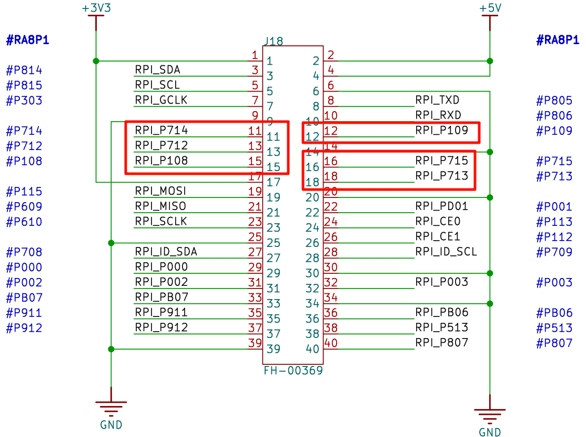
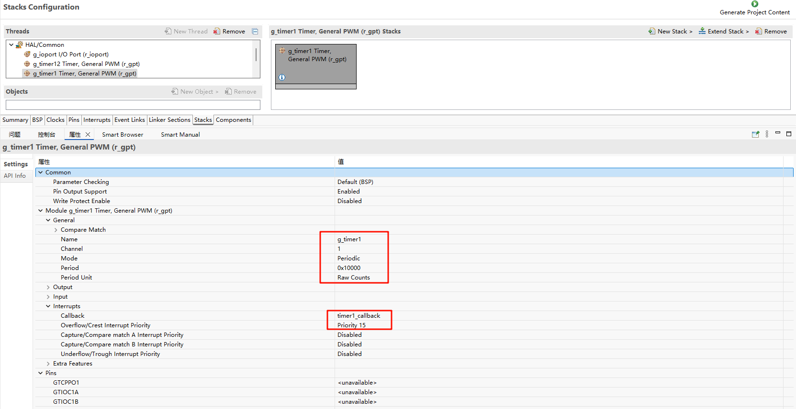
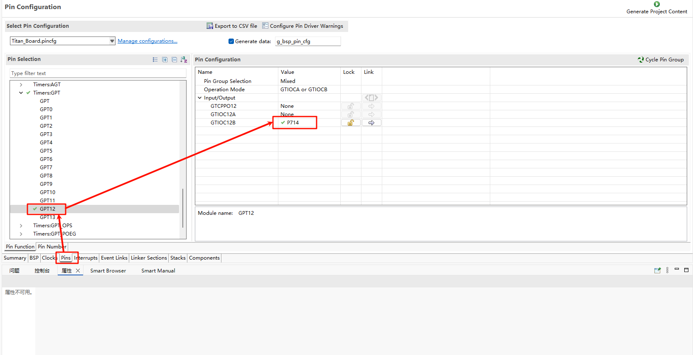

# GPT 使用说明

**中文** | [**English**](./README.md)

## 简介

在我们具体的应用场合中往往都离不开 timer 的使用，本例程主要介绍了如何在 Titan Board 上使用 GPT 设备，包括基本定时器的使用和 PWM 的使用。

## PWM 简介

**PWM(Pulse Width Modulation , 脉冲宽度调制) **是一种对模拟信号电平进行数字编码的方法，通过不同频率的脉冲使用方波的占空比用来对一个具体模拟信号的电平进行编码，使输出端得到一系列幅值相等的脉冲，用这些脉冲来代替所需要波形的设备。


上图是一个简单的 PWM 原理示意图，假定定时器工作模式为向上计数，当计数值小于阈值时，则输出一种电平状态，比如高电平，当计数值大于阈值时则输出相反的电平状态，比如低电平。当计数值达到最大值是，计数器从0开始重新计数，又回到最初的电平状态。高电平持续时间（脉冲宽度）和周期时间的比值就是占空比，范围为0~100%。上图高电平的持续时间刚好是周期时间的一半，所以占空比为50%。

一个比较常用的pwm控制情景就是用来调节灯或者屏幕的亮度，根据占空比的不同，就可以完成亮度的调节。PWM调节亮度并不是持续发光的，而是在不停地点亮、熄灭屏幕。当亮、灭交替够快时，肉眼就会认为一直在亮。在亮、灭的过程中，灭的状态持续时间越长，屏幕给肉眼的观感就是亮度越低。亮的时间越长，灭的时间就相应减少，屏幕就会变亮。


## 定时器（Timer）简介

### 1. 概述

**定时器（Timer）** 是微控制器（MCU）或嵌入式系统中用于产生精确时间间隔或计数事件的硬件模块。定时器通常可以：

- 产生固定时间间隔的中断
- 测量时间长度或事件间隔
- 驱动 PWM 信号生成
- 计数外部脉冲

定时器是 MCU 实时控制、PWM 输出、事件计数、定时采样等应用的核心模块。

### 2. 定时器类型

根据功能和用途，定时器主要可分为以下几类：

1. **基本定时器（Basic Timer）**
   - 简单的计数器，可用于产生固定时间间隔中断
   - 通常只有向上计数功能
2. **通用定时器（General Purpose Timer）**
   - 支持多种模式：单次计数、循环计数、PWM 输出、输入捕获
   - 可配置预分频器、计数模式和自动重装载值
3. **高级定时器（Advanced Timer）**
   - 支持更复杂功能，如死区时间、同步触发、互补 PWM 输出
   - 多用于电机控制和功率电子应用
4. **看门狗定时器（Watchdog Timer）**
   - 用于系统可靠性监控
   - 如果 MCU 未按时复位定时器，会触发复位或中断
5. **实时时钟（RTC）定时器**
   - 提供日历/时钟功能
   - 通常低功耗，可在待机模式下继续计时

### 3. 定时器工作原理

定时器通常由以下几个部分组成：

1. **计数器（Counter）**
   - 用于累加或递减计数值
   - 计数单位由 **时钟频率（Timer Clock）** 决定
2. **预分频器（Prescaler）**
   - 用于将系统时钟分频，降低计数器计数速度
   - 公式：Timer Tick Frequency = Timer Clock / (Prescaler + 1)
3. **自动重装载寄存器（ARR / Period Register）**
   - 当计数器达到该值时触发中断或产生事件
   - 可实现循环计数
4. **中断/事件生成**
   - 定时器计数到 ARR 时可触发中断、PWM 更新或外部事件

### 4. 定时器模式

1. **单次模式（One-Shot Mode）**
   - 计数器计数到目标值后停止
   - 用于一次性延时或事件触发
2. **循环模式（Auto-Reload / Continuous Mode）**
   - 计数器计数到目标值后自动重装载继续计数
   - 用于周期性定时器和 PWM 输出
3. **PWM 模式**
   - 通过比较寄存器（Compare Register）生成占空比可调的 PWM 信号
   - 广泛应用于电机控制、LED 调光
4. **输入捕获模式（Input Capture）**
   - 捕获外部信号的到达时间
   - 可用于测量脉宽、频率或事件间隔
5. **输出比较模式（Output Compare）**
   - 当计数器达到比较值时改变输出状态
   - 用于定时事件触发或波形产生

## RA8 系列 GPT 模块概述

Renesas RA8 系列微控制器集成了高性能的通用 PWM 定时器（GPT）模块，支持多种定时和控制功能，适用于多种应用场景。

### GPT 模块特性

- **支持模式**：周期模式、单次模式和 PWM 模式。
- **计数源**：支持 PCLK、外部触发引脚（GTETRG）、GTIOC 引脚或 ELC 事件作为计数源。
- **PWM 输出**：支持对 GTIOC 引脚输出周期性或 PWM 信号。
- **可配置性**：支持运行时重新配置周期、占空比和比较匹配值。
- **计数方式**：支持计数上升、下降或双向计数。
- **高分辨率**：支持高分辨率 PWM 波形生成，适用于精密控制应用。

## PWM 输出实现

PWM（脉宽调制）是一种常用的模拟信号模拟方法，通过调节脉冲的占空比来控制输出信号的平均电压。

### 1. RT-Thread PWM 驱动框架

RT-Thread 提供了统一的 PWM 驱动框架，应用程序可以通过以下接口访问 PWM 设备：

- `rt_device_find()`：查找 PWM 设备句柄。
- `rt_pwm_set()`：设置 PWM 的周期和脉冲宽度。
- `rt_pwm_enable()`：使能 PWM 输出。
- `rt_pwm_disable()`：禁用 PWM 输出。

### 2. 运行时调整 PWM 参数

RA8 GPT 模块支持在运行时调整 PWM 的周期和占空比。可以使用以下函数进行调整：

- `rt_pwm_set()`：设置 PWM 的周期和脉冲宽度。

例如，要将 PWM 的周期调整为 500000，占空比调整为 70%，可以使用以下代码：

```c
#defien PWM_DEV_NAME	"pwm12"
#define PWM_DEV_CHANNEL	0
struct rt_device_pwm *pwm_dev = RT_NULL;
rt_uint_32_t period = 500000;
rt_uint_32_t pulse = 350000;

pwm_dev = (struct rt_device_pwm *)rt_device_find(PWM_DEV_NAME);
rt_pwm_set(pwm_dev, PWM_DEV_CHANNEL, period, pulse);
rt_pwm_enable(pwm_dev, PWM_DEV_CHANNEL)
```

## 硬件定时器（hwtimer）实现

硬件定时器用于实现高精度的定时控制，适用于周期性任务调度、事件计时等场景。

### 1. RT-Thread hwtimer 驱动框架

RT-Thread 提供了统一的硬件定时器驱动框架，应用程序可以通过以下接口访问硬件定时器：

- `rt_device_find()`：查找硬件定时器设备句柄。
- `rt_device_open()`：以读写方式打开定时器设备。
- `rt_device_set_rx_indicate()`：设置超时回调函数。
- `rt_device_control()`：控制定时器设备，可以设置定时模式(单次/周期)/计数频率，或者停止定时器。
- ` rt_device_write()`：设置定时器超时值，定时器随即启动。
- ` rt_device_read()`：获取定时器当前值。
- `rt_device_close()`：关闭定时器设备。

### 2. RA8 GPT 配置示例

以下是使用 RA8 GPT 模块实现硬件定时器的配置示例：

```c
/* 获取定时器时钟频率 */
rt_uint32_t freq = R_FSP_SystemClockHzGet(FSP_PRIV_CLOCK_PCLKD) >> g_timer1_cfg.source_div;
/* 查找定时器设备 */
rt_device_t hw_dev = rt_device_find("timer1");
/* 打开定时器设备 */
rt_err_t ret = rt_device_open(hw_dev, RT_DEVICE_OFLAG_RDWR);
/* 设置超时回调函数 */
rt_device_set_rx_indicate(hw_dev, timeout_cb);
/* 设置时钟频率 */
rt_device_control(hw_dev, HWTIMER_CTRL_FREQ_SET, &freq);
/* 设置定时模式为周期定时 */
rt_hwtimer_mode_t mode = HWTIMER_MODE_PERIOD;
ret = rt_device_control(hw_dev, HWTIMER_CTRL_MODE_SET, &mode);
/* 设置定时器超时时间 */
timeout_s.sec = 1;  /* secend */
timeout_s.usec = 0; /* microsecend */
if (rt_device_write(hw_dev, 0, &timeout_s, sizeof(timeout_s)) != sizeof(timeout_s))
{
    rt_kprintf("set timeout value failed\n");
    return -RT_ERROR;
}
```

在上述示例中，硬件定时器的超时时间被设置为1秒。

### 3. 定时器中断处理

RA8 GPT 模块支持定时器中断，可以在定时器溢出时触发中断服务程序。以下是定时器中断处理的配置示例：

```c
static rt_err_t timeout_cb(rt_device_t dev, rt_size_t size)
{
    rt_kprintf("this is hwtimer timeout callback fucntion!\n");
    rt_kprintf("tick is :%d !\n", rt_tick_get());
    return RT_EOK;
}
```

## 硬件说明

Titan Board 的树莓派接口上有 6 个 PWM 接口，本示例使用 P714 输出 PWM 波。



## FSP 配置

* FSP 分别配置使能 GPT1 为基本定时器模式，GPT12 为 PWM 模式：




* 并配置 Pins 使能 GPT12：



### RT-Thread Settings 配置

* 在配置中打开 timer1 使能与 PWM12 使能：


### 示例工程说明

本例程的源码位于`/project/Titan_driver_gpt`：

```c
/* This is a hwtimer example */
#define HWTIMER_DEV_NAME "timer1" /* device name */
static rt_err_t timeout_cb(rt_device_t dev, rt_size_t size)
{
    rt_kprintf("this is hwtimer timeout callback fucntion!\n");
    rt_kprintf("tick is :%d !\n", rt_tick_get());
    return RT_EOK;
}

int hwtimer_sample(void)
{
    rt_err_t ret = RT_EOK;
    rt_hwtimerval_t timeout_s;
    rt_device_t hw_dev = RT_NULL;
    rt_hwtimer_mode_t mode;

    rt_uint32_t freq = R_FSP_SystemClockHzGet(FSP_PRIV_CLOCK_PCLKD) >> g_timer1_cfg.source_div;
    rt_kprintf("GPT Timer clock freq is: %d hz\n", freq);

    hw_dev = rt_device_find(HWTIMER_DEV_NAME);
    if (hw_dev == RT_NULL)
    {
        rt_kprintf("hwtimer sample run failed! can't find %s device!\n", HWTIMER_DEV_NAME);
        return -RT_ERROR;
    }

    ret = rt_device_open(hw_dev, RT_DEVICE_OFLAG_RDWR);
    if (ret != RT_EOK)
    {
        rt_kprintf("open %s device failed!\n", HWTIMER_DEV_NAME);
        return ret;
    }

    rt_device_set_rx_indicate(hw_dev, timeout_cb);

    rt_device_control(hw_dev, HWTIMER_CTRL_FREQ_SET, &freq);

    mode = HWTIMER_MODE_PERIOD;
    ret = rt_device_control(hw_dev, HWTIMER_CTRL_MODE_SET, &mode);
    if (ret != RT_EOK)
    {
        rt_kprintf("set mode failed! ret is :%d\n", ret);
        return ret;
    }

    /* Example Set the timeout period of the timer */
    timeout_s.sec = 1;  /* secend */
    timeout_s.usec = 0; /* microsecend */
    if (rt_device_write(hw_dev, 0, &timeout_s, sizeof(timeout_s)) != sizeof(timeout_s))
    {
        rt_kprintf("set timeout value failed\n");
        return -RT_ERROR;
    }

    /* read hwtimer value */
    rt_device_read(hw_dev, 0, &timeout_s, sizeof(timeout_s));
    rt_kprintf("Read: Sec = %d, Usec = %d\n", timeout_s.sec, timeout_s.usec);

    return ret;
}
MSH_CMD_EXPORT(hwtimer_sample, hwtimer sample);
```
每隔 1s 触发一次中断回调函数打印输出，下面是 PWM 配置使能：

PWM 相关宏定义：

当前版本的 PWM 驱动将每个通道都看做一个单独的 PWM 设备，每个设备都只有一个通道 0。使用 PWM12 设备，注意此处通道选择为 0 通道；

```c
#define PWM_DEV_NAME        "pwm12" /* PWM设备名称 */
#define PWM_DEV_CHANNEL      0      /* PWM通道 */
struct rt_device_pwm *pwm_dev;      /* PWM设备句柄 */
```

配置 PWM 周期以及占空比：

```
static int pwm_sample(int argc, char *argv[])
{
    rt_uint32_t period, pulse;

    if (argc != 3)
    {
        LOG_I("Usage: pwm_sample <period> <pulse>");
        LOG_I("Example: pwm_sample 500000 250000");
        return -RT_ERROR;
    }

    period = (rt_uint32_t)atoi(argv[1]);
    pulse  = (rt_uint32_t)atoi(argv[2]);

    if (period == 0 || pulse > period)
    {
        LOG_E("Error: Invalid parameters. Ensure period > 0 and pulse <= period.");
        return -RT_ERROR;
    }

    pwm_dev = (struct rt_device_pwm *)rt_device_find(PWM_DEV_NAME);
    if (pwm_dev == RT_NULL)
    {
        LOG_E("Error: Cannot find PWM device named '%s'\n", PWM_DEV_NAME);
        return -RT_ERROR;
    }

    if (rt_pwm_set(pwm_dev, PWM_DEV_CHANNEL, period, pulse) != RT_EOK)
    {
        LOG_E("Error: Failed to set PWM configuration.");
        return -RT_ERROR;
    }

    if (rt_pwm_enable(pwm_dev, PWM_DEV_CHANNEL) != RT_EOK)
    {
        LOG_E("Error: Failed to enable PWM output.");
        return -RT_ERROR;
    }

    LOG_I("PWM started on device: %s, channel: %d", PWM_DEV_NAME, PWM_DEV_CHANNEL);
    LOG_I("Period: %u ns, Pulse: %u ns", period, pulse);
    LOG_I("Please connect the \'P714\' to a logic analyzer or oscilloscope for waveform observation.");

    return RT_EOK;
}
MSH_CMD_EXPORT(pwm_sample, Configure and start PWM output: pwm_sample <period> <pulse>);
```


##  编译&下载

* RT-Thread Studio：在 RT-Thread Studio 的包管理器中下载 Titan Board 资源包，然后创建新工程，执行编译。

编译完成后，将开发板的 USB-DBG 接口与 PC 机连接，然后将固件下载至开发板。

## 运行效果

在串口终端分别输入pwm_sample、hwtimer_sample查看具体效果；

每隔 1s 触发回调函数并打印输出：


使用逻辑分析仪量取 PWM 输出波形如下所示：


