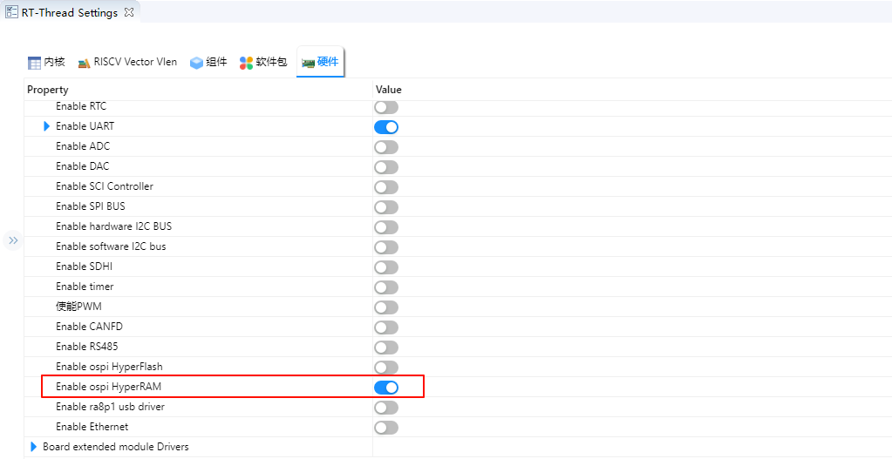
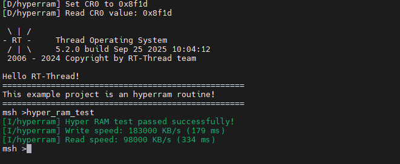

# HyperRAM Usage Guide

**English** | [**Chinese**](./README_zh.md)

## Introduction

This example demonstrates how to use the **Octa-SPI (OSPI) interface** on the **Titan Board** to connect to an external **HyperRAM** memory device and perform read/write tests based on the RT-Thread driver framework. Through this example, users can become familiar with the configuration of the RA8 OSPI controller, the operating modes of HyperRAM, and the application flow of accessing external memory under RT-Thread.

## HyperRAM Overview

### 1. General Description

**HyperRAM** is a type of **high-performance, low-pin-count (LPC) DRAM** first introduced by **Cypress (now Infineon)**.

It is based on the **HyperBus interface** and is mainly designed for **embedded systems, display controllers, IoT devices, and automotive electronics** that require **high bandwidth, low power consumption, and a simple interface**.

HyperRAM belongs to the **pSRAM (Pseudo-SRAM)** category. Externally, it behaves like SRAM (simple read/write, no refresh required by the user), but internally it is implemented with low-power DRAM (self-refresh).

### 2. Architecture and Interface

HyperRAM uses the **HyperBus interface**, which has the following features:

- **Low pin count**: typically requires only **13 signal pins** (8-bit data bus + control/clock), significantly reducing PCB complexity compared to traditional SDRAM (dozens of pins).
- **Double Data Rate (DDR) transfer**: data is transmitted on both clock edges to increase bandwidth.
- **Serialized control protocol**: memory is accessed through a command–address–data sequence, simplifying design.

Interface signals include:

- **DQ[7:0]**: 8-bit bidirectional data bus
- **RWDS (Read-Write Data Strobe)**: data strobe for synchronization
- **CLK**: clock input
- **CS#**: chip select
- **RESET#**: reset
- **CKE**: clock enable

### 3. Operating Principle

HyperRAM access consists of **command + address + data** phases:

1. **Command phase**
   - The host sends a read/write command and target address.
2. **Latency phase**
   - HyperRAM prepares its internal memory array (latency is configurable).
3. **Data transfer phase**
   - Data is transferred on **DQ[7:0]** in DDR mode, with RWDS providing synchronization.

Internally, it is DRAM with **self-refresh**, but externally it appears as SRAM — no refresh management is needed by the user.

### 4. Performance Characteristics

- **Data bus width**: 8 bits
- **Operating voltage**: 1.8 V or 3.0 V (low power design)
- **Data rate**: up to **400 MB/s (200 MHz DDR × 8-bit)**
- **Capacity range**: 32 Mb ~ 512 Mb (4 MB ~ 64 MB)
- **Low power**: supports deep power-down mode, standby current < 10 µA
- **Simple interface**: only 13 pins required for high-speed access

### 5. Advantages of HyperRAM

1. **Low pin count**
   - Far fewer pins compared to SDRAM/PSRAM (30+ pins), saving PCB routing.
2. **High bandwidth**
   - DDR interface, bandwidth up to 400 MB/s, suitable for **frame buffer and display refresh**.
3. **Low power consumption**
   - Ideal for battery-powered devices such as IoT and wearables.
4. **Ease of use**
   - Externally behaves like SRAM — simple to use, no refresh required.

### 6. Comparison with Other Memories

| Feature   | HyperRAM           | SDRAM / DDR        | SRAM                    | NOR Flash       |
| --------- | ------------------ | ------------------ | ----------------------- | --------------- |
| Interface | HyperBus (13-pin)  | Parallel 16–32-bit | Parallel/Serial         | SPI/QSPI        |
| Capacity  | 32 Mb ~ 512 Mb     | 64 Mb ~ 1 Gb+      | Small (Kb~Mb)           | 4 Mb ~ 2 Gb     |
| Bandwidth | ~400 MB/s          | ~800 MB/s+         | ~50 MB/s                | ~100 MB/s       |
| Power     | Low                | Higher             | Low                     | Low             |
| Use cases | Cache/Frame buffer | System memory      | High-speed small memory | Program storage |

## RA8 Series OSPI (Octa-SPI) Features

The **OSPI (Octa-SPI)** is a key peripheral module in the RA8 MCU family, designed to connect high-speed external memories such as **Octa Flash, HyperFlash, and HyperRAM**, fulfilling the need for **large-capacity storage, high-speed caching, and XIP execution** in embedded applications.

### 1. Protocol Support

RA8 OSPI supports multiple interface protocols, making it highly adaptable:

- **Standard SPI mode**: 1-1-1 (single-line instruction, address, data)
- **Dual-SPI**: 2-2-2 mode
- **Quad-SPI**: 4-4-4 mode
- **Octa-SPI**: 8-8-8 mode (DDR/SDR supported)
- **HyperBus protocol**:
  - Supports **HyperRAM / HyperFlash**
  - DDR data sampling on both edges
  - Throughput up to **333 MB/s**

### 2. Data Transfer Capability

- **Maximum frequency**: up to **166 MHz clock**
- **DDR mode**: data transferred on both rising and falling edges (double effective bandwidth)
- **Effective bandwidth**:
  - Octa-SPI DDR mode, 8-bit bus, 166 MHz → **333 MB/s**
  - HyperBus mode also achieves **333 MB/s**
- **Burst access**: configurable burst lengths (16/32/64/128 bytes) for higher efficiency

### 3. Memory Mapping and Execution

RA8 OSPI allows external memories to be **mapped into the MCU address space**, enabling direct access similar to on-chip SRAM:

- **XIP (Execute-In-Place)**: run code directly from external Flash
- **Mapped memory cache**:
  - Built-in prefetch buffer improves instruction fetch speed
  - Suitable for frequent read access
- **Configurable access modes**:
  - Direct access (command-driven)
  - Memory-mapped access (address-space based)

### 4. Command and Timing Support

- **Programmable command set**: adaptable for different Flash/HyperRAM vendors
- **DQS (Data Strobe) support**: improves data integrity in DDR mode
- **Chip select control**: multiple CS pins supported for multiple devices
- **Latency adjustment**: configurable clock delay and sampling point to match high-speed HyperRAM/HyperFlash

### 5. Low Power and Sleep Management

- **Supports peripheral low-power modes**:
  - HyperRAM deep power-down mode
  - HyperFlash standby mode
- **Fast wake-up**: quick recovery of memory access via chip select
- **Battery-powered applications ready**

## Hardware Description


## FSP Configuration

* Create a `r_ospi_b` stack:


* Configure the r_ospi_b stack:


* HyperRAM pin configuration:


* The drive capability of all pins related to HyperRAM should be configured as H, and OM_1_SIO0 to OM_1_SIO7 need to be configured as Input pull-up.


## RT-Thread Settings Configuration

* Enable HyperRAMin RT-Thread Settings.



## Software Overview

The HyperRAM test source for this routine is located in `./board/ports/hyperram`:

```c
#include <string.h>
#include <inttypes.h>
#include "hal_data.h"
#include "hyper_ram_test.h"
#include <rtthread.h>

#define DBG_TAG "hyperram"
#define DBG_LVL DBG_INFO
#include <rtdbg.h>

#define ram_cfg     g_ospi1_cfg
#define ram_ctrl    g_ospi1_ctrl

#define OSPI_OM_RESET               BSP_IO_PORT_12_PIN_07
#define HYPER_RAM_RESET_DELAY()     R_BSP_SoftwareDelay(10UL, BSP_DELAY_UNITS_MICROSECONDS)

#define HYPER_RAM_CFG_REG_0_ADDRESS (0x01000000)
#define HYPER_RAM_CFG_REG_1_ADDRESS (0x01000001)

ospi_b_xspi_command_set_t g_hyper_ram_commands[] =
{
    {
        .protocol = SPI_FLASH_PROTOCOL_8D_8D_8D,
        .frame_format = OSPI_B_FRAME_FORMAT_XSPI_PROFILE_2_EXTENDED,
        .latency_mode = OSPI_B_LATENCY_MODE_FIXED,
        .command_bytes = OSPI_B_COMMAND_BYTES_1,
        .address_bytes = SPI_FLASH_ADDRESS_BYTES_4,

        .read_command = 0xA0,
        .read_dummy_cycles = 11,
        .program_command = 0x20,
        .program_dummy_cycles = 11,

        .address_msb_mask = 0xF0,
        .status_needs_address = false,

        .p_erase_commands = NULL,
    }
};

uint16_t swap16(uint16_t value)
{
    uint16_t ret;
    ret  = value << 8;
    ret |= value >> 8;
    return ret;
}

static fsp_err_t hyper_ram_config_get(uint32_t address, uint16_t * const p_value_out)
{
    spi_flash_direct_transfer_t xfer = {
            .address = address,
            .address_length = 4,
            .command_length = 2,
            .command = 0xE000,
            .data_length = 2,
            .dummy_cycles = 1,
    };

    fsp_err_t err = R_OSPI_B_DirectTransfer(&ram_ctrl, &xfer, SPI_FLASH_DIRECT_TRANSFER_DIR_READ);
    if (err != FSP_SUCCESS)
    {
        LOG_E("HyperRAM config get failed!");
        return err;
    }

    *p_value_out = (uint16_t) xfer.data;

    return FSP_SUCCESS;
}

static fsp_err_t hyper_ram_config_set(uint32_t address, uint16_t value)
{
    spi_flash_direct_transfer_t xfer = {
            .address = address,
            .address_length = 4,
            .command = 0x6000,
            .command_length = 2,
            .data = (uint16_t) value,
            .data_length = 2,
            .dummy_cycles = 0,
    };

    fsp_err_t err = R_OSPI_B_DirectTransfer(&ram_ctrl, &xfer, SPI_FLASH_DIRECT_TRANSFER_DIR_WRITE);
    if (err != FSP_SUCCESS)
    {
        LOG_E("HyperRAM config set failed!");
        return err;
    }

    return FSP_SUCCESS;
}


/* Define the static array at address 0x70000000 using section attribute */
#define TEST_SIZE 8388608 // 32MB (8M x 4 bytes)
static uint32_t test_array[TEST_SIZE] __attribute__((section(".ospi1_cs0_noinit")));

void hyper_ram_test(void)
{
    const uint32_t test_bytes = TEST_SIZE * 4; // Total bytes: 32MB
    uint32_t errors = 0;
    rt_tick_t start_time, end_time;
    uint32_t write_speed_kbs, read_speed_kbs;
    uint32_t write_time_ms, read_time_ms;

    /* Write pattern to RAM and measure time */
    start_time = rt_tick_get();
    for (uint32_t i = 0; i < TEST_SIZE; i++)
    {
        test_array[i] = i ^ 0xA5A5A5A5; // Use XOR pattern for better error detection
    }
    end_time = rt_tick_get();

    /* Calculate write speed in KB/s and time in ms */
    write_time_ms = (end_time - start_time) * 1000 / RT_TICK_PER_SECOND;
    if (write_time_ms > 0)
    {
        write_speed_kbs = (test_bytes / 1024) / write_time_ms * 1000; // KB/s
    }
    else
    {
        write_speed_kbs = 0; // Avoid division by zero
    }

    /* Verify written pattern while measuring read time */
    start_time = rt_tick_get();
    for (uint32_t i = 0; i < TEST_SIZE; i++)
    {
        uint32_t expected = i ^ 0xA5A5A5A5;
        uint32_t actual = test_array[i];
        if (actual != expected)
        {
            errors++;
//            rt_kprintf("errors:%d actual:%d\n", errors, actual);
        }
    }
    end_time = rt_tick_get();

    /* Calculate read speed in KB/s and time in ms */
    read_time_ms = (end_time - start_time) * 1000 / RT_TICK_PER_SECOND;
    if (read_time_ms > 0)
    {
        read_speed_kbs = (test_bytes / 1024) / read_time_ms * 1000; // KB/s
    }
    else
    {
        read_speed_kbs = 0; // Avoid division by zero
    }

    /* Print test results */
    if (errors == 0)
    {
        LOG_I("Hyper RAM test passed successfully!");
    }
    else
    {
        LOG_E("Hyper RAM test failed with %u errors", errors);
    }

    /* Print read and write speeds as integers */
    LOG_I("Write speed: %u KB/s (%u ms)", write_speed_kbs, write_time_ms);
    LOG_I("Read speed: %u KB/s (%u ms)", read_speed_kbs, read_time_ms);
}
MSH_CMD_EXPORT(hyper_ram_test, hyper_ram_test);

int hyper_ram_init(void)
{
    /* Change OM_RESET back to normal IO mode. */
    R_IOPORT_PinCfg(&g_ioport_ctrl,
                    OSPI_OM_RESET,
                    IOPORT_CFG_PORT_DIRECTION_OUTPUT
                        | IOPORT_CFG_DRIVE_HIGH
                        | IOPORT_CFG_PORT_DIRECTION_OUTPUT
                        | IOPORT_CFG_PORT_OUTPUT_HIGH);

    /* Pin reset the OctaFlash */
    R_BSP_PinWrite(OSPI_OM_RESET, BSP_IO_LEVEL_LOW);
    HYPER_RAM_RESET_DELAY();
    R_BSP_PinWrite(OSPI_OM_RESET, BSP_IO_LEVEL_HIGH);
    HYPER_RAM_RESET_DELAY();

    /* Open the interface and immediately transition to 8D-8D-8D mode */
    R_OSPI_B_Open((spi_flash_ctrl_t *)&ram_ctrl, &ram_cfg);
    R_OSPI_B_SpiProtocolSet(&ram_ctrl, SPI_FLASH_PROTOCOL_8D_8D_8D);

    uint16_t cfg_reg0 = 0;
    hyper_ram_config_get(HYPER_RAM_CFG_REG_0_ADDRESS, &cfg_reg0);
    LOG_D("Read CR0 value: 0x%x", swap16(cfg_reg0));

    uint16_t value0 = 0x8f1d;
    hyper_ram_config_set(HYPER_RAM_CFG_REG_0_ADDRESS, swap16(value0));
    LOG_D("Set CR0 to 0x%x", value0);

    cfg_reg0 = 0;
    hyper_ram_config_get(HYPER_RAM_CFG_REG_0_ADDRESS, &cfg_reg0);
    LOG_D("Read CR0 value: 0x%x", swap16(cfg_reg0));

    return RT_EOK;
}
INIT_BOARD_EXPORT(hyper_ram_init);
```

## Build & Download

* **RT-Thread Studio:** Download the Titan Board resource pack from the RT-Thread Studio package manager, then create a new project and compile it.


Once compiled, connect the development board’s USB-DBG interface to the PC, and download the firmware to the development board.

## Running Result

Press the reset button to restart the Titan Board and enter the `hyper_ram_test` command to start the HyperRAM test.

