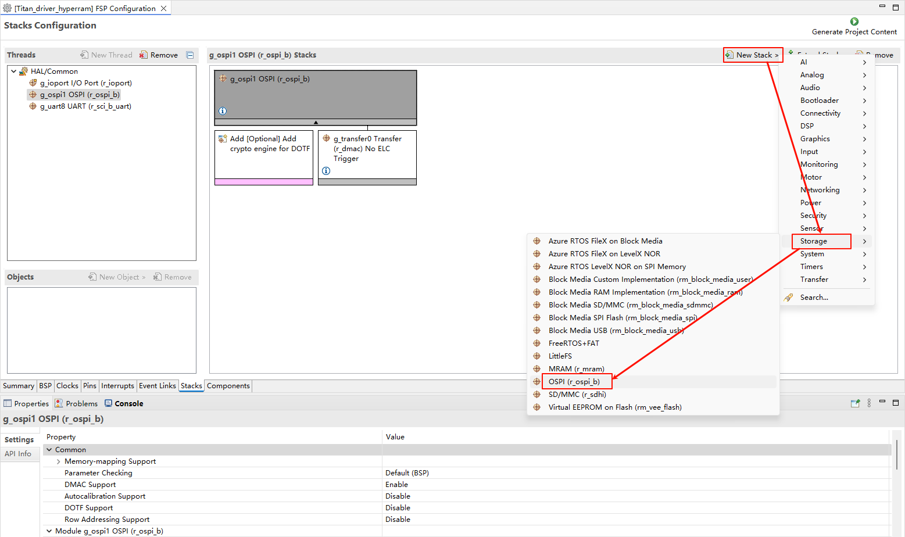
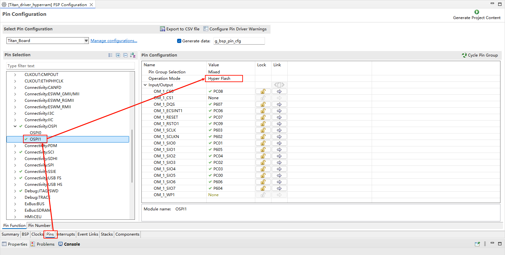

# HyperRAM 使用说明

**中文** | [**English**](./README.md)

## 简介

本示例演示了如何在 **Titan Board** 上使用 **Octa-SPI (OSPI) 接口**连接 **HyperRAM** 外部存储器，并基于 RT-Thread 驱动框架进行读写测试。通过该示例，用户可以熟悉 RA8 OSPI 控制器的配置方法、HyperRAM 的工作模式，以及在 RT-Thread 下访问外部存储器的应用流程。

## HyperRAM 简介

### 1. 概述

**HyperRAM** 是一种由 **Cypress（现 Infineon）** 首次推出的 **高性能低引脚数（Low Pin Count, LPC）DRAM**。

它基于 **HyperBus 接口**，主要面向 **嵌入式系统、显示控制、IoT 设备、汽车电子** 等需要 **高带宽、低功耗、简单接口** 的应用。

HyperRAM 属于 **pSRAM（Pseudo-SRAM，伪静态RAM）**，它在外部表现得像 SRAM（简单读写，无需用户刷新），但内部实际上是低功耗 DRAM（自刷新）。

### 2. 架构与接口

HyperRAM 使用 **HyperBus 接口**，其特点是：

- **引脚数少**：通常仅需 **13 个信号引脚**（8-bit 数据总线 + 控制/时钟），相比传统 SDRAM（几十个引脚）大幅减少 PCB 复杂度。
- **双数据速率（DDR）传输**：在时钟上升沿和下降沿传输数据，提高带宽。
- **串行控制协议**：通过命令-地址-数据序列访问内存，简化设计。

接口结构如下：

- **数据线 DQ[7:0]**：8 位双向数据
- **RWDS（Read-Write Data Strobe）**：数据同步信号
- **CLK**：时钟输入
- **CS#**：片选信号
- **RESET#**：复位
- **CKE**：时钟使能

### 3. 工作原理

HyperRAM 通过 **命令+地址+数据** 的方式访问：

1. **命令阶段**
   - 主机发送读/写命令和目标地址。
2. **延迟阶段**
   - HyperRAM 准备内部存储阵列（延迟可配置）。
3. **数据传输阶段**
   - 以 DDR 方式在 **DQ[7:0]** 上传输数据，RWDS 提供数据同步。

内部采用 DRAM 技术，支持 **自刷新**，但对外表现为 “像 SRAM 一样” ——用户无需关心刷新操作。

### 4. 性能特性

- **数据总线宽度**：8 位
- **工作电压**：1.8 V 或 3.0 V 低功耗设计
- **数据速率**：最高可达 **400 MB/s（200 MHz DDR × 8-bit）**
- **容量范围**：32 Mb ~ 512 Mb（4 MB ~ 64 MB）
- **低功耗**：支持深度睡眠模式，待机电流 < 10 µA
- **简单接口**：13 根引脚即可完成高速访问

### 5. HyperRAM 的优势

1. **低引脚数**
   - 与传统 SDRAM/PSRAM（30+ 引脚）相比大幅减少引脚需求，节省 PCB 走线。
2. **高带宽**
   - DDR 接口，带宽可达 400 MB/s，足以支持 **图像缓存、显示刷新** 等应用。
3. **低功耗**
   - 适合电池供电设备，如 IoT、可穿戴设备。
4. **易用性**
   - 对外表现类似 SRAM，简单易用，无需用户刷新。

### 6. 与其他存储的对比

| 特性     | HyperRAM          | SDRAM / DDR   | SRAM        | NOR Flash |
| -------- | ----------------- | ------------- | ----------- | --------- |
| 接口     | HyperBus (13-pin) | 并行 16~32 位 | 并行/串行   | SPI/QSPI  |
| 容量范围 | 32Mb ~ 512Mb      | 64Mb ~ 1Gb+   | 小（Kb~Mb） | 4Mb ~ 2Gb |
| 带宽     | ~400 MB/s         | ~800 MB/s+    | ~50 MB/s    | ~100 MB/s |
| 功耗     | 低                | 较高          | 较低        | 较低      |
| 应用场景 | 缓存/帧缓冲       | 系统主存      | 高速小容量  | 程序存储  |

## RA8 系列 OSPI (Octa-SPI) 特性

**OSPI (Octa-SPI)** 是 RA8 系列 MCU 中的重要外设接口模块，专门用于连接高速外部存储器（如 **Octa Flash、HyperFlash、HyperRAM**），以满足嵌入式应用在 **大容量存储、高速缓存、XIP 执行**等方面的需求。

### 1. 协议支持

RA8 OSPI 兼容多种存储接口协议，灵活适配不同外部存储器：

- **SPI 标准模式**：1-1-1 (单线指令、地址、数据)
- **Dual-SPI**：2-2-2 模式（双线）
- **Quad-SPI**：4-4-4 模式（四线）
- **Octa-SPI**：8-8-8 模式（八线，支持 DDR/SDR）
- **HyperBus 协议**：
  - 用于连接 **HyperRAM / HyperFlash**
  - 双边沿数据采样（DDR）
  - 传输速率可达 **333 MB/s**

### 2. 数据传输能力

- **最高频率**：支持 **166MHz 时钟**
- **DDR 模式**：数据在时钟上升沿与下降沿同时传输（带宽翻倍）
- **有效带宽**：
  - Octa-SPI DDR 模式，8-bit 总线，166 MHz → **333 MB/s**
  - HyperBus 模式同样可达 **333 MB/s**
- **Burst 访问**：支持可编程突发长度（16/32/64/128 字节），提升连续读写效率

### 3. 存储器映射与执行

RA8 OSPI 支持将外部存储映射到 **MCU 地址空间**，使外设访问与片上 SRAM 类似，方便应用：

- **XIP (Execute-In-Place)**：可直接在外部 Flash 中执行代码
- **存储映射缓存**：
  - 内建预取缓冲器，提高指令读取速度
  - 适合频繁读取的代码和数据场景
- **可配置读写访问模式**：
  - 直接访问模式（命令驱动）
  - 存储映射模式（内存地址空间直接访问）

### 4. 命令与时序支持

- **可编程命令集**：支持用户配置的指令序列（适配不同厂商 Flash/HyperRAM）
- **DQS (Data Strobe) 支持**：在 DDR 模式下提供时序同步，提高数据完整性
- **片选控制**：多片选引脚，可支持多个外部存储器
- **延迟补偿**：可配置时钟延迟、采样点位置，以适配高速 HyperRAM/HyperFlash

### 5. 低功耗与休眠管理

- **支持外设低功耗模式**：
  - HyperRAM 深度休眠模式 (Deep Power-Down)
  - HyperFlash 待机模式
- **快速唤醒**：通过片选控制快速恢复存储访问
- **适合电池供电应用**

## 硬件说明


## FSP 配置

* 新建 r_ospi_b stack：



* 配置 r_ospi_b stack：


* HyperRAM 引脚配置：



## RT-Thread Settings 配置

* 在 RT-Thread Settings 中使能 HyperRAM。


## 软件说明

本例程的 HyperRAM 测试源码位于 `./board/ports/hyperram` 中：

```c

#include <string.h>
#include <inttypes.h>
#include "hal_data.h"

#include "hyper_ram_test.h"
#include <rtthread.h>

#define ram_cfg     g_ospi1_cfg
#define ram_ctrl    g_ospi1_ctrl

#define OSPI_OM_RESET               BSP_IO_PORT_12_PIN_07
#define HYPER_RAM_RESET_DELAY()     R_BSP_SoftwareDelay(10UL, BSP_DELAY_UNITS_MICROSECONDS)

#define RAM_WORD_SIZE               (2UL)
#define RAM_WORDS_PER_BLOCK         (8UL)
#define RAM_BLOCK_SIZE              (RAM_WORD_SIZE * RAM_WORDS_PER_BLOCK)
#define RAM_BLOCKS_PER_PAGE         (64UL)
#define RAM_PAGE_SIZE               (RAM_BLOCK_SIZE * RAM_BLOCKS_PER_PAGE)
#define RAM_PAGE_COUNT              (32768UL)
#define RAM_DENSITY                 (RAM_PAGE_SIZE * RAM_PAGE_COUNT)

#define CHUNK_SIZE                  (64UL)

#define HYPER_RAM_CFG_REG_0_ADDRESS (0x0800)
#define HYPER_RAM_CFG_REG_1_ADDRESS (0x0801)

#if !defined(LENGTH_OF)
 #define LENGTH_OF(arr)             (sizeof((arr)) / sizeof((arr)[0]))
#endif

#define TRY(fn)                     _TRY_BREAK(fn, false)
#define TRY_BREAK(fn)               _TRY_BREAK(fn, true)
#define _TRY_BREAK(fn,break_on_err)         \
    do                                      \
    {                                       \
        volatile fsp_err_t _err;            \
        if (FSP_SUCCESS != (_err = (fn)))   \
        {                                   \
            if (break_on_err) __BKPT(0); \
            return _err;                    \
        }                                   \
    } while (0)

#define CATCH_BREAK(fn)                     \
    do                                      \
    {                                       \
        volatile fsp_err_t _err;            \
        if (FSP_SUCCESS != (_err = (fn)))   \
        {                                   \
            __BKPT(0);                   \
        }                                   \
    } while (0)

typedef enum
{
    HYPER_RAM_CMD_READ           = 0x80,
    HYPER_RAM_CMD_WRITE          = 0x00,
    HYPER_RAM_CMD_MEMORY_SPACE   = 0x00,
    HYPER_RAM_CMD_REGISTER_SPACE = 0x40,
    HYPER_RAM_CMD_WRAP           = 0x00,
    HYPER_RAM_CMD_LINEAR         = 0x20,
} hyper_ram_cmd_t;

ospi_b_xspi_command_set_t g_hyper_ram_commands[] =
{
 {
  .protocol = SPI_FLASH_PROTOCOL_8D_8D_8D,
  .frame_format = OSPI_B_FRAME_FORMAT_XSPI_PROFILE_2_EXTENDED,
  .latency_mode = OSPI_B_LATENCY_MODE_FIXED,
  .command_bytes = OSPI_B_COMMAND_BYTES_1,
  .address_bytes = SPI_FLASH_ADDRESS_BYTES_4,

  .read_command = 0xA0,
  .read_dummy_cycles = 13,
  .program_command = 0x20,
  .program_dummy_cycles = 13,

  .address_msb_mask = 0xF0,
  .status_needs_address = false,

  .p_erase_commands = NULL,
 }
};

/**
 * Entry point for HyperRAM testing.
 */

/* Define the static array at address 0x70000000 using section attribute */
#define TEST_SIZE 8388608 // 32MB (8M x 4 bytes)
static uint32_t test_array[TEST_SIZE] __attribute__((section(".ospi1_cs0_noinit_nocache")));

void hyper_ram_test(void)
{
    const uint32_t test_bytes = TEST_SIZE * 4; // Total bytes: 32MB
    uint32_t errors = 0;
    rt_tick_t start_time, end_time;
    uint32_t write_speed_kbs, read_speed_kbs;
    uint32_t write_time_ms, read_time_ms;

    /* Write pattern to RAM and measure time */
    start_time = rt_tick_get();
    for (uint32_t i = 0; i < TEST_SIZE; i++)
    {
        test_array[i] = i ^ 0xA5A5A5A5; // Use XOR pattern for better error detection
    }
    end_time = rt_tick_get();

    /* Calculate write speed in KB/s and time in ms */
    write_time_ms = (end_time - start_time) * 1000 / RT_TICK_PER_SECOND;
    if (write_time_ms > 0)
    {
        write_speed_kbs = (test_bytes / 1024) / write_time_ms * 1000; // KB/s
    }
    else
    {
        write_speed_kbs = 0; // Avoid division by zero
    }

    /* Verify written pattern while measuring read time */
    start_time = rt_tick_get();
    for (uint32_t i = 0; i < TEST_SIZE; i++)
    {
        uint32_t expected = i ^ 0xA5A5A5A5;
        uint32_t actual = test_array[i];
        if (actual != expected)
        {
            errors++;
//            rt_kprintf("errors:%d actual:%d\n", errors, actual);
        }
    }
    end_time = rt_tick_get();

    /* Calculate read speed in KB/s and time in ms */
    read_time_ms = (end_time - start_time) * 1000 / RT_TICK_PER_SECOND;
    if (read_time_ms > 0)
    {
        read_speed_kbs = (test_bytes / 1024) / read_time_ms * 1000; // KB/s
    }
    else
    {
        read_speed_kbs = 0; // Avoid division by zero
    }

    /* Print test results */
    if (errors == 0)
    {
        rt_kprintf("Hyper RAM test passed successfully!\n");
    }
    else
    {
        rt_kprintf("Hyper RAM test failed with %u errors\n", errors);
    }

    /* Print read and write speeds as integers */
    rt_kprintf("Write speed: %u KB/s (%u ms)\n", write_speed_kbs, write_time_ms);
    rt_kprintf("Read speed: %u KB/s (%u ms)\n", read_speed_kbs, read_time_ms);
}
MSH_CMD_EXPORT(hyper_ram_test, hyper_ram_test);

int hyper_ram_init(void)
{
    /* Change OM_RESET back to normal IO mode. */
    R_IOPORT_PinCfg(&g_ioport_ctrl,
                    OSPI_OM_RESET,
                    IOPORT_CFG_PORT_DIRECTION_OUTPUT
                        | IOPORT_CFG_DRIVE_HIGH
                        | IOPORT_CFG_PORT_DIRECTION_OUTPUT
                        | IOPORT_CFG_PORT_OUTPUT_HIGH);

    /* Pin reset the OctaFlash */
    R_BSP_PinWrite(OSPI_OM_RESET, BSP_IO_LEVEL_LOW);
    HYPER_RAM_RESET_DELAY();
    R_BSP_PinWrite(OSPI_OM_RESET, BSP_IO_LEVEL_HIGH);
    HYPER_RAM_RESET_DELAY();

    /* Open the interface and immediately transition to 8D-8D-8D mode */
    R_OSPI_B_Open((spi_flash_ctrl_t *)&ram_ctrl, &ram_cfg);
    R_OSPI_B_SpiProtocolSet(&ram_ctrl, SPI_FLASH_PROTOCOL_8D_8D_8D);

    return RT_EOK;
}
INIT_BOARD_EXPORT(hyper_ram_init);
```

## 编译&下载

* RT-Thread Studio：在RT-Thread Studio 的包管理器中下载 Titan Board 资源包，然后创建新工程，执行编译。


编译完成后，将开发板的 USB-DBG 接口与 PC 机连接，然后将固件下载至开发板。

## 运行效果

按下复位按键重启开发板，输入 `hyper_ram_test` 命令开始 HyperRAM 测试。


