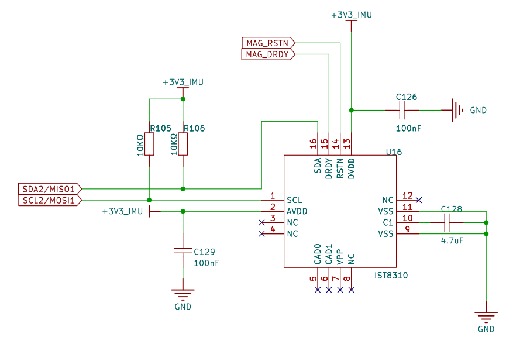
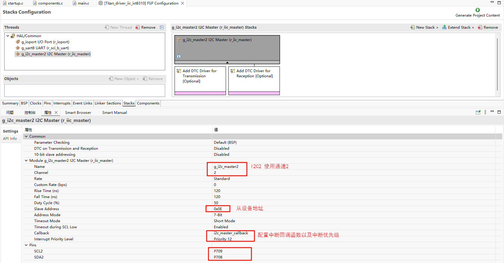
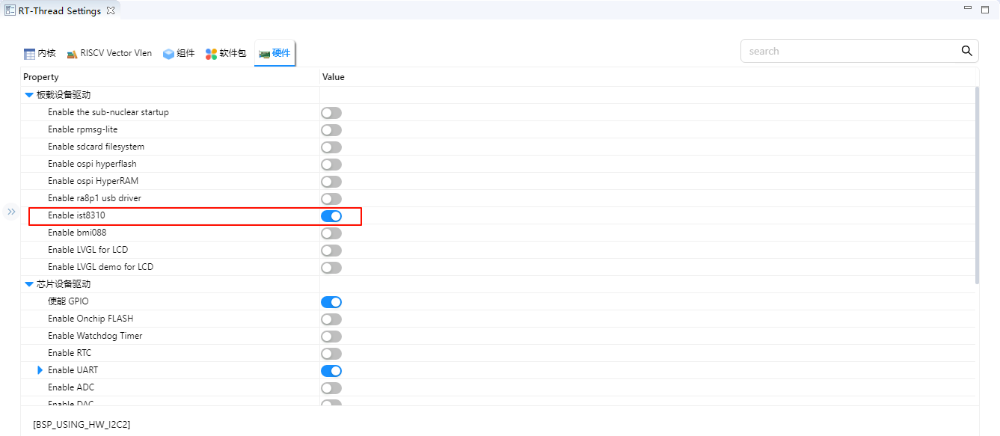
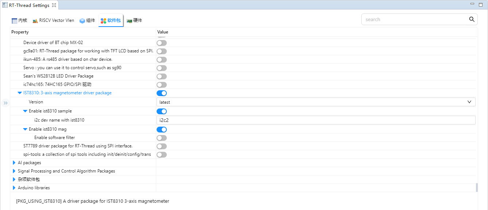
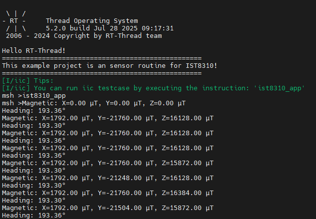

# IST8310 Example Usage Instructions

**English** | [**Chinese**](./README_zh.md)

## Introduction

This example demonstrates how to use the **I2C interface of the RA8 series MCU** on the **Titan Board** to connect to the **IST8310 three-axis magnetometer sensor** and read data via the **I2C driver framework provided by RT-Thread**.
 Through this example, users can become familiar with the **configuration of the RA8 I2C Master peripheral** and the workflow for accessing sensors under RT-Thread.

## IST8310 Magnetometer Introduction

### 1. Overview

The **IST8310**, produced by **iSentek (Amys Semiconductor)**, is a **three-axis geomagnetic sensor (Magnetometer)** primarily used to measure geomagnetic field strength for **electronic compass (E-Compass) applications**.

It is commonly used in **drones, smartphones, wearable devices, and navigation systems** to provide heading information or detect magnetic fields.

### 2. Key Features

- **Three-axis measurement**: Measures X, Y, and Z directions simultaneously
- **Communication interface**: I²C (up to 400 kHz)
- **Measurement range**: ±1600 µT
- **Resolution**: 0.3 µT
- **Output rate**: Configurable, up to **200 Hz**
- **Low power consumption**: Operating current ~85 µA, standby current <1 µA
- **Supply voltage**: 1.8 V ~ 3.6 V (compatible with common MCUs)
- **Package**: 3 × 3 × 1 mm LGA, compact for embedded applications

### 3. Working Principle

The IST8310 detects magnetic fields using the **Hall effect** or **magneto-resistive effect**, with the core process as follows:

1. **Magnetic field detection**
   - The sensing unit detects the geomagnetic field (~50 µT) or other magnetic variations.
2. **Signal conditioning**
   - Internal analog circuits convert the sensed signal into a voltage, then amplify and filter it.
3. **A/D conversion**
   - Built-in ADC converts the analog signal to digital values.
4. **Data output**
   - Outputs X, Y, Z magnetic field strength values via the I²C bus for the MCU to calculate heading or orientation.

### 4. Performance Specifications

- **Sensitivity**: 0.3 µT / LSB
- **Offset error**: Typical ±1 µT
- **Zero-point drift**: Temperature compensation reduces drift
- **Sampling rate**: Configurable from 0.5 Hz to 200 Hz
- **Operating temperature**: -40 ℃ ~ +85 ℃

### 5. Advantages and Limitations

**Advantages**

- Small size, low power consumption, suitable for battery-powered systems
- Digital output, easy MCU integration
- Wide operating voltage range, strong adaptability

**Limitations**

- External **calibration** required (hard iron/soft iron correction) for accuracy
- Sensitive to temperature and environmental magnetic interference
- Alone, prone to noise; often fused with IMU (accelerometer + gyroscope)

## RA8 Series I2C Master Features

The RA8 series MCU has a built-in **I2C controller**, a high-performance, multi-functional, master/slave-compatible module suitable for reliable, high-speed communication with I2C devices such as sensors, EEPROMs, and RTC chips.

### 1. Architecture Overview

The RA8 I2C controller consists of:

- **Master/Slave Control**
  - Supports master, slave, and multi-master modes
  - Automatic bus arbitration and conflict handling
  - Supports 7-bit and 10-bit addressing
- **Clock Generator & Prescaler**
  - Built-in programmable prescaler
  - Supports standard, fast, and high-speed modes
  - Allows precise baud rate configuration
- **Transmit/Receive FIFO**
  - Independent TX and RX FIFOs
  - Reduces CPU intervention, increases data throughput
  - Supports batch read/write for high-speed sensor data acquisition
- **Interrupt Controller**
  - Supports multiple events: transfer complete, arbitration lost, bus error, FIFO empty/full
  - Can be used in interrupt or polling mode
- **DMA Support**
  - TX/RX data can be transferred via DMA
  - Reduces CPU load, lowers power consumption
  - Suitable for high-frequency or large-data I2C operations

### 2. Supported I2C Modes

| Mode            | Speed          | Features                                        |
| --------------- | -------------- | ----------------------------------------------- |
| Standard Mode   | 100 kbps       | Compatible with standard I2C                    |
| Fast Mode       | 400 kbps       | Supports high-speed sensors and EEPROM          |
| Fast Mode Plus  | 1 Mbps         | Increased bus bandwidth, reduced latency        |
| High-Speed Mode | 3.4 Mbps       | Suitable for high-speed data acquisition        |
| Address Mode    | 7-bit / 10-bit | Supports standard and extended slave addressing |

### 3. Bus Management & Multi-Master Features

- **Bus Arbitration**
  - Detects conflicts automatically when multiple masters transmit
  - Follows I2C standard arbitration rules to avoid bus contention
- **Start/Stop Condition Generation**
  - Hardware automatically generates START/STOP signals
  - Supports repeated start conditions
- **ACK/NACK Support**
  - Automatically detects slave responses
  - NACK detection for communication error handling
- **Clock Stretching**
  - Supports slave-held clock low for slow devices
  - Ensures reliable data transfer with slower slaves

### 4. Timing and Data Transfer

- **Bidirectional lines (SDA/SCL)**
  - Open-drain, requires external pull-up resistors (4.7kΩ~10kΩ)
  - Supports 1.8V / 3.3V I/O
- **High-speed data transfer**
  - Standard, fast, high-speed modes supported
  - Fast-Mode Plus up to 1 Mbps
  - Multi-master, bidirectional synchronous communication supported
- **FIFO & Burst support**
  - 8~32 byte FIFO for continuous read/write
  - Reduces CPU interrupt frequency

### 5. DMA and Interrupt Mechanisms

- **DMA Support**
  - TX/RX FIFOs can be linked to DMA controller
  - Auto-triggered DMA transfer reduces CPU load
  - Ideal for high-frequency sensor data acquisition or continuous streams
- **Interrupt Types**
  - Transfer complete (TX empty / RX full)
  - Arbitration lost (multi-master conflict)
  - Bus error (START/STOP/ACK/NACK errors)
  - FIFO threshold (high/low water mark)

### 6. Fault Detection & Tolerance

- Arbitration lost detection for multi-master safety
- Bus error detection for illegal conditions
- Slave non-response handling with configurable retries
- SCL timeout protection to prevent long bus hold

### 7. Electrical & Power Features

- **I/O voltage**: Configurable 1.8V / 3.3V
- **Low power mode**: Supports idle bus entry
- **SDA/SCL idle power consumption** very low
- **Deep sleep wake-up**: I2C peripheral can wake the MCU

## Hardware Description

Titan Board uses IIC2 to communicate with IST8310.



## FSP Configuration

* Create a new stack and select `r_iic_master`. Then, configure the I2C2 settings as shown below:



## RT-Thread Settings Configuration

* Enable the RT-Thread I2C driver framework and the IST8310 driver software package in the configuration.





## Example Project Description

The magnetometer data communication is realized based on the driver software package IST8310.

```c
/*
* Copyright (c) 2006-2025, RT-Thread Development Team
*
* SPDX-License-Identifier: Apache-2.0
*
* Change Logs:
* Date           Author        Notes
* 2025-06-13     kurisaW       first version
*/

#include <rtthread.h>
#include "ist8310.h"

static void ist8310_entry()
{
    ist8310_device_t dev = ist8310_init(IST8310_SAMPLE_I2C_DEV_NAME);
    if (dev == RT_NULL) {
        rt_kprintf("IST8310 init failed\n");
        return;
    }

    /* Set the magnetic declination Angle (set according to the actual position) */
    ist8310_set_declination(dev, 0.15f);  /* For example: 0.15 radians */

    while (1)
    {
        ist8310_data_t data;
        if (ist8310_read_magnetometer(dev, &data) == RT_EOK)
        {
            rt_kprintf("Magnetic: X=%.2f µT, Y=%.2f µT, Z=%.2f µT\n", data.x, data.y, data.z);
        }

        float heading = ist8310_read_heading(dev);
        rt_kprintf("Heading: %.2f°\n", heading);

        rt_thread_mdelay(1000);
    }
}

void ist8310_app()
{
    rt_thread_t ist8310 = rt_thread_create("ist8310", ist8310_entry, RT_NULL, 2048, 20, 10);
    if(ist8310 != RT_NULL)
    {
        rt_thread_startup(ist8310);
    }

    return;
}
MSH_CMD_EXPORT(ist8310_app, IST8310 app);
```

## Compilation & Download

* **RT-Thread Studio**: In RT-Thread Studio’s package manager, download the Titan Board resource package, create a new project, and compile it.

After compilation, connect the development board’s USB-DBG interface to the PC and download the firmware to the development board.

## Run Effect

Input ist8310_app command in serial port terminal:

