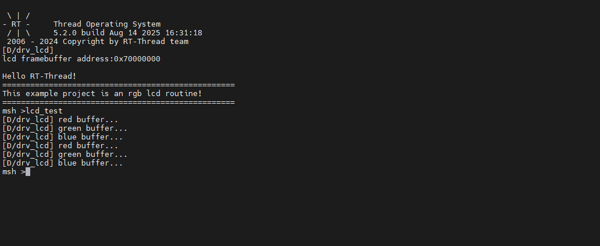

# RGB LCD 使用说明

**中文** | [**English**](./README.md)

## 简介

本示例演示了如何在 **Titan Board** 上使用 **RA8 系列 MCU 的 GLCDC 模块**结合 **RT-Thread 的 LCD 驱动框架**驱动 RGB LCD 屏幕，实现图像显示与界面更新。文档将详细介绍 **RA8 系列 GLCDC 外设特性**及 **RT-Thread LCD 驱动框架**，并提供示例配置和操作方法。

## RA8 系列 GLCDC 模块

### 1. 简介

**GLCDC（Graphics LCD Controller）**是 RA8 系列 MCU 内置的高性能图形控制器模块，专门用于驱动 TFT/RGB LCD 屏幕，支持各种分辨率、色彩格式和图像处理功能。结合 RT-Thread 的 **LCD 驱动框架**，可以实现统一接口下的屏幕初始化、刷新、图像绘制及 DMA 加速等功能。

RA8 系列 **GLCDC (Graphics LCD Controller)** 提供了从 MCU 内部存储器或外部图像缓存向 RGB/LCD 显示屏输出图像的能力。它集成了：

- **帧缓冲控制**：可配置多帧缓冲，实现页面切换或双缓冲显示
- **颜色格式支持**：RGB565, RGB888, ARGB8888 等
- **图形处理功能**：背景图层、文字/图形合成、透明度混合、调色板等
- **同步信号生成**：HSYNC, VSYNC, DE（Data Enable）等
- **DMA 支持**：高速数据传输，减少 CPU 占用
- **中断功能**：帧结束中断、行结束中断等

### 2. 模块架构

RA8 GLCDC 模块主要包含以下子模块：

1. **图层合成单元（Layer Composition Unit）**
   - 支持多图层叠加
   - 提供 alpha blending、透明度控制、颜色键控
   - 可以对图层进行旋转、翻转处理
2. **帧缓冲接口（Frame Buffer Interface）**
   - 支持访问 MCU 内部 SRAM 或外部存储器
   - 提供单/双缓冲模式，保证连续显示
   - 配合 DMA 自动读取图像数据
3. **DMA 控制器（DMA Controller）**
   - 自动传输像素数据到 RGB 输出端口
   - 可配置突发长度，提高带宽利用率
   - 支持循环传输，适合视频或动画场景
4. **同步信号生成器（Timing Generator）**
   - 自动生成 HSYNC/VSYNC/DE 信号
   - 支持 TTL 接口 RGB 时序
   - 可配置极性、同步宽度、前后肩时间等
5. **中断与事件处理单元（Interrupt/Event Controller）**
   - 提供帧结束中断、行结束中断
   - 可用于页面切换、动态绘制或滚动显示
   - 支持 DMA 传输完成触发中断

### 3. GLCDC 工作原理

1. **帧缓冲读取**
   - GLCDC 通过 DMA 从内存读取图像数据，支持单/双缓冲模式，保证连续显示。
2. **图层合成**
   - 支持多图层叠加，例如背景图层 + 前景图层 + 图标/文字图层
   - 提供透明度控制和调色板映射
3. **像素时序输出**
   - 根据 LCD 的接口要求生成 HSYNC/VSYNC/DE 信号
   - 支持 RGB 并行接口、TTL 接口或 LVDS（视具体板级实现）
4. **中断与事件**
   - **帧结束中断（VBlank）**：可用于更新下一帧数据
   - **行结束中断**：可用于滚动显示或动态绘制

### 4. GLCDC 支持的功能与特性

| 功能类别  | 描述                                             |
| --------- | ------------------------------------------------ |
| 分辨率    | 最高可达 800×480 (具体取决于 MCU 型号及时钟配置) |
| 色彩模式  | RGB565、RGB888、ARGB8888 等                      |
| 多图层    | 背景 + 前景 + 符号图层，可叠加混合               |
| 帧缓冲    | 支持单帧/双帧缓冲模式，DMA 传输提高性能          |
| 调色板    | 支持 8/16 位调色板映射，实现色彩转换             |
| 同步信号  | HSYNC, VSYNC, DE，可配置极性和时序               |
| DMA 支持  | 自动从内存传输图像数据，无需 CPU 干预            |
| 中断      | 帧结束、行结束中断，可用于屏幕刷新同步           |
| 旋转/翻转 | 支持 90°/180°/270°旋转及 X/Y 翻转                |

## RT-Thread LCD 驱动框架

RT-Thread 提供了 **统一的 LCD 驱动框架**，通过封装底层控制器，支持不同屏幕类型与 MCU 外设。框架主要接口如下：

### 主要接口

| 函数/宏                                   | 功能                                              |
| ----------------------------------------- | ------------------------------------------------- |
| `rt_device_find("lcd")`                   | 查找 LCD 设备句柄                                 |
| `rt_device_open(dev, flags)`              | 打开设备，初始化 LCD 硬件                         |
| `rt_device_control(dev, cmd, args)`       | 控制 LCD，例如更新lcd图像、设置背光、读取屏幕信息 |
| `rt_device_write(dev, pos, buffer, size)` | 向 LCD 写入像素数据                               |
| `rt_device_read(dev, pos, buffer, size)`  | 从 LCD 读取像素数据（部分屏幕支持）               |
| `rt_device_close(dev)`                    | 关闭设备                                          |

## 硬件说明

## FSP 配置

### HyperRAM 配置

* 新建 r_ospi_b stack：

* 配置 r_ospi_b stack：

* HyperRAM 引脚配置：

### RGB LCD 配置

* 新建 `r_glcdc` stack：

* 配置中断回调和图形层1：

* 配置输出参数、CLUT、TCON和抖动。

* 配置 GLCDC 的引脚：

### LCD 背光配置

* 新建 `r_gpt` stack：

* 配置背光 PWM 输出：

### D/AVE 2D 配置

* 新建 `r_drw` stack：

## RT-Thread Settings 配置

* 在 RT-Thread Settings 中使能 RGB565 LCD，使用 pwm7 输出屏幕背光。

## 编译&下载

* RT-Thread Studio：在RT-Thread Studio 的包管理器中下载 Titan Board 资源包，然后创建新工程，执行编译。

编译完成后，将开发板的 USB-DBG 接口与 PC 机连接，然后将固件下载至开发板。

## 运行效果

复位开发板后在终端输入 `lcd_test` 命令运行刷屏程序。

