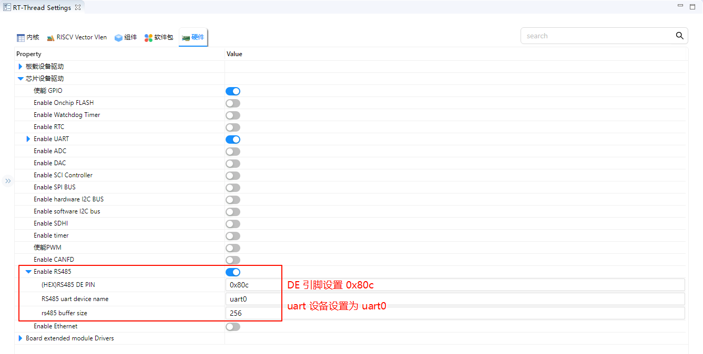

# RS485 Driver Usage Instructions

**English** | [**Chinese**](./README_zh.md)

## Introduction

This example demonstrates how to implement **RS485 half-duplex communication** on the **Titan Board** using the **RA8 series MCU UART module**, leveraging the **RT-Thread serial driver framework** for data transmission and reception. Through this example, users can become familiar with the **configuration of RA8 UART peripherals**, setting up RS485 communication modes, and application workflows under RT-Thread.

## RS-485 Overview

### 1. General Description

**RS-485** (also known as **TIA/EIA-485**) is a **differential serial communication standard** widely used in industrial control, building automation, and long-distance data transmission. It is an enhanced version of RS-232, supporting longer distances and multi-node communication.

Key features:

- **Differential signaling**: Uses two lines (A/B) to transmit signals, improving noise immunity.
- **Multi-point communication**: A single bus can support up to **32 drivers and 32 receivers** (more with extended devices).
- **Long-distance transmission**: Standard up to **1200 meters**, with speed inversely related to distance.
- **Half-duplex or full-duplex**: Flexible configuration; industrial protocols like Modbus RTU typically use half-duplex.

### 2. Physical Layer Characteristics

| Feature              | Description                                       |
| -------------------- | ------------------------------------------------- |
| Signal type          | Differential (A/B lines)                          |
| Driver voltage       | ±1.5 V to ±5 V                                    |
| Receiver threshold   | ≥ ±200 mV                                         |
| Maximum nodes        | 32 drivers + 32 receivers (standard)              |
| Bus length           | Up to 1200 m (longer at lower speeds)             |
| Termination resistor | 120 Ω, matches bus impedance, reduces reflections |

**Differential signaling principle**:

- Lines A and B carry opposite currents.
- The receiver measures **V_AB = V_A - V_B**.
- Common-mode noise is rejected, maintaining correct logic levels.

### 3. Communication Modes

1. **Half-Duplex**
   - Single-direction communication on the bus.
   - Send/receive enable control switches direction.
   - Common in Modbus RTU and industrial protocols.
2. **Full-Duplex**
   - Uses two differential pairs (A/B + A’/B’) to transmit and receive simultaneously.
   - Increases communication efficiency.
   - Requires more complex PCB routing.
3. **Point-to-Point & Multi-Point**
   - Point-to-point: Simple and reliable two-node communication.
   - Multi-point: Requires bus arbitration to avoid conflicts.

### 4. Signal Characteristics

- **Logic levels**:
  - Logic “1” (mark): A < B
  - Logic “0” (space): A > B
- **Noise immunity**:
  - Differential signaling rejects common-mode interference.
  - Suitable for long-distance industrial transmission.
- **Baud rate vs. distance**:

| Baud Rate  | Maximum Distance |
| ---------- | ---------------- |
| 9600 bps   | 1200 m           |
| 115200 bps | 100 m            |

- Higher baud rates reduce maximum transmission distance.

### 5. Advantages and Limitations

**Advantages**:

- Strong noise immunity
- Supports long distances and multiple nodes
- Low bus cost and simple wiring

**Limitations**:

- Half-duplex requires software or hardware to manage conflicts
- High-speed communication is distance-limited
- Requires termination resistors for proper operation

## RA8 Series UART Module Overview

The RA8 series MCU features a high-performance UART peripheral, supporting multiple communication modes and baud rates, making it suitable for RS485 half-duplex communication.

### 1. UART General Features

- **Communication mode**: Standard asynchronous serial
- **Data length**: 5–9 bits
- **Stop bits**: 1, 1.5, 2
- **Parity**: None, even, or odd
- **Baud rate**: 300 bps – 12 Mbps (higher on some models)
- **FIFO support**: TX/RX buffers to reduce CPU load
- **DMA support**: TX/RX can leverage DMA for high throughput
- **Interrupt events**: Transmission complete, FIFO threshold, errors (frame, overflow, parity)

### 2. RS485-Specific Features

- **Driver Enable (DE) auto-control**:
  - DE is automatically raised during transmission
  - Lowered after transmission completes
- **Half-duplex mode**:
  - Single-wire transceivers use direction control to switch between send and receive
- **Optional address detection**:
  - Supports address matching for multi-node communication

### 3. UART Architecture and Operation

1. **TX/RX FIFO**
   - Independent buffers for transmit and receive
   - FIFO threshold interrupts improve continuous data handling
2. **Baud rate generator**
   - Generates desired baud rate from PCLK and divisors
   - Supports standard and non-standard rates
3. **Interrupt and event handling**
   - TX empty interrupt: transmit buffer is empty
   - RX full interrupt: receive buffer is full
   - Error interrupts: frame, overflow, parity
   - Transmission complete interrupt: can trigger RS485 DE auto-switch

## RT-Thread UART Driver Framework

RT-Thread provides a unified **serial driver framework** that supports standard UART and RS485 communication.

### Key Interfaces

| Function / Macro                          | Purpose                                           |
| ----------------------------------------- | ------------------------------------------------- |
| `rt_device_find("uartX")`                 | Find UART device handle                           |
| `rt_device_open(dev, flags)`              | Open device and initialize hardware               |
| `rt_device_control(dev, cmd, args)`       | Control UART settings (baud rate, mode, RS485 DE) |
| `rt_device_write(dev, pos, buffer, size)` | Send data                                         |
| `rt_device_read(dev, pos, buffer, size)`  | Receive data                                      |
| `rt_device_close(dev)`                    | Close UART device                                 |

## Hardware Description

## FSP Configuration

* Open the FSP tool and create a  `r_sci_b_uart` stack:

* Configure `r_sci_b_uart` stack：

* Configure `r_sci_b_uart` 引脚：

## RT-Thread Settings Configuration

* Enable and configure RS485.

## Build & Download

* **RT-Thread Studio:** Download the Titan Board resource pack from the RT-Thread Studio package manager, then create a new project and compile it.

Once compiled, connect the development board’s USB-DBG interface to the PC, and download the firmware to the development board.

## Running Result

Type `rs485_cmd -t RT-Thread` command in terminal to send "RT-Thread" string.

The RS485 interface of the Titan Board is connected to the RS485 interface of another development Board, and the data is continuously sent using the other development board, and the terminal will output the data received by the Titan Board.

