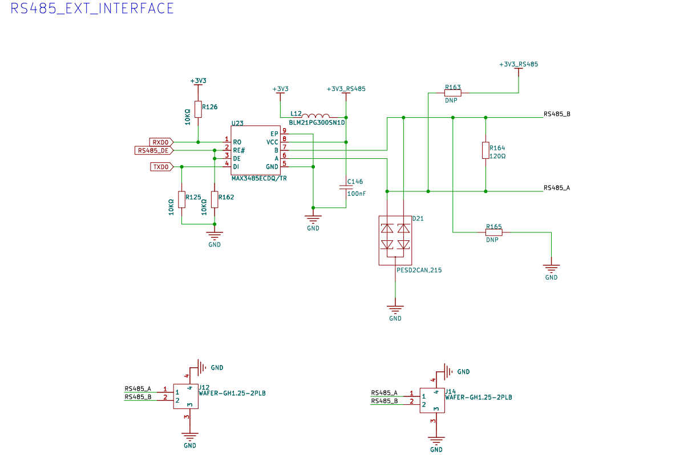
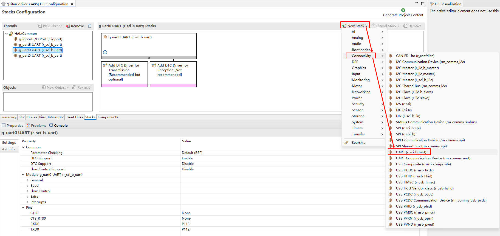
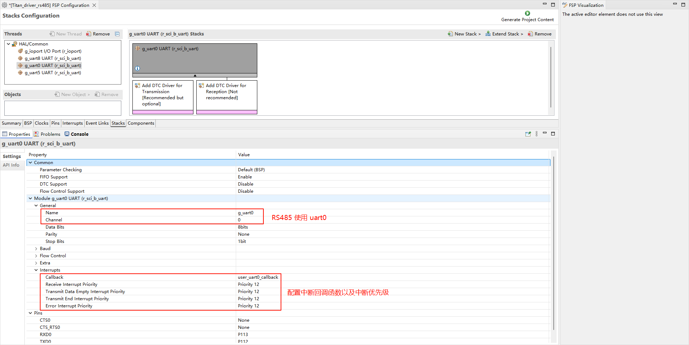
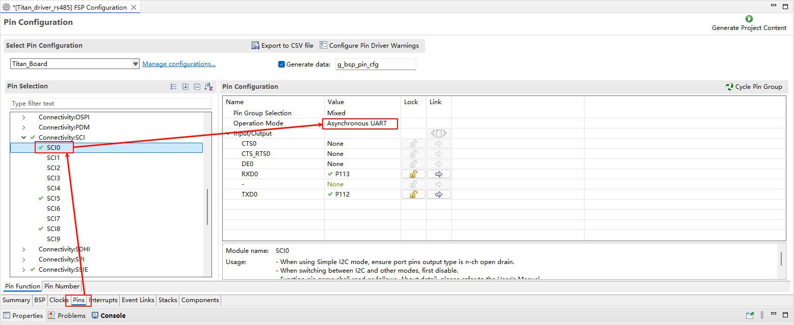
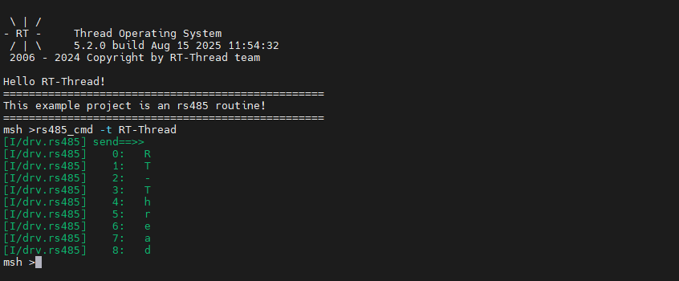
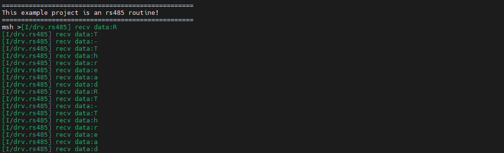

# RS485 驱动例程

**中文** | [**English**](./README.md)

## 简介

本示例演示了如何在 **Titan Board** 上使用 **RA8 系列 MCU 的 UART 模块**实现 **RS485 半双工通信**，并基于 **RT-Thread 串口驱动框架**进行数据收发。通过该示例，用户可以熟悉 **RA8 UART 外设的配置方法**、RS485 通信模式的设置，以及在 RT-Thread 下的应用流程。

## RS-485 简介

### 1. 概述

**RS-485**（也称 **TIA/EIA-485**）是一种**差分信号串行通信标准**，用于工业控制、楼宇自动化和远距离数据传输。它是 **RS-232 的增强版**，可以支持更长距离和多节点通信。

主要特点：

- **差分传输**：使用 A/B 两条线传输信号，提高抗干扰能力
- **多点通信**：单总线可挂载 **多达 32 个驱动器和 32 个接收器**（扩展器件可更多）
- **长距离传输**：标准可达 **1200 米**，速率与距离成反比
- **半双工或全双工**：可灵活配置，常见工业总线协议（Modbus RTU）采用半双工

### 2. 物理层特性

| 特性           | 描述                              |
| -------------- | --------------------------------- |
| 信号类型       | 差分信号（A/B 两线）              |
| 驱动电压       | ±1.5 V 至 ±5 V                    |
| 接收器阈值     | ≥ ±200 mV                         |
| 总线最大节点数 | 32 个驱动器 + 32 个接收器（标准） |
| 总线长度       | 最高可达 1200 m（速率低可更长）   |
| 终端电阻       | 120 Ω，匹配总线阻抗，减少反射     |

**差分信号原理**：

- A/B 两条线同时传输电流方向相反的信号
- 接收器测量 **V_AB = V_A - V_B**
- 即使有共模干扰，差分电压仍可保持正确逻辑

### 3. 通信模式

1. **半双工（Half-Duplex）**
   - 总线单方向通信
   - 通过控制发送/接收使能实现
   - 常用于 Modbus RTU 等工业协议
2. **全双工（Full-Duplex）**
   - 使用两对差分线（A/B + A’/B’）同时收发
   - 提高通信效率
   - 对 PCB 布线要求更高
3. **点对点和多点通信**
   - 点对点：两节点通信，简单可靠
   - 多点（多驱动器/多接收器）：需总线仲裁，避免冲突

### 4. 信号特性

- **逻辑电平**：

  - 逻辑 “1”（标记电平）：A < B
  - 逻辑 “0”（空闲电平）：A > B

- **抗干扰能力**

  - 差分信号可抑制共模干扰
  - 常用于工业环境中的长距离传输

- **波特率与距离**：

  | 波特率     | 最大传输距离 |
  | ---------- | ------------ |
  | 9600 bps   | 1200 m       |
  | 115200 bps | 100 m        |

  - 波特率越高，传输距离越短

### 5. 优势与限制

**优势**：

- 抗干扰能力强
- 支持长距离和多节点
- 总线成本低，布线简单

**限制**：

- 半双工总线通信需软件或硬件管理冲突
- 高速通信距离受限
- 需要终端电阻匹配

## RA8 系列 UART 模块概述

RA8 系列 MCU 内置高性能 UART 外设，支持多种通信模式和波特率，能够满足 RS485 半双工通信需求。

### 1. UART 总体特性

- **通信模式**：标准 UART 异步串行通信
- **数据位长度**：5~9 位可选
- **停止位**：1、1.5、2 位可选
- **奇偶校验**：支持无、偶、奇校验
- **波特率**：支持 300 bps ~ 12 Mbps，部分型号可更高
- **FIFO 支持**：发送/接收 FIFO 缓冲，减轻 CPU 负担
- **DMA 支持**：TX/RX 可通过 DMA 提高数据吞吐
- **中断事件**：传输完成、中断触发、FIFO 阀值、错误检测（帧错误、溢出、奇偶校验错误）

### 2. RS485 相关功能

RA8 UART 模块对 RS485 支持如下：

- **DE（Driver Enable）自动控制**
  - 当发送数据时自动拉高 DE
  - 发送完成后自动拉低 DE
- **半双工模式**
  - 单线收发器，通过方向控制实现收发切换
- **地址检测功能（可选）**
  - 支持多机通讯的地址匹配

### 3. UART 架构与工作原理

1. **发送/接收 FIFO**
   - 提供独立的 TX/RX 缓冲区
   - 支持 FIFO 阈值中断，提高连续收发效率
2. **波特率生成器**
   - 根据 PCLK 和分频寄存器生成所需波特率
   - 支持标准波特率和非标准波特率
3. **中断与事件处理**
   - TX 空中断：发送缓冲区空
   - RX 满中断：接收缓冲区满
   - 错误中断：帧错误、溢出、奇偶校验错误
   - 发送完成中断：可用于 RS485 DE 自动控制

## RT-Thread UART 驱动框架

RT-Thread 提供统一的 **串口驱动框架**，支持标准 UART 和 RS485。

### 主要接口

| 函数/宏                                   | 功能                                        |
| ----------------------------------------- | ------------------------------------------- |
| `rt_device_find("uartX")`                 | 查找 UART 设备句柄                          |
| `rt_device_open(dev, flags)`              | 打开设备，初始化硬件                        |
| `rt_device_control(dev, cmd, args)`       | 控制 UART，例如设置波特率、模式、RS485 方向 |
| `rt_device_write(dev, pos, buffer, size)` | 发送数据                                    |
| `rt_device_read(dev, pos, buffer, size)`  | 接收数据                                    |
| `rt_device_close(dev)`                    | 关闭 UART                                   |

## 硬件说明

## FSP 配置

* 打开 FSP 工具，新建 `r_sci_b_uart` stack：

* 配置 `r_sci_b_uart` stack：

* 配置 `r_sci_b_uart` 引脚：

## RT-Thread Settings 配置

* 使能并配置 RS485。

##  编译&下载

* RT-Thread Studio：在RT-Thread Studio 的包管理器中下载 Titan Board 资源包，然后创建新工程，执行编译。

编译完成后，将开发板的 USB-DBG 接口与PC 机连接，然后将固件下载至开发板。

### 运行效果

在终端中输入 `rs485_cmd -t RT-Thread` 命令发送 “RT-Thread” 字符串。

将 Titan Board 的 RS485 接口与另一块开发板的 RS485 接口连接，使用另一块开发板不断发送数据，终端会输出 Titan Board 接收到的数据。

