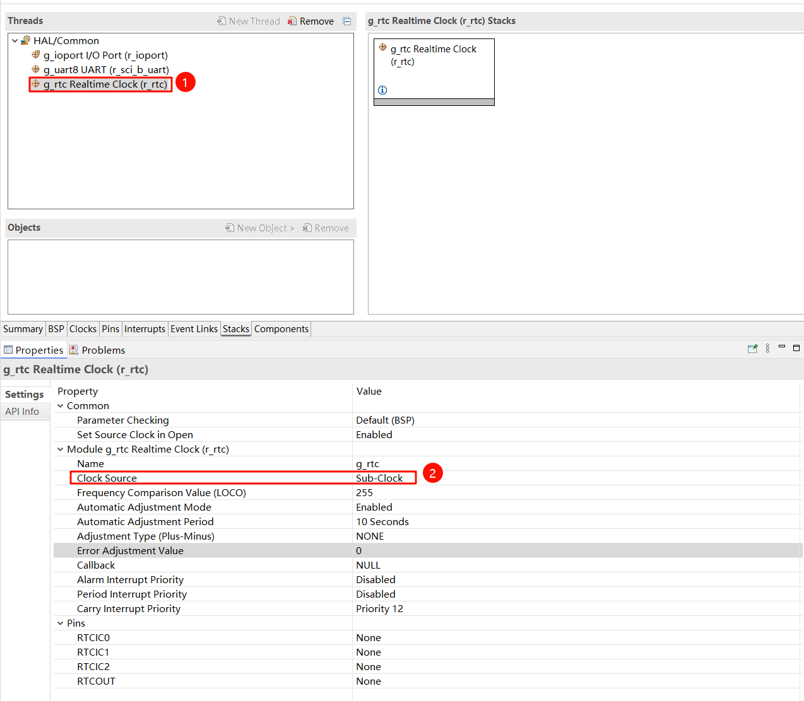
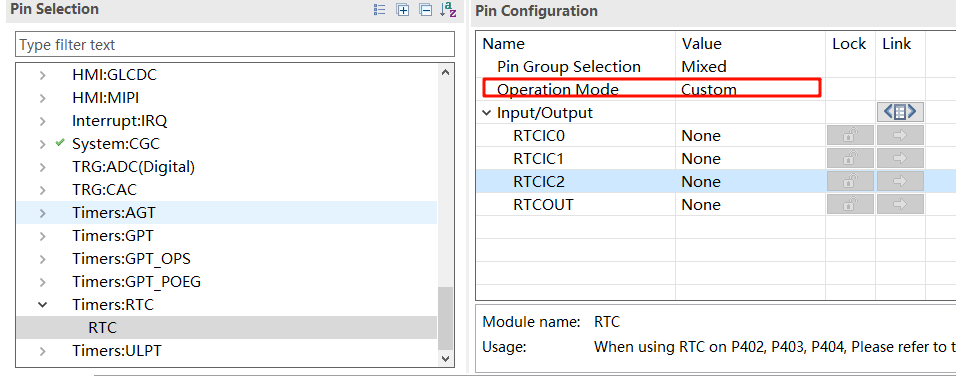

# RTC 及 alarm 使用例程说明

**中文**|[**English**](README.md)

## 简介

本例程主要介绍了如何在 Titan Board 上使用 **RA8 系列 MCU 的 RTC 模块**，结合 **RT-Thread RTC 驱动框架**，实现基本的实时时钟功能及闹钟功能。RTC 可以提供精确的实时时间，它可以用于产生年、月、日、时、分、秒等信息。目前实时时钟芯片大多采用精度较高的晶体振荡器作为时钟源。有些时钟芯片为了在主电源掉电时还可以工作，会外加电池供电，使时间信息一直保持有效。

RT-Thread 的 RTC 设备为操作系统的时间系统提供了基础服务。面对越来越多的 IoT 场景，RTC 已经成为产品的标配，甚至在诸如 SSL 的安全传输过程中，RTC 已经成为不可或缺的部分。

## RTC（实时时钟）简介

### 1. 概述

**RTC（Real-Time Clock）** 是一种用于 **计量和跟踪实际时间（年、月、日、时、分、秒）** 的电子模块或芯片。它通常内置在 **微控制器（MCU）** 或作为独立芯片存在，用于提供 **系统时间**、**定时唤醒**、**定时事件触发** 等功能。

RTC 的核心特点是 **低功耗、长时间稳定运行**，即使系统主电源断电，也可通过备用电源（如电池或超级电容）继续计时。

### 2. 工作原理

RTC 基本上是一个 **低功耗振荡器 + 计数器** 系统：

1. **时钟源**
   - RTC 通常使用 **32.768 kHz 石英晶振**（1 Hz = 2^15 周期）
   - 提供稳定时基
2. **分频计数**
   - 将晶振信号分频得到 1 Hz 的秒脉冲
   - 累计计数生成分钟、小时、天、月、年
3. **寄存器存储**
   - RTC 内部寄存器保存当前时间、日期、闹钟设置等
4. **电源冗余**
   - 内部电池或超级电容供电，使 RTC 在主电源断电时继续运行

### 3. RTC 类型

1. **内部 RTC**
   - 集成在 MCU 内部
   - 优点：节省芯片数量，成本低
   - 缺点：晶振精度受 PCB 布线、温度影响
2. **外部 RTC 芯片**
   - 独立芯片，如 DS3231、PCF8563
   - 优点：高精度、可用 I²C/SPI 接口连接 MCU
   - 缺点：增加 PCB 封装面积和成本

### 4. 关键参数

| 参数       | 描述                                   |
| ---------- | -------------------------------------- |
| 振荡器频率 | 通常 32.768 kHz，低功耗稳定            |
| 时间精度   | ppm / 秒/天，决定时钟漂移              |
| 电源电压   | 1.8~5V，支持备用电源                   |
| 功耗       | 1~5 µA（低功耗模式）                   |
| 接口类型   | I²C、SPI 或 MCU 内部总线               |
| 功能扩展   | 闹钟输出、方波输出、温度补偿、定时唤醒 |

### 5. RTC 功能

1. **实时时钟**
   - 提供当前时间和日期
2. **闹钟功能（Alarm）**
   - 可设置指定时间触发中断或唤醒 MCU
3. **定时唤醒（Wake-up Timer）**
   - MCU 进入低功耗模式时，可由 RTC 定时唤醒
4. **温度补偿**（部分高精度芯片，如 DS3231）
   - 自动校正晶振频率，减少漂移
5. **方波输出（Square Wave Output）**
   - 提供固定频率脉冲，用于驱动 MCU 定时器或其他模块

### 6. RTC 应用场景

- **嵌入式设备**
  - MCU 实时时间追踪，事件记录
- **低功耗物联网设备**
  - RTC 唤醒 MCU 进行周期性数据采集
- **手表与智能穿戴设备**
  - 提供精准计时功能
- **数据记录仪与工业控制**
  - 时间戳、日志记录
- **汽车电子**
  - 行车记录仪、车载娱乐系统计时

## RA8 系列 RTC 模块概述

RA8 系列 MCU 内置高度灵活的 **实时时钟（RTC）** 外设，适用于低功耗、高精度的嵌入式时间管理应用。

### 1. 总体特性

- **时间管理**：支持秒、分、时、日、月、年及星期。
- **时钟源**：
  - **外部低速晶振（通常为 32.768 kHz）**，高精度。
  - **内部低速 RC 振荡器**，低功耗，精度稍低。
- **闹钟功能**：支持单次和重复闹钟，可生成中断。
- **定时器**：子秒定时器、周期性唤醒定时器。
- **防篡改检测（可选）**：可在配置的引脚检测外部篡改事件。
- **低功耗操作**：RTC 可在待机或睡眠模式下运行，确保 MCU 断电时仍保持时间。

### 2. RTC 模块架构

RA8 RTC 模块包含以下功能模块：

1. **时间计数器（Calendar Counter）**
   - 维护当前时间和日期。
   - 支持 24 小时或 12 小时制。
   - 自动处理闰年调整。
2. **闹钟与比较单元**
   - 将当前时间与预设闹钟值比较。
   - 匹配时生成中断。
   - 支持重复闹钟（每日、每小时等）。
3. **时钟源与分频器**
   - 将外部 32.768 kHz 或内部 RC 振荡器分频生成 1 Hz 时基。
   - 可选择时钟精度与功耗的平衡。
4. **中断控制器**
   - 支持闹钟中断、周期中断、溢出中断。
   - 可配置中断屏蔽、使能及状态标志。
5. **防篡改及备份寄存器（可选）**
   - 非易失性备份寄存器，可存储断电保留数据。
   - 防篡改引脚可触发中断，实现安全应用。

### 3. 关键特性

| 特性               | 描述                                     |
| ------------------ | ---------------------------------------- |
| 时间分辨率         | 秒级，可选子秒计数                       |
| 时间范围           | 年、月、日、时、分、秒                   |
| 闹钟               | 可配置闹钟并触发中断                     |
| 时钟源             | 外部 32.768 kHz 晶振，内部低速 RC 振荡器 |
| 功耗               | 超低功耗，支持待机/睡眠模式              |
| 中断               | 闹钟、周期性、溢出                       |
| 备份寄存器         | 非易失性寄存器，可在断电期间保存数据     |
| 防篡改检测（可选） | 外部引脚事件可触发中断                   |

### 4. 工作原理

1. **选择时钟源**：外部晶振或内部 RC 振荡器。
2. **设置时间**：将初始时间和日期写入日历计数器。
3. **设置闹钟**：配置闹钟时间并使能闹钟中断。
4. **中断处理**：MCU 可通过 RTC 中断标志响应闹钟或周期性事件。
5. **电源管理**：RTC 在低功耗模式下继续计时，确保时间准确。

## RT-Thread RTC 驱动框架

RT-Thread 提供统一的 **RTC 驱动框架**，抽象底层硬件接口，提供标准化 API 以支持时间管理和闹钟功能。

### 1. 主要接口

| 函数 / 宏                                 | 功能                                |
| ----------------------------------------- | ----------------------------------- |
| `rt_device_find("rtc")`                   | 获取 RTC 设备句柄                   |
| `rt_device_open(dev, flags)`              | 打开 RTC 设备并初始化硬件           |
| `rt_device_control(dev, cmd, args)`       | 配置 RTC：设置/获取时间，设置闹钟等 |
| `rt_device_read(dev, pos, buffer, size)`  | 读取当前时间或闹钟状态              |
| `rt_device_write(dev, pos, buffer, size)` | 写入时间或闹钟值                    |
| `rt_device_close(dev)`                    | 关闭 RTC 设备                       |

------

### 2. `rt_device_control` 常用命令

| 命令                           | 描述                       |
| ------------------------------ | -------------------------- |
| `RT_DEVICE_CTRL_RTC_SET_TIME`  | 设置当前 RTC 时间          |
| `RT_DEVICE_CTRL_RTC_GET_TIME`  | 获取当前 RTC 时间          |
| `RT_DEVICE_CTRL_RTC_SET_ALARM` | 设置闹钟时间并使能闹钟中断 |
| `RT_DEVICE_CTRL_RTC_GET_ALARM` | 获取已配置的闹钟时间       |
| `RT_DEVICE_CTRL_RTC_ENABLE`    | 使能 RTC                   |
| `RT_DEVICE_CTRL_RTC_DISABLE`   | 禁用 RTC                   |

------

### 3. 闹钟处理

- 通过 `RT_DEVICE_CTRL_RTC_SET_ALARM` 配置闹钟。
- 使能中断，当闹钟触发时 MCU 收到通知。
- 中断服务例程可更新标志、触发事件或唤醒低功耗 MCU。

## 硬件说明

本例程使用的RTC 设备依赖于LOCO 时钟，此外无需过多连接。

## FSP 配置

* 打开 FSP，选择对应的工程文件下的 configuration.xml，新增 RTC Stack;


* 下面进行 RTC 参数的配置，设置 rtc stack name 为 g_rtc，设置 RTC 中断回调函数为 rtc_callback，并配置中断回调优先级；


## RT-Thread Settings 配置

* 打开 RT-Thread Settings，找到硬件选项，使能 RTC；


* 接下来我们配置 RTC，首先需要使能 RT-Thread 的 RTC 设备框架，同时使能 alarm 功能；


##  示例代码说明

本例程的源码位于`/src/hal_entry.c`。

```c
    rt_err_t ret = RT_EOK;
    time_t now;
    rt_device_t device = RT_NULL;

    device = rt_device_find(RTC_NAME);
    if (!device)
    {
      rt_kprintf("find %s failed!\n", RTC_NAME);
    }

    if(rt_device_open(device, 0) != RT_EOK)
    {
      rt_kprintf("open %s failed!\n", RTC_NAME);
    }

    /* 设置日期 */
    ret = set_date(2025, 8, 1);
    rt_kprintf("set RTC date to 2025-8-1\n");
    if (ret != RT_EOK)
    {
        rt_kprintf("set RTC date failed\n");
    }

    /* 设置时间 */
    ret = set_time(15, 00, 00);
    if (ret != RT_EOK)
    {
        rt_kprintf("set RTC time failed\n");
    }

    /* 延时3秒 */
    rt_thread_mdelay(3000);

    /* 获取时间 */
    get_timestamp(&now);
    rt_kprintf("now: %.*s", 25, ctime(&now));
```

下面代码可创建一个 RTC 闹钟，然后设置 1 秒后唤醒，最后把该函数导入 msh 命令行中。

```c
void user_alarm_callback(rt_alarm_t alarm, time_t timestamp)
{
    LOG_I("user alarm callback function.");
}

void alarm_sample(void)
{
    rt_device_t dev = rt_device_find("rtc");
    struct rt_alarm_setup setup;
    struct rt_alarm * alarm = RT_NULL;
    static time_t now;
    struct tm p_tm;

    if (alarm != RT_NULL)
        return;

    /* 获取当前时间戳，并把下一秒时间设置为闹钟时间 */
    now = get_timestamp(NULL) + 1;
    gmtime_r(&now,&p_tm);

    setup.flag = RT_ALARM_SECOND;
    setup.wktime.tm_year = p_tm.tm_year;
    setup.wktime.tm_mon = p_tm.tm_mon;
    setup.wktime.tm_mday = p_tm.tm_mday;
    setup.wktime.tm_wday = p_tm.tm_wday;
    setup.wktime.tm_hour = p_tm.tm_hour;
    setup.wktime.tm_min = p_tm.tm_min;
    setup.wktime.tm_sec = p_tm.tm_sec;

    alarm = rt_alarm_create(user_alarm_callback, &setup);
    if(RT_NULL != alarm)
    {
        rt_alarm_start(alarm);
    }
}
/* export msh cmd */
MSH_CMD_EXPORT(alarm_sample,alarm sample);
```

## 编译&下载

* RT-Thread Studio：在 RT-Thread Studio 的包管理器中下载 Titan Board 资源包，然后创建新工程，执行编译。

编译完成后，将开发板的 USB-DBG 接口与 PC 机连接，然后将固件下载至开发板。

## 运行效果

按下复位按键重启开发板，输入 `alarm_sample` 命令运行闹钟示例，可以看到板子上会打印如下信息：


## 拓展：RTC 掉电运行

当板卡主电源断开后，如需让 RTC 掉电继续运行，需要通过 VBAT 引脚接上外部供电，需要注意的是，当 VBAT 给 RTC 供电时，只会继续 Calendar 计数器的计时，其他 RTC 的功能无法使用，下面是一个参考代码：

**ps:** rtc 如果打算掉电运行，那么应该确保 rtc_init 只初始化一次，后续可通过 rtc_get 获取时间

```c
#define RTC_YEAR_SET 2025
#define RTC_MON_SET  8
#define RTC_MDAY_SET 5

#define RTC_WDAY_SET (RTC_YEAR_SET-2000 \
                  + ((RTC_YEAR_SET-2000)/4) \
                  - 35 + (26*(RTC_MON_SET+1))/10 \
                  + RTC_MDAY_SET -1 )%7

#define RTC_HOUR_SET 12
#define RTC_SEC_SET 0
#define RTC_MIN_SET 0

void rtc_get()
{
    rtc_time_t get_time;
    R_RTC_CalendarTimeGet(g_rtc.p_ctrl, &get_time);
    rt_kprintf ("%d-%d-%d-%d:%d:%d\r\n", get_time.tm_year + 1900, get_time.tm_mon + 1, get_time.tm_mday,
             get_time.tm_hour, get_time.tm_min, get_time.tm_sec);
}
MSH_CMD_EXPORT(rtc_get, rtc_get);

void rtc_init(void)
{
   rtc_time_t set_time =
   {
     .tm_min = RTC_MIN_SET,
     .tm_hour = RTC_HOUR_SET,
     .tm_mday = RTC_MDAY_SET,
     .tm_wday = RTC_WDAY_SET,
     .tm_mon = RTC_MON_SET - 1,
     .tm_year = RTC_YEAR_SET-1900,
   };

   R_RTC_Open (g_rtc.p_ctrl, g_rtc.p_cfg);

   R_RTC_CalendarTimeSet (g_rtc.p_ctrl, &set_time);
}
MSH_CMD_EXPORT(rtc_init, rtc_init);
```

FSP配置：




