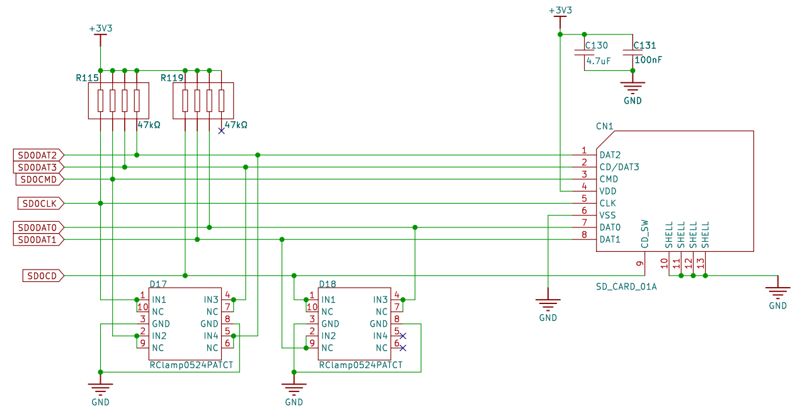
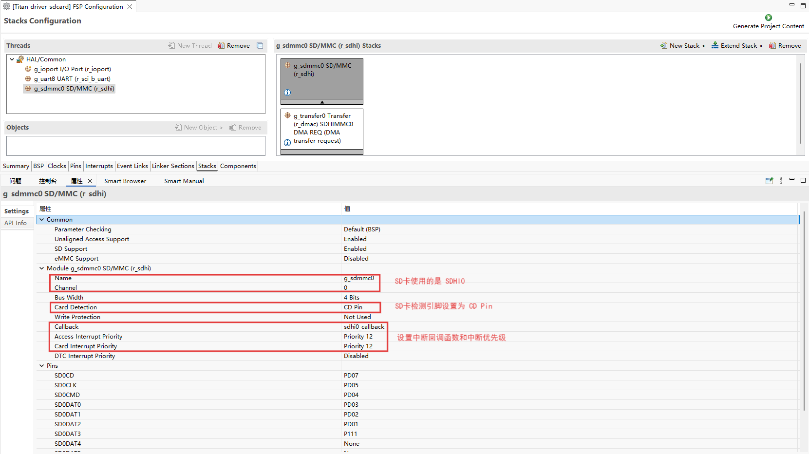
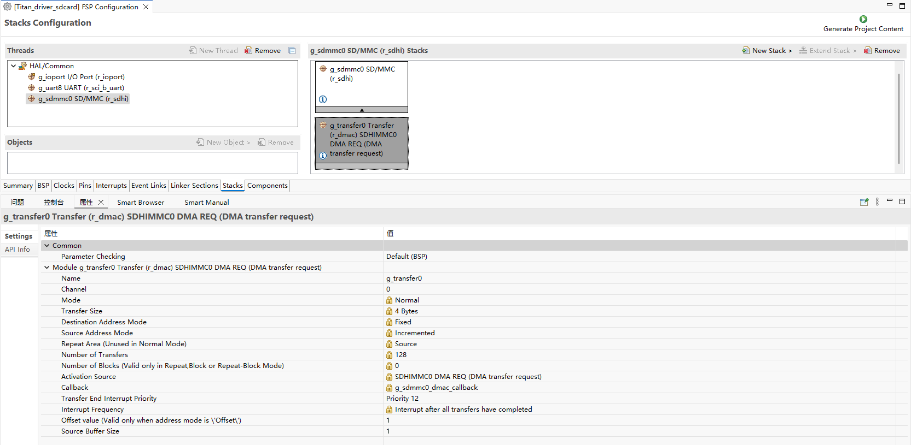
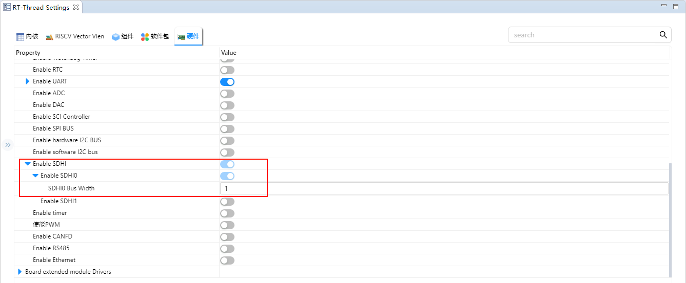
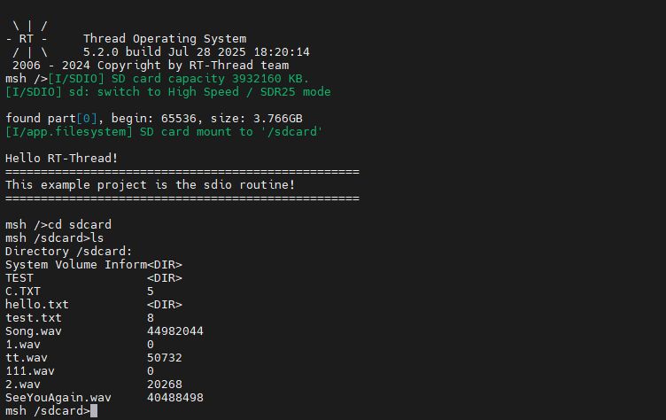

# SD Card File System Usage Instructions

**English**|[**Chinese**](README_zh.md)

## Introduction

This routine uses the SD card in the SD card slot on the development board as the storage device for the file system, shows how to create a file system (format card) on the SD card, and mount the file system into the RT-Thread operating system.

Once the filesystem is mounted, it shows how to use the functionality provided by the filesystem to manipulate directories and files.

### SD Card Introduction

#### 1. Overview

**SD Card (Secure Digital Card)** is a small, portable, non-volatile storage device widely used in **embedded systems, cameras, mobile phones, and data loggers**.

An SD card is composed of a **controller + NAND Flash memory chip** and communicates with the host through a standard interface.

Key features:

- Compact and lightweight, typically **32 × 24 × 2.1 mm** (standard card)
- Stores data using **non-volatile NAND Flash**
- Supports hot-plugging and power-off protection

#### 2. SD Card Types

1. **By size**
   - **Standard SD**: 32 × 24 mm
   - **Mini SD**: 21.5 × 20 mm
   - **Micro SD (TF Card)**: 15 × 11 mm, most commonly used
2. **By capacity**

| Type | Capacity Range |
| ---- | -------------- |
| SDSC | 1 MB ~ 2 GB    |
| SDHC | 4 GB ~ 32 GB   |
| SDXC | 32 GB ~ 2 TB   |
| SDUC | 2 TB ~ 128 TB  |

1. **By speed class**
   - **Class 2/4/6/10**: Minimum write speed of 2, 4, 6, 10 MB/s
   - **UHS (Ultra High Speed)**: UHS-I/UHS-II/UHS-III, up to **312 MB/s**
   - **Video Speed Class (V6/V10/V30/V60/V90)**: Designed for HD/4K video recording

#### 3. SD Card Interfaces

1. **SPI Mode**
   - Uses SPI bus (MISO, MOSI, SCK, CS)
   - Simple and MCU-friendly
   - Lower data transfer rate
2. **SD Mode (1-bit / 4-bit)**
   - Uses dedicated SD bus
   - Supports 1-bit or 4-bit data lines
   - Faster than SPI mode
3. **UHS Mode**
   - Supports high-speed data transfer
   - Commonly used in cameras and high-performance embedded applications

#### 4. Working Principle

1. **Command/Data Transfer**
   - Host sends commands (CMD) via SD protocol
   - Card returns responses (R1, R2, etc.)
   - Data read/write in **blocks of 512 bytes**
2. **Controller Management**
   - Internal controller handles **bad block management, ECC, logical-to-physical mapping**
   - Host does not directly manage NAND Flash
3. **Data Storage**
   - Data is stored in NAND Flash
   - Supports multiple erasures with endurance (typically 100k cycles)

#### 5. SD Card Performance

| Parameter         | Description                            |
| ----------------- | -------------------------------------- |
| Capacity          | 1 GB ~ 128 TB                          |
| Block Size        | 512 Bytes (standard)                   |
| Interface Speed   | SPI / SD 1-bit/4-bit / UHS             |
| Max Speed         | 25 MB/s (standard), 312 MB/s (UHS-III) |
| Operating Voltage | 3.3 V (some Micro SD support 1.8 V)    |
| Temp Range        | -25 ℃ ~ 85 ℃ (industrial grade)        |
| Endurance         | 10^4 ~ 10^5 erase cycles               |

#### 6. SD Card Applications

1. **Consumer Electronics**
   - Phones, tablets, cameras, camcorders
2. **Embedded Systems**
   - MCU/FPGA data storage
   - Logging, config file storage
3. **Industrial Applications**
   - Controllers, data acquisition systems
   - Industrial-grade SD cards for harsh environments
4. **Audio/Video**
   - High-speed video recording (UHS/V Class)
5. **Automotive**
   - Dashcams, navigation systems

### RA8 Series SDHI Module Overview

The RA8 series MCU integrates a high-performance **SDHI module** designed for high-speed communication with SD/SDHC/SDXC cards. It supports both **SPI mode** and **SD/SDIO mode**.

#### 1. Key Features

- **SD Standards Support**
  - SD v1.x / v2.x / SDHC / SDXC
  - SPI mode & SD/MMC mode
- **High-Speed Data Transfer**
  - Up to 50 MHz SDCLK (depending on MCU clock)
  - 1-bit/4-bit data bus support
- **Auto Command & Data Transfer**
  - DMA support to reduce CPU load
  - Auto command sequence generation (CMD0–CMD59)
- **Error Detection**
  - CRC7 for commands, CRC16 for data
  - Timeout & response error detection
- **Interrupt Support**
  - Card insert/remove interrupt
  - Command complete interrupt
  - Data transfer complete interrupt
  - Error interrupt

#### 2. SDHI Module Architecture

1. **Command Control Unit**
   - Sends SD commands (CMD0–CMD59)
   - Handles responses (R1, R2, R3, R7)
   - Supports timeout detection and CRC check
2. **Data Transfer Unit**
   - Transfers data via FIFO or DMA
   - Block size up to 512 bytes
   - Supports single/multi-block transfer
3. **Clock & Bus Control**
   - Generates/divides SDCLK
   - Switches between 1-bit/4-bit modes
   - Configurable signal timings
4. **Card Detect & Power Control**
   - Detects card insertion/removal
   - Can control card power if supported
5. **Interrupt/Event Controller**
   - Command complete interrupt
   - Data transfer complete interrupt
   - Error interrupt
   - Card detect interrupt

#### 3. SDHI Working Principle

1. **Initialization**
   - Detect card insertion
   - Send CMD0, CMD8 for initialization
   - Query card capacity & version
2. **Command Transmission**
   - Host sends commands
   - Card responds with CRC check & triggers interrupt
3. **Data Transfer**
   - Reads/writes via FIFO or DMA
   - Supports single/multi-block operations
4. **Error Handling**
   - Timeout, CRC, and response errors
   - SDHI triggers error interrupt, driver retries or recovers

## Hardware Description

This example is connected to the memory through the SDIO interface, using the SD0 of the hardware, the schematic diagram is as follows:



## FSP Configuration

* Create stacks select r_sdhi and configure sdhi0 configuration information as follows:





## RT-Thread Settings Configuration

* Enable the SD card file system in the configuration.


* Enable SDHI0 and set the Bus Width of SDHI0 to 1.



## Example Project Description

This routine file system initialization source in  `./board/ports/drv_filesystem.c` ：

```c
#include <rtthread.h>

#if defined(BSP_USING_FILESYSTEM)
#include <dfs_romfs.h>
#include <dfs_fs.h>
#include <dfs_file.h>

#if DFS_FILESYSTEMS_MAX < 4
#error "Please define DFS_FILESYSTEMS_MAX more than 4"
#endif
#if DFS_FILESYSTEM_TYPES_MAX < 4
#error "Please define DFS_FILESYSTEM_TYPES_MAX more than 4"
#endif

#define DBG_TAG "app.filesystem"
#define DBG_LVL DBG_INFO
#include <rtdbg.h>

#ifdef BSP_USING_FS_AUTO_MOUNT
#ifdef BSP_USING_SDCARD_FATFS
static int onboard_sdcard_mount(void)
{
    if (dfs_mount("sd", "/sdcard", "elm", 0, 0) == RT_EOK)
    {
        LOG_I("SD card mount to '/sdcard'");
    }
    else
    {
        LOG_E("SD card mount to '/sdcard' failed!");
        rt_pin_write(0x000D, PIN_LOW);
    }

    return RT_EOK;
}
#endif /* BSP_USING_SDCARD_FATFS */
#endif /* BSP_USING_FS_AUTO_MOUNT */

#ifdef BSP_USING_FLASH_FS_AUTO_MOUNT
#ifdef BSP_USING_FLASH_FATFS
#define FS_PARTITION_NAME "filesystem"

static int onboard_fal_mount(void)
{
    /* 初始化 fal 功能 */
    extern int fal_init(void);
    extern struct rt_device* fal_mtd_nor_device_create(const char *parition_name);
    fal_init ();
    /* 在 ospi flash 中名为 "filesystem" 的分区上创建一个块设备 */
    struct rt_device *mtd_dev = fal_mtd_nor_device_create (FS_PARTITION_NAME);
    if (mtd_dev == NULL)
    {
        LOG_E("Can't create a mtd device on '%s' partition.", FS_PARTITION_NAME);
        return -RT_ERROR;
    }
    else
    {
        LOG_D("Create a mtd device on the %s partition of flash successful.", FS_PARTITION_NAME);
    }

    /* 挂载 ospi flash 中名为 "filesystem" 的分区上的文件系统 */
    if (dfs_mount (FS_PARTITION_NAME, "/fal", "lfs", 0, 0) == 0)
    {
        LOG_I("Filesystem initialized!");
    }
    else
    {
        dfs_mkfs ("lfs", FS_PARTITION_NAME);
        if (dfs_mount ("filesystem", "/fal", "lfs", 0, 0) == 0)
        {
            LOG_I("Filesystem initialized!");
        }
        else
        {
            LOG_E("Failed to initialize filesystem!");
            rt_pin_write(0x000D, PIN_LOW);
        }
    }

    return RT_EOK;
}
#endif /*BSP_USING_FLASH_FATFS*/
#endif /*BSP_USING_FLASH_FS_AUTO_MOUNT*/

const struct romfs_dirent _romfs_root[] =
{
#ifdef BSP_USING_SDCARD_FATFS
    {ROMFS_DIRENT_DIR, "sdcard", RT_NULL, 0},
#endif

#ifdef BSP_USING_FLASH_FATFS
  { ROMFS_DIRENT_DIR, "fal", RT_NULL, 0 },
#endif
        };

const struct romfs_dirent romfs_root =
{
ROMFS_DIRENT_DIR, "/", (rt_uint8_t*) _romfs_root, sizeof(_romfs_root) / sizeof(_romfs_root[0])
};

static int filesystem_mount(void)
{

#ifdef RT_USING_DFS_ROMFS
    if (dfs_mount(RT_NULL, "/", "rom", 0, &(romfs_root)) != 0)
    {
        LOG_E("rom mount to '/' failed!");
    }

    /* 确保块设备注册成功之后再挂载文件系统 */
    rt_thread_delay(500);
#endif
#ifdef BSP_USING_FS_AUTO_MOUNT
    onboard_sdcard_mount();
#endif /* BSP_USING_FS_AUTO_MOUNT */

#ifdef BSP_USING_FLASH_FS_AUTO_MOUNT
    onboard_fal_mount ();
#endif

    return RT_EOK;
}
INIT_COMPONENT_EXPORT(filesystem_mount);
#endif /* defined(BSP_USING_FILESYSTEM)*/
```

## Compilation & Download

* **RT-Thread Studio**: In RT-Thread Studio’s package manager, download the Titan Board resource package, create a new project, and compile it.

After compilation, connect the development board’s USB-DBG interface to the PC and download the firmware to the development board.

## Run Effect

Press the reset button to restart the development board, wait for the SD to mount, and enter the file system directory of the SD card to view the files on the SD card.

