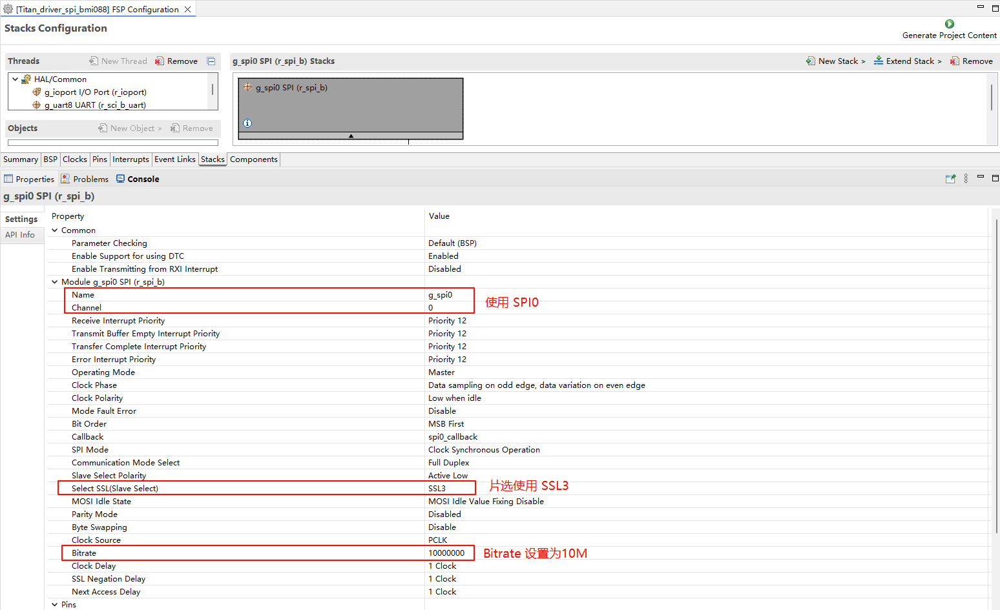
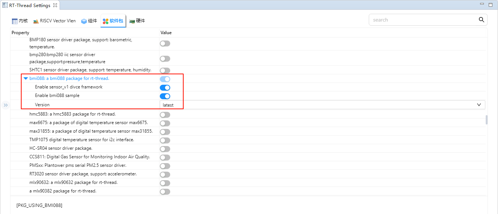
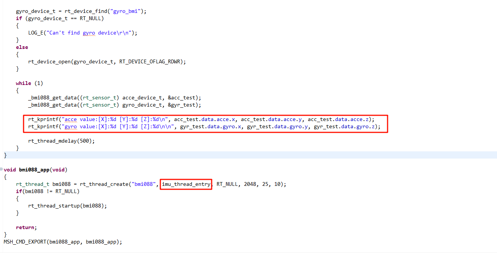
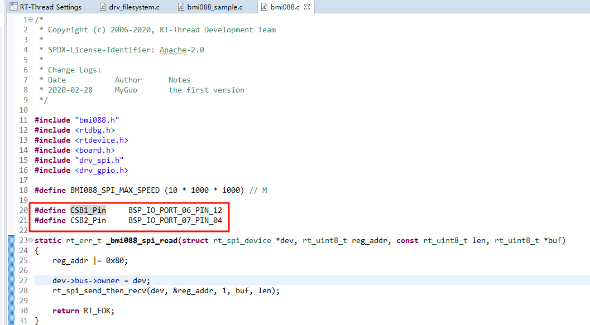

# BMI088 Gyroscope Usage Instructions

**English** | [**Chinese**](./README_zh.md)

## Introduction

This example demonstrates how to use the **SPI module of the RA8 series MCU** on the **Titan Board**, in combination with the **RT-Thread SPI driver framework** and the **BMI088 software package (a 6-axis IMU: 3-axis accelerometer + 3-axis gyroscope)**, to perform sensor initialization and data acquisition.

## Overview of BMI088

### 1. General Description

The **BMI088** is a **high-performance 6-axis IMU (Inertial Measurement Unit)** developed by Bosch Sensortec, integrating a **3-axis accelerometer** and a **3-axis gyroscope**.

It is designed for **drones, robotics, industrial automation, and navigation systems**, where high stability and low noise are required.

The BMI088 is well known for its **high vibration robustness** and **low noise performance**. Compared with common consumer-grade IMUs (such as MPU6050, BMI160, etc.), it is more widely used in industrial and UAV applications.

### 2. Key Features

#### (1) Accelerometer

- Measurement range: ±3 g / ±6 g / ±12 g / ±24 g
- Noise density: **approx. 120 µg/√Hz**
- Sampling rate: up to **1.6 kHz**
- Offset: factory calibrated
- Features: high stability, low noise, wide dynamic range

#### (2) Gyroscope

- Measurement range: ±125 °/s, ±250 °/s, ±500 °/s, ±1000 °/s, ±2000 °/s
- Noise density: **approx. 0.014 °/s/√Hz**
- Sampling rate: up to **2 kHz**
- Built-in **vibration suppression design** to reduce the impact of high-frequency vibration
- Excellent bias stability, suitable for long-term operation

#### (3) Interface & Power Supply

- **Communication interface**: SPI (up to 10 MHz), I²C (up to 400 kHz)
- Operating voltage: 1.71V ~ 3.6V
- Package: 3 mm × 4.5 mm × 0.95 mm (LGA-16)

### 3. Working Principle

- **Accelerometer**: Detects acceleration in three axes using MEMS structures and outputs corresponding digital signals.
- **Gyroscope**: Measures angular velocity based on the Coriolis effect, providing three-axis rotational motion data.
- **Sensor Fusion**: Combining accelerometer and gyroscope data allows for attitude estimation (Pitch, Roll, Yaw).

### 4. Main Advantages

1. **High vibration robustness**
   - The gyroscope features a special anti-vibration structure, making it suitable for drones and other high-vibration environments.
2. **Low-noise performance**
   - Both accelerometer and gyroscope deliver low-noise output, ensuring accurate attitude estimation.
3. **Industrial-grade reliability**
   - More stable and less temperature drift compared to consumer-grade IMUs (e.g., BMI160, MPU6050).
4. **High bandwidth**
   - The gyroscope bandwidth can reach up to 2 kHz, making it ideal for high-speed control scenarios.

### 5. Application Scenarios

- **Drones**: flight attitude detection, navigation, and stabilization
- **Robotics**: motion control, SLAM, and balance control
- **Industrial measurement**: platform stabilization, robotic arm motion detection
- **Automotive systems**: inertial navigation, assisted positioning
- **Motion tracking**: VR/AR, wearable devices

## RA8 Series SPI Module (r_spi_b) Instructions

The RA8 series MCU integrates an **enhanced SPI module (r_spi_b)**, which can be used for high-speed serial communication with peripherals such as Flash memory, sensors, displays, and audio codecs. This module supports both master and slave modes, provides full-duplex communication, and integrates rich buffering, clock control, and DMA mechanisms at the hardware level, effectively reducing CPU workload.

### 1. Key Features

- **Operating Modes**
  - Supports **Master mode** and **Slave mode**
  - Supports **Full-duplex communication** (simultaneous transmit and receive)
  - Supports **Half-duplex mode** for unidirectional communication devices
- **Clock Features**
  - Supports serial clock (SPCLK) up to **166 MHz** (depending on system clock and device specifications)
  - Configurable **polarity (CPOL)** and **phase (CPHA)**, supporting standard **SPI Modes 0/1/2/3**
- **Data Format**
  - Supports 8-bit, 16-bit, and 32-bit frame formats
  - Supports **MSB-first** and **LSB-first** transmission
- **Chip Select Management**
  - Supports **hardware chip select (SSL0~SSL3)**
  - Also supports **software-controlled GPIO chip select**
- **Buffering & DMA**
  - Built-in **FIFO buffers** to reduce interrupt frequency
  - Supports **DTC/DMA** automatic transfer, ideal for large data transactions
- **Interrupts & Events**
  - Transmit complete interrupt
  - Receive complete interrupt
  - Transfer error interrupt (e.g., overflow, underrun)

### 2. SPI Module Architecture

The RA8 series SPI (r_spi_b) consists of the following submodules:

1. **Clock Control Unit**
   - Generates the serial clock (SPCLK)
   - Configurable prescalers for adjusting communication speed
   - Provides polarity (CPOL) and phase (CPHA) settings
2. **Transfer Control Unit**
   - Controls data frame length (8/16/32-bit)
   - Configures data order (MSB/LSB)
   - Manages transmit/receive direction
3. **FIFO Buffers**
   - Transmit FIFO
   - Receive FIFO
   - Reduce interrupt frequency, improve performance
4. **Chip Select Control Unit**
   - Provides up to 4 independent chip select signals (SSL0~SSL3)
   - Automatic assertion/deassertion of chip select
   - Supports multiple slave devices
5. **DMA/DTC Support**
   - SPI module can directly cooperate with DMA/DTC
   - Enables **CPU-free streaming data transfer**
   - Especially useful for sensor data acquisition, external memory access, etc.
6. **Interrupt Control**
   - Transmit interrupt (TXI)
   - Receive interrupt (RXI)
   - Transfer end interrupt (TEI)
   - Error interrupt (ERI)

### 3. Working Principle

1. **Master Mode Communication**
   - Configure SPCLK, CPOL, and CPHA
   - Configure chip select signal (SSLx)
   - Write data into transmit FIFO
   - SPI hardware automatically shifts out data while receiving incoming data
2. **Slave Mode Communication**
   - Wait for chip select signal from master
   - Receive data from master while optionally transmitting response data
   - Supports DMA for writing received data into memory
3. **FIFO & DMA Coordination**
   - Short transfers: handled via interrupts
   - Large data transfers: automatically handled via DMA/DTC, CPU only needs to configure initial parameters

## Hardware Description

The Titan Board uses SPI0 to communicate with the BMI088 gyroscope.


## FSP Configuration

* Open the FSP tool, create a new stack, and select `r_spi_b`:



* Configure SPI0 pins:


## RT-Thread Settings Configuration

* Enable bmi088:


* Enable sensor_v1 and sample in the bmi088 package configuration:



## Software Description

Using the BMI088 package on the Titan Board requires the following modifications for adaptation:

* Modify `./packages/bmi088-latest/sample/bmi088_sample.c`:

​	Modify the SPI BUS to spi0, and modify the chip selection pin:


​	Add imu data printing and create a data ingest thread:



* Modify `./packages/bmi088-latest/src/bmi088.c`

​	Modify the CS pin adaptation Renesas development board:




The bmi088 driver sample is located at  `./packages/bmi088-latest/samples/bmi088_sample`：

```c
/*
 * Copyright (c) 2006-2020, RT-Thread Development Team
 *
 * SPDX-License-Identifier: Apache-2.0
 *
 * Change Logs:
 * Date           Author      Notes
 * 2020-03-10     MyGuo       the first version
 */
 
#include <rtthread.h>
#include <rtdbg.h> 
#include "bmi088.h"
#include "sensor_intf_bmi088.h"
#include "drv_spi.h"
#include "bmi088_sample.h"

#define BMI088_BUS_NAME "spi0"
#define BMI088A_SPI_NAME "spi00"
#define BMI088G_SPI_NAME "spi01"

static rt_device_t acce_device_t;
static rt_device_t gyro_device_t;
struct rt_sensor_data acc_test;
struct rt_sensor_data gyr_test;

void imu_thread_entry(void* parameter)
{
    // Configure spi, configure chip selection pin (before acc, gyr initialization, because device initialization involves pin operation)
    rt_hw_spi_device_attach(BMI088_BUS_NAME, BMI088A_SPI_NAME, BSP_IO_PORT_06_PIN_12);
    rt_hw_spi_device_attach(BMI088_BUS_NAME, BMI088G_SPI_NAME, BSP_IO_PORT_07_PIN_04);

    // Registering sensors
    struct rt_sensor_config acc_cfg = {0};
    struct rt_sensor_config gyr_cfg = {0};
    
    acc_cfg.intf.dev_name = BMI088A_SPI_NAME;
    gyr_cfg.intf.dev_name = BMI088G_SPI_NAME;
    
    rt_hw_bmi088_init("bmi", &acc_cfg, &gyr_cfg);

    acce_device_t = rt_device_find("acce_bmi");
    if (acce_device_t == RT_NULL)
    {
        LOG_E("Can't find acce device\r\n");
    }
    else 
    {
        rt_device_open(acce_device_t, RT_DEVICE_OFLAG_RDWR);
    }
    
    gyro_device_t = rt_device_find("gyro_bmi");
    if (gyro_device_t == RT_NULL)
    {
        LOG_E("Can't find gyro device\r\n");
    }
    else
    {
        rt_device_open(gyro_device_t, RT_DEVICE_OFLAG_RDWR);
    }
    
    while (1)
    {
        _bmi088_get_data((rt_sensor_t) acce_device_t, &acc_test);
        _bmi088_get_data((rt_sensor_t) gyro_device_t, &gyr_test);

        rt_kprintf("acce value:[X]:%d [Y]:%d [Z]:%d\n", acc_test.data.acce.x, acc_test.data.acce.y, acc_test.data.acce.z);
        rt_kprintf("gyro value:[X]:%d [Y]:%d [Z]:%d\n\n", gyr_test.data.gyro.x, gyr_test.data.gyro.y, gyr_test.data.gyro.z);

        rt_thread_mdelay(1000);
    }
}

void bmi088_app(void)
{
    rt_thread_t bmi088 = rt_thread_create("bmi088", imu_thread_entry, RT_NULL, 2048, 25, 10);
    if(bmi088 != RT_NULL)
    {
        rt_thread_startup(bmi088);
    }

    return;
}
MSH_CMD_EXPORT(bmi088_app, bmi088_app);
```

## Compilation & Download

* **RT-Thread Studio**: In RT-Thread Studio’s package manager, download the Titan Board resource package, create a new project, and compile it.

After compilation, connect the development board’s USB-DBG interface to the PC and download the firmware to the development board.

## Run Effect

Open the serial port tool and enter the `bmi088_app` command in the terminal to obtain the gyroscope data:

