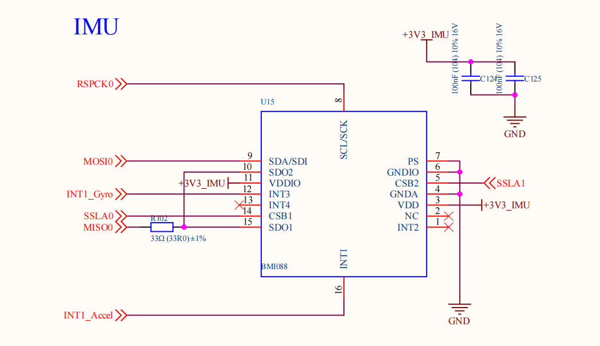
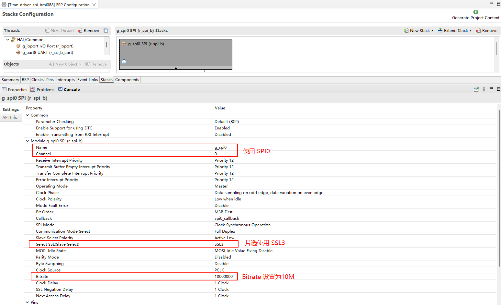
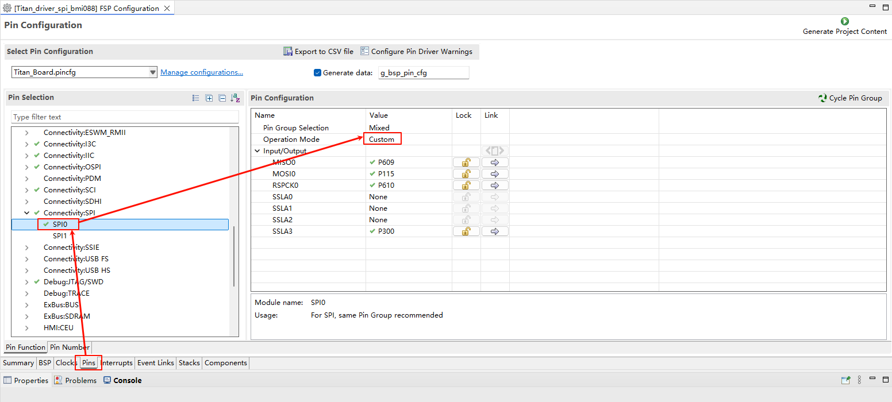
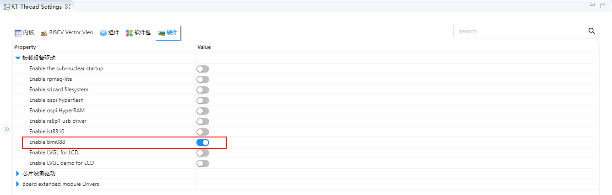
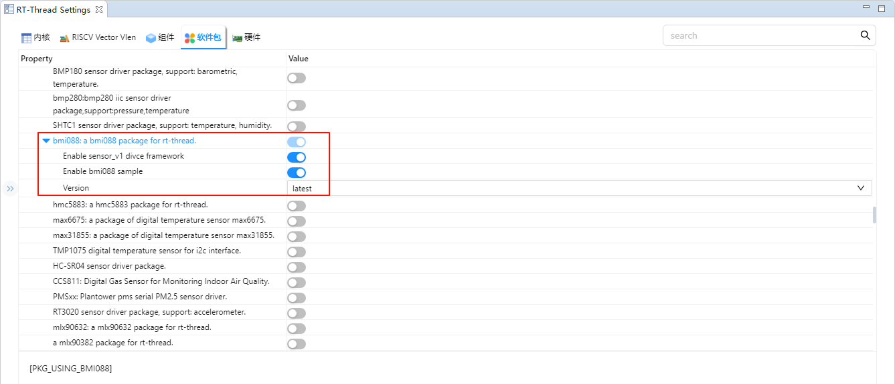
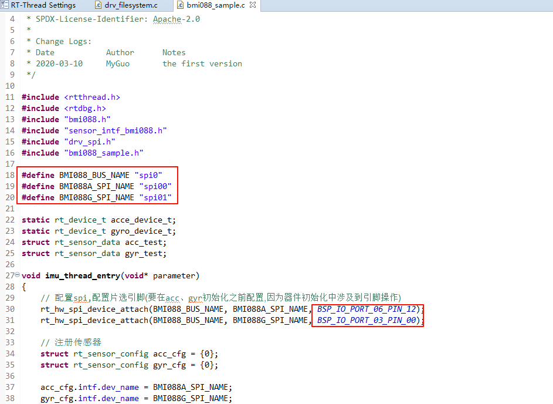
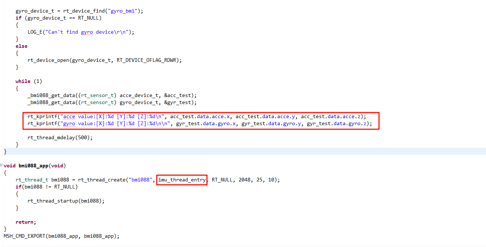
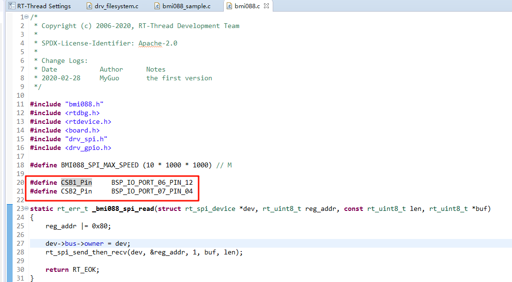
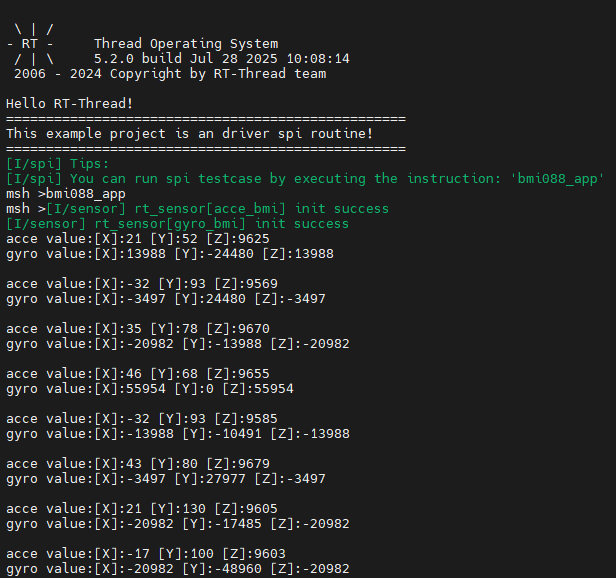

# BMI088 陀螺仪使用说明

**中文** | [**English**](./README.md)

## 简介

本示例展示了如何在 **Titan Board** 上使用 **RA8 系列 MCU 的 SPI 模块**，结合 **RT-Thread SPI 驱动框架** 与 **BMI088 软件包（六轴 IMU：三轴加速度计 + 三轴陀螺仪）** 完成传感器初始化与数据读取。

## BMI088 简介

### 1. 概述

**BMI088** 是 Bosch Sensortec 推出的 **高性能 6 轴 IMU（Inertial Measurement Unit，惯性测量单元）**，集成了 **3 轴加速度计** 和 **3 轴陀螺仪**。

它专为 **无人机、机器人、工业自动化、导航系统** 等需要高稳定性和低噪声的场景设计。

BMI088 以 **高抗振性** 和 **低噪声性能** 著称，相比常见消费级 IMU（如 MPU6050、BMI160 等），在工业和无人机领域应用更广泛。

### 2. 核心特性

#### (1) 加速度计（Accelerometer）

- 测量范围：±3 g / ±6 g / ±12 g / ±24 g
- 噪声密度：**约 120 µg/√Hz**
- 采样率：最高 **1.6 kHz**
- 零点偏移（Offset）：出厂已校准
- 特点：高稳定性、低噪声、宽动态范围

#### (2) 陀螺仪（Gyroscope）

- 测量范围：±125 °/s、±250 °/s、±500 °/s、±1000 °/s、±2000 °/s
- 噪声密度：**约 0.014 °/s/√Hz**
- 采样率：最高 **2 kHz**
- 内置 **抗震设计**，减少高频振动影响
- 零偏稳定性好，适合长期运行

#### (3) 接口与电源

- **通信接口**：SPI（最高 10 MHz）、I²C（最高 400 kHz）
- 工作电压：1.71V ~ 3.6V
- 封装：3 mm × 4.5 mm × 0.95 mm（LGA-16）

### 3. 工作原理

- **加速度计**：通过检测 MEMS 结构在三轴方向的加速度，输出对应的数字信号。
- **陀螺仪**：基于科里奥利效应测量角速度，提供三轴旋转运动信息。
- **数据融合**：结合加速度和陀螺仪数据，可实现姿态解算（Pitch、Roll、Yaw）。

### 4. 主要优势

1. **抗振动能力强**
   - 陀螺仪内部有特殊抗震结构，适合无人机等强振动环境。
2. **低噪声性能**
   - 加速度计和陀螺仪均具备低噪声输出，保证姿态解算的精度。
3. **工业级可靠性**
   - 比消费级 IMU（如 BMI160、MPU6050）更稳定，温漂小。
4. **高带宽**
   - 陀螺仪带宽最高可达 2 kHz，适合高速控制场景。


### 5. 应用场景

- **无人机**：飞行姿态检测、导航、稳定控制
- **机器人**：运动控制、SLAM、平衡控制
- **工业测量**：平台稳定、机械臂运动检测
- **车载系统**：惯性导航、辅助定位
- **运动追踪**：VR/AR、智能穿戴设备

## RA8 系列 SPI 模块（r_spi_b）概述

RA8 系列 MCU 内置 **增强型 SPI 模块（r_spi_b）**，可用于与各类外设进行高速串行通信，如 Flash、传感器、显示器、音频编解码器等。该模块支持主机模式和从机模式，提供全双工通信能力，并在硬件层面集成了丰富的缓冲、时钟和 DMA 控制机制，能够有效降低 CPU 负担。

### 1. 基本特性

- **工作模式**
  - 支持 **主机模式（Master）** 和 **从机模式（Slave）**
  - 支持 **全双工通信**（同时发送与接收）
  - 支持 **半双工模式**，适合某些单向传输的外设
- **时钟特性**
  - 支持 **高达 166 MHz** 的串行时钟（SPCLK，取决于系统时钟和芯片规格）
  - 可配置的 **极性（CPOL）** 和 **相位（CPHA）**，支持标准 **SPI Mode 0/1/2/3**
- **数据格式**
  - 支持 8 位、16 位、32 位帧格式
  - 支持 **MSB-first** 和 **LSB-first** 传输
- **片选管理**
  - 支持 **硬件片选（SSL0~SSL3）**
  - 也可使用 **GPIO 软件片选**
- **缓冲与 DMA**
  - 内部具备 **FIFO 缓冲区**，可减少中断频率
  - 支持 **DTC/DMA** 自动传输，适合大数据量通信
- **中断与事件**
  - 发送完成中断
  - 接收完成中断
  - 传输错误中断（如溢出、欠载）

### 2. SPI 模块架构

RA8 系列 SPI（r_spi_b）内部主要由以下子模块组成：

1. **时钟控制单元（Clock Control Unit）**
   - 控制串行时钟 SPCLK 的生成
   - 可选择分频因子，调整通信速率
   - 提供极性（CPOL）和相位（CPHA）配置
2. **传输控制单元（Transfer Control Unit）**
   - 控制数据帧的长度（8/16/32 bit）
   - 配置数据顺序（MSB/LSB）
   - 控制发送/接收方向
3. **FIFO 缓冲区**
   - 发送缓冲 FIFO
   - 接收缓冲 FIFO
   - 有效降低中断处理频率，提高系统性能
4. **片选控制单元（SSL Control Unit）**
   - 提供 4 个独立片选信号（SSL0~SSL3）
   - 自动拉低/释放片选信号
   - 支持多从设备应用场景
5. **DMA/DTC 支持**
   - SPI 模块可直接与 DMA/DTC 配合
   - 实现 **无 CPU 干预的数据流式传输**
   - 特别适用于传感器数据采集、外部存储器访问等
6. **中断控制**
   - 发送完成中断（TXI）
   - 接收完成中断（RXI）
   - 传输结束中断（TEI）
   - 错误中断（ERI）

### 3. 工作原理

1. **主机模式下通信**
   - 配置 SPCLK、CPOL、CPHA
   - 配置片选信号 SSLx
   - 写入数据到发送 FIFO
   - SPI 硬件自动移位输出，同时接收数据
2. **从机模式下通信**
   - 等待主机片选信号有效
   - 接收来自主机的数据，同时可发送响应数据
   - 支持 DMA，将接收数据写入内存
3. **FIFO 与 DMA 协同**
   - 短数据传输：由中断驱动
   - 大数据传输：由 DMA/DTC 自动完成，CPU 仅需配置起始参数

## 硬件说明

Titan Board 使用 SPI0 与 BMI088 陀螺仪通信。



## FSP配置说明

* 打开 FSP 工具，新建 Stacks 并选择 r_spi_b：



* 配置 SPI0 引脚：



## RT-Thread Settings配置

* 使能 bmi088：



* 在 bmi088 软件包配置中使能 sensor_v1 和 sample：



## 软件说明

在 Titan Board 上使用 BMI088 软件包需要做如下修改进行适配：

* 修改 `./packages/bmi088-latest/sample/bmi088_sample.c`:

​	将 SPI BUS 修改为 spi0，修改片选引脚：



​	添加 imu 数据打印并创建数据采集线程：



* 修改 `./packages/bmi088-latest/src/bmi088.c`

​	修改 CS 引脚适配瑞萨开发板：



BMI088 驱动示例程序位于 `./packages/bmi088-latest/samples/bmi088_sample.c`：

```c
#include <rtthread.h>
#include <rtdbg.h> 
#include "bmi088.h"
#include "sensor_intf_bmi088.h"
#include "drv_spi.h"
#include "bmi088_sample.h"

#define BMI088_BUS_NAME "spi0"
#define BMI088A_SPI_NAME "spi00"
#define BMI088G_SPI_NAME "spi01"

static rt_device_t acce_device_t;
static rt_device_t gyro_device_t;
struct rt_sensor_data acc_test;
struct rt_sensor_data gyr_test;

#define BMI088A_PIN     BSP_IO_PORT_12_PIN_10
#define BMI088G_PIN     BSP_IO_PORT_12_PIN_14

void imu_thread_entry(void* parameter)
{
    // 配置spi,配置片选引脚(要在acc、gyr初始化之前配置,因为器件初始化中涉及到引脚操作)
    rt_hw_spi_device_attach(BMI088_BUS_NAME, BMI088A_SPI_NAME, 0x060C);
    rt_hw_spi_device_attach(BMI088_BUS_NAME, BMI088G_SPI_NAME, 0x0704);

    // 注册传感器
    struct rt_sensor_config acc_cfg = {0};
    struct rt_sensor_config gyr_cfg = {0};
    
    acc_cfg.intf.dev_name = BMI088A_SPI_NAME;
    gyr_cfg.intf.dev_name = BMI088G_SPI_NAME;
    
    rt_hw_bmi088_init("bmi", &acc_cfg, &gyr_cfg);

    acce_device_t = rt_device_find("acce_bmi");
    if (acce_device_t == RT_NULL)
    {
        LOG_E("Can't find acce device\r\n");
    }
    else 
    {
        rt_device_open(acce_device_t, RT_DEVICE_OFLAG_RDWR);
    }
    
    gyro_device_t = rt_device_find("gyro_bmi");
    if (gyro_device_t == RT_NULL)
    {
        LOG_E("Can't find gyro device\r\n");
    }
    else
    {
        rt_device_open(gyro_device_t, RT_DEVICE_OFLAG_RDWR);
    }
    
    while (1)
    {
        _bmi088_get_data((rt_sensor_t) acce_device_t, &acc_test);
        _bmi088_get_data((rt_sensor_t) gyro_device_t, &gyr_test);

        rt_kprintf("acce value:[X]:%d [Y]:%d [Z]:%d\n", acc_test.data.acce.x, acc_test.data.acce.y, acc_test.data.acce.z);
        rt_kprintf("gyro value:[X]:%d [Y]:%d [Z]:%d\n\n", gyr_test.data.gyro.x, gyr_test.data.gyro.y, gyr_test.data.gyro.z);

        rt_thread_mdelay(500);
    }
}

void bmi088_app(void)
{
    rt_thread_t bmi088 = rt_thread_create("bmi088", imu_thread_entry, RT_NULL, 2048, 25, 10);
    if(bmi088 != RT_NULL)
    {
        rt_thread_startup(bmi088);
    }

    return;
}
MSH_CMD_EXPORT(bmi088_app, bmi088_app);
```

## 编译&下载

* RT-Thread Studio：在RT-Thread Studio 的包管理器中下载 Titan Board 资源包，然后创建新工程，执行编译。

编译完成后，将开发板的 USB-DBG 接口与 PC 机连接，然后将固件下载至开发板。

## 运行效果

打开串口工具，在终端里输入 bmi088_app 指令获取陀螺仪数据：


