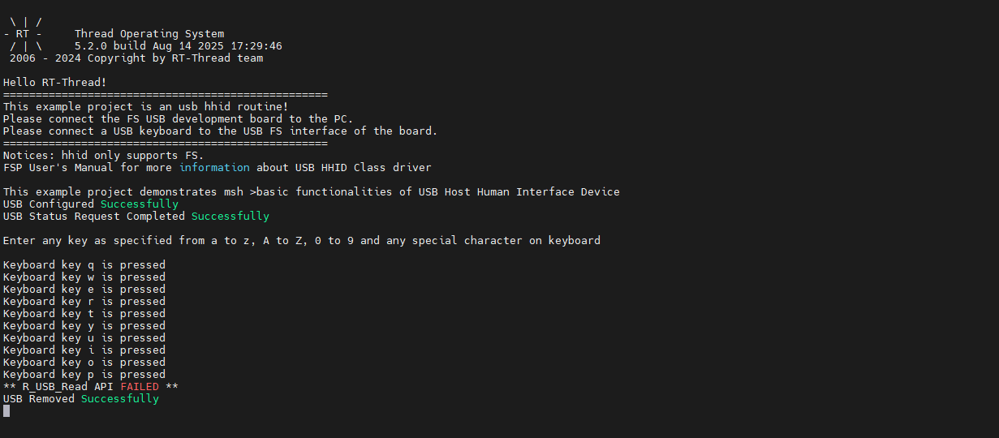

# USB-HHID Usage Instructions

**English** | [**Chinese**](./README_zh.md)

## Introduction

This document introduces a complete example of using the **USB Host HID (HHID) module (r_usb_hhid) of the RA8 MCU series** on the **Titan Board** to implement USB keyboard recognition and key input acquisition.

**USB HID** stands for *Universal Serial Bus Human Interface Device*. As the name suggests, HID devices are peripherals that directly interact with humans, such as keyboards, mice, and joysticks.

## USB HHID Overview

### 1. General Overview

**USB HID (Human Interface Device)** is a device class defined in the USB specification, designed to enable interaction between humans and computers.

Typical **HID devices** include:

- Keyboards
- Mice
- Game controllers
- Touch screens
- Consumer control devices (e.g., volume buttons, media keys)

**USB HHID (Host HID)** refers to **Host-side support for HID devices**. In this mode, the MCU or embedded system acts as the USB Host, capable of detecting, managing, and communicating with HID devices.

### 2. HID Protocol Characteristics

- **Plug and Play**: No extra drivers are required, as most host OS (Windows, Linux, RTOS, etc.) provide built-in HID support.
- **Report Descriptor Based**: Devices describe their data format through HID Report Descriptors.
- **Low Bandwidth Usage**: Typically uses USB interrupt transfers, with small data size and low latency, suitable for real-time user interactions.
- **Cross-Platform**: Standardized protocol, widely supported across PCs, embedded systems, and mobile devices.

### 3. Data Communication Mechanism

HID communication uses **endpoints**:

- **Control Endpoint (Endpoint 0)**: Used for device enumeration and descriptor exchange.
- **Interrupt Endpoint**: Used for HID data transfer, typically via polling.

#### HID Data Flow:

1. **Device Connection** → Host retrieves device descriptors via control transfer.
2. **Report Descriptor Parsing** → Host learns the data format.
3. **Polling** → Host periodically retrieves input reports from the HID device.
4. **Optional Output Reports** → Host sends control data back to the device (e.g., LED status).

### 4. HID Device Categories

- **Input Devices**: Keyboards, mice, touchpads, game controllers.
- **Output Devices**: LEDs, haptic feedback devices.
- **Composite Devices**: Devices with multiple HID functions, e.g., a mouse with extra buttons.

### 5. Application Scenarios

- **Embedded System Debugging**: MCU as USB Host to connect keyboards/mice for user input.
- **Industrial Control**: Connection of barcode scanners or control joysticks.
- **Medical Devices**: Standardized connection with input peripherals.
- **Consumer Electronics**: Smart TVs, set-top boxes supporting USB remotes/gamepads.

## RA8 USB HHID Module Overview

### 1. Module Role & Functions

- **USB Host Controller Support**: Supports USB Host mode (Full-Speed / High-Speed, depending on MCU hardware). Handles bus-level enumeration, transaction scheduling, endpoint management, and VBUS control.
- **HHID Class Driver Responsibilities**: Implements USB HID Class (0x03) handling, specifically:
  - Enumeration and endpoint setup
  - Parsing HID Report Descriptors or using Boot Protocol
  - Submitting periodic interrupt transfers
  - Decoding keyboard key codes and reporting events
- **Transfer Type**: Interrupt IN transfers (polling-based) for keyboard input. Also supports control transfers (for descriptors, protocol switching, etc.).
- **Event Dispatching**: Key events (make/break, modifier keys) are delivered via callbacks, message queues, or RT-Thread device framework.

### 2. Capabilities

- Full USB enumeration (Get Descriptor, Set Configuration, Set Interface)
- HID Report Descriptor parsing for complex data formats
- Support for **HID Boot Protocol (keyboard)** for simplified parsing
- Poll interval and timeout/retry management
- Hot-plug detection and multi-device support (with USB Hub)
- Error handling (CRC, NAK, STALL, timeouts) with recovery mechanisms
- Optional DMA support (depending on host controller hardware)

### 3. Workflow

1. **Host Initialization**: Initialize USB host controller, enable VBUS, start USB interrupts and SOF.
2. **Device Detection**: Detect device insertion, trigger enumeration.
3. **Enumeration & Class Detection**: Read descriptors to identify HID class (0x03).
4. **Endpoint Setup**: Retrieve HID descriptors, report descriptors, or check Boot Protocol.
5. **Interrupt IN Endpoint Configuration**: Open endpoint and submit periodic interrupt transfers.
6. **Data Reception & Parsing**: Parse HID reports into key events.
7. **Event Reporting**: Forward key events to the application layer (RT-Thread framework).
8. **Device Removal Handling**: Stop polling, release resources, notify removal event.

## Hardware Description

Titan Board provides a USB-Device peripheral, located on the development board as shown below:

## FSP Configuration

* Create a  `r_usb_hhid` stack.

* Configure  `r_usb_basic` stack.

* Configure USB FS pins.

## RT-Thread Settings Configuration

* Enable USB HHID。

* The USB example currently uses the FreeRTOS interface driver, so we also need to enable the FreeRTOS compatibility layer package.

## Compilation & Download

* **RT-Thread Studio**: Download the Titan Board resource package in the RT-Thread Studio package manager, create a new project, and compile it.

Once the compilation is complete, connect the USB-DBG interface of the development board to the PC and download the firmware to the board.

## Running Results

Connect the keyboard to the USB-DEV interface of the Titan Board via a adapter cable. After pressing a key on the keyboard, the terminal will display which key was pressed.

