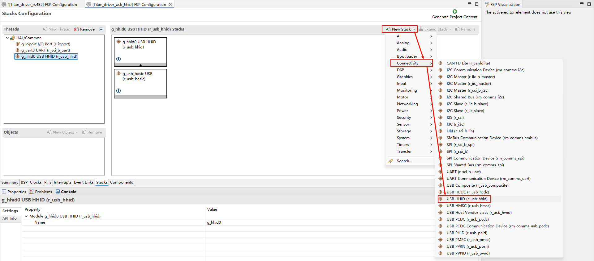
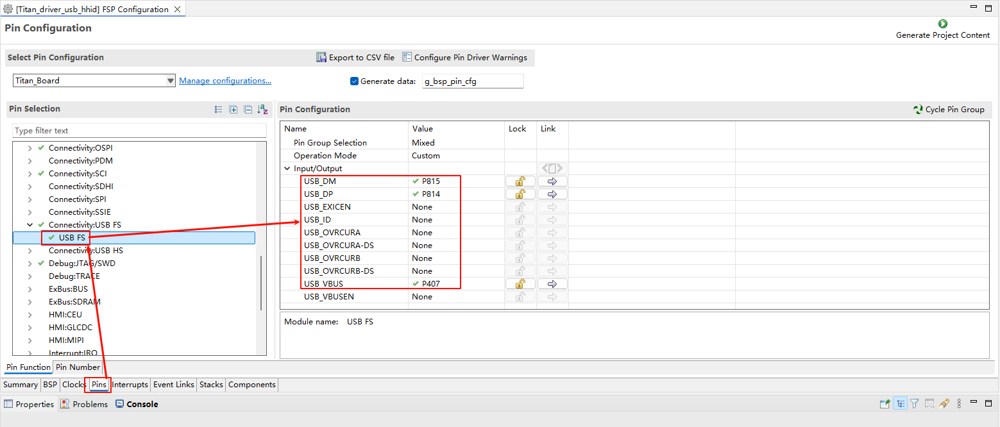
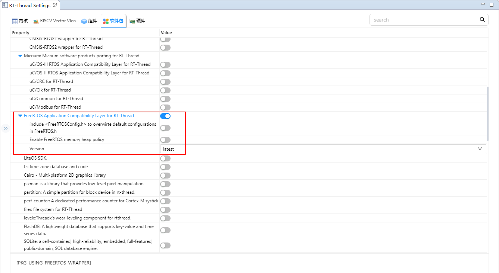

# USB-HHID 驱动例程

**中文** | [**English**](./README.md)

## 简介

本文档介绍在 **Titan Board** 上使用 **RA8 系列 MCU 的 USB Host HID（HHID）模块（r_usb_hhid）** 实现 USB 键盘识别与按键输入采集的完整示例。USB HID 是 Universal Serial Bus Human Interface Device 的缩写，由其名称可以了解 HID 设备是直接与人交互的设备，例如键盘、鼠标与游戏杆等。

## USB HHID 简介

### 1. 概述

**USB HID（Human Interface Device）** 是 USB 协议中定义的一类设备，用于实现人与计算机之间的交互。

常见的 **HID 设备** 包括：

- 键盘（Keyboard）
- 鼠标（Mouse）
- 游戏手柄（Gamepad）
- 触摸屏（Touch Screen）
- 消费类控制器（音量调节键、媒体键）

**USB HHID（Host HID）** 通常指 **主机（Host）端对 HID 类设备的支持**，即 MCU 或嵌入式系统作为 USB 主机，能够识别、管理和通信 HID 设备。

### 2. HID 协议特点

- **即插即用（Plug and Play）**：无需额外驱动，主机操作系统（Windows、Linux、RTOS 等）一般自带 HID 类驱动。
- **基于报告描述符（Report Descriptor）**：设备通过 HID 报告描述符（HID Report Descriptor）告诉主机其数据格式。
- **低带宽占用**：典型使用 USB Interrupt Transfer（中断传输），数据量小、延迟低，适合人机交互。
- **跨平台支持**：标准化协议，广泛适用于 PC、嵌入式系统、移动设备。

### 3. 数据通信方式

HID 通信基于 **端点（Endpoint）**：

- **控制端点（Endpoint 0）**：用于设备枚举、描述符传输。
- **中断端点（Interrupt Endpoint）**：主要用于 HID 数据传输，典型的 Polling 方式。

#### HID 数据流：

1. **设备连接** → 主机通过 USB 控制传输读取设备描述符。
2. **解析 HID 报告描述符** → 获取数据格式定义。
3. **周期性轮询（Polling）** → 主机定期从 HID 设备获取输入报告（Input Report）。
4. **可选输出（Output Report）** → 主机向 HID 设备发送控制数据，例如 LED 灯状态。

### 4. HID 设备分类

- **输入设备**：键盘、鼠标、触摸板、手柄。
- **输出设备**：LED 灯、力反馈设备。
- **复合设备**：例如带按键的鼠标，同时有指针输入和按钮输入。

### 5. 应用场景

- **嵌入式系统调试**：MCU 作为 USB Host，支持接入键盘/鼠标，用于人机交互。
- **工业控制**：接入条码扫描枪、专用控制手柄，提高设备操作便利性。
- **医疗设备**：通过标准化接口接入输入装置。
- **消费电子**：智能电视、机顶盒通过 USB Host 接口支持遥控器或游戏手柄。

## RA8 系列 USB HHID 模块简介

### 1. 模块定位与功能

- **USB Host Controller 支持**：支持 USB Host 模式（Full-Speed / High-Speed，取决 MCU 硬件），负责总线层枚举、USB 事务调度、端点管理、USB 供电控制等。
- **HHID 类驱动职责**：实现 USB HID class（0x03）中键盘（SubClass Boot、Protocol Keyboard）解析逻辑，完成：枚举后查找 IN 中断端点、提交周期性中断传输、解析 HID 报告描述符或使用 Boot Protocol、解码按键码并上报事件。
- **传输类型**：采用 **Interrupt IN**（周期性）从键盘读取输入报告；也支持 control transfer（获取 descriptor、切换协议等）。
- **事件分发**：将解析出的按键事件（make/break，修饰键状态）通过回调、消息队列或 RT-Thread 设备/传感器框架上报给上层应用。

### 2. 支持能力

- USB 标准枚举（Get Descriptor / Set Configuration / Set Interface）
- 识别 HID 报告描述符并按 Report Descriptor 解析复杂报告
- 支持 **HID Boot Protocol（键盘）** 的快速解析（如果设备支持）
- 管理中断轮询周期（poll interval）与传输超时、重试策略
- 支持多设备（通过 Hub 支持）与动态插拔检测（hot-plug）
- 错误检测：CRC/NAK/STALL/timeout 处理与恢复
- 支持与 DMA 协同（若 USB Host 控制器/驱动支持）

### 3. 工作流程

1. **Host 初始化**：host controller 驱动初始化，VBUS 打开，USB interrupt/sof 启动。
2. **设备连接检测**：检测到设备插入（GPIO / ID / VBUS sense），触发枚举流程。
3. **枚举与类判断**：读取设备描述符、配置描述符、接口描述符，判断类为 HID（bDeviceClass/bInterfaceClass=0x03）。
4. **找端点并获取报告描述符**：获取 HID Descriptor 与 Report Descriptor，或判断是否支持 Boot Protocol。
5. **配置端点**：打开 Interrupt IN 端点，根据端点描述（最大包长、poll interval）提交中断接收请求（循环）。
6. **接收并解析报告**：每次中断到达后，解析 report（按 report descriptor 或 boot protocol），生成按键按下/释放事件。
7. **事件上报**：通过回调/消息队列/RT-Thread 设备上报给上层应用。
8. **拔出处理**：设备拔出时，停止轮询、释放资源、上报拔出事件。

## 硬件说明

Titan Board 提供一个 USB-Device 外设，位于开发板的位置如下所示：

## FSP配置说明

* 新建 `r_usb_hhid` stack。

* 配置 `r_usb_basic` stack。

* 配置 USB FS 引脚。

## RT-Thread Settings配置

* 使能 USB HHID。

* USB-HHID 示例目前使用的是 freertos 接口驱动，因此我们还需要使能 Freertos 兼容层软件包。

## 编译&下载

* RT-Thread Studio：在 RT-Thread Studio 的包管理器中下载 Titan Board 资源包，然后创建新工程，执行编译。

编译完成后，将开发板的 USB-DBG 接口与PC 机连接，然后将固件下载至开发板。

## 运行效果

将键盘通过转接线连接到  Titan Board 的 USB-DEV 接口上，按下键盘上的按键后，终端输出按下的是哪个按键。

