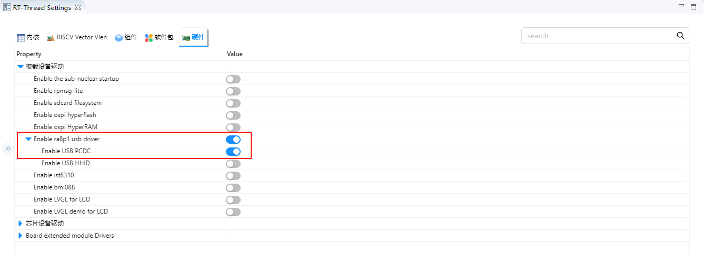

# USB-PCDC Usage Instructions

**English** | [**Chinese**](./README_zh.md)

## Introduction

This example demonstrates how to use the **RA8 Series MCU USB PCDC module (r_usb_pcdc)** on the **Titan Board** to enumerate the device as a **USB virtual serial port (CDC)**, allowing serial communication with the board on a PC as a “COM port/ttyACM”.

## USB PCDC Instructions

### 1. Overview

**USB PCDC (USB Peripheral Communications Device Class)** is a specific implementation of the **CDC (Communications Device Class)** defined in the USB protocol.

It primarily allows **embedded devices to appear as a virtual serial port (VCOM) over USB**, enabling the host (PC or embedded host) to interact with the USB device just like a traditional UART serial port.

Common application scenarios:

- MCU as a USB device, recognized by the PC as a virtual serial port (COMx).
- Embedded devices communicating with a host computer for data transfer or debugging.
- Replacing physical RS-232/RS-485 interfaces to reduce hardware cost.

### 2. PCDC Protocol Features

1. **CDC Class Protocol**
   - USB-defined communication device class, uses standard class drivers (no extra driver installation needed; automatically recognized on Windows/Linux/macOS).
2. **Data Transfer Methods**
   - **Control Endpoint (Endpoint 0)**: Used for device enumeration and descriptor transfer.
   - **Interrupt Endpoint**: Used for status and control signals (e.g., DTR, RTS).
   - **Bulk Endpoint**: For high-efficiency, reliable serial data transfer.
3. **Virtual Serial Port Features**
   - Appears as a standard serial port (COM port or ttyUSB) on the host.
   - Supports UART configurations such as baud rate, data bits, parity, and stop bits.

### 3. Typical Application Architecture

- **USB Device (MCU side)**: Implements the PCDC protocol stack, connecting USB data to the MCU’s internal UART/application layer.
- **USB Host (PC/embedded system)**: Maps a virtual serial port through the OS-provided CDC driver.
- **Application Layer**: Host software (PuTTY, Tera Term, serial monitor tools) can communicate directly.

### 4. Advantages

- **No additional driver needed**: Most OSs include built-in CDC drivers.
- **Replaces traditional serial ports**: Enables debugging/communication even without a physical UART.
- **Higher data rates**: Full-Speed (12 Mbps) or High-Speed (480 Mbps) USB exceeds typical UART bandwidth.
- **High compatibility**: Works with various host applications (LabVIEW, Python pySerial, C# serial libraries).

## RA8 Series USB PCDC Module (r_usb_pcdc) Overview

The RA8 Series MCU integrates a **USB PCDC (Peripheral CDC) module**, designed to enumerate the MCU as a **USB virtual serial port (CDC device)**, enabling bidirectional data communication with a PC or other USB hosts. It works together with the RA8 **basic USB module (r_usb_basic)**, and the **r_usb_pcdc class driver** provides full CDC functionality.

### 1. Module Functionality

- **Device Mode Support**: MCU acts as a USB device connected to a host (Full-Speed / High-Speed, depending on MCU specification).
- **Virtual Serial Port (CDC) Features**:
  - Handles class requests: `SET_LINE_CODING`, `GET_LINE_CODING`, `SET_CONTROL_LINE_STATE`, `SEND_BREAK`.
  - Supports standard Bulk IN/OUT endpoints and an Interrupt IN endpoint.
  - Generates serial port status notifications (e.g., DTR/RTS, line state).
- **Data Transfer Management**: Supports high-efficiency transfer with DMA/DTC or FIFO buffers.
- **Event Callback Mechanism**: For connection, disconnection, configuration completion, data transfer completion, class request handling, and error events.
- **Hot-plug and Low Power**: Supports VBUS detection, suspend/resume, and remote wakeup.
- **Application Layer Interface**: Provides API for read/write buffers, send-complete notifications, and event callbacks.

### 2. Supported Features

- **Standard USB Enumeration**: Supports Device, Configuration, and Interface Descriptors.
- **Endpoint Management**: Configures Bulk IN/OUT and Interrupt IN endpoints.
- **Class Request Handling**: Parses line coding and control line state according to CDC protocol.
- **Reliable Transfers**: Supports CRC, NAK, STALL, and timeout handling.
- **Multiple Device & Composite Device Support**: Can dynamically manage multiple CDC devices via hubs.
- **DMA Collaboration**: Optimizes data throughput and reduces CPU load.

### 3. Module Architecture

```
[ Application Layer Task/Thread ]
         ↑     Callback/Event notifications (connect, configure, transfer complete)
[ r_usb_pcdc Class Driver ]
         ↕     Class request parsing, data transfer management, endpoint configuration
[ r_usb_basic Basic Driver ]
         ↕     USB device enumeration, endpoint control, SOF interrupt, DMA support
[ USB Device Controller/PHY ]
         ↕     USB D+/D- signals (FS) or ULPI/HS PHY (HS)
[ USB Cable ]  <—> Host (PC)
```

**Key Submodules**:

1. **Class Request Handler**: Parses CDC class requests and callbacks the application.
2. **Endpoint Control and Buffers**: Manages Bulk/Interrupt endpoints and supports DMA/FIFO.
3. **Event Management**: Handles connection/disconnection, configuration, suspend/resume, transfer complete, error events.
4. **Power and Clock Control**: USB PHY, VBUS detection, suspend/wake management.

### 4. Workflow

1. **USB Initialization**: Initialize USB controller, PHY, and class driver.
2. **Device Connection Detection**: Detect VBUS/ID signals to trigger enumeration.
3. **Enumeration and Configuration**: Upload descriptors and configure interface/endpoints.
4. **Endpoint Data Transfer**: Application exchanges data with host via Bulk IN/OUT endpoints.
5. **Class Request Handling**: Process CDC control requests from host.
6. **Event Callback Notification**: Notify application of connection, configuration, and transfer completion.
7. **Disconnection Handling**: Stop endpoint transfers, release buffers, and handle device removal events.

## Hardware Description


## FSP Configuration Configuration

* Create a `r_usb_pcdc stack`：


* Configure `r_usb_basic`：


* Configure USB FS pin：


* Configure USB HS pin：


> **PS:** Note that when switching to HS mode, the **P413 pin** needs to be pulled high, as shown in the figure below:
>
> 

## RT-Thread Settings Configuration

Enable USB PCDC。



## Compilation & Download

* **RT-Thread Studio**: Download the Titan Board resource package from the RT-Thread Studio package manager, then create a new project and compile.

After compiling, connect the USB-DBG interface of the development board to the PC and download the firmware to the development board.

## Running Effect

Use USB cable to connect the USB-DEV interface of Titan Board with the computer, open the serial port terminal with the serial port assistant, input 1 into the serial port terminal, and see the output in the debugging terminal of the development board.


Enter 2 into the USB-PCDC serial terminal, and you will see the following output in the USB-PCDC serial terminal:

