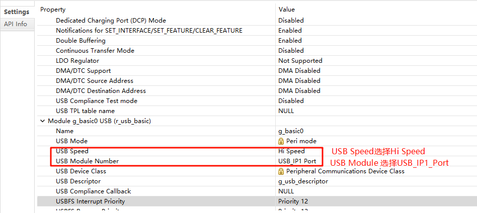
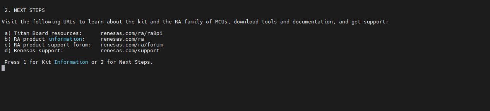

# USB-PCDC 驱动例程

**中文** | [**English**](./README.md)

## 简介

本示例演示如何在 **Titan Board** 上使用 **RA8 系列 MCU 的 USB PCDC 模块（r_usb_pcdc）** 将设备枚举为 **USB 虚拟串口（CDC）**，从而在 PC 上以 “COM 口/ttyACM” 的形式与板卡进行串行数据通信。

## USB PCDC 简介

### 1. 概述

**USB PCDC（USB Peripheral Communications Device Class）** 属于 USB 协议中定义的 **CDC（Communications Device Class，通信设备类）** 的一种实现。

它主要用于 **将嵌入式设备通过 USB 接口虚拟成串口（Virtual COM Port, VCOM）**，使主机（PC、嵌入式 Host）能够像访问传统 UART 串口一样访问 USB 设备。

常见应用场景：

- MCU 作为 USB 设备，通过 PCDC 连接到 PC，PC 识别为虚拟串口（COMx）。
- 嵌入式设备与上位机进行数据通信或调试。
- 代替物理 RS-232/RS-485 接口，降低硬件成本。

### 2. PCDC 的协议特性

1. **CDC 类协议**
   - 属于 USB 定义的通信类设备，使用标准类驱动（无需额外安装驱动，在 Windows/Linux/MacOS 中大多数情况自动识别）。
2. **数据传输方式**
   - **控制端点（Endpoint 0）**：用于设备枚举、描述符传输。
   - **中断端点（Interrupt Endpoint）**：用于状态和控制信号（如 DTR、RTS）。
   - **批量传输端点（Bulk Endpoint）**：用于大数据量的串口数据传输（高效可靠）。
3. **虚拟串口功能**
   - 在主机端表现为标准串口（COM 口或 ttyUSB 设备）。
   - 支持波特率、数据位、校验位、停止位等 UART 常见配置。

### 3. 典型应用架构

- **USB Device（MCU 端）**：实现 PCDC 协议栈，将 USB 数据与 MCU 内部 UART/应用层对接。
- **USB Host（PC/嵌入式系统）**：通过操作系统自带 CDC 驱动，映射出虚拟串口接口。
- **应用层**：上位机可直接使用串口工具（如 PuTTY、Tera Term、串口助手）进行交互。

### 4. 优点

- **无需额外驱动**：大多数 OS 自带 CDC 驱动。
- **替代传统串口**：即使 MCU 无物理串口，也能通过 USB 实现调试/通信。
- **速率更高**：USB 全速（12 Mbps）、高速（480 Mbps）带宽远高于传统 UART。
- **通用性强**：支持各种上位机应用（LabVIEW、Python pySerial、C# 串口库等）。

## RA8 系列 USB PCDC 模块（r_usb_pcdc）简介

RA8 系列 MCU 内置 **USB PCDC（Peripheral CDC）模块**，专用于将 MCU 枚举为 **USB 虚拟串口（CDC 设备）**，从而实现与 PC 或其他 USB 主机的数据双向通信。该模块与 RA8 的基础 USB 模块（r_usb_basic）结合使用，通过类驱动 r_usb_pcdc 提供完整的 CDC 功能。

### 1. 模块定位与功能

- **设备模式支持**：实现 MCU 作为 USB 设备连接到主机（Full-Speed / High-Speed，根据具体 MCU 规格）
- **虚拟串口（CDC）功能**：
  - 处理类请求：`SET_LINE_CODING`、`GET_LINE_CODING`、`SET_CONTROL_LINE_STATE`、`SEND_BREAK`
  - 支持标准 Bulk IN/OUT 端点和 Interrupt IN 端点
  - 生成串口状态通知（如 DTR/RTS、线路状态）
- **数据收发管理**：可通过 DMA/DTC 或 FIFO 缓冲实现大数据量高效传输
- **事件回调机制**：连接、断开、配置完成、数据收发完成、类请求处理、错误事件等
- **热插拔与低功耗**：支持 VBUS 侦测、挂起/唤醒、远程唤醒功能
- **应用层接口**：通过类驱动 API 提供读写缓冲、发送完成通知、事件回调机制

### 2. 支持能力

- **标准 USB 枚举**：支持 Device Descriptor、Configuration Descriptor、Interface Descriptor 等
- **端点管理**：配置 Bulk IN/OUT 和 Interrupt IN 端点
- **类请求解析**：按 CDC 协议解析行编码、控制线状态
- **传输可靠性**：支持 CRC、NAK、STALL 及超时处理
- **多设备与复合设备支持**：可在 Hub 环境下动态识别和管理多个 CDC 设备
- **与 DMA 协同**：优化数据吞吐，减少 CPU 占用

### 3. 模块架构

```
[ 应用层任务/线程 ]
         ↑           回调/事件通知（连接、配置、收发完成）
[ r_usb_pcdc 类驱动 ]
         ↕           类请求解析、数据收发管理、端点配置
[ r_usb_basic 基础驱动 ]
         ↕           USB 设备枚举、端点控制、SOF 中断、DMA 支持
[ USB 设备控制器/PHY ]
         ↕           USB D+/D- 信号（FS）或 ULPI/HS PHY（HS）
[ USB 线缆 ]  <—> 主机（PC）
```

**关键子模块说明**：

1. **类请求处理器**：解析 CDC 类请求，回调上层应用
2. **端点控制与缓冲**：管理 Bulk/Interrupt 端点传输，支持 DMA/FIFO
3. **事件管理**：连接/断开、配置完成、挂起/恢复、传输完成、错误处理
4. **电源与时钟控制**：USB PHY、VBUS 侦测、挂起唤醒管理

### 4. 工作流程

1. **USB 初始化**：USB 控制器、PHY 及类驱动初始化
2. **设备连接检测**：检测 VBUS/ID 信号触发枚举
3. **枚举与配置**：上传描述符、设置接口和端点
4. **端点数据传输**：应用通过 Bulk IN/OUT 与主机进行数据收发
5. **类请求处理**：处理主机发来的 CDC 控制请求
6. **事件回调上报**：将连接、配置、收发完成等事件通知应用
7. **断开处理**：停止端点传输，释放缓冲区，处理拔出事件

## 硬件说明


## FSP配置说明

* 新建 r_usb_pcdc stack：


* 配置 r_usb_basic：



* 配置 USB FS 引脚：


* 配置 USB HS 引脚：


> PS：注意，切换HS模式需要拉高P413引脚，如下图所示：
>
> 

## RT-Thread Settings配置

使能 USB PCDC。


## 编译&下载

* RT-Thread Studio：在 RT-Thread Studio 的包管理器中下载 Titan Board 资源包，然后创建新工程，执行编译。

编译完成后，将开发板的 USB-DBG 接口与 PC 机连接，然后将固件下载至开发板。

## 运行效果

使用 USB 线连接 Titan Board 的 USB-DEV 接口与电脑，使用串口助手打开串口终端，向串口终端中输入 1，能在开发板的调试终端看到输出。


向 USB-PCDC 的串口终端中输入 2，能在 USB-PCDC 的串口终端中看到如下输出。


