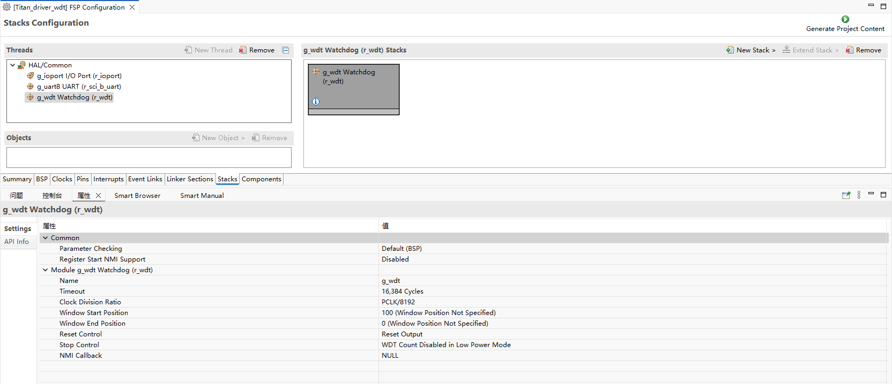
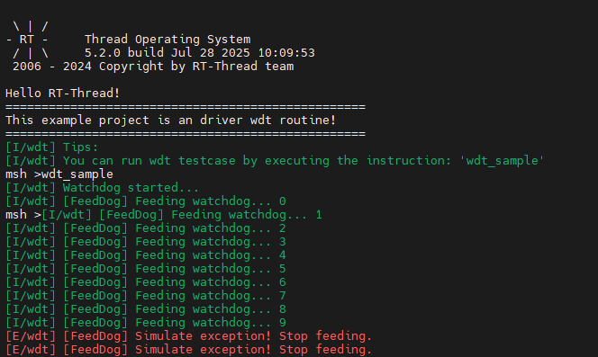

# WDT 使用说明

**中文** | [**English**](./README.md)

## 简介

看门狗设备可以保证我们的代码在我们的预期中进行，可以有效防止我们的程序因为一些其它不可控因素导致代码”跑飞“。本示例展示了如何在 **Titan Board** 上使用 **RA8 系列 MCU 的 WDT 模块**，结合 **RT-Thread 的 WDT 驱动框架** 实现看门狗功能，包括定时器配置、喂狗操作及超时响应。

## WDT（Watchdog Timer）简介

### 1. 概述

**WDT（看门狗定时器）** 是嵌入式系统中用于 **监控系统运行状态、防止程序卡死或异常挂起的硬件定时器**。

当 MCU 或处理器在规定时间内未对 WDT 进行复位（Kick/Reload）时，WDT 会 **自动复位系统**，确保系统能够恢复正常运行。

WDT 常用于：

- 防止软件死循环或任务卡死
- 提高系统可靠性和稳定性
- 工业控制、汽车电子、无人机、通信设备等关键应用

### 2. 工作原理

1. **计数器模式**
   - WDT 内部有一个递减计数器，从设定初值开始计数。
   - MCU 必须在计数器到达零前 **清零计数器（Reload/Kick）**。
   - 如果计数器归零，触发 **系统复位** 或 **中断**。
2. **喂狗机制**
   - MCU 定期向 WDT 写入特定值，重置计数器
   - 俗称 “喂狗”，保证系统正常运行时 WDT 不复位
3. **复位/中断模式**
   - **复位模式**：WDT 到期直接复位 MCU
   - **中断模式**：WDT 到期产生中断，可先尝试软件自我恢复

### 3. WDT 类型

| 类型                                    | 描述                                               |
| --------------------------------------- | -------------------------------------------------- |
| **独立看门狗（Independent WDT, IWDT）** | 独立时钟源，系统重启或挂起时仍能运行               |
| **窗口看门狗（Window WDT）**            | MCU 必须在规定窗口时间内喂狗，否则触发复位         |
| **超级看门狗（Super WDT）**             | 提供更高精度或可配置更长时间的保护                 |
| **软看门狗（Software WDT）**            | 通过软件定时器实现，看门狗功能由操作系统或应用维护 |

### 4. 关键参数

- **计数器位数**：决定 WDT 最大时间间隔
- **超时时间（Timeout）**：从上次喂狗到 WDT 触发复位的时间
- **时钟源**：独立低速晶振或系统时钟
- **复位方式**：硬件复位或中断通知

示例：

- MCU WDT 超时时间 500 ms
- MCU 任务每 100 ms 喂狗一次
- 若任务卡死 500 ms 未喂狗 → WDT 自动复位系统

### 5. WDT 使用原则

1. **定期喂狗**：确保系统在正常运行时 WDT 不触发
2. **关键任务喂狗**：通常在主循环或关键任务中喂狗
3. **中断安全**：喂狗操作应避免被中断阻塞
4. **合理超时设置**：超时时间既要大于任务执行时间，又不能太长，防止死机长时间不被复位

## RA8 系列 WDT 模块（r_wdt）简介

RA8 系列 MCU 内置高性能 **WDT 模块（r_wdt）**，提供可靠的系统监控能力，可通过硬件复位或中断模式实现故障保护。

### 1. 基本特性

- **定时器模式**：支持单次计时或周期计时
- **时钟源**：独立低功耗时钟（LPO）或系统时钟
- **复位与中断输出**：
  - 超时可触发 MCU 系统复位
  - 可选择中断模式，产生 WDT 中断供软件处理
- **计数范围**：支持 8~32 位计数器，可灵活配置超时时间
- **安全性特性**：
  - 禁止误操作保护（有些寄存器需要解锁序列）
  - 多级复位模式（WDT Reset, Non-maskable Reset）
- **独立操作**：在 MCU 低功耗或睡眠模式下依然可运行

### 2. 模块架构

RA8 WDT 模块主要包含以下子模块：

1. **计数器单元（Counter Unit）**
   - 基于时钟源递减计数
   - 支持周期性溢出检测
2. **控制寄存器（Control Register）**
   - 启动/停止 WDT
   - 配置超时时间和中断/复位模式
   - 配置喂狗序列
3. **状态寄存器（Status Register）**
   - 反映 WDT 当前状态
   - 超时标志
   - 中断/复位触发标志
4. **复位与中断控制单元**
   - 超时触发 MCU 复位
   - 可选择中断模式通知 CPU
   - 支持 NMI 或系统复位输出

### 3. 工作原理

1. **启动 WDT**：配置计数器、时钟源、超时时间后启动 WDT。
2. **喂狗操作**：软件周期性写入特定寄存器序列，重置计数器防止超时。
3. **超时响应**：
   - 若未喂狗，计数器溢出触发超时
   - 根据配置选择：
     - 硬件复位 MCU
     - 触发 WDT 中断供程序处理
4. **安全保护**：WDT 控制寄存器通常需解锁后才能修改，防止误操作。

## RT-Thread WDT 框架简介

**RT-Thread WDT（Watchdog Timer）框架** 是 RT-Thread 设备驱动层提供的统一接口，用于管理各类 MCU 的硬件看门狗模块。该框架将硬件 WDT 功能抽象为标准设备接口，使应用层能够跨平台使用统一的 API 来实现系统自恢复机制。

### 1. 设备模型

在 RT-Thread 中，WDT 被作为 **设备对象**（`struct rt_device` 的子类，类型为 `RT_Device_Class_WDT`）进行管理，开发者无需关心底层硬件寄存器操作，只需调用标准接口即可完成看门狗功能。

### 2. 操作接口

应用程序通过 RT-Thread 提供的 I/O 设备管理接口来访问看门狗硬件，相关接口如下所示：

| **函数**            | **描述**                                   |
| ------------------- | ------------------------------------------ |
| rt_device_find()    | 根据看门狗设备设备名称查找设备获取设备句柄 |
| rt_device_init()    | 初始化看门狗设备                           |
| rt_device_control() | 控制看门狗设备                             |
| rt_device_close()   | 关闭看门狗设备                             |

### 3. 框架特点

- **设备抽象统一**：所有硬件 WDT 通过相同的设备接口暴露给上层应用。
- **跨平台支持**：应用程序可在不同 MCU 平台间移植而无需修改 WDT 相关代码。
- **超时保护**：支持配置超时时间，系统未及时喂狗则触发中断或复位。
- **运行模式可选**：支持 **中断模式** 和 **复位模式**，满足不同场景需求。
- **安全可靠**：结合硬件 WDT 提供强制复位机制，防止系统异常卡死。

### 4. 使用流程

* **查找 wdt 设备**

``` C
#define WDT_DEVICE_NAME    "wdt"    /* 看门狗设备名称 */

static rt_device_t wdg_dev;         /* 看门狗设备句柄 */
/* 根据设备名称查找看门狗设备，获取设备句柄 */
wdg_dev = rt_device_find(WDT_DEVICE_NAME);
```

* **初始化看门狗**

```C
/* 初始化设备 */
rt_device_init(wdg_dev);
```

* **控制看门狗**

命令控制字可取如下宏定义值：

```C
#define RT_DEVICE_CTRL_WDT_GET_TIMEOUT    (1) /* 获取溢出时间 */
#define RT_DEVICE_CTRL_WDT_SET_TIMEOUT    (2) /* 设置溢出时间 */
#define RT_DEVICE_CTRL_WDT_GET_TIMELEFT   (3) /* 获取剩余时间 */
#define RT_DEVICE_CTRL_WDT_KEEPALIVE      (4) /* 喂狗 */
#define RT_DEVICE_CTRL_WDT_START          (5) /* 启动看门狗 */
#define RT_DEVICE_CTRL_WDT_STOP           (6) /* 停止看门狗 */
```

设置看门狗溢出时间使用示例如下所示：

```C
#define WDT_DEVICE_NAME    "wdt"    /* 看门狗设备名称 */

rt_uint32_t timeout = 1;       /* 溢出时间，单位：秒*/
static rt_device_t wdg_dev;    /* 看门狗设备句柄 */
/* 根据设备名称查找看门狗设备，获取设备句柄 */
wdg_dev = rt_device_find(WDT_DEVICE_NAME);
/* 初始化设备 */
rt_device_init(wdg_dev);

/* 设置看门狗溢出时间 */
rt_device_control(wdg_dev, RT_DEVICE_CTRL_WDT_SET_TIMEOUT, &timeout);
/* 设置空闲线程回调函数 */
rt_thread_idle_sethook(idle_hook);
```

在空闲线程钩子函数里喂狗使用示例如下所示：

```C
static void idle_hook(void)
{
    /* 在空闲线程的回调函数里喂狗 */
    rt_device_control(wdg_dev, RT_DEVICE_CTRL_WDT_KEEPALIVE, NULL);
}
```

* **关闭看门狗**

```C
rt_device_close(wdg_dev);
```

## 硬件说明

无

## FSP 配置

* 打开 FSP 工具 新建 Stacks 选择 r_wdt：



* **注意**：使用 WDT 需要使能 OFS0 寄存器配置。


## RT-Thread Settings 配置

* 使能 WDT。


## 示例工程说明

示例程序位于 `project/Titan_driver_wdt/src/hal_entry.c`。

```c
/*
 * Copyright (c) 2006-2024, RT-Thread Development Team
 *
 * SPDX-License-Identifier: Apache-2.0
 *
 * Change Logs:
 * Date           Author        Notes
 * 2024-03-11     kurisaw       first version
 */

#include <rtthread.h>
#include "hal_data.h"
#include <rtdevice.h>
#include <board.h>

#define DBG_TAG "wdt"
#define DBG_LVL DBG_LOG
#include <rtdbg.h>

#define WDT_DEVICE_NAME "wdt"    // 默认看门狗设备名，视 BSP 而定
#define WDT_FEED_INTERVAL 1000   // 喂狗间隔（单位 ms）
#define WDT_TIMEOUT 3            // 看门狗超时时间（单位 s）

static rt_device_t wdt_dev = RT_NULL;
static rt_thread_t feed_thread = RT_NULL;

#define LED_PIN_0    BSP_IO_PORT_06_PIN_00 /* Onboard LED pins */

void hal_entry(void)
{
    rt_kprintf("\nHello RT-Thread!\n");
    rt_kprintf("==================================================\n");
    rt_kprintf("This example project is an driver wdt routine!\n");
    rt_kprintf("==================================================\n");

    LOG_I("Tips:");
    LOG_I("You can run wdt testcase by executing the instruction: \'wdt_sample\'");

    while (1)
    {
        rt_pin_write(LED_PIN_0, PIN_HIGH);
        rt_thread_mdelay(1000);
        rt_pin_write(LED_PIN_0, PIN_LOW);
        rt_thread_mdelay(1000);
    }
}

static void feed_dog_entry(void *parameter)
{
    int count = 0;

    while (1)
    {
        if (count < 10)
        {
            rt_device_control(wdt_dev, RT_DEVICE_CTRL_WDT_KEEPALIVE, RT_NULL);
            LOG_I("[FeedDog] Feeding watchdog... %d", count);
        }
        else
        {
            LOG_E("[FeedDog] Simulate exception! Stop feeding.");
        }

        count++;
        rt_thread_mdelay(WDT_FEED_INTERVAL);
    }
}

static int wdt_sample(void)
{
    rt_err_t ret;

    wdt_dev = rt_device_find(WDT_DEVICE_NAME);
    if (wdt_dev == RT_NULL)
    {
        LOG_E("Cannot find %s device!", WDT_DEVICE_NAME);
        return -1;
    }

    ret = rt_device_control(wdt_dev, RT_DEVICE_CTRL_WDT_START, RT_NULL);
    if (ret != RT_EOK)
    {
        LOG_E("Start watchdog failed!");
        return -1;
    }

    LOG_I("Watchdog started...", WDT_TIMEOUT);

    feed_thread = rt_thread_create("feed_dog", feed_dog_entry, RT_NULL, 1024, 10, 10);
    if (feed_thread != RT_NULL)
        rt_thread_startup(feed_thread);

    return 0;
}
MSH_CMD_EXPORT(wdt_sample, wdt_sample);
```

## 编译&下载

* RT-Thread Studio：在 RT-Thread Studio 的包管理器中下载 Titan Board 资源包，然后创建新工程，执行编译。

编译完成后，将开发板的 USB-DBG 接口与 PC 机连接，然后将固件下载至开发板。

## 运行效果

在终端输入 wdt_sample 指令运行 WDT 测试程序，在喂狗 10 次后停止喂狗，模拟了程序异常情况。



## 引用参考

设备与驱动：[WDT 设备](https://www.rt-thread.org/document/site/#/rt-thread-version/rt-thread-standard/programming-manual/device/watchdog/watchdog)

 
