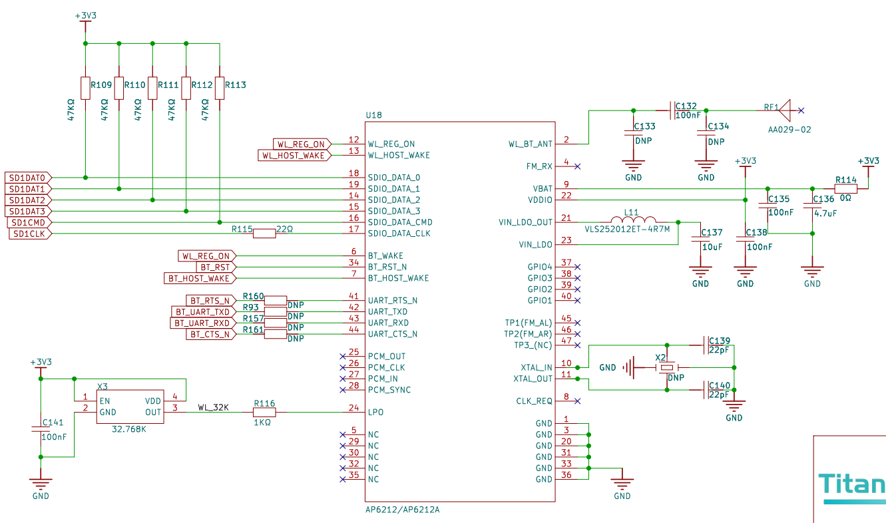
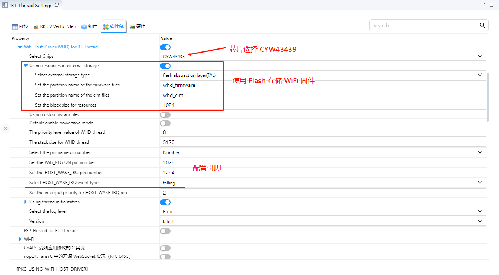

# Wi-Fi Usage Instructions

**English**|[**Chinese**](README_zh.md)

## Introduction

This example demonstrates how to use the **RA8 series MCU SDHI module (r_sdhi)** on the **Titan Board** to drive the **CYWL6208-GS WiFi module**, enabling wireless network connectivity via the SDIO interface.
 In this example, the MCU communicates with the CYWL6208-GS module (chip CYW43438) through the **SDIO bus**, and integrates with the RT-Thread network stack (lwIP) to achieve TCP/IP network functionality.

## WiFi Introduction

### 1. Overview

**WiFi (Wireless Fidelity)** is a wireless local area network (WLAN) communication technology based on the **IEEE 802.11 standard**.
 It transmits data between terminal devices (such as MCUs, smartphones, PCs, or IoT devices) and access points (APs) via radio waves, providing **short-range high-speed wireless communication**.

WiFi is currently one of the most widely used wireless technologies, commonly applied in home networks, office networks, industrial control, smart homes, and IoT devices.

### 2. Working Principle

1. **Communication Method**
   - WiFi uses the **ISM bands** (2.4 GHz, 5 GHz, 6 GHz) and modulation schemes such as **OFDM, DSSS, and QAM** for data transmission.
   - WiFi networks consist of **Access Points (APs)** and **Stations (STAs)**.
2. **Data Transmission Flow**
   - The STA scans for available WiFi networks.
   - STA sends authentication and association requests.
   - The AP completes handshake and key negotiation.
   - Once a secure communication channel is established between STA and AP, data transmission occurs.

### 3. WiFi Standards

Different WiFi versions correspond to the IEEE 802.11 standards:

| Standard              | Frequency Band | Max Rate | Features                                          |
| --------------------- | -------------- | -------- | ------------------------------------------------- |
| **802.11b**           | 2.4 GHz        | 11 Mbps  | Early version, poor interference resistance       |
| **802.11g**           | 2.4 GHz        | 54 Mbps  | Backward compatible with 802.11b                  |
| **802.11n (WiFi 4)**  | 2.4/5 GHz      | 600 Mbps | MIMO technology                                   |
| **802.11ac (WiFi 5)** | 5 GHz          | 3.5 Gbps | MU-MIMO, 80/160 MHz channels                      |
| **802.11ax (WiFi 6)** | 2.4/5/6 GHz    | 9.6 Gbps | OFDMA, lower latency, higher concurrency          |
| **802.11be (WiFi 7)** | 2.4/5/6 GHz    | >30 Gbps | Multi-link operation (MLO), ultra-high throughput |

### 4. WiFi Modes

- **STA mode (Station)**: Device connects to an AP.
- **AP mode (Access Point)**: Device provides network access as a hotspot.
- **P2P mode (Peer-to-Peer/Ad-Hoc)**: Direct device-to-device communication.
- **Hybrid mode**: Both STA and AP functions coexist.

### 5. WiFi Security

- **WEP** (deprecated, insecure)
- **WPA/WPA2**: TKIP/AES-based encryption, mainstream security
- **WPA3**: Enhanced security, supports SAE handshake to prevent brute-force attacks

### 6. WiFi Characteristics

#### Advantages

- High-speed transmission (Gbps level)
- Widely supported (phones, PCs, MCUs, etc.)
- Low cost, mature ecosystem
- Can connect multiple devices simultaneously

#### Disadvantages

- High power consumption, unsuitable for ultra-low-power applications
- Limited transmission range (typically 10–100 m)
- 2.4 GHz band prone to interference (Bluetooth, microwave ovens, etc.)

## RA8 Series SDHI Module Introduction

The **RA8 series MCU SDHI (SD Host Interface) module** is a host controller compliant with **SD/SDIO/eMMC standards**, capable of communicating with storage devices (SD card, eMMC) or SDIO peripherals (e.g., WiFi, Bluetooth modules) via **1-bit or 4-bit data lines**.

In **storage applications**, it functions as an SD/eMMC controller for high-speed read/write operations. In **peripheral expansion applications**, it acts as an SDIO host to establish data channels with WiFi, Bluetooth, GNSS, and other modules.

In this example, SDHI is used to drive the **CYWL6208-GS WiFi module (SDIO interface)** to enable wireless networking for the MCU.

### 1. Key Features

- **SD Standard Support**
  - SD v1.x / v2.x / SDHC / SDXC
  - Supports SPI mode and SD/MMC mode
- **High-Speed Data Transfer**
  - Up to 50 MHz SDCLK (depending on MCU clock configuration)
  - Supports 1-bit / 4-bit bus
- **Automatic Command and Data Transfer**
  - DMA support reduces CPU usage
  - Automatic command sequence generation (CMD0~CMD63)
- **Error Detection**
  - CRC7 for commands, CRC16 for data
  - Timeout detection and response error recognition
- **Interrupt Support**
  - Card insertion/removal detection
  - Command completion
  - Data transfer completion
  - Error interrupt

### 2. SDHI Module Architecture

The RA8 SDHI module consists of the following sub-modules:

1. **Command Control Unit**
   - Sends commands (CMD0~CMD63)
   - Handles responses (R1, R2, R3, R7, etc.)
   - Supports command timeout detection and CRC check
2. **Data Transfer Unit**
   - Data send/receive via internal FIFO or DMA
   - Supports block read/write, maximum 512-byte block
   - Single/multi-block transfer modes
3. **Clock and Bus Control**
   - SDCLK generation and division
   - 1-bit / 4-bit bus width switching
   - Configurable high/low-level hold time
4. **Card Detection and Power Control**
   - Detect card insertion/removal
   - Control card power if supported
5. **Interrupt and Event Control Unit**
   - Command completion interrupt
   - Data transfer completion interrupt
   - Error interrupt
   - Card insertion/removal interrupt

### 3. Workflow (Example: SDIO WiFi)

1. **Hardware Initialization**
   - Configure SDHI pins: CMD, CLK, DAT0~3
   - Enable clock, reset SDHI controller
2. **Bus Initialization**
   - Set clock frequency (initial low → high speed)
   - Send initialization commands (CMD0, CMD5, CMD3, etc.)
   - Enumerate device and assign RCA
3. **Function Configuration**
   - Identify SDIO WiFi device
   - Configure block size, bus width, transfer rate
   - Enable interrupts
4. **Normal Operation**
   - WiFi driver accesses control registers and data transfer interface
   - MCU exchanges large packets with WiFi chip via **DMA + interrupts**
   - Upper layer protocol stack (lwIP) completes TCP/IP communication

## Hardware Description

## FSP Configuration

* The first step is to configure Flash. See the README.md in the `Titan_component_flash_fs` project for the Flash configuration.
* Next, configure SDHI1 and create a new `r_sdhi` stack:

* Configure `r_sdhi` stack:

* Configure SDHI1 pins：

## RT-Thread Settings Configuration

* Enable ospi Flash.

* The Bus Width of SDHI1 is set to 4.

* Configure the WHD package.

## Compilation & Download

* **RT-Thread Studio**: In RT-Thread Studio’s package manager, download the Titan Board resource package, create a new project, and compile it.

After compilation, connect the development board’s USB-DBG interface to the PC and download the firmware to the development board.

## Run Effect

Press the reset button to restart the development board, if the terminal output firmware read error information, then you need to use **ymodem** to download WiFi firmware to Flash. Use the `whd_res_download whd_firmware` command to download `43438A1.bin` into the `whd_firmware` partition of Flash; Use the `whd_res_download whd_clm` command to download `43438A1.clm_blob` into the `whd_clm` partition of the Flash.

The WiFi firmware can be found in the `/firmware` folder of the project root.

After downloading the WiFi firmware, reset the Titan Board, and you can see that the WiFi firmware is loaded normally and the WiFi module is initialized successfully. Then type `wifi join TitanBoard 12345678` to connect to WiFi and `ping baidu.com` to ping test.

