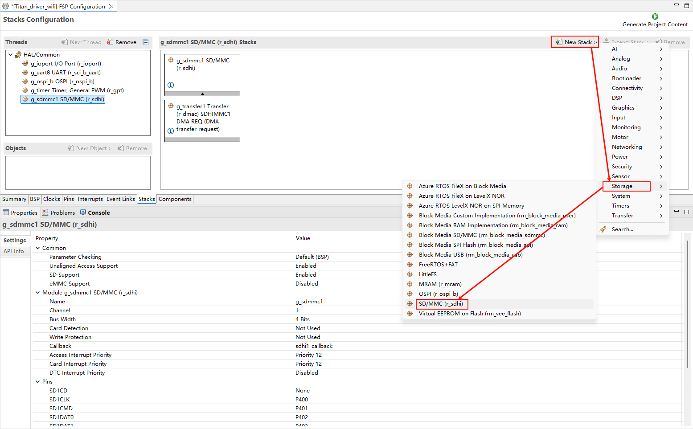
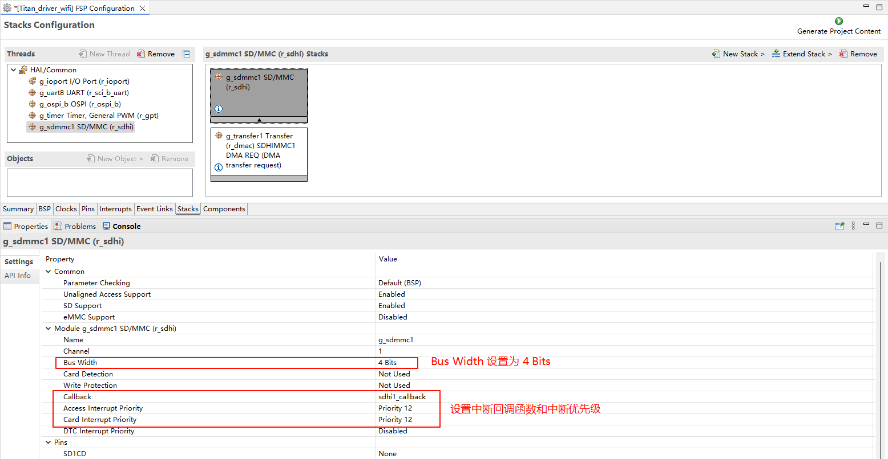
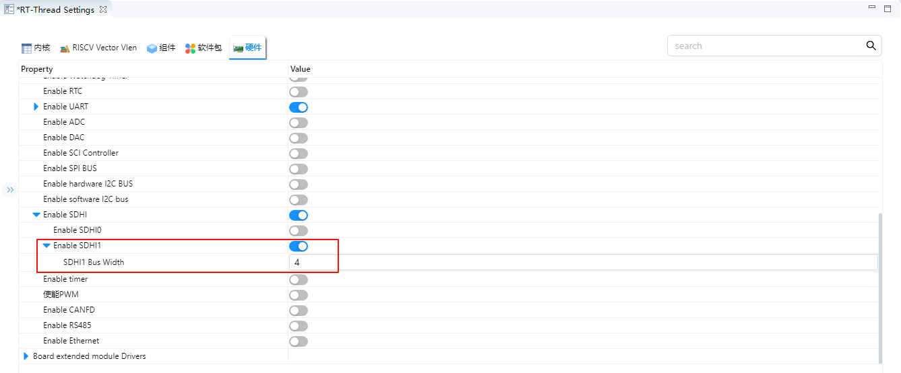
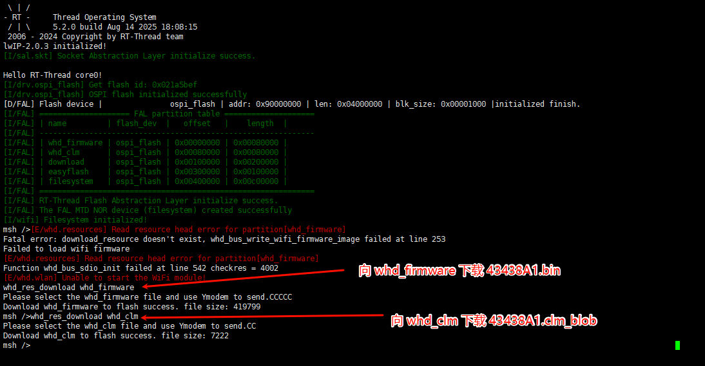

# Wi-Fi使用说明

**中文**|[**English**](README.md)

## 简介

本示例演示了如何在 **Titan Board** 上使用 **RA8 系列 MCU 的 SDHI 模块（r_sdhi）** 驱动 **CYWL6208-GS WiFi 模块**，从而实现基于 SDIO 接口的无线网络连接。
 在该示例中，MCU 通过 **SDIO 总线** 与 CYWL6208-GS 模块（芯片 CYW43438）通信，结合 RT-Thread 的网络协议栈（lwIP）实现 TCP/IP 网络功能。

## WiFi 简介

### 1. 概述

**WiFi（Wireless Fidelity，无线保真）** 是一种基于 **IEEE 802.11 标准** 的无线局域网（WLAN）通信技术。它通过无线电波在终端设备（如 MCU、手机、电脑、IoT 设备）与接入点（AP）之间传输数据，实现 **短距离高速无线通信**。

WiFi 目前是最常用的无线连接技术之一，广泛应用于家庭网络、办公网络、工业控制、智能家居和物联网设备。

### 2. 工作原理

1. **通信方式**
   - WiFi 使用 **ISM 频段**（2.4 GHz、5 GHz、6 GHz），通过 **OFDM、DSSS、QAM 等调制方式**实现数据传输。
   - WiFi 网络由 **接入点（AP）** 和 **终端设备（Station, STA）** 构成。
2. **数据传输流程**
   - 终端 STA 通过 **扫描（Scan）** 找到可用 WiFi 网络
   - STA 发送 **认证与关联请求**
   - 接入点 AP 完成 **握手与密钥协商**
   - STA 与 AP 建立安全通信通道后进行数据传输

### 3. WiFi 协议标准

WiFi 的不同版本对应 IEEE 802.11 标准：

| 标准                  | 频段        | 最大速率 | 特点                          |
| --------------------- | ----------- | -------- | ----------------------------- |
| **802.11b**           | 2.4 GHz     | 11 Mbps  | 早期版本，抗干扰差            |
| **802.11g**           | 2.4 GHz     | 54 Mbps  | 向下兼容 b                    |
| **802.11n (WiFi 4)**  | 2.4/5 GHz   | 600 Mbps | MIMO 技术                     |
| **802.11ac (WiFi 5)** | 5 GHz       | 3.5 Gbps | MU-MIMO、80/160 MHz 信道      |
| **802.11ax (WiFi 6)** | 2.4/5/6 GHz | 9.6 Gbps | OFDMA，更低延迟，更高并发     |
| **802.11be (WiFi 7)** | 2.4/5/6 GHz | >30 Gbps | 多链路操作（MLO），超高吞吐量 |

### 4. WiFi 模式

- **STA 模式（Station）**：设备作为终端接入 AP
- **AP 模式（Access Point）**：设备作为热点提供网络
- **P2P 模式（Peer-to-Peer/Ad-Hoc）**：设备间直接通信
- **混合模式**：STA 与 AP 同时存在

### 5. WiFi 安全机制

- **WEP**（已废弃，不安全）
- **WPA/WPA2**：基于 TKIP、AES 加密，主流安全方式
- **WPA3**：增强安全性，支持 SAE 握手，防止暴力破解

### 6. WiFi 特点

**优点**

- 高速传输（Gbps 级别）
- 广泛支持（手机、PC、MCU 等）
- 成本低，生态成熟
- 可同时接入多设备

**缺点**

- 功耗较高，不适合超低功耗应用
- 传输距离有限（一般 10~100 米）
- 在 2.4 GHz 下易受干扰（蓝牙、微波炉等）

## RA8 系列 SDHI 模块概述

RA8 系列 MCU 内置的 **SDHI（SD Host Interface）** 模块是一个符合 **SD/SDIO/eMMC 标准** 的主机控制器，能够通过 **1-bit 或 4-bit 数据线**与存储设备（SD 卡、eMMC）或支持 SDIO 协议的外设（如 WiFi、蓝牙模块）进行通信。

在**存储应用**中，它可作为 SD/eMMC 控制器实现高速读写；在 **外设扩展应用**中，它可作为 SDIO 主机与 WiFi、蓝牙、GNSS 等模块建立数据通道。

在本示例中，SDHI 主要用于驱动 **CYWL6208-GS WiFi 模块（基于 SDIO 接口）**，从而实现 MCU 的无线联网功能。

### 1. 总体特性

- **支持 SD 标准**
  - SD v1.x / v2.x / SDHC / SDXC
  - 支持 SPI 模式和 SD/MMC 模式
- **高速数据传输**
  - 最高可达 50 MHz SDCLK（具体取决于 MCU 时钟配置）
  - 支持 1-bit/4-bit 数据总线
- **自动命令和数据传输**
  - 支持 DMA 传输模式，减少 CPU 占用
  - 自动命令序列生成（CMD0~CMD63）
- **错误检测**
  - CRC7 校验命令，CRC16 校验数据
  - 超时检测，响应错误识别
- **中断支持**
  - 卡插拔检测中断
  - 命令完成中断
  - 数据传输完成中断
  - 错误中断

### 2. SDHI 模块架构

RA8 SDHI 模块主要包含以下子模块：

1. **命令控制单元（Command Control Unit）**
   - 负责发送命令（CMD0~CMD63）
   - 处理命令响应（R1、R2、R3、R7 等）
   - 支持命令超时检测和 CRC 校验
2. **数据传输单元（Data Transfer Unit）**
   - 通过内部 FIFO 或 DMA 实现数据收发
   - 支持块读/写，最大 512 字节块
   - 支持单块/多块传输模式
3. **时钟与总线控制**
   - SDCLK 生成和分频
   - 1-bit 或 4-bit 总线切换
   - 可配置高/低电平保持时间
4. **卡检测与电源控制**
   - 检测 SD 卡插入/拔出状态
   - 可控制卡片电源开关（如支持）
5. **中断与事件控制单元**
   - 命令完成中断
   - 数据传输完成中断
   - 错误中断
   - 卡插拔中断

### 3. 工作流程（以 SDIO WiFi 为例）

1. **硬件初始化**
   - 配置 SDHI 引脚：CMD、CLK、DAT0~3
   - 使能时钟，复位 SDHI 控制器
2. **总线初始化**
   - 设置时钟频率（初始低速 → 高速模式）
   - 发送初始化命令（CMD0、CMD5、CMD3 等）
   - 枚举设备，分配 RCA
3. **功能配置**
   - 识别为 SDIO WiFi 设备
   - 配置块大小、总线宽度、传输速率
   - 打开中断机制
4. **正常运行**
   - WiFi 驱动通过 SDIO 寄存器访问与数据传输接口控制模块
   - MCU 通过 **DMA + 中断** 与 WiFi 芯片交换大数据包
   - 上层协议栈（lwIP）完成 TCP/IP 通信

## 硬件说明

## FSP 配置

* 首先需要配置 Flash，Flash 配置参考 `Titan_component_flash_fs` 工程下的 README.md。
* 接下来配置 SDHI1，新建 r_sdhi stack：

* 配置 SDHI1 stack：

* 配置 SDHI1 引脚：

## RT-Thread Settings 配置

* 使能 ospi Flash。

* SDHI1 的 Bus Width 设置为 4。

* 配置 WHD 软件包。

## 编译&下载

* RT-Thread Studio：在 RT-Thread Studio 的包管理器中下载 Titan Board 资源包，然后创建新工程，执行编译。

编译完成后，将开发板的 USB-DBG 接口与 PC 机连接，然后将固件下载至开发板。

##  运行效果

按下复位按键重启开发板，如果终端输出固件读取错误的信息，那么需要使用 **ymodem** 向 Flash 中下载 WiFi 固件。使用 `whd_res_download whd_firmware` 命令下载 43438A1.bin 到 Flash 的 `whd_firmware` 分区中；使用 `whd_res_download whd_clm` 命令下载 43438A1.clm_blob 到 Flash 的 `whd_clm` 分区中。

WiFi 固件可以在工程根目录的 `/firmware` 文件夹中找到。

下载 WiFi 固件后复位开发板，能看到 WiFi 固件正常加载，WiFi 模块初始化成功。接着输入 `wifi join TitanBoard 12345678` 连接 WiFi，然后输入 `ping baidu.com`进行 ping 测试。

