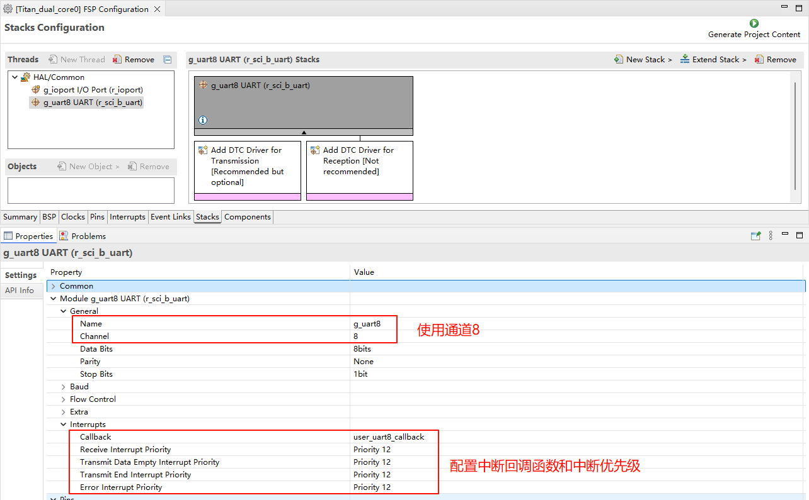

# 双核工程使用说明（Core0）

**中文** | [**English**](./README.md)

## 简介

本工程基于 **Titan Board**  开发板，运行在 **Cortex-M85 (Core0)** 内核上，作为双核系统的主控核心模板工程。

**Core0 (Cortex-M85 @ 1GHz)**：高性能主核，负责系统的主要业务逻辑、复杂计算、外设管理。

**Core1 (Cortex-M33 @ 250MHz)**：低功耗辅核，适合处理实时任务、安全服务或低功耗场景。

本模板工程为后续应用开发提供基本的启动代码、RT-Thread  支持、外设初始化框架。

**注意**：**Titan_dual_core0** 与 **Titan_dual_core1** 两个工程配合使用。

## 硬件说明

Core0 使用 UART8 (USB-DBG) 作为调试串口。

## FSP配置说明

* 新建 `r_sci_b_uart` stack：


* 配置 `r_sci_b_uart`：



* 配置 UART8 的引脚：


## RT-Thread Settings配置

* 使能 sub-nuclear startup。


## 示例工程说明

示例程序位于 `/src/hal_entry.c`，通过蓝色 LED 灯(LED_B)来指示 Core0 运行状态。

```c
#include <rtthread.h>
#include "hal_data.h"
#include <rtdevice.h>
#include <board.h>

#define LED_PIN     BSP_IO_PORT_00_PIN_12 /* Onboard LED pins */

void hal_entry(void)
{
    rt_kprintf("\n==================================================\n");
    rt_kprintf("This is core0!\n");
    rt_kprintf("Hello, Titan Board!\n");
    rt_kprintf("==================================================\n");

    rt_kprintf("\nThe dual-core project should collaborate with the SDK project for development: << Titan_dual_core1 >>\n");

    while (1)
    {
        rt_pin_write(LED_PIN, PIN_HIGH);
        rt_thread_mdelay(500);
        rt_pin_write(LED_PIN, PIN_LOW);
        rt_thread_mdelay(500);
    }
}
```

## 编译&下载

* RT-Thread Studio：在 RT-Thread Studio 的包管理器中下载 Titan Board 资源包，然后创建新工程，执行编译。

编译完成后，将开发板的 USB-DBG 接口与 PC 机连接，然后将固件下载至开发板。

#### 下载方式

​	目前 DAP-Link 还不支持烧录 Core1 固件，所以需要**使用 Renesas Flash Programmer 工具来烧录固件**，具体烧录步骤如下：

1. 下载并安装 Renesas Flash Programmer 工具：[Renesas Flash Programmer (Programming GUI) | Renesas](https://www.renesas.com/en/software-tool/renesas-flash-programmer-programming-gui#downloads)。
2. 将开发板的 USB-DEV 接口与 PC 机连接。
3. 创建工程：开发板需要进入 BOOT 模式（按住 BOOT 按钮，点按一下 RESET 按钮）


4. 选择要烧录的固件（Core0 和 Core1 的固件）：


5. 烧录固件（此时开发板需要处于 BOOT 模式）：


## 运行效果

复位开发板后蓝色 LED 会不停闪烁。

