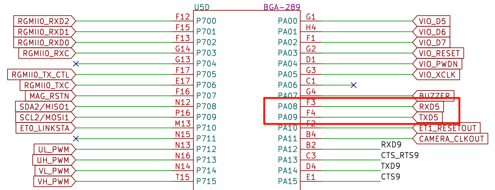
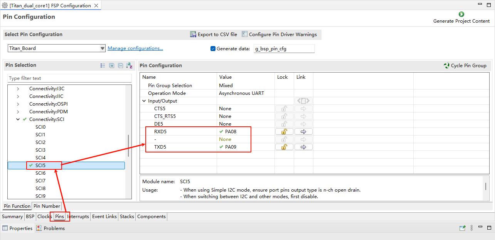

# Dual-core Project Instructions (Core1)

**English** | [**Chinese**](./README_zh.md)

## Introduction

This project is based on the **Titan Board** development board and runs on the **Cortex-M33 (Core1)**, serving as the primary control template project in a dual-core system.

**Core0 (Cortex-M85 @ 1GHz)**: The high-performance main core, responsible for major system logic, complex computations, and peripheral management.

**Core1 (Cortex-M33 @ 250MHz)**: The low-power auxiliary core, suitable for handling real-time tasks, security services, or low-power scenarios.

This template project provides the basic startup code, RT-Thread support, and peripheral initialization framework for subsequent application development.

**Note**: The **Titan_dual_core0** and **Titan_dual_core1** projects are used together **(Core1 is started by Core0)**.

## Hardware Description

Core1 uses UART5 as the debug serial port.



## FSP Configuration

* Create a `r_sci_b_uart` stack:


* Configure `r_sci_b_uart`:


* Configure UART5 pin:



## RT-Thread Settings Configuration

* Enable UART5.


## Example Code Description

The sample program is located in `/src/hal_entry.c` and uses the green LED (LED_G) to indicate the running status of Core1.

```c
#include <rtthread.h>
#include "hal_data.h"
#include <rtdevice.h>
#include <board.h>

#define LED_PIN    BSP_IO_PORT_06_PIN_13 /* Onboard LED pins */

void hal_entry(void)
{
    rt_kprintf("\n==================================================\n");
    rt_kprintf("This is core1!\n");
    rt_kprintf("Hello, Titan Board!\n");
    rt_kprintf("==================================================\n");

    rt_kprintf("\nThe dual-core project should collaborate with the SDK project for development: << Titan_dual_core0 >>\n");
    while (1)
    {
        rt_pin_write(LED_PIN, PIN_HIGH);
        rt_thread_mdelay(1000);
        rt_pin_write(LED_PIN, PIN_LOW);
        rt_thread_mdelay(1000);
    }
}
```

## Compilation & Download

* **RT-Thread Studio**: In RT-Thread Studio's package manager, download the Titan Board resource package, create a new project, and compile it.

#### Download Methods

Currently, DAP-Link does not support programming the Core1 firmware, so you need to **use the Renesas Flash Programmer tool to program the firmware**. The detailed programming steps are as follows:

1. Download and install the Renesas Flash Programmer tool: [Renesas Flash Programmer (Programming GUI) | Renesas](https://www.renesas.com/en/software-tool/renesas-flash-programmer-programming-gui#downloads).
2. Connect the USB-DEV port of the development board to the PC.
3. Create a project: The development board needs to enter BOOT mode (**hold down the BOOT button and press the RESET button once**).


4. Select the firmware to be programmed (Core0 and Core1 firmware):


5. Flashing firmware (at this time, the development board must be in **BOOT** mode):


## Run Effect

After resetting the development board, the blue (Core0) and green (Core1) LEDs will keep flashing continuously.

