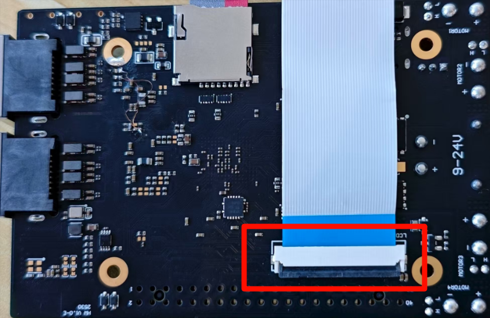
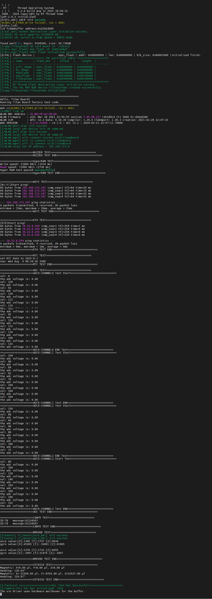

# 产测程序使用说明
## 测试准备

1. 开发板测试固件：rtthread.hex
2. Wi-Fi 固件：43438A1.bin、43438A1.clm_blob
3. SD 卡：SD 卡根目录中放入Wi-Fi 固件
4. MIPI CSI 接口 OV5640 摄像头
5. 800 * 480 RGB LCD 屏幕
6. 3 - 6 个 LED 灯

## 硬件连接

### PWM

​	将树莓派接口上的六个 PWM 引脚 VL_PWM(P714)、UL_PWM(P712)、WL_PWM(P108)、VH_PWM(P715)、UH_PWM(P713)、WH_PWM(P109) 外接 LED 灯。

### CANFD

​	连接 CAN0 与 CAN1 (CAN0_H 与 CAN1_H 连接；CAN0_L 与 CAN1_L 连接)。

### RS485

​	将开发板上的两个 RS485 接口中的任意一个与另一块开发板的 RS485 接口连接 (A 与 A 连接；B 与 B 连接)。

### MIPI CSI 摄像头

​	在 MIPI CSI 接口上连接一个 OV5640 摄像头模块。

### RGB LCD 屏幕

​	在开发板背面的 RGB LCD 接口接入一块 800*480 的 RGB 屏幕。

### 以太网

​	将网线插入 ETH1 网口。

## LED 指示灯

​	开发板上有蓝、绿、红三个 LED 指示灯：

* **蓝色 LED：**以 500ms 的间隔不断闪烁，指示程序的运行状态。当蓝色 LED 停止闪烁时，代表程序运行异常。
* **绿色 LED：**默认为熄灭状态，当功能测试完成时，绿色 LED 亮起。
* **红色 LED：**默认为熄灭状态，当有功能测试出错时，红色 LED 亮起。

## 程序运行流程

### 1. HyperFlash 与 SD 卡挂载文件系统

​	开发板上电后会自动挂载 SD 卡与 HyperFlash 上的文件系统。

### 2. 自动连接 WiFi

​	开发板挂载完 SD 卡后从 SD 卡内加载 WiFi 固件并完成 WiFi 初始化，接着自动连接 WiFi (名称：Titan Board，密码：12345678)。

### 3. 开发板输出 PWM

​	开发板上电后，树莓派接口上的六个 PWM 接口会输出 PWM 波， 观察接在 PWM 引脚上的 LED 的亮度变化（呼吸灯效果）。

### 3. 蜂鸣器测试

​	首先测试蜂鸣器功能，蜂鸣器会播放两只老虎的旋律。

### 4. HyperRAM 测试

​	在 HyperRAM 测试程序中会测试 HyperRAM 的读写速度。

### 5. WiFi 测试

​	开发板上电后会自动初始化 WiFi模块并从 SD 卡中下载固件到 WiFi 模块中。WiFi 测试程序调用 ping 命令来测试网络的连通性。

### 6. 以太网测试

​	以太网测试程序调用 ping 命令测试网络的连通性。

### 7. RTC 测试

​	RTC 测试会在终端输出设置的日期与时间 。

### 8. ADC 测试

​	ADC 测试程序依次测试 ADC0 的通道0、1、2、3。

### 9. CANFD 测试

​	CANFD 测试程序中 CANFD0 发送数据，CANFD1 接收 CANFD0 发送的数据。

### 10. IMU 测试

​	IMU 测试程序测试能否正确读取 BMI088 模块的数据。

### 11. 磁力计测试

​	磁力计测试程序测试能否正确读取 IST8310 模块的数据。

### 12. 摄像头与屏幕测试

​	在测试程序的最后会开启摄像头，此时需要用手在摄像头前面晃动激活摄像头捕获，LCD 屏幕会显示摄像头捕获到的画面。

## 测试结果说明

* **所有功能测试成功：**当测试结束并且所有功能测试通过时，开发板上的绿色 LED 灯会亮起并且终端会输出 `ALL Test Run Successful!`。

* **有功能测试出错：**当测试结束但是有功能测试出错时，开发板上的红色 LED 灯会亮起并且终端会输出测试出错的功能有哪些。

**测试程序终端输出：**

