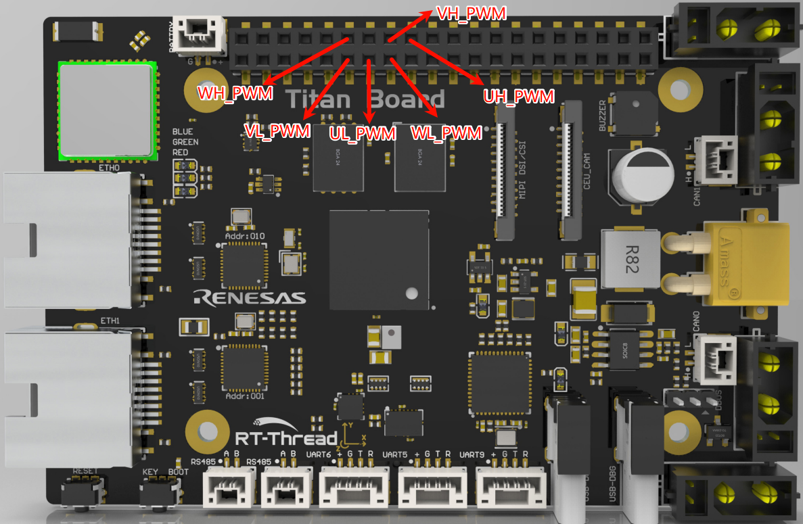
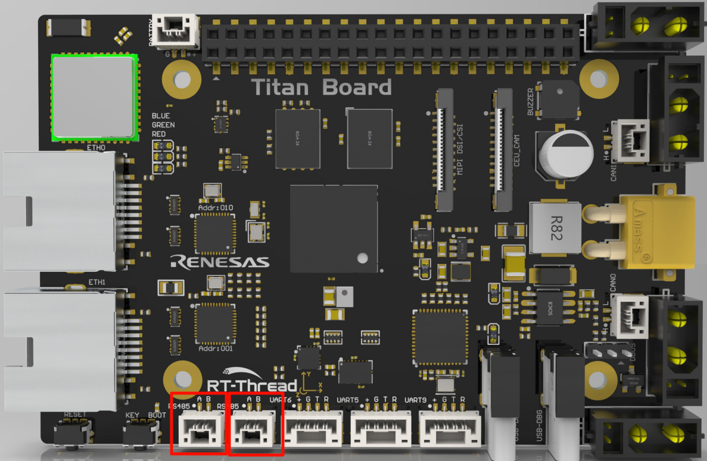
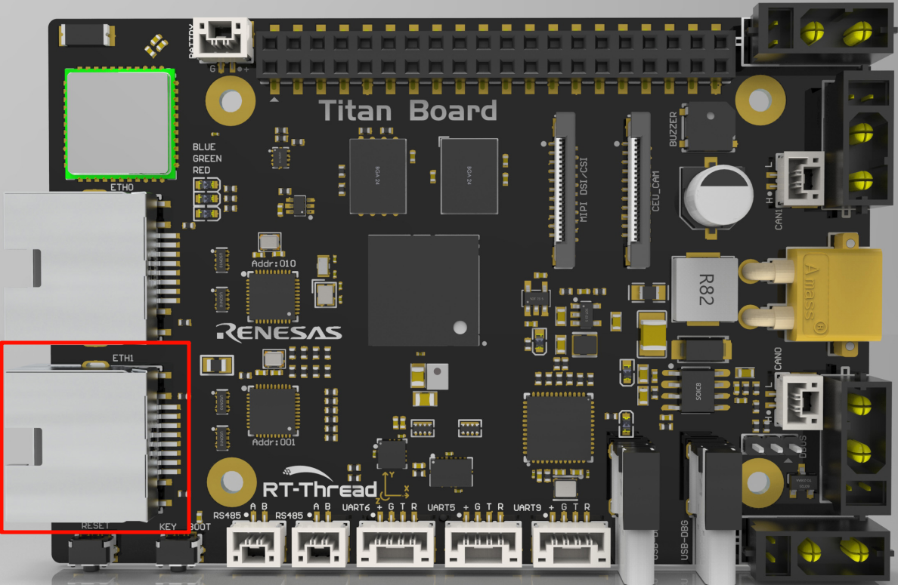
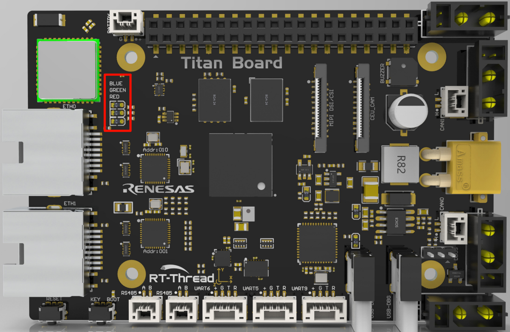
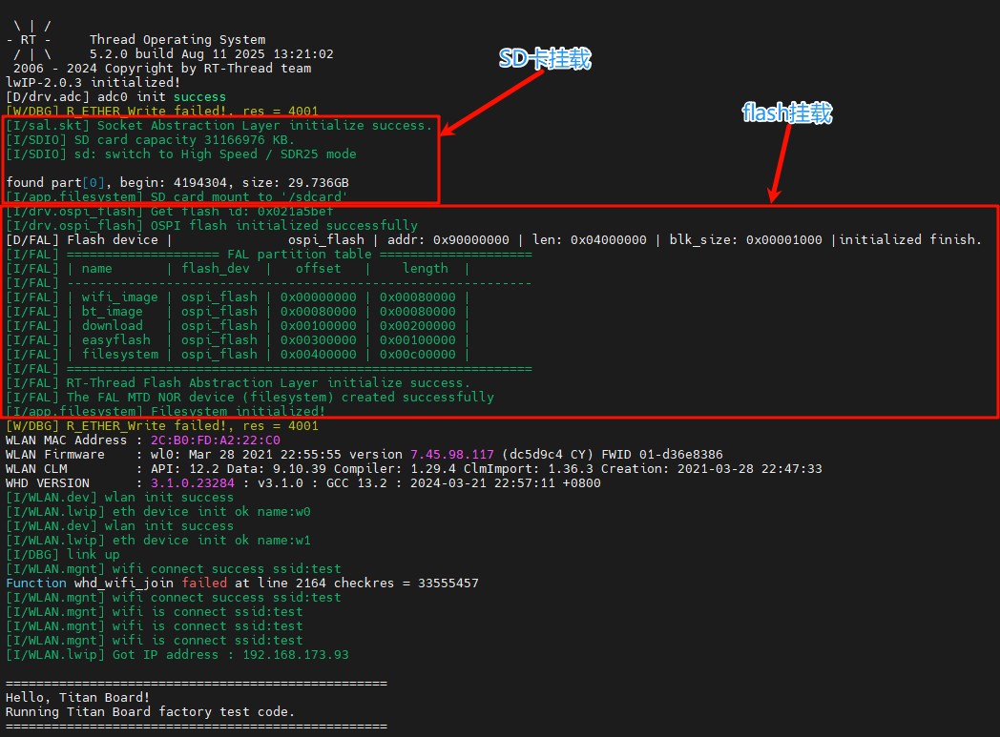
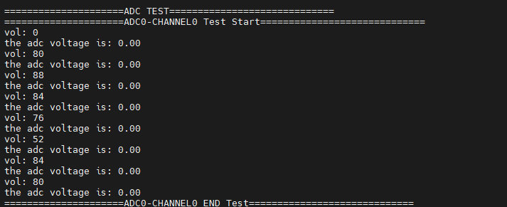

# Production Test Program User Guide

**English** | [**Chinese**](./README_zh.md)

## Test Preparation

1. Development board test firmware: **rtthread.hex**
2. Wi-Fi firmware: **43438A1.bin**, **43438A1.clm_blob**
3. SD card: Place Wi-Fi firmware in the root directory of the SD card
4. MIPI CSI interface OV5640 camera
5. 800 × 480 RGB LCD screen
6. 3–6 LED lights

## Hardware Connections

### PWM

Connect LEDs to the six PWM pins on the Raspberry Pi interface: **VL_PWM (P714), UL_PWM (P712), WL_PWM (P108), VH_PWM (P715), UH_PWM (P713), and WH_PWM (P109).**

### CANFD

Connect CAN0 and CAN1 (CAN0_H to CAN1_H; CAN0_L to CAN1_L).

### RS485

Connect either of the two RS485 ports on the development board to the RS485 port of another development board (A to A; B to B).

### MIPI CSI Camera

Connect an OV5640 camera module to the MIPI CSI interface.

### RGB LCD Screen

Connect an 800 × 480 RGB screen to the RGB LCD interface on the back of the development board.

### Ethernet

Insert a network cable into the ETH1 port.

## LED Indicators

The development board has three LED indicators: blue, green, and red.

- **Blue LED:** Flashes continuously at 500 ms intervals, indicating program running status. If the blue LED stops flashing, the program has crashed.
- **Green LED:** Off by default. Lights up when all functional tests pass.
- **Red LED:** Off by default. Lights up when a functional test fails.

## Program Execution Flow

### 1. Mounting HyperFlash and SD Card File Systems

After power-on, the board automatically mounts the SD card and HyperFlash file systems.

### 2. Automatic Wi-Fi Connection

After mounting the SD card, the board loads Wi-Fi firmware from it, initializes Wi-Fi, and automatically connects to the Wi-Fi network (SSID: **Titan Board**, Password: **12345678**).

### 3. PWM Output

After power-on, the six PWM pins on the Raspberry Pi interface output PWM waves. LEDs connected to these pins should show brightness changes (breathing light effect).

### 4. Buzzer Test

The buzzer plays the melody of "Two Tigers" as a functional test.

### 5. HyperRAM Test

The HyperRAM test program measures HyperRAM read/write speed.

### 6. Wi-Fi Test

The Wi-Fi test program initializes the Wi-Fi module, loads firmware from the SD card, and uses the `ping` command to test connectivity.

### 7. Ethernet Test

The Ethernet test program uses the `ping` command to verify network connectivity.

### 8. RTC Test

The RTC test outputs the configured date and time in the terminal.

### 9. ADC Test

The ADC test program sequentially tests channels 0, 1, 2, and 3 of ADC0.

### 10. CANFD Test

In the CANFD test program, CANFD0 transmits data, and CANFD1 receives it.

### 11. IMU Test

The IMU test program verifies correct data reading from the BMI088 module.

### 12. Magnetometer Test

The magnetometer test program verifies correct data reading from the IST8310 module.

### 13. Camera and Screen Test

At the end of the test program, the camera is activated. Wave your hand in front of the camera to trigger capture; the LCD screen will display the captured image.

## Test Result Description

- **All tests passed:** At the end of testing, if all functions pass, the green LED lights up and the terminal outputs `ALL Test Run Successful!`.

  
  
- **Test failures detected:** If some tests fail, the red LED lights up and the terminal outputs which functions failed.

**Example terminal output of test program:**

