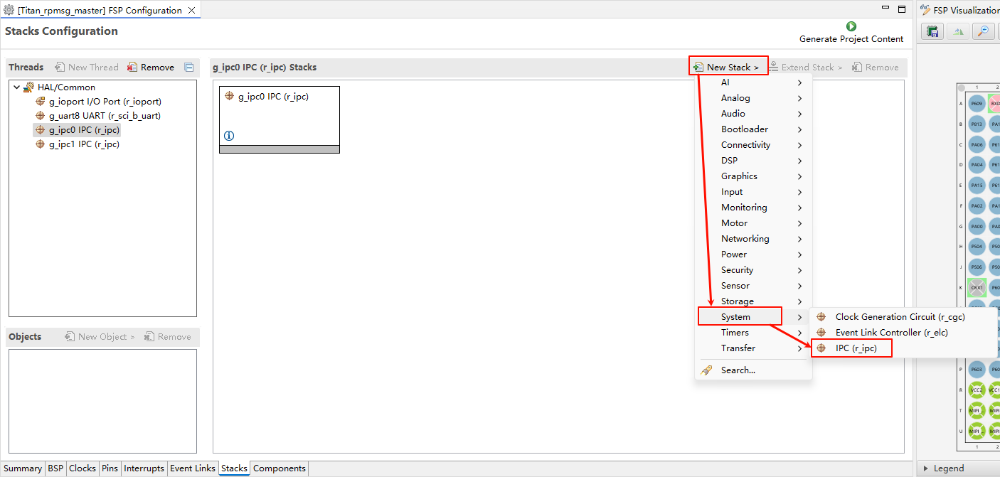
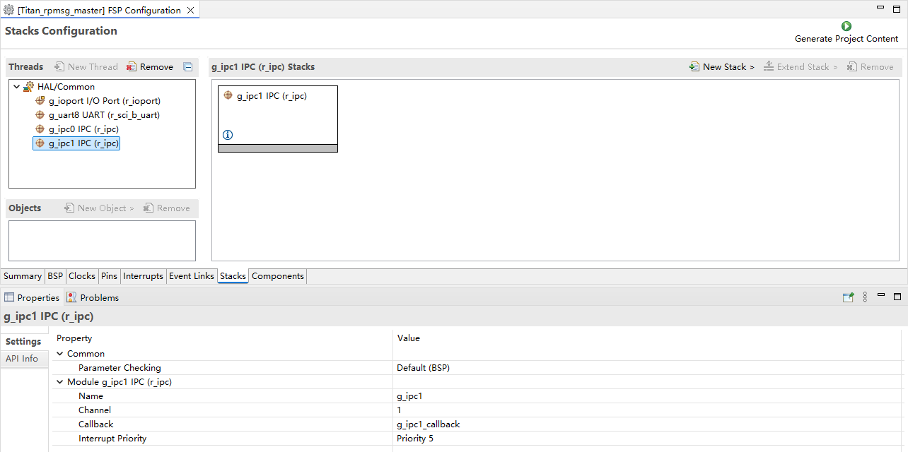
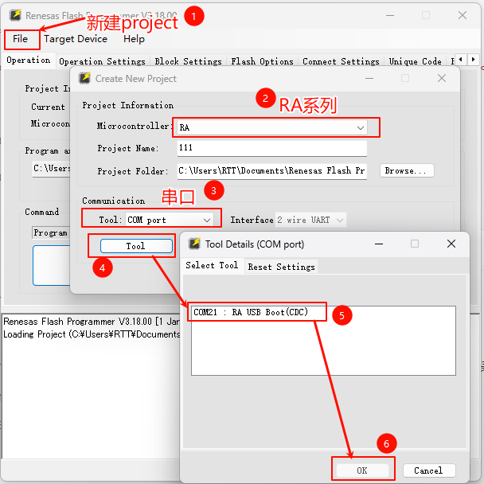

# RPMsg-Lite Usage Instructions（Core0 Master）

**English** | [**Chinese**](./README_zh.md)

## Introduction

This project runs on **RA8P1 Core0 (Cortex-M85, nominal 1 GHz)** and serves as the main control application in a dual-core system:

- Responsible for **system initialization, peripheral resource management**, and **Core1 startup/management**.
- Establishes a **message channel** with Core1 over shared memory using **RPMsg-Lite** (virtqueue/vring), supporting command delivery, data exchange, event notification, etc.

**Key Features**

- **Multicore Communication**: RPMsg-Lite master-side initialization, endpoint creation, message send/receive, blocking/non-blocking queues.
- **RT-Thread Support**: Dedicated communication thread, safe queues, event synchronization.
- **Shared Memory & Cache Safety**: Reserved **non-cacheable / strongly consistent** shared memory regions; provides memory barriers and cache operation guidelines.
- **Clear Startup Sequence**: Core0 handles loading/launching Core1 and performs **link-up/handshake**.
- **Trimmed Protocol Layer**: Includes simple **Ping/Pong** and **frame format** examples for easy expansion of application command sets.

## RPMsg-Lite Instructions

**RPMsg-Lite** is a lightweight implementation of Remote Processor Messaging (RPMsg), primarily used in multi-core processor systems to enable data exchange and message passing between different cores. It is based on the **OpenAMP** framework and leverages shared memory and virtual channels (Virtio Channels) to achieve efficient and reliable inter-core communication in resource-constrained embedded systems.

#### 1. Design Background

In multi-core MCUs or SoC systems, different cores may execute different types of tasks, for example:

- Cortex-M cores run real-time control tasks
- Cortex-A cores run operating systems or high-level applications

In such cases, an efficient communication mechanism is needed to exchange data or trigger events between cores. RPMsg-Lite provides a lightweight, easy-to-use, and reliable message-passing solution.

#### 2. Key Features

1. **Lightweight**
   - Compared with full RPMsg implementations, RPMsg-Lite consumes less memory and CPU resources, making it ideal for resource-constrained embedded systems.
   - Core data structures and queue mechanisms are optimized to minimize memory copies.
2. **Inter-core Communication**
   - Supports communication between different cores.
   - Uses shared memory as a data buffer, with messages transmitted via virtual channels.
3. **Reliability**
   - Provides reliable message delivery mechanisms to ensure messages are neither lost nor duplicated.
   - Configurable message queue lengths allow for high-reliability data transmission.
4. **Flexibility**
   - Supports static or dynamic creation of communication channels to adapt to different system architectures.
5. **Simple Interface**
   - Offers easy-to-use APIs for sending, receiving, and managing channels.
   - Developers can integrate it quickly without needing to understand the underlying shared memory or interrupt mechanisms.

#### 3. Working Principle

RPMsg-Lite is based on the **virtio** virtual device mechanism:

1. Shared memory stores message data and queue information.
2. The sending core writes messages to the shared memory queue and notifies the receiving core via an interrupt.
3. The receiving core reads the messages and processes them according to application requirements.
4. After processing, the receiving core can send acknowledgment messages to ensure communication reliability.

#### 4. Application Scenarios

- **Dual-core or Multi-core MCU systems**: For example, in the RA8P1 dual-core MCU, M85 handles high-performance tasks while M33 handles real-time tasks, with communication between the cores via RPMsg-Lite.
- **Real-time task separation**: Time-sensitive tasks and high-level application tasks can run separately to improve system performance.
- **Resource-constrained embedded systems**: Low memory footprint and communication overhead make it suitable for industrial control, robotics, automotive electronics, and other fields.

## Hardware Description

None

## FSP Configuration

* Create two  `r_ipc` stacks:

* Configure IPC0：

* Configure IPC1：

## RT-Thread Settings Configuration

* Enable sub-nuclear startup and rpmsg-lite。

## Example Code Description

The sample program is located at `/board/ports/rpmsg-adapt`.

## Compilation & Download

* **RT-Thread Studio**: In RT-Thread Studio's package manager, download the Titan Board resource package, create a new project, and compile it.

After compilation, connect the development board's USB-DBG interface to the PC and download the firmware to the development board.

#### Download Methods

Currently, DAP-Link does not support programming the Core1 firmware, so you need to **use the Renesas Flash Programmer tool to program the firmware**. The detailed programming steps are as follows:

1. Download and install the Renesas Flash Programmer tool: [Renesas Flash Programmer (Programming GUI) | Renesas](https://www.renesas.com/en/software-tool/renesas-flash-programmer-programming-gui#downloads).
2. Connect the USB-DEV port of the development board to the PC.
3. Create a project: The development board needs to enter BOOT mode (**hold down the BOOT button and press the RESET button once**).

4. Select the firmware to be programmed (Core0 and Core1 firmware):

5. Flashing firmware (at this time, the development board must be in **BOOT** mode):

## Run Effect

Enter the command `rp_master` in the Core0 terminal to start the RPMsg master.

