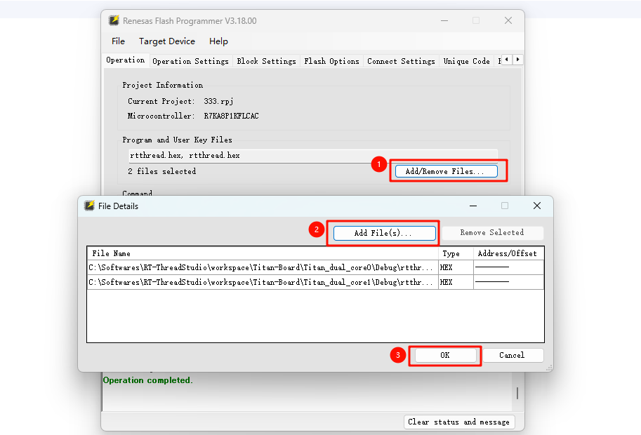

# RPMsg-Lite 使用说明（Core1 Remote）

**中文** | [**English**](./README.md)

## 简介

本工程运行于 **RA8P1 的 Core1（Cortex-M33，250 MHz）**，作为双核系统的从核（Remote）工程：

- 通过 **RPMsg-Lite** 接收来自 Core0（Master）的指令和数据；
- 处理特定任务（如通信处理、数据采集、安全控制、低功耗管理），并将结果回传 Core0；
- 支持独立应用逻辑和消息驱动机制。

**主要特性**

- **多核通信**：RPMsg-Lite Remote 端初始化、端点创建、消息收发。
- **RT-Thread支持**：独立线程处理收发消息，支持事件/队列同步。
- **共享内存与缓存安全**：使用 Core0 预留的共享内存，保证缓存一致性。
- **握手机制**：与 Core0 Master 进行 HELLO/READY/ACK 通信。
- **可扩展协议层**：轻量协议示例（Ping/Pong、命令帧、数据流）。

## RPMsg-Lite 简介

**RPMsg-Lite** 是一个轻量级远程处理器间通信（Remote Processor Messaging, RPMsg）实现，主要用于多核处理器系统中，实现不同核心之间的数据交换和消息传递。它基于 **OpenAMP** 框架，利用共享内存（Shared Memory）和虚拟通道（Virtio Channels）机制，在资源受限的嵌入式系统中实现高效、可靠的跨核通信。

#### 一、设计背景

在多核 MCU 或 SoC 系统中，不同核心可能运行不同类型的任务，例如：

- Cortex-M 核心运行实时控制任务
- Cortex-A 核心运行操作系统或高层应用
   这时核心之间需要高效的通信机制来交换数据或触发事件。RPMsg-Lite 提供了一个轻量、易用、可靠的消息传递解决方案。

#### 二、核心特性

1. **轻量级**
   - 相比完整的 RPMsg 实现，RPMsg-Lite 占用的内存和 CPU 资源更少，非常适合资源受限的嵌入式系统。
   - 核心数据结构和队列机制经过优化，减少内存拷贝。
2. **跨核心通信**
   - 支持多核心之间的通信。
   - 利用共享内存作为数据缓冲区，消息通过虚拟通道进行传递。
3. **可靠性**
   - 提供可靠的消息发送机制，保证消息不会丢失或重复。
   - 可配置消息队列长度，实现高可靠性数据传输。
4. **灵活性**
   - 支持静态或动态创建通信通道，适应不同系统架构。
5. **简单接口**
   - 提供易用的 API，包括消息发送、接收和通道管理接口。
   - 开发者无需了解底层共享内存或中断机制即可快速集成。

#### 三、工作原理

RPMsg-Lite 基于 **virtio** 虚拟设备机制：

1. 共享内存（Shared Memory）用于存放消息数据和队列信息。
2. 发送核心将消息写入共享内存队列，并通过中断通知接收核心。
3. 接收核心读取消息，并根据应用需求进行处理。
4. 消息处理完成后，接收核心可回馈确认信息，保证通信可靠性。

#### 四、应用场景

- **双核或多核 MCU 系统**：例如 RA8P1 双核 MCU 中 M85 处理高性能任务，M33 处理实时任务，两核通过 RPMsg-Lite 通信。
- **实时任务分离**：将时间敏感任务和高层应用任务分开运行，提高系统性能。
- **资源受限的嵌入式系统**：占用内存小、通信开销低，适合工业控制、机器人、汽车电子等领域。

## 硬件说明

无

## FSP配置说明

* 新建两个 `r_ipc` stack：

* 配置 IPC0：

* 配置 IPC1：

## RT-Thread Settings配置

* 使能 sub-nuclear startup 和 rpmsg-lite。

## 示例工程说明

示例程序位于 `/board/ports/rpmsg-adapt`。

## 编译&下载

* RT-Thread Studio：在 RT-Thread Studio 的包管理器中下载 Titan Board 资源包，然后创建新工程，执行编译。

#### 烧录方式

​	目前 DAP-Link 还不支持烧录 Core1 固件，所以需要**使用 Renesas Flash Programmer 工具来烧录固件**，具体烧录步骤如下：

1. 下载并安装 Renesas Flash Programmer 工具：[Renesas Flash Programmer (Programming GUI) | Renesas](https://www.renesas.com/en/software-tool/renesas-flash-programmer-programming-gui#downloads)。
2. 将开发板的 USB-DEV 接口与 PC 机连接。
3. 创建工程：开发板需要进入 BOOT 模式（按住 BOOT 按钮，点按一下 RESET 按钮）

4. 选择要烧录的固件：

5. 烧录固件（此时开发板需要处于 BOOT 模式）：

## 运行效果

Core1 会自动启动 rp_remote，等 Core0 启动 rp_master 后就能进行核间通信了。

