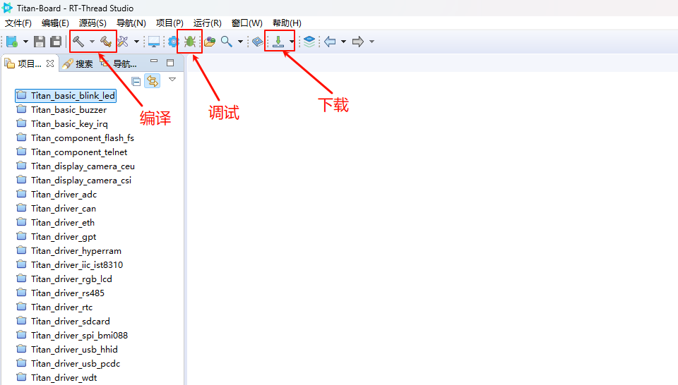
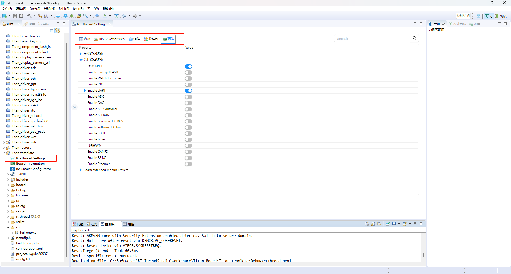

# Titan Board BSP 说明

**中文** | [**English**](./README.md)

## 简介

本文档为 RT-Thread Titan Board 开发板提供 BSP (板级支持包) 说明。通过阅读快速上手章节，开发者可以快速地上手该 BSP，将 RT-Thread 运行在开发板上。

主要内容如下：

- 开发板介绍
- BSP 快速上手指南

## 开发板介绍

基于瑞萨 RA8P1 开发的 Titan Board 开发板，通过灵活配置软件包和 IDE，对嵌入系统应用程序进行开发。

开发板正面外观如下图：


该开发板常用 **板载资源** 如下：

- MCU：R7KA8P1KFLCAC，高性能 1GHz Arm® Cortex®-M85 与 250MHz Arm® Cortex®-M33 双内核，1MB code MRAM 以及 2MB 带 ECC 的 SRAM。
- 调试接口：板载 DAP-Link 接口
- 板载接口：40Pin 树莓派接口、MIPI DSI/CSI、CEU Camera、RGB LCD接口、2个以太网接口、4个 CAN 电机接口、2个 RS485接口、3路串口、1个 DBUS 接口、1个 USBHS/USBFS 接口、1个 RTC 电池接口。

**更多详细资料及工具**

## 外设支持

本 BSP 目前对外设的支持情况如下：

| **片上外设** | **支持情况** | **组件** | **支持情况**  |
| ------------ | ------------ | -------- | ------------ |
| UART         | 支持         | LWIP     | 支持         |
| GPIO         | 支持         | TCP/UDP  | 支持         |
| HWTIMER      | 支持         | MQTT     | 支持         |
| IIC          | 支持         | TFTP     | 支持         |
| WDT          | 支持         | Telnet | 支持 |
| RTC          | 支持         | **多核通信** | **支持情况** |
| ADC          | 支持         | RPmsg-Lite | 支持 |
| DAC          | 支持         |          |              |
| SPI          | 支持         |          |              |
| RS485 | 支持 | | |
| CANFD | 支持 | | |
| SDHI | 支持 | | |

## 使用说明

使用说明分为如下两个章节：

- 快速上手

  本章节是为刚接触 RT-Thread 的新手准备的使用说明，遵循简单的步骤即可将 RT-Thread 操作系统运行在该开发板上，看到实验效果。
- 进阶使用

  本章节是为需要在 RT-Thread 操作系统上使用更多开发板资源的开发者准备的。通过使用 FSP 和 RT-Thread Settings 工具对项目进行配置，可以开启更多板载资源，实现更多高级功能。

### 快速上手

本 BSP 目前提供 RT-Thread Studio 工程。下面以 RT-Thread Studio 开发环境为例，介绍如何将系统运行起来。

**创建工程**

* 下载 Titan Board 资源包、GNU_Tools_for_ARM_Embedded_Processors v13.3。


* 新建 RT-Thread 项目


**硬件连接**

使用 USB 数据线连接开发板到 PC，使用 DAP-Link 接口下载和 DEBUG 程序。

**编译下载**



**查看运行结果**

下载程序成功之后，系统会自动运行并打印系统信息。

连接开发板对应串口到 PC , 在终端工具里打开相应的串口（115200-8-1-N），复位设备后，可以看到 RT-Thread 的输出信息。输入 help 命令可查看系统中支持的命令。

```bash
 \ | /
- RT -     Thread Operating System
 / | \     5.2.0 build Aug 5 2025 17:24:30
 2006 - 2024 Copyright by RT-Thread team

==================================================
Hello, Titan Board!
==================================================
msh >ps
thread       pri  status      sp     stack size max used left tick   error  tcb addr
------------ ---  ------- ---------- ----------  ------  ---------- ------- ----------
tshell        20  running 0x000000cc 0x00001000    16%   0x0000000a OK      0x22022568
sys workq     23  suspend 0x000000c4 0x00000800    11%   0x0000000a OK      0x22021a60
tidle0        31  ready   0x000000a4 0x00000100    67%   0x00000011 OK      0x220203c8
timer          4  suspend 0x000000a4 0x00000200    38%   0x00000009 EINTRPT 0x22020818
main          10  suspend 0x000000dc 0x00000800    18%   0x00000007 EINTRPT 0x22021128
msh >
```

**应用入口函数**

应用层的入口函数在 **src\hal_entry.c** 中 的 `void hal_entry(void)` 。用户编写的源文件可直接放在 src 目录下。

```c
void hal_entry(void)
{
    rt_kprintf("\n==================================================\n");
    rt_kprintf("Hello, Titan Board!\n");
    rt_kprintf("==================================================\n");

    while (1)
    {
        rt_pin_write(LED_PIN_0, PIN_HIGH);
        rt_thread_mdelay(1000);
        rt_pin_write(LED_PIN_0, PIN_LOW);
        rt_thread_mdelay(1000);
    }
}
```

### 进阶使用

**资料及文档**

- [开发板官网主页](https://www.renesas.cn/zh/products/ra8p1)
- [开发板数据手册](https://www.renesas.cn/zh/document/dst/25574255?r=25574019)
- [开发板硬件手册](https://www.renesas.cn/zh/document/mah/25574257?r=25574019)
- [多核开发指南](https://www.renesas.cn/zh/document/apn/developing-ra8-dual-core-mcu?r=25574019)
- [示例项目包](https://www.renesas.cn/zh/document/apn/ek-ra8p1-example-project-bundle?r=25574019)
- [Renesas RA8P1 Group](https://www.renesas.cn/zh/document/fly/renesas-ra8p1-group?r=25574019)

**FSP 配置**

需要修改瑞萨的 BSP 外设配置或添加新的外设端口，需要用到瑞萨的 [RA 可扩展性强的配置软件包 (FSP)](https://www.renesas.cn/zh/software-tool/flexible-software-package-fsp?queryID=c20a16b5f7f3866713b62c7acb07f2fc) 配置工具。请务必按照如下步骤完成配置。配置中有任何问题可到 [RT-Thread 社区论坛](https://club.rt-thread.org/) 中提问。

1. [下载灵活配置软件包 (FSP) | Renesas](https://github.com/renesas/fsp/releases/download/v6.0.0/setup_fsp_v6_0_0_rasc_v2025-04.1.exe)，请使用 FSP 6.0.0 版本
2. 请参考文档：[RA系列使用FSP配置外设驱动](https://www.rt-thread.org/document/site/#/rt-thread-version/rt-thread-standard/tutorial/make-bsp/renesas-ra/RA系列使用FSP配置外设驱动?id=ra系列使用-fsp-配置外设驱动)。

**RT-Thread Settings**

在 RT-Thread Settings 中可以对 RT-Thread 的内核、组件、软件包以及 Titan Board 的设备驱动进行配置。



## 联系人信息

在使用过程中若您有任何的想法和建议，建议您通过以下方式来联系到我们  [RT-Thread 社区论坛](https://club.rt-thread.org/)

## 贡献代码

如果您对 Titan Board 感兴趣，并且有一些好玩的项目愿意与大家分享的话欢迎给我们贡献代码，您可以参考 [如何向 RT-Thread 代码贡献](https://www.rt-thread.org/document/site/#/rt-thread-version/rt-thread-standard/development-guide/github/github)。
